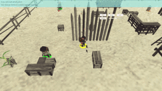

## 赛题名称

净土保卫战

## 赛题介绍

美丽的罗姆森林曾经是一片丰饶的土地，然而在核大战过后强烈的核辐射使得罗姆森林变得寸草不生。在核战后的50多年里，B-II号避难所的居民都是依靠战前的存粮生活。

但是最近，B-II号避难所的存粮已经见底，这使得原本生活在罗姆森林里的四大族群坐立不安。为了养活各自的族人，各族群派出了自己的“觅食者”在这一片荒凉的土地上寻找和制作食物，为自己的族人带回尽量多的粮食。经过核辐射的土地难以养活植物，但经过觅食者们的不懈努力，他们还是成功地发现了一些在废土上种植农作物的办法。不久，他们又发现了罗姆森林中存在的一些奇妙的材料，把这些奇妙的材料施放到土壤中可以使得土壤一定程度地恢复出产粮食的能力。于是，觅食者们开始了净土保卫战……

## 游戏界面

## 相关链接

+ THUAI3.0 GitHub 仓库链接：[eesast/THUAI3.0](https://github.com/eesast/THUAI3.0)
