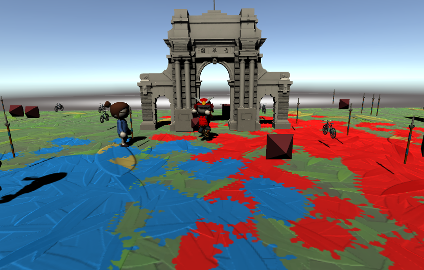

## 赛事名称

清彩无限

## 赛事简介

2021年是我校建成110周年，在今日的园子里，同学们身手矫健，下水能游五十米；上岸仰卧起坐、引体向上皆通习之；刷乐动力面不红、气不喘。但这一切并非来的自然而然，一百多年前的今天，中华民族背负“国力荼弱，武风不振，民族之体制日趋轻细”的痼疾。为此，清华率先将体育纳入毕业考核要求，以期充沛武德，强健身体。

时值今日，同学们的体育活动愈加丰富，趣味性越来越被重视。于是，既为了追忆吴宓老师和马约翰老师的浓厚师生情，又为了庆祝110周年校庆，学校组织了主题为“情谊香浓，清彩无限 ”的趣味活动。

活动中，选手们将分为两队，纷纷携带上装有代表自己队伍的独特彩色粉末的彩蛋，尽可能地将彩粉挥洒在赛场的每一个角落，以期赛场被染成自己的主题颜色。比赛结束后，泼洒彩色粉末面积最大的队伍将获得比赛的胜利，抱得奖杯！

彩蛋的巧妙运用，场内道具的争夺，是体力的拼搏，更是智谋的交锋！在这场欢乐而又紧张的博弈之中，奖杯终将花落谁家？

## 相关链接

+ THUAI4 GitHub 仓库链接：[eesast/THUAI4](https://github.com/eesast/THUAI4)
