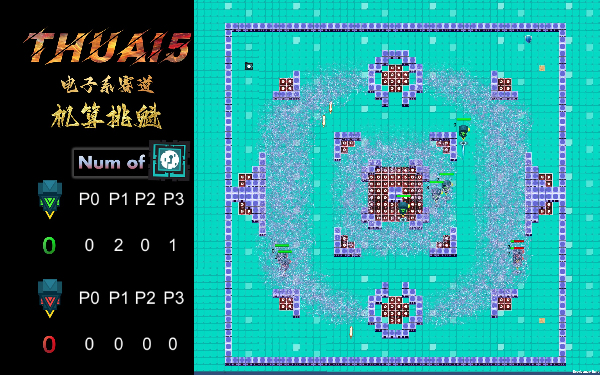

## 赛事名称

机算挑魁

## 赛事背景

在展览会上，清华推出了全新的智能机器人，为了抢夺全新的算力资源，这些机器人蓄势待发，一场算力争夺的比赛就此打响。比赛中，“CPU工厂”将生产CPU，机器人来回巡视，拾取并安装CPU，提高自己的算力。看！机器人1号躲入了电磁屏蔽区，消失在了大家的视野中；机器人2号发射了信号干扰弹，对其他机器人产生了干扰……

比赛不断进行，机器人们也不断安装上CPU，它们的算力持续增加。诶？校科协的成员们带着自制的道具来了！他们在赛场上放置道具，给机器人们使用。什么？机器人3号电量不足，被迫离场充电。太可惜了，它的诸多零件都被机器人4号抢走了……

时间不断推移，比赛进入白热化阶段。各队机器人的算力不断增加着。谁能神机妙算，一战夺魁？让我们拭目以待！

## 游戏主界面

## 相关链接

+ THUAI5 GitHub 仓库链接：[eesast/THUAI5](https://github.com/eesast/THUAI5)
+ THUAI5 Wiki：[eesast/THUAI5/wiki](https://github.com/eesast/THUAI5/wiki)
