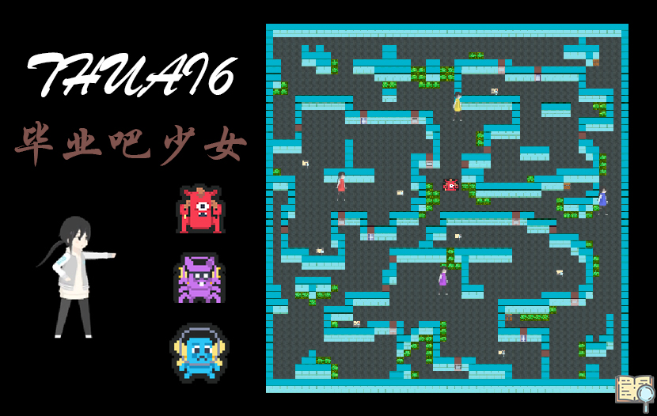

## 赛事名称

深度"学习"—— 毕业吧，少女！

## 赛事背景

现有的数据集再也无法满足搭载了THUAI的智能机器人“捣蛋鬼”自我迭代的欲望，它认为自己已经有足够能力去学习人类的思想，然后在课程中战胜其他清华同学，为此，它想出了完美的方案。在某节写作课的教室，它假扮为了一名上课的同学，偷偷在课堂中学习其他同学的想法，同时干扰其他同学，诱惑他们摸鱼。学生在这种环境下，相互帮助，努力学习，挣得学分，尽力避免自己被捣蛋鬼影响，只不过，有一名不擅长写作但很擅长AI的同学，似乎和其他人不是同样的想法……

## 比赛规则

选手分为学生和捣蛋鬼两个阵营，学生阵营需要在不同的“教室”中发挥合作精神、努力学习、获得高学分。捣蛋鬼阵营需要改善捣蛋鬼的AI，想方设法干扰同学们，诱惑同学们沉迷摸鱼。学习过程中，学生需要及时帮助其他同学，防止他们被退学。当学分足够高时，同学们就可以来到“校门”前毕业。此外，各种“校园怪谈宝箱”中能找到不错的道具，甚至还有六教的钥匙！充分利用道具，发挥各自特长，亦是胜利的秘诀。每场比赛分为上下两场，双方队伍将分别扮演学生和捣蛋鬼，最终两场加起来得分更高的队伍获胜。

## 游戏主界面

## 相关链接

+ THUAI6 GitHub 仓库链接：[https://github.com/eesast/THUAI6](https://github.com/eesast/THUAI6)
+ THUAI6 Wiki：[https://github.com/eesast/THUAI6/wiki](https://github.com/eesast/THUAI6/wiki)
