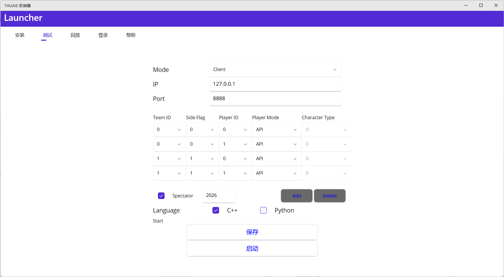

---
title: THUAI8 西游真经劫 AI 编写手册
sidebar_label: AI 编写手册
---


## 目录

- [前言](#前言)
- [下载前准备](#下载前准备)
- [选手包下载](#选手包下载)
- [AI代码编写](#AI代码编写)
  - [C++ AI编写](#C++)
  - [Python AI编写](#Python)
- [下载器调试](#下载器调试)
  - [Server配置](#Server配置)
  - [Client配置](#Client配置)
- [常见问题](#常见问题)

## 前言

欢迎参加THUAI8西游真经劫比赛！本手册将指导你如何编写AI以参与这场激动人心的对抗。在开始编写AI之前，建议你首先阅读游戏规则文档，了解游戏的基本机制和胜利条件。

西游真经劫游戏要求你分别编写双方各7个（共14个）角色(包括home)的AI代码，分别控制取经团队或妖怪阵营。通过资源采集、建筑建造、角色技能和团队配合，争取获得更高的得分并击败对手。

## 下载前准备
1.THUAI8提供C++ 和Python双赛道进行比赛，在准备阶段，你应该明确使用C++ 或者Python进行参赛
2.C++ 环境配置：THUAI8 C++ 赛道使用Visual Studio 2022 (v17.13.6) 进行代码编译，因此，在安装选手包之前，选手需要下载最新版本Visual Studio 2022或更新其至v17.13.6版本
- 更新Visual Studio 2022：若之前安装过Visual Studio 2022，但不为最新版，可打开Visual Studio Installer进行版本更新


3.Python环境配置：确保Python安装版本在3.9以上，否则可能导致grpc版本更新失败
查看方法：在cmd中输入```python --version```查看版本


## 选手包下载

1.在开始编写你的AI代码之前，请前往赛事云盘下载选手包下载器兼启动器(Installer)并解压


2.运行installer.exe(可能有警告，请点击"更多信息"-"仍然运行")


- 首次打开下载器后，会在 `C:\Users\用户名\Documents\` 路径下生成 `THUAI8` 文件夹，用于存储下载器的配置信息和缓存，请勿随意修改该文件夹内容。
- 选择下载路径时，请确保选择一个空文件夹。
- 首次下载完成后，`下载` 按钮会自动变为 `移动` 按钮，此时可以选择新的空文件夹路径进行移动操作。
- 界面提供两个进度条：上方进度条显示已下载的文件数量，下方进度条显示当前文件的下载进度。
- 如果下载出现问题，且 `是否已下载选手包` 复选框显示为勾选状态，请关闭下载器，删除已下载的文件，并将 `C:\Users\用户名\Documents\THUAI8\config.json` 中的 `"Installed": true` 改为 `"Installed": false`。
 
3.更新
  更新前需要先进行检查更新操作。若显示`Need to update`则需要更新，反之`Nothing to update`
- **下载后不要对其他非空文件路径进行更新操作，这将会删除多余的文件**
- 若未勾选，请更改`config.json`中的`"Installed":false`改为`"Installed"：true`（一般不会出现此情况）

第一次下载完成后，请检查更新，第一次下载的安装包通常版本较旧。

4.日志
- `Installer`界面下方存在操作日志（滚动功能有些异常）
- 安装目录下`logs\installer.log`中存在日志供参考

## AI代码编写
### C++
- 选手编写AI代码的位置在CAPI/cpp/API/src/AI.cpp处，安装Visual Studio 2022最新版本后，打开位于CAPI/cpp处的API.sln解决方案即可对整个项目进行编辑

- 打开项目后，在右侧**解决方案资源管理器**中，选择**源文件**，打开AI.cpp即可开始编写代码
- AI代码编写完成后，需要编译产生API.exe以供下载器启动。选择顶部栏处的**生成-重新生成解决方案**，等待一段时间后即编译完成

- 生成成功后，**输出**窗口会提示编译成功的信息

- 此后即可使用下载器进行[调试](#下载器调试)

### Python
- 选手编写AI代码的位置在CAPI/python/PyAPI/AI.py处

- 由于python不需要编译产生可执行文件，可直接前往[调试界面](#下载器调试)

## 下载器调试

下载器集成了**选手包下载**、**选手包更新**、**本地调试**、**本地回放**等功能，选手可以使用下载器启动本地调试界面进行调试

- 打开下载器后，选择**调试**界面

此界面中，选手可以设置启动的服务类型（Server或Client）
### Server配置
- 配置Server时，选手可以设置服务器启动的端口Port（一般不需要更改），本场游戏的队伍数量（一般为2），以及每一支队伍的人数（按照需求而定，至少为1，决赛默认为6）。这里为方便起见，设置每队的人数为1（即只有唐僧或九灵元圣）
- 保存后启动，此时Server正常运行如下


### Client配置
- 切换Mode为Client，此时可以配置Client启动
- 与Server相同，选手可以配置Client启动的IP和端口（一般不需要更改）。在此基础上，选手可以加入一定数量的对战Client和旁观Client（调试界面）。
- 点击Add加入对战Client。对于不同的Server配置，需要加入的对战Client数量也不同。对于每一支队伍人数为x的情况，需要为每支队伍各加入x+1个Client，分别对应PlayerID从0到x；teamID和SideFlag保持一致。例如，对于每支队伍人数为1的情况，客户端加入情况应该如下配置：


- 勾选Spectator以启用简易调试界面，并确保其ID大于2025（默认2026）
- 选择正确的Language，保存后即可启动Client


## 常见问题

**Q: 如何确定角色的位置？**
A: 使用 `api.GetSelfInfo()`获取角色位置，位置是以像素为单位的坐标 (x, y)。

**Q: 如何计算两点间距离？**
A: 使用欧几里得距离公式：`distance = sqrt((x1-x2)^2 + (y1-y2)^2)`。

**Q: 如何判断是否可以攻击到敌人？**
A: 检查敌人是否在角色的攻击范围内：`distance <= self_info.attackRange * 1000`。

**Q: 为什么我的AI在本地运行正常，提交后却失败？**
A: 可能原因包括：

- 代码中存在无限循环
- 调试输出过多导致缓冲区溢出
- 未考虑到某些边界情况

**Q: 如何优化AI性能？**
A:

- 减少不必要的API调用
- 避免复杂计算导致的超时
- 使用高效的寻路和决策算法

---

祝你在THUAI8西游真经劫比赛中取得好成绩！如有更多问题，欢迎在比赛交流群中讨论。

```
