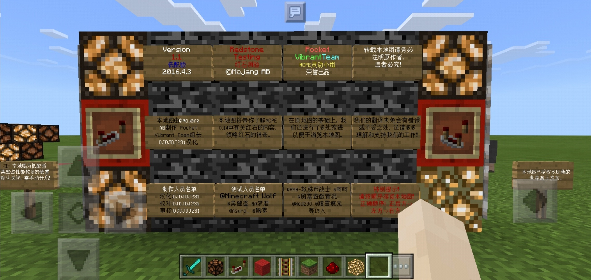

## 简介

《Redstone Testing》（非官方中文名《红石测验》）是由 Mojang AB 官方出品的基于 Minecraft Pocket Edition 0.14 的红石教程地图，其详尽和严谨程度在同类教程中是出类拔萃的。在之后，Mojang AB 又出版了配套的红石挑战地图《红石之谜》，通过闯关帮助玩家练习红石。

2016 年，在多玩我的世界盒子上，Pocket VibrantTeam（MCPE 灵动小组）发布了《Redstone Testing》的汉化地图，本教程即基于该汉化地图改编。

以下为原作者版权声明：

## 写在这里

+ 由于原地图基于 MCPE 0.14 制作，因此少部分特性与现版本不同，本教程作者已发现部分并予以更正。且由于原地图版本较低，使用较高版本的 PE 版 / 基岩版会导致一些问题，例如木牌上的字不可见等，因此本教程使用的 Minecraft 版本较旧，与新版本 Minecraft Java 版和基岩版可能均存在不一致的现象。如果读者发现任何疏漏，都可以在 GitHub 上提出 issue 告知我们，不胜感激。
+ 本教程主要基于 MCPE 1.1 版本，并且适当参考 Minecraft Java 版 1.19。
+ 本教程对原地图的章节进行了重新划分，主要分为以下几个章节：
  + [（一）红石基础](redstone_basic1.md)
  + 未完待续……

下面，就让我们开启红石学习之旅吧！

