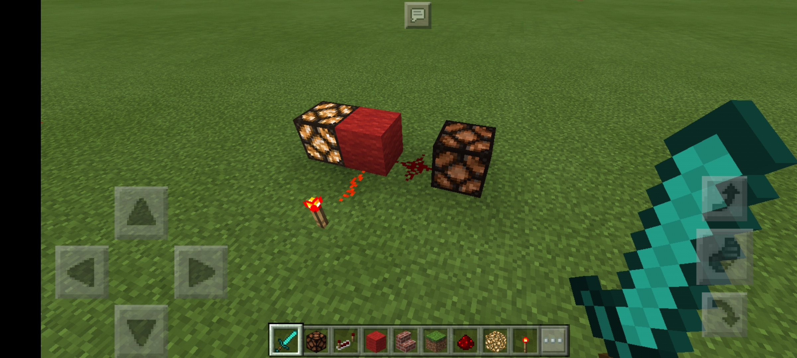

本章改编自原红石测验第一阶段第一部分。

## 前置知识

在阅读本教程之前，需要声明的是，在本教程将 Minecraft 中的方块分为以下几种：

1. 非透明方块：大多数方块均属于此类
2. 透明方块：玻璃等可以透视的方块
3. 萤石
4. 台阶：台阶可以被放置在上半格或下半格，放置在上半格和下半格的台阶可能有不同的性质，如图：

   

5. 楼梯：楼梯可以被正立或倒立放置，正立与倒立放置的楼梯可能有不同的性质，如图：

   

6. 能源：能够为红石提供能量的方块，例如拉杆、按钮、红石块、红石火把等
7. 机械装置：能够被红石充能并做出可观测的反应的方块，例如红石灯、门、音符盒、TNT、活塞等

了解了这些，那就让我们进入我们的红石之旅吧！

## 红石的基本性质

首先，我们在简单认识一下红石。我们用于传输能量的红石通常是以“红石粉”的形式存在，红石粉在红石电路中的作用可以类比现实生活中电路中的“导线”，因此也是红石电路的基础所在。我们现在就来看一看红石的基本性质吧！

### 红石的形态

我们将红石粉放置在方块上时，红石粉会呈现不同的形态，且能够自行校直。

当红石被孤立地放置时，会呈现十字星或点状形态。在比较新的 Java 版的 Minecraft 中，右击红石可以将其在十字星与点状形态之间转换。下图为红石的十字星和点状形态：

下图为红石线：

此外，红石还可以呈现 L 型、T 型、十字型等多种形态：

当红石旁放置红石时，它们的放置方式会发生改变。例如，在下图的红色羊毛上放置红石，下面的红石形态则会发生改变：

### 红石的连接

看完了红石的各种形态，我们再来看红石的连接规则，即红石能与那些方块相互连接起来。规则如下：

1. 红石不会自动调整形态而与邻近的非透明方块、透明方块、萤石，以及各种形态的楼梯与台阶相连：

   非透明方块

   

   透明方块

   

   萤石

   

   楼梯与台阶

   

2. 垂直对角线方向

   + 垂直对角线方向的连接
     + 红石能够放置在非透明方块和萤石上，并且在垂直的高度为 1 的对角线方向上相连
     + 红石可以放置在透明方块、上半格的台阶、倒置的楼梯上，但不会相连
     + 红石不能放置在下半格的台阶上

     

   + 垂直对角线方向的连接会被非透明方块阻碍，但不会被萤石以及各种形态的台阶和楼梯阻碍：

     

     

### 水与岩浆

水与岩浆均能够冲走红石，使其掉落：

## 红石的能量传输

既然红石粉是“导线”，那么它就一定承担着传输能量（也称红石信号）的职责，下面我们来学习一下红石的能量传输。首先需要注意的是，红石是否进行能量传输，与红石是否连接**没有必然联系**——我们将会看到，未连接的红石也有可能会传输能量。

首先，红石在传输能量的过程中是有衰减的。红石最多能够传输 15 格能量，第 16 格将不会获得能量。如下图所示，第 16 格红石彻底变暗，没有能量：

在使用红石能源时，红石能够自动地调整形态而与邻近的红石能源相连的：

下面我们具体来看一下红石的能量传输规则。

1. 红石无法透过任何方块传输能量。如下图，各种方块均可以阻断红石的能量传输：

   非透明方块、透明方块与萤石：

   

   各种形态的楼梯与台阶：

   

2. 红石可以通过任何方块沿垂直对角线向上传输能量。如下图所示，即使楼梯和台阶上的红石并没有在形态上直接连接起来，但仍可以传输能量：

   

3. 但红石只能通过非透明方块和透明方块沿垂直对角线向下传输能量，其他方块均无法向下传输能量。如下图所示，萤石、台阶和楼梯均不能向下传输：

   

4. 在垂直对角线上的非透明方块会阻碍能量的传输，但透明方块、萤石、台阶、楼梯均不会阻碍能量的传输：

   

5. 同理，非透明方块可以阻碍萤石、台阶、楼梯的垂直能量传输：

   

## 机械装置

下面我们来介绍一下红石电路的机械装置，即现实生活中电路里的“用电器”。我们既然要搭建红石电路，自然是希望红石电路能够发挥一定的功能，做一些我们想要做的事情。而根据红石电路中的能量和信号发挥一定功能的方块就是我们要介绍的“机械装置”。

### 机械装置的充能

一个机械装置，如果收到了红石传递来的能量，那么我们就称作这个机械装置被“充能”，也称作这个机械装置被“激活”。

“红石灯”是一个机械装置，当被充能时会亮起，不被充能时则熄灭。由于红石灯被激活后的效果较为明显，因此之后我们将大量使用红石灯来作为机械装置以及方块的代表，以探测该处方块是否收到了红石信号。

在我们要给机械装置充能时，红石是**不会**自动改变形态而与机械装置连接的，但红石必须与机械装置相连才能激活机械装置。如下图，红石并没有自动改变为线状形态而主动与机械装置相连：

如下图，只有与机械装置相连的红石才能激活机械装置：

十字星形态的红石是与四周的方块均相连的，可以激活周围的机械装置：

但点状形态的红石是不与四周的方块相连的，不会激活周围的机械装置：

### 其他方块的充能

除了机械装置以外，还有其他的一些方块可以被充能。

非透明方块可以被充能，并可以发出长度为 1 的红石信号，即可以激活临近的机械装置，但无法再直接通过红石向外传输。下图显示了被充能的非透明方块可以激活临近的红石灯，但不能通过距离为 1 的红石传输信号到红石灯：

透明方块、萤石、楼梯、台阶，均不能被充能：

### 形形色色的机械装置

下面我们来介绍一下各种常见的机械装置。

+ 红石灯：被充能的红石灯处于亮起状态

+ 门：被充能的门、铁门、活版门、栅栏门等均处于打开状态

  

+ 动力铁轨

  + 被充能的动力铁轨至多传输 8 格，且能让矿车加速；但若动力铁轨未被充能，则动力铁轨会使矿车停下。下图显示了被充能的动力铁轨的能量传输距离，可以看到第 9 格位置的动力铁轨就不会接收到红石信号：

    

  + 若被充能的动力铁轨临近一个非透明方块，那么在该动力铁轨上放置的矿车会立即加速。例如下图中临近草方块的的动力铁轨上若放置矿车，则矿车会被立即加速：

    

+ TNT：被充能的 TNT 会爆炸

+ 铁轨：拐弯处的铁轨被充能后会改变方向。下图为拐弯处的铁轨被充能前后的形状改变情况：

  

+ 激活铁轨：被充能的激活铁轨可以：

  + 让矿车中的生物被抛出
  + 让漏斗矿车无法工作
  + 让 TNT 矿车爆炸

+ 音符盒

  + 当音符盒被充能时，会发出单个音符
  + 音符会因放置音符盒的方块不同而发生改变
  + 点击一次音符盒会使其发出的音符升高半度，最高可升高 25 度

## 实践：红石能量传输模型

通过了之前的学习，相信读者对红石的基本使用已经有了初步的了解，那么下面就让我们来动手做一些初步的实践吧！

如果我们只搭建这样的在同一平面上传输能量的红石电路：

这简直是无趣了！很多时候，我们希望能量能够向上传输：

但这太浪费空间了。我们希望能够节省一些空间，我们很容易能够想到 2x2 的螺旋式上升方式：

但这仍然会导致能量随着高度的增加而衰减，无法传播到很高的高度，并且 2x2 的空间仍然是相对较大的。

### 红石火把

在进入正题之前，让我们先认识一个新的红石元件——红石火把。红石火把既可以做能源使用，又是一个机械装置，还可以发出微弱的光亮来照明。作为能源，红石火把可以对外供能；作为机械装置，当红石火把被充能时，便无法对外供能，也无法提供光亮。

如下图所示，左面的红石火把作为能源，将能量传输给红石粉，而中间的红色羊毛（非透明方块）被红石粉充能，因此该红色羊毛对其临近的机械装置充能，即为放置其上的红石火把充能。该红石火把被充能后无法再对外供能，并处于熄灭状态。

但是红石火把是有传输延迟的，即红石火把从接收红石信号的改变到其产生效应存在时间差。通过红石火把，我们便能够实现很多神奇的功能。

### 塔式传输模型

回归正题，我们回到如何向上传输红石信号的问题。首先我们要介绍的是塔式传输模型。

塔式传输模型可以用于竖直向上传输，主要是利用非透明方块的充能和红石火把进行传输，其需要的空间更小。如图所示：

塔式传输模型中，每个红石火把要么为其上面的非透明方块充能，要么受到其下面的非透明方块的充能，从而可以根据最底层的非透明方块是否被充能而产生交替式的红石信号，进而可以将最底层是否接受到红石实现信号反映到顶层。在该图中，如果去掉直接放在地面上的红石火把，即不给最底层的非透明方块充能，那么以上各层的红石灯的明暗情况将反转。

这种传输模型仅占 1x1 的空间，并且由于有红石火把供能，因此不会有能量衰减。但信号的有无是交替的，因此对传输的高度有限制，且由于红石火把本身存在传输延迟，能量的传输也存在较高的延迟。

### 紧密式红石火把塔

为了克服塔式传输模型中有无信号的交替问题，可以使用紧密式红石火把塔，如下图：

紧密式红石火把塔与之前的塔式传输模型类似，同样可以实现信号的竖直向上传输，但占据 1x2 的空间。而且由于使用的红石火把增多，此模型的传输延迟相比于塔式传输模型更高（约为两倍）。

### 萤石塔（台阶塔、楼梯塔）

使用红石火把的传输模型均有较高的延迟，而萤石塔则可以解决这一问题。

我们之前说到，红石信号可以沿着萤石的垂直对角线方向向上传输能量，但萤石不会阻隔垂直对角线方向上的能量传输，我们可以利用萤石的这两个性质实现能量的竖直向上传输：

从图中可以看出，我们只需要交替地放置萤石，就可以实现能量的向上传输。

萤石塔也是占有 1x2 的空间。由于萤石塔没有使用红石火把，因此不会带来任何的传输延迟。但是，由于没有了红石火把的供能，能量向上传输的过程存在衰减。

同理，由于台阶和楼梯与萤石在能量传输方面存在类似的性质，因此也可以同理造出台阶塔与楼梯塔。

### 下降式火把塔

我们之前讨论了能量向上传输的模型。但很多时候我们需要能量能够向下传输。下降式火把塔利用红石火把能够将能量传输给位于其下面的红石的特性实现能量的向下传输。此模型由于较为抽象，因此提供侧视图和俯视图两个视角的图像：

+ 侧视图：

  

+ 俯视图：

  

可以看到，下降式火把塔是螺旋下降的。在下降式火把塔中，每个红石火把要么被放置其的非透明方块所充能，要么为其下面的红石粉提供能量。而被传输能量的红石粉为防止其的非透明方块充能（与该方块接触即连接），该透明方块被充能后向防止其的红石火把充能。如此递归，则可把顶层的信号传递到底层。

下降式火把塔占据 2x2 的空间，且存在延迟。

### 自己动手

+ 上面介绍了一些向上传输的模型，它们要么存在延迟，要么存在信号衰减而有高度限制。你是否能将它们结合起来，搭建出一格延迟又小，又能克服因信号衰减而产生高度限制，而且所占空间也不大的向上的传输模型？试试看！
+ 想一想，试一试，可以设计出向下传输的萤石塔（台阶塔、楼梯塔）吗？为什么？

## 实践：试试其他方块

上面讨论了一些常见方块在红石方面表现出的性质。但还有一些方块我们并没有尝试。机械装置，如 TNT、音符盒等，是否可以阻断垂直对角线方向红石的连接，又是否可以阻断能量的传输？末地传送门能否阻断，又能否被充能？你又能想到什么其他的方块？动手试一试吧！

