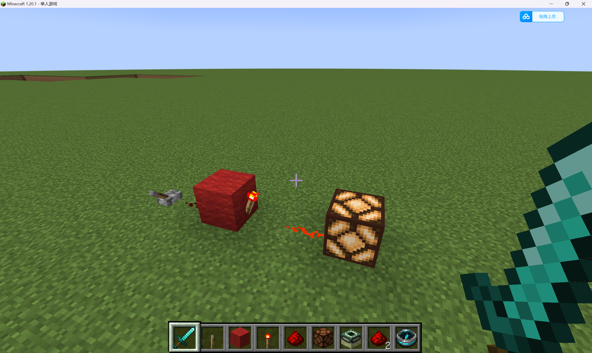
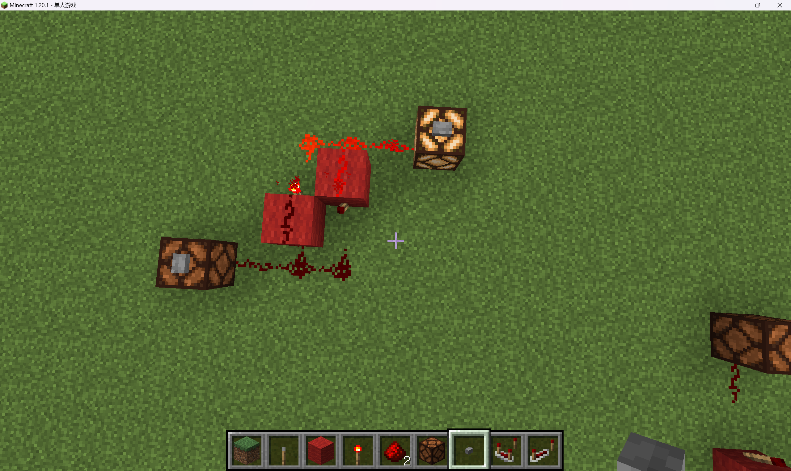
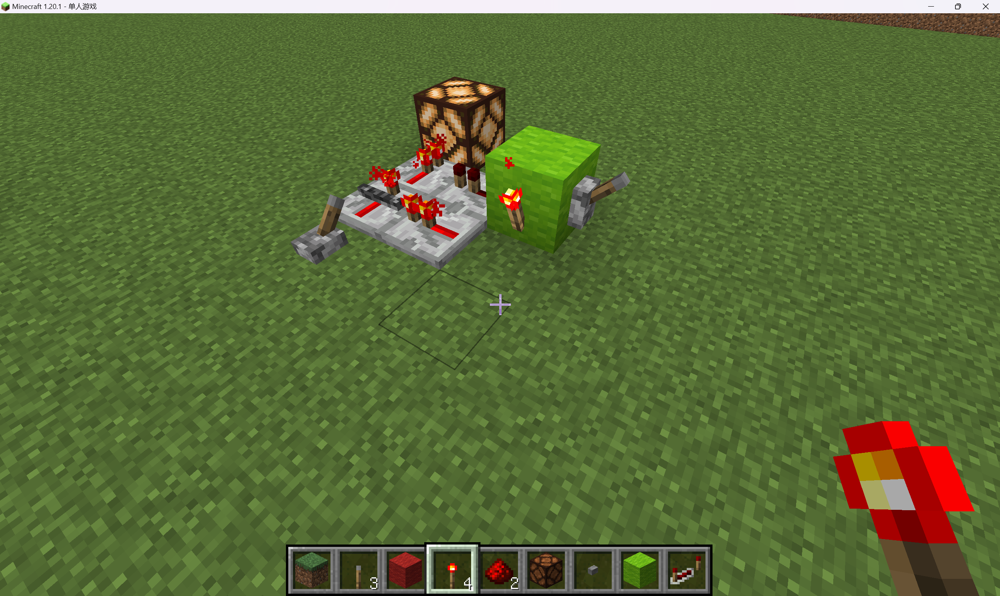
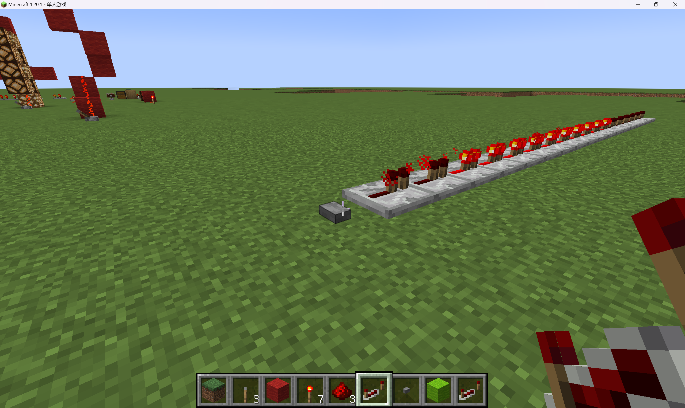

---

Copyright (C) Timothy Liu 2023

许可证：[Creative Commons — 署名-相同方式共享 4.0 国际 — CC BY-SA 4.0](https://creativecommons.org/licenses/by-sa/4.0/deed.zh-Hans)

2023.07.24

---

## 目录

[TOC]

## 简介

+ Java 版：经典版本
+ 基岩版（Bedrock 版）：使用 C++ 编写的版本，原为携带版（MCPE，Minecraft Pocket Edition）
+ ~~网易 Java 版~~

## 客户端安装

一切客户端均可登录 [Minecraft 官网](https://www.minecraft.net/) 查看详情

### Java 版安装

#### 正版安装

在 Microsoft Store（地区需要设置为美国或其他非国区）里氪金购买即可

#### 免费安装

1. 访问 [HMCL](https://hmcl.huangyuhui.net/download/)，下载相应版本的安装包
2. 打开安装包进行安装
3. 打开 HMCL 安装包进行安装（期间可能需要提示安装 Java，安装后重新打开安装包安装即可）
4. 选择**离线**账号，设置用户名
5. 安装合适版本的 Minecraft 客户端
6. 运行 Minecraft

### 基岩版安装

#### 正版安装

+ （Windows）在 Microsoft Store（非国区）里氪金购买
+ （iOS）在 App Store（非国区）里氪金购买
+ （Android）在 Google Play（非国区）里氪金购买

#### 免费版安装

+ 以前网上有不少旧版的安卓的 APK 安装包，现在不知道还有没有……

## 开一个 Minecraft 服务器

### 使用 Docker 开一个 Minecraft 服务器

+ Q：为什么使用 Docker？
+ A：方便！

Docker 镜像：

+ Java 版 Server 镜像：[itzg/minecraft-server - Docker Image | Docker Hub](https://hub.docker.com/r/itzg/minecraft-server)

+ 基岩版 Server 镜像：[itzg/minecraft-bedrock-server - Docker Image | Docker Hub](https://hub.docker.com/r/itzg/minecraft-bedrock-server)

**以 Java 版为例**

1. 新建一个目录作为工作目录

2. 建立一个 `data` 子目录用于存储数据

3. 从 [docker-minecraft-server/docker-compose.yml at master · itzg/docker-minecraft-server (github.com)](https://github.com/itzg/docker-minecraft-server/blob/master/docker-compose.yml) 复制 `docker-compose` 配置文件：

   ```yaml
   version: "3.8"
   
   services:
     mc:
       image: itzg/minecraft-server # 此处可以通过 tag 指定版本：https://hub.docker.com/r/itzg/minecraft-server/tags
       environment:
         EULA: "true"
       ports:
         - "25565:25565"  # 此处的前一个数字换成希望开设服务的端口（1024 以上，且没被其他服务占用）
       volumes:
         - data:/data     # 此处的前一个 `data` 换成用于存储数据的目录的**绝对路径**（不可以是相对路径）
       stdin_open: true
       tty: true
       restart: unless-stopped
   volumes:
     data: {}
   ```

   存入到工作目录中。

4. 运行：

   ```bash
   $ docker-compose up -d
   ```

   执行：

   ```bash
   $ docker logs <container_id>
   ```

   查看运行情况，等待直到运行完毕。

   其中，`<container_id>` 可以通过 `docker ps` 查看。

5. 修改配置文件

   注意，之前的启动仅仅是为了得到一个初始化的配置文件而已（当然我们也可以自己写，这太麻烦了）。我们还需要进行一些配置才可以使用。因此执行：

   ```bash
   $ docker-compose down
   ```

   来关闭服务器。

   然后我们可以看到，在 `data` 目录下，生成了 `server.properties` 文件。在里面可以看到：

   ```properties
   online-mode=true
   ```

   这一行。而因为我们使用的是免费的 Minecraft，使用离线账号登录，因此之前我们是无法连接到服务器的，所以我们修改为：

   ```properties
   online-mode=false
   ```

6. 修改世界属性

   注意到该配置文件中还有很多关于世界的属性，例如游戏难度、游戏模式（生存、创造、极限），等等多种配置，我们可以进行修改。

   但需要注意的是，我们有些属性是创建世界的时候才需要的，因此修改之后我们必须重新生成世界，这需要我们**删除 `world` 文件夹**

7. 重新启动服务器

   ```bash
   $ docker-compose up -d
   ```

   执行：

   ```bash
   $ docker logs <container_id>
   ```

   查看运行情况，等待直到运行完毕。

8. 使用客户端连接服务器

   使用和服务器**相同版本**的 MInecraft 客户端，在“多人游戏”中连接我们的服务器，并指定 `host:port` 进行连接（`host` 为 `ip` 地址或域名；`25565` 为默认端口，非 `25565` 需指定端口）即可

## 红石基础

### 前置条件

在阅读本教程之前，需要声明的是，在本教程将 Minecraft 中的方块分为以下几种：

1. 非透明方块：大多数方块均属于此类
2. 透明方块：玻璃等可以透视的方块
3. 萤石
4. 台阶：台阶可以被放置在上半格或下半格，放置在上半格和下半格的台阶可能有不同的性质
5. 楼梯：楼梯可以被正立或倒立放置，正立与倒立放置的楼梯可能有不同的性质
6. 能源：能够为红石提供能量的方块，例如拉杆、按钮、红石块、红石火把等
7. 机械装置：能够被红石激活并做出可观测的反应的方块，例如红石灯、门、音符盒、TNT、活塞等

### 红石的基本性质

#### 红石的形态

+ 十字
+ 点状
+ 线状
+ L 型
+ T 型
+ 对角线

红石会自动调整形态

#### 水和岩浆

水和岩浆能够冲走红石，使其掉落

### 红石的能量传输

首先，红石在传输能量的过程中是有衰减的，即红石信号的强度会随着传输距离的增大而减弱。红石信号最强只有 15 级，这意味着即便是再强的电源，第 16 格也不会获得能量。

在使用红石能源时，红石能够自动地调整形态而与邻近的红石能源相连的

下面我们具体来看一下红石的能量传输规则

1. 红石无法透过任何方块传输能量。如下图，各种方块均可以阻断红石的能量传输
2. 红石可以通过任何方块沿垂直对角线向上传输能量
3. 但红石只能通过非透明方块和透明方块沿垂直对角线向下传输能量，其他方块均无法向下传输能量
4. 在垂直对角线上的非透明方块会阻碍能量的传输，但透明方块、萤石、台阶、楼梯均不会阻碍能量的传输

### 机械装置初探

一个机械装置，如果收到了红石传递来的能量，那么这个机械装置被“激活”。

例如，“红石灯”是一个机械装置，当被充能时会亮起，不被充能时则熄灭。由于红石灯被激活后的效果较为明显，因此之后我们将大量使用红石灯来作为机械装置以及方块的代表，以探测该处方块是否收到了红石信号

红石是**不会**自动改变形态而与机械装置连接的，但红石必须与机械装置**相连**才能激活机械装置（十字星形态的红石是与四周的方块均相连的，可以激活周围的机械装置；点状形态的红石是不与四周的方块相连的，不会激活周围的机械装置）

一些机械装置：

+ 红石灯：被充能的红石灯处于亮起状态
+ 门：被充能的门、铁门、活版门、栅栏门等均处于打开状态
+ 动力铁轨：被充能的动力铁轨至多传输 8 格，且能让矿车加速；但若动力铁轨未被充能，则动力铁轨会使矿车停下；若被充能的动力铁轨临近一个非透明方块，那么在该动力铁轨上放置的矿车会立即加速
+ TNT：被充能的 TNT 会爆炸
+ 铁轨：拐弯处的铁轨被充能后会改变方向。下图为拐弯处的铁轨被充能前后的形状改变情况
+ 激活铁轨：被充能的激活铁轨可以
  + 让矿车中的生物被抛出
  + 让漏斗矿车无法工作
  + 让 TNT 矿车爆炸
+ 音符盒：被充能时发出单个音符
+ ……

### 方块的充能

非透明方块可以被红石“充能”，并可以发出长度为 1 的红石信号，即可以激活临近的机械装置，但无法再直接通过红石向外传输；透明方块、萤石、楼梯、台阶，均不能被充能

### 练习——如何更高效地向上 / 下传输能量

参见：[红石测验第一章——红石基础#实践：红石能量传输模型 | EESΛST Docs (eesast.com)](https://docs.eesast.com/docs/game/minecraft/redstone/redstone_testing/redstone_basic1#实践红石能量传输模型)

## 红石进阶

### 给方块强充能

+ 被强充能的方块可以激活相邻的机械装置，也可以将被充的能量传递给周围的红石
+ 被（弱）充能的方块只可以激活相邻的机械装置，但无法激活周围的红石线

### 使用红石线给方块充能

若要用红石线给方块（弱）充能，要么与方块成一条直线，要么放置在方块的上方；红石线无法给其上方的方块充能

### 能源

能源是能够发出红石信号（能量）的方块。在使用红石能源时，红石能够自动地调整形态而与邻近的红石能源相连的

+ 红石块：永久开启的能源，产生 15 格信号，可以激活相邻的机械装置
+ 红石火把：永久开启的能源，产生 15 格信号，可以为相邻方块（除放置它的方块外）充能，可以为它上面的方块强充能，不能为放置它的方块充能，可以激活相邻的机械装置
  + 在某些旧版本不能放置在萤石上
  + 红石火把同时也是一个机械装置，若红石火把放置在被充能的方块上，它会熄灭
+ 拉杆：可开关的能源，产生 15 格信号，可以为相邻方块充能，可以为放置它的方块强充能，可以激活相邻的机械装置
  + 在某些旧版本不能放置在萤石和透明方块上
+ 按钮：按下去后会提供能量，但短暂时间后便弹起，其他性质与拉杆类似
  + 使用箭射在按钮上可以将按钮持续按下
+ 压力板
  + 木制 / 石制压力板：当有实体或物品在压力板上面时会激活压力板，发出能量
  + 测重压力板：发出红石信号的强度随上面物体的增多而增大，最大强度为 15 格（注意相同的掉落的物品会叠加，若多个掉落的物品叠加则只视为一个物品）
    + 重质（铁质）：每增加 10 个物品，信号强度增加一格
    + 轻制（金质）：每增加 1 个物品，信号强度增加一格
  + 矿车可以激活铁轨弯道内侧的压力板

+ 绊线钩：当绊线钩上的线与实体接触时会产生信号；当绊线钩上的线被非剪刀破坏时会产生脉冲信号（即短暂地产生信号）
  + 线的长度不能超过 40 格，否则绊线钩无法正常工作
+ 探测铁轨：有矿车在其上面时发出能量
+ 陷阱箱：与常规储物箱几乎相同，但在被打开时发出红石信号
+ 阳光传感器（阳光探测器）：发出红石信号与**接收到的天空光照等级**有关（详情略，请同学们自行查阅资料并探索）

### 更多红石元件

+ 发射器：在刚被激活的时候随机发射出一个装填的物品，
  + 有两个红石信号的延迟
  + 可以发射箭、喷溅型药水、雪球、鸡蛋、火焰弹、烟花、TNT、水和岩浆（发射或用空桶回收）、船、装备、打火石、怪物的蛋、骨粉、南瓜（可以生成铁 / 雪傀儡），等等
+ 投掷器：在刚被激活的时候随机把一个装填的物品扔出来
  + 有两个红石信号的延迟
  + 如果投掷器正对着一个容器（例如储物箱等），则会把物品直接放入该容器中
+ 活塞：在被激活时会弹出，并推动前面的方块
+ 黏性活塞：在被激活时会弹出，并推动前面的方块，并在缩回时将前面的方块带回
+ 侦测器（观察者）：侦测方块的变化，若有变化则产生红石信号
+ 漏斗
  + 在未被充能时，可以不断地将其上方的容器导入其中，也可以不断将其中的物品导入到其下方的容器中
  + 在被充能时停止工作
+ ……

## 红石电路

### 红石中继器

+ 顾名思义，红石中继器最基本的功能是“中继”。红石信号是有传输距离的，如果我们要传的更远，那么就可以使用红石中继器来帮忙——红石中继器无论输入的红石信号强度如何，总能输出 15 格的红石信号，并且还可以为其前面的方块强充能。

+ 红石中继器有唯一的输入端和输出端，因此可以当作“二极管”来使用，保证信号的单向传输
+ 红石中继器具有**锁存**功能，可以在侧面被其他的中继器（或比较器）“锁定”，在输出端保持被锁定前的状态
+ 红石中继器默认具有一个红石信号的延迟，但右击红石中继器可以改变它的延迟（可以在 1\~4 个延迟内调整）

### 红石比较器

+ 在“中继”的功能上，作为其他情况的平凡情况，红石比较器总会输出等同于输入的红石信号强度，其他性质与红石中继器类似
+ 也可以用作“二极管”保证信号的单向传输
+ 红石比较器有一个红石信号的延迟
+ “比较”功能：红石比较器有两种模式
  + 默认情况下，其前方的小红石火把会熄灭，此时，若从侧面输入的能量大于输入端输入的能量，则输出为 0，否则不影响输出
  + 右击红石比较器，其前方的小红石火把会亮起，红石比较器变为“减法模式”，此时，输出为输入端信号强度减去侧面输入的信号强度，若结果为负数则输出为 0
+ 若比较器紧贴一个容器（例如储物箱等装物品的容器、炼药锅、末地传送门、物品展示框、蛋糕等），或与储物箱相隔一个方块，则比较器的输出取决于容器装满的程度

### 数字逻辑

在数字电路中，我们的电路通常情况下仅存在“0”和“1”两种电平，即“低电平”和“高电平”（此外还有“不定态”X 和“高阻态”Z，但它们是没有办法拿来直接使用的）。那么红石电路中，我们将红石有信号作为“1”，无信号作为“0”

#### 真值表

真值表是布尔函数的表格表述形式，代表各个布尔变量（自变量）取不同的值（0 或 1）时，布尔函数的函数值情况，例如布尔函数“或”的真值表：

|  X   |  Y   | X + Y |
| :--: | :--: | :---: |
|  0   |  0   |   0   |
|  0   |  1   |   1   |
|  1   |  0   |   1   |
|  1   |  1   |   1   |

#### 逻辑门

1. 非门

   真值表：

   |  X   | $\overline{X}$ |
   | :--: | :------------: |
   |  0   |       1        |
   |  1   |       0        |

   

2. 与门

   真值表：

   |  X   |  Y   |  XY  |
   | :--: | :--: | :--: |
   |  0   |  0   |  0   |
   |  0   |  1   |  0   |
   |  1   |  0   |  0   |
   |  1   |  1   |  1   |

   利用红石火把和方块充能的特性：

   

3. 或门

   真值表：

   |  X   |  Y   | X + Y |
   | :--: | :--: | :---: |
   |  0   |  0   |   0   |
   |  0   |  1   |   1   |
   |  1   |  0   |   1   |
   |  1   |  1   |   1   |

   直接连起来，或可以使用二极管防止能量反馈：

   

4. 与非门

   真值表：

   |  X   |  Y   | $\overline{XY}$ |
   | :--: | :--: | :-------------: |
   |  0   |  0   |        1        |
   |  0   |  1   |        1        |
   |  1   |  0   |        1        |
   |  1   |  1   |        0        |

   把与门前面的红石火把去掉就好了（加个非门等价于去掉一个非门）：

   

5. 或非门

   真值表：

   |  X   |  Y   | $\overline{X + Y}$ |
   | :--: | :--: | :----------------: |
   |  0   |  0   |         1          |
   |  0   |  1   |         0          |
   |  1   |  0   |         0          |
   |  1   |  1   |         0          |

   或门后边加个非门就好了（二极管可以省了）：

   

6. 异或门

   两个输入不一样时输出才为 1，一样时为 0

   真值表：

   |  X   |  Y   | $X \oplus Y$ |
   | :--: | :--: | :----------: |
   |  0   |  0   |      0       |
   |  0   |  1   |      1       |
   |  1   |  0   |      1       |
   |  1   |  1   |      0       |

   我们通过非常简单的观察（迫真），就可以看出逻辑表达式：$X \oplus Y = \overline{X}Y + X\overline{Y} = \overline{(XY+\overline{X})} + \overline{(XY+\overline{Y})}$ 显然成立（

   于是就可以给予最后这个逻辑表达式，做出以下这个非常简单的异或门：

   

   当然，我们还可以使用我们的红石比较器的“减法模式”来更简洁地实现：

   

7. Only Gate（使能的非）

   当且仅当某一个特定的输入为 1 时才为 1（即另外一个为 1 时输出恒为 0，为 0 时输出与该特定输入相同）

   真值表：

   |  X   |  Y   | Enable |
   | :--: | :--: | :----: |
   |  0   |  0   |   0    |
   |  0   |  1   |   0    |
   |  1   |  0   |   1    |
   |  1   |  1   |   0    |

   


### 时序逻辑

+ 组合逻辑：输入是什么，输出就是什么
+ 时序逻辑：存在时序关联，存在状态转移

#### 锁存器与触发器

+ SR 锁存器（RS 锁存器）

  输入端有两个，一个 R 端，一个 S 端；输出端有两个，一个 Q 端，一个 Q' 端（Q' 端为 Q 端的非）

  当 S 端变为 1 时，Q 端变为 1，Q' 端变为 0；R 端为复位端（R 端为 1 时，Q 端变为 0，Q' 端变为 1）

  在 Minecraft 中，可以将瞬时的信号转化为持久信号；在数字电路中更有妙用

  

  

+ RS-ISR 锁存器

  一次性的锁存器，一旦激活永久保持

  只能通过破坏环路上的红石线来熄灭的版本：

  

  带复位键的版本：

  

+ D 锁存器

  存在一个使能端，控制输入端信号能否到达输出端，或是输出端保持之前的状态。使用中继器自己的性质即可：

  

+ D 触发器

  存在一个输入端 D 以及一个时钟输入 C，当 C 位于上升沿（从 0 变 1）或下降沿（从 1 变 0）时将输出端变为此时输入端的状态。下图为下降沿采样的 D 触发器（把时钟输入和非门调换位置即可变成上升沿采样）：

  

### 时钟（脉冲）信号生成

时钟信号，即在 0 和 1 之间周期性变化的信号，常用来搭建时序逻辑的数字电路，通过触发器实现在每个上升沿（或下降沿）采样，使电路周期性地运转，例如我们熟悉的 CPU 就是这个工作原理。时钟信号产生方法有很多，以下仅介绍部分简单的时钟信号生成器。

首先，奇数个非门首尾相连当然可以生成时钟信号（可以通过增加非门数量或插入红石中继器等增大时钟周期）：


也可以利用红石中继器的传输延时，将红石中继器首尾相连形成周期性信号（但启动时需要快速打开和关闭，操作的时间需要小于时钟周期），可以通过增加中继器来调节时钟周期：


还有其他的产生时钟（脉冲）信号的方法，尤其是带有使能的受控脉冲、时钟周期可调的脉冲，占空比可调的脉冲，渐变脉冲，等等，它们可以利用红石火把、比较器、漏斗等元件的特性进行脉冲生成，但这些都非常的复杂，时间原因在此不做过多介绍了，大家可以自行查阅资料进行学习。

### 单脉冲生成器

如果我们只需要很短暂的一次性的红石信号，我们称这种信号为“单脉冲信号”。产生单脉冲信号的方法很多，我们在这里仅作简单介绍。

首先，最简单的单脉冲生成器当然是按钮（多个相连的中继器用来查看脉冲长度）：




但按钮的时长毕竟比较长，有时候我们希望调节单脉冲的长度。一个最简单的办法就是利用中继器的锁存功能，在输入端和锁存端形成时间差，来获得单脉冲：


而且我们还可以通过调节中继器的延时来调节脉冲长度

当然这是最简单的单脉冲生成方式，此外还有其他的单脉冲生成方式，以及暗脉冲（仅有短暂的一段时间为 0 其他时间为 1）生成方式，时间原因不做过多介绍了，同学们可以自己查阅学习

## 结语

由于时间原因，我们还有很多有趣的内容没有涉及，包括但不限于：

+ 使用 K8S（Kubernetes）开设 Minecraft 服务器
+ 开设 Minecraft 基岩版服务器
+ 萤石、台阶、楼梯、透明方块的更多形态和红石特性
+ 阳光传感器的详细介绍（两种模式、夜光传感器、其与时间、天气的关系、与太阳正弦角的数学关系，等）
+ 各种脉冲生成器（X-同步脉冲生成器、渐变脉冲生成器、基于各种逻辑门的脉冲生成器，等等）
+ 各种单脉冲生成器
+ 基岩版（含旧的 PE 版）、Java 版中红石特性的区别
+ 各种矿车和铁轨
+ 漏斗的详细使用
+ 更多方块的红石特性（物品展示框、……）
+ 非红石的电路（沙子—仙人掌电路、木牌—水—火把电路、……）
+ ……

略去上述内容不会对我们后续的学习产生太大的影响，感兴趣的同学可以自行查阅资料学习，并持续关注我们正在更新的 Mojang 官方红石教程的翻译工作：

[红石测验 | EESΛST Docs (eesast.com)](https://docs.eesast.com/docs/game/minecraft/redstone/redstone_testing/)


**最后，欢迎大家选修电子系核心课——《数字逻辑与处理器基础》课程以更深入地感受数字电路与处理器的设计（或阅读参考文献中的课件自行学习）！！！（逃**


## 参考文献

+ [红石测验第一章——红石基础 | EESΛST Docs (eesast.com)](https://docs.eesast.com/docs/game/minecraft/redstone/redstone_testing/redstone_basic1)，2023 年 7 月 24 日
+ [《数字逻辑与处理器基础》课件](https://cloud.tsinghua.edu.cn/d/bc56c91e6b414a61bb6f/?p=%2F2-2 数字逻辑与处理器基础（数逻）%2F课件%2F理论课%2F数逻mhb课件2021&mode=list)，马洪兵，2021 年春
+ [Minecraft Wiki – The Ultimate Resource for Minecraft (fandom.com)](https://minecraft.fandom.com/wiki/Minecraft_Wiki)，2023 年 7 月 24 日
+ [中文Minecraft Wiki - 最详细的我的世界百科 (fandom.com)](https://minecraft.fandom.com/zh/wiki/Minecraft_Wiki)，2023 年 7 月 24 日
+ [官方网站 | Minecraft](https://www.minecraft.net/zh-hans)，2023 年 7 月 24 日

---

## 作业

### 练习——如何更高效地向上 / 下传输能量

参见：[红石测验第一章——红石基础#实践：红石能量传输模型 | EESΛST Docs (eesast.com)](https://docs.eesast.com/docs/game/minecraft/redstone/redstone_testing/redstone_basic1#实践红石能量传输模型)

自行练习，无需提交

