## 一、Unity 介绍

### 1、什么是游戏引擎？

- 游戏引擎（Game Engine）是指一些已编写好的可编辑的电脑游戏系统，或者一些交互式实时图像应用程序的核心组件。这些组件提供了游戏设计者设计游戏所需的各种工具，不需要游戏设计者从零开始，可以直接引用引擎里的部分功能快速编写出游戏。
- 说白了，就是帮游戏开发者省事的工具。

### 2、什么是 Unity？

- Unity 是一款游戏引擎。

- Unity 是由 Unity Technologies 开发的一个让你轻松创建诸如三维视频游戏、建筑可视化、实时三维动画等类型互动内容的多平台的综合型游戏开发工具，是一个全面整合的专业游戏引擎。Unity2D/3D 游戏引擎可以发布到 Windows, MacOS, Linux, iOS 等诸多平台。

- Unity 官网：https://unity.com/
- Unity 官方学习资源：https://learn.unity.com/
- Unity 官方文档：https://docs.unity3d.com/Manual/index.html
- Google/Unity Forums

### 3、为什么选择 Unity？

- Unity 创作出了很多优秀的作品：明日方舟、王者荣耀、精灵宝可梦 GO、炉石传说、极乐迪斯科、崩坏 3、原神、纪念碑谷。
- Unity 应用十分广泛，以下是来自网络的数据：
  - Unity 的客户包括动视暴雪，EA，Ubisoft 等国外大厂 ，也包括腾讯，网易，巨人，盛大，完美世界，西山居等国内知名大厂，全球超过 1900 万的中小企业以及个人开发者。全平台（包括 Steam/PC/主机/手机）所有游戏中有一半都是基于 Unity 创作的，在 Apple 应用商店和 Google Play 上排名最靠前的 1000 款游戏中，53%都是用 Unity 创作的。
- Unity 的优势？

  - 易上手，入门快。
  - 学习成本低，大量教程，学习文档完善。
  - 好就业。

- Unity 的劣势？
  - 坑不少。
  - 版本兼容性不好。
  - ......

## 二、环境配置与安装

### 1. 版本：

- Unity 编辑器：Unity 2021.3.4f1c1（LTS）
- Unity Hub：3.1.2-c2
- 安装共占用空间大小：10GB 左右
- 随着版本更迭，如果想要下载并保留多个版本编辑器，占用空间会更大。
- 作为参考，我体验过：两版本+依赖/插件+各种库，共 30GB。
- 如果电脑有显卡的话，使用体验会好一些。
- 不同版本之间差距不小，兼容性也极差。可能对项目平台进行升级后就完全不能用了，所以在正式开发前，Unity 界面组要统一开发版本，并一直用到结束。（记得选择 LTS，长期支持版本)

### 2. 安装教程：

- Unity 工程及 Unity Editor 版本管理：Unity Hub

- 图形化编辑界面：Unity Editor

- 代码编辑器：Visual Studio（安装时选择"使用 Unity 的游戏开发"），VS Code（在 Unity Editor 中修改默认代码编辑器），其他。

- 先下载 Visual Studio，这是我们主要的代码编辑器。

- 再下载 Unity Hub，链接为：[Unity 官方下载](https://unity.cn/releases)，下载完后安装，记得留出足够的空间。

- 然后，在 Unity Hub 中，下载当前版本的 Unity 编辑器。这也几乎是全自动的。

- 可轻松获取免费个人版的激活。（如果你不以赚大钱为目标的话）

- 如果在安装过程中发生了一些问题，建议百度或者 CSDN，这大概能够解决百分之九十九的问题。

### 3、工具介绍：

- Unity Hub 是一种管理工具，可用于管理所有 Unity 项目，管理 Unity Editor 及其关联组件的不同版本的安装，还可以创建新项目，以及打开现有项目。

- Unity Editor，游戏开发的主要工具，主要使用 UI 进行开发设计。

- Visual Studio，写游戏逻辑及角色控制脚本的工具。简而言之，就是拿它来写代码。Unity 使用的是 C#语言。你也可以用别的代码编辑器，我曾试过 Rider，感觉 VS 还是最熟悉和舒服的。

- Unity Editor 和 Visual Studio，两者相符相成，互相依赖，开发过程既需要写代码，也需要上手挂载、布置、调试、运行、检查。

- 其他工具：
  - Aseprite，一款简洁的 2D 像素风角色绘图工具。很实用，上手也很容易。
  - PhotoShop，界面设计免不了要涉及到美术相关内容。所以如果你对美术有一定兴趣和追求，那会很好。

## 三、写在前面

- Unity 的学习量还是不小的。这篇文档里所讲的只是杯水车薪，只是起到一个引路的目的。

- 个人觉得 Unity 学习最高效的方法，就是跟着一些教学视频去从零开始亲手实现一个完整的项目，当你做了几个项目之后，就对整体的逻辑和技术比较了解了。Unity 有书（没看过），网络上、B 站上也有比较丰富的资源可以学习。

- 游戏开发是个很有趣的过程，一直保持兴趣热爱。

- 推荐两个用过的 2D 教学视频：

  - [Unity2021 入门教程*游戏开发 100 集课程(含建模)*哔哩哔哩\_bilibili](https://www.bilibili.com/video/BV1WK411V7dn?spm_id_from=333.1007.top_right_bar_window_custom_collection.content.click&vd_source=a7c1833920cb4ecbac7b53187e6e45da)
  - [【Unity 2D 游戏开发教程】第 1 课 如何在 Unity 中快速导入序列帧动画 Aseprite 动画帧导出\_哔哩哔哩\_bilibili](https://www.bilibili.com/video/BV1sE411L7kV?spm_id_from=333.999.0.0&vd_source=a7c1833920cb4ecbac7b53187e6e45da)

- 这两套教学都很好上手，Up 主讲得也挺细致，都过一遍之后就基本上轻车熟路了。

- 最重要的资源：Unity 文档：[Unity User Manual 2021.3 (LTS) - Unity 手册 (unity3d.com)](https://docs.unity3d.com/cn/current/Manual/UnityManual.html)

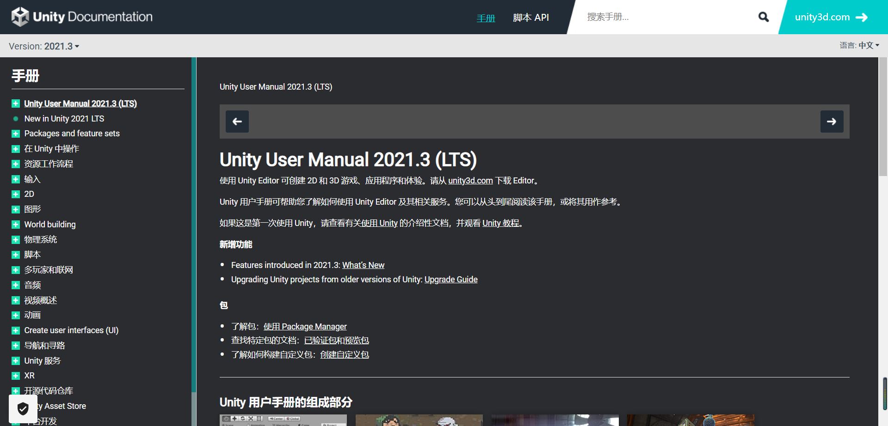

### Unity 基本知识

#### Scene（场景）

Scene 包含了若干 GameObject，一个游戏可以包含多个场景，不同的场景之间是独立的，并且可以通过脚本切换场景。

#### GameObject（游戏对象）

一个 GameObject 就是场景中的一个对象，比如一个球，一个人；它可以独立地活动。GameObject 之间存在 Parent 和 Children 的关系，即一个对象可以从属于另一个对象，成为其子对象。

请注意，GameObject 之间的父子关系并非继承关系，而只是一种从属关系。

#### Component（组件）

一个 GameObject 可以拥有若干个 Component，两者之间仍是一种从属关系。每个 Component 可以独立地实现 GameObject 需求的某些功能。常用的如 Rigid（刚体），Animator（动画）等。

#### Prefab（预设）

Prefab 与 GameObject 之间的关系类似于类和对象的关系。即后者是前者的实例。Prefab 的使用能够减少不必要的重复工作。当 Prefab 被修改时，它的所有 GameObject 实例也会被修改。

#### Script（脚本）

通过编写代码，并将 Script 添加为某个 GameObject 的 Component，当该 GameObject 被实例化并且处于活动状态，且该 Component 也处于活动状态时，它便可以控制 GameObject 的行为。

Unity 脚本是基于 Mono 的，所有需要使用 Unity 引擎的脚本，都应该继承自 MonoBehaviour 类。换句话说，只有那些完全不依赖于 Unity 引擎进行初始化和更新，也不调用 Unity 的 API 的脚本，比如单纯进行数学计算的类，是不需要继承 MonoBehaviour 的。

#### Assets（资源）

你的所有 Prefab, Script 以及 Material 等资源都在 Assets 中进行管理。对于规模较大的工程，总应该建立规范的目录结构。

#### 所以，Unity 是如何工作的？

首先要加载一个场景。当场景被加载时，场景中的所有 GameObject 都会被加载。当 GameObject 加载时，其所有 Component 也随之实例化。当某个 Script 实例化时，其 Awake()方法和 Start()方法被先后调用（细节这里不说），当所有 Start()方法都被调用完毕后，游戏会进入第一帧，每隔一段时间就会 Update 一次。

## 四、Unity 界面介绍

- 在这一部分的介绍中，不会涉及到复杂的代码和操作，而主要带大家熟悉一下 Unity 这个软件。Unity 这个软件还是比较复杂的。而我们的介绍就从 Unity Editor 界面的认识开始。

- 打开 Unity Hub，界面应该如下：

  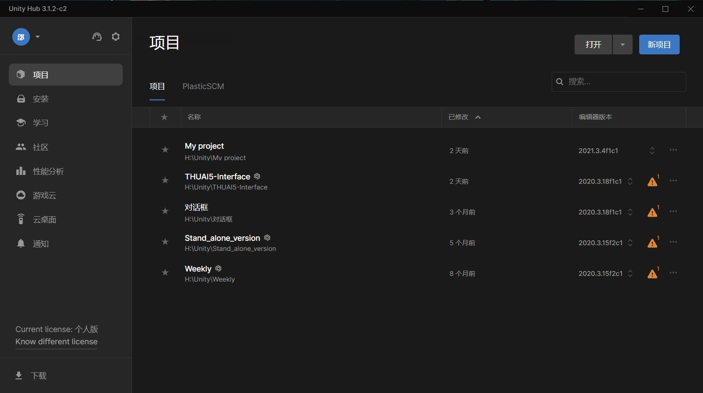

  点击右上角的“新项目”文件夹，选择如下配置：

  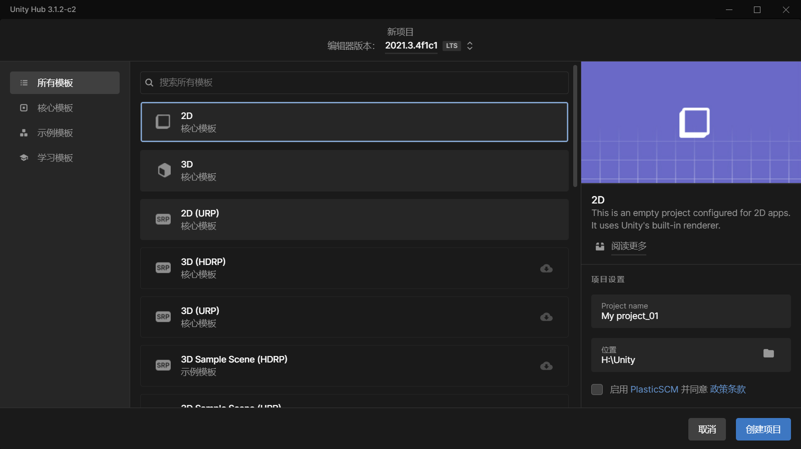

  其实 2D 和 3D 的界面差不太多，THUAI5 的 Unity 界面使用的是 2D 的开发平台，所以就以 2D 的界面为例进行介绍，3D 的其实很类似。

  创建完项目后，出现如下界面：

  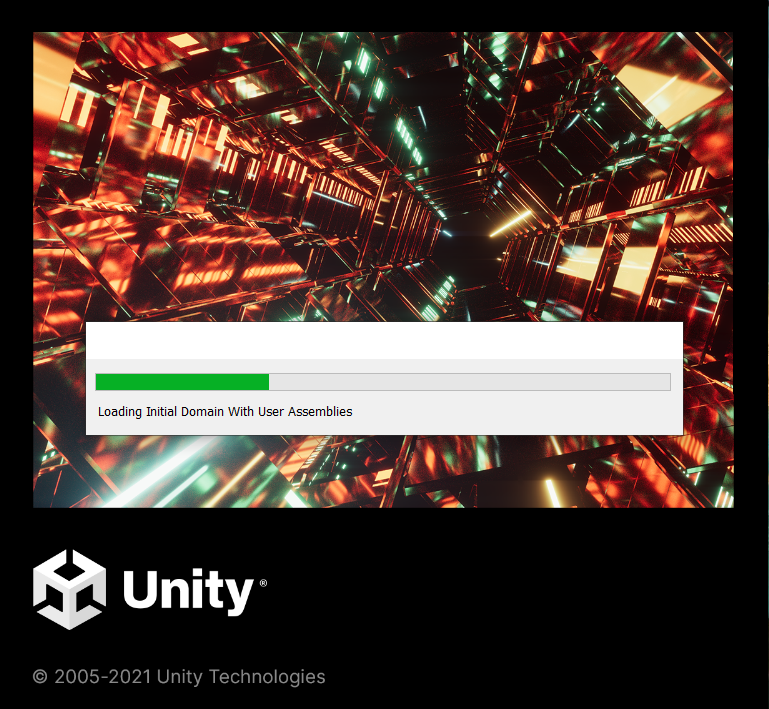

  等待一会后，进入 Editor：

  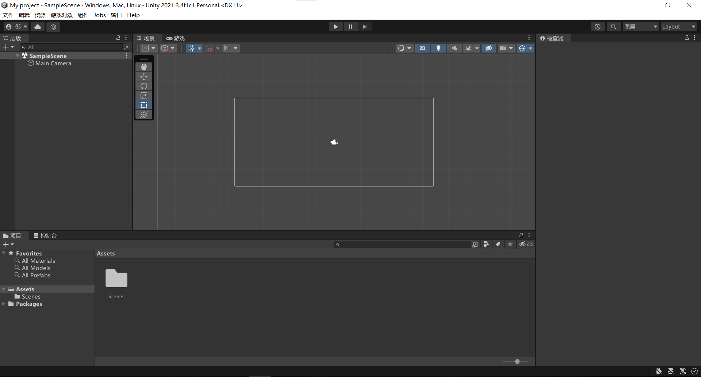

  这就是主界面。它分为如下几个部分：

  1、最上面的导航栏。

  - 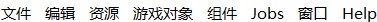

  - 其实用到的也不多，这个中文的其实已经一目了然了，讲两个小点：

  - Help 中可以直接调出 Unity 的用户手册。
  - 资源里面可以选择导入包和导出包。

  2、左边的 Hierarchy 面板。

  - 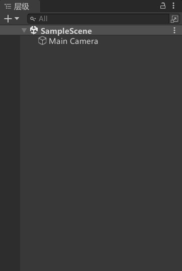
  - 用来放游戏对象。

  - 采用层次显示方式，可以方便观察父子关系。

  - 游戏里的每个游戏对象都需要把 project 中的资源，**拖拽**到 hierarchy 中创建成为游戏对象。只有在 hierarchy 面板中创建了对象，我们才能够在游戏中看到它。（资源存放在哪里？）

  3、下方的资源面板。

  - 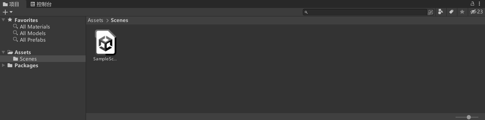
  - 用于存放项目所要用到的脚本代码、预制体、美术资源、材质资源、音乐资源......

  - Unity 支持文件拖拽。而且用拖拽有的时候更加保险。
  - 在界面上拖拽和对文件夹直接进行操作是一致的。
  - **记得保持良好的习惯：**Assets 下面的资源按照类别分别建立文件夹：比如 Scenes、Scripts、Heros、Music、Backgrounds......

  4、右边的 inspector 检视面板。

  - 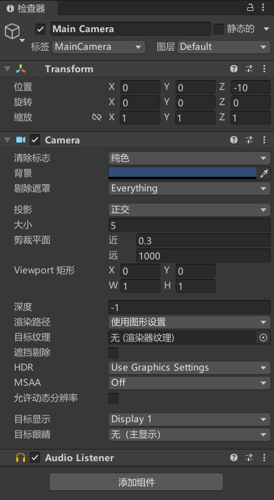
  - 显示当前选定游戏对象附加的组件及其属性信息。
  - 组件：哪些东西是组件？如何增加组件？
    - 后面会详细介绍。

  5、中间的场景和游戏面板：

  - 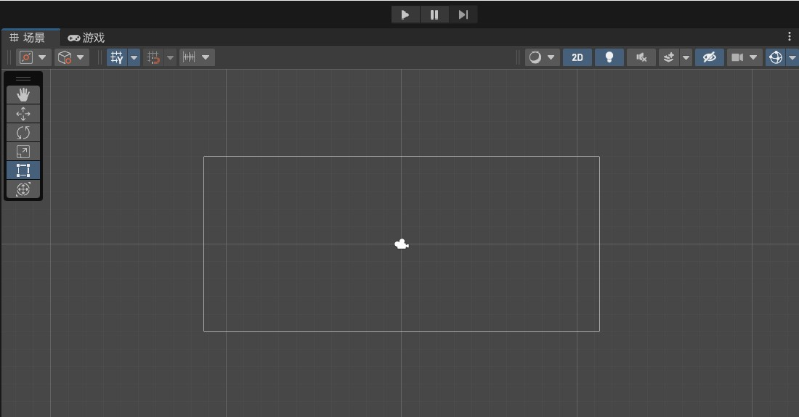
  - 这两个是**核心操作面板**。
  - 所有的操作都是在场景面板中完成的。
  - 游戏面板等于是对游戏功能的测试。能够准确体验游戏的运行状态。
  - 当我们在场景中完成全部的部署之后，点击运行按钮，就可以开始游戏（开始测试）。
  - 中断按钮可以暂停当前游戏并切换回场景面板以查看对象的实时属性。

## 五、添加资源与游戏对象

### 1、添加一只不会动的皮卡丘。

- 先添加到资源文件。（拖拽/文件夹）
- 再从资源文件中，把皮卡丘拖拽到 Hierarchy 面板或者 Scene 面板。思考：这两者有什么区别？
- 看看这张皮卡丘的图片有哪些属性？
- 捏一捏它。如何调整图片的大小、位置、旋转.....

### 2、添加一只会动的圣诞老人。

- Unity 不支持 gif。
- 如何把一串图像组合成 gif？

  1. 首先获得一张帧图片。
  2. 把帧图片导入到 Unity 中。
  3. 改变图片属性为多个。并按照 cell 大小完成切割。
  4. 选住所有帧，拖到 Hierarchy 面板，Unity 会自动生成动画文件。

- 点击运行按钮让你的圣诞老人动起来。
- 关于动画，更全面、系统、深层次的应用：动画状态机。（Animator）

  - 它和数逻的状态机其实很相近，毕竟名字里有个状态机。
  - 状态，即动画的效果，比如人物静止的时候会有上下轻微浮动的动画，人物走的时候有个行走的动画，人物攻击的时候有个攻击的动画，跳跃的时候有个跳跃的动画，这些不同的动画状态，都是通过**状态机**连接起来的。。
  - 既然有不同的状态，那么就应该有状态转换的条件

    - 比如人物什么时候从站立状态转而变成走路的状态——按下 WSAD 键盘
    - 再比如人物放完技能之后应该自动返回站立（挂机）状态，肯定不能一直放技能。（有 CD 存在）
    - 这些控制条件是通过挂载在人物下的脚本结合 Unity 的动画状态机来控制的。

  - 动画是游戏的一个重点。比如你需要卖氪金的皮肤，那么不同皮肤的动画之间应该有品质区分等等，动画就不一样，控制器也会不一样。

### 3、Camera 介绍：

- 超级重要。
- 在 3D 中尤其重要。
- 相机。可以将游戏运行的画面呈现出来。
- 只有在相机范围内的部分才会在最终的游戏界面中显现出来。
- 相机的实现是需要 Camera 组件的，灵活使用 Camera 组件可以在游戏中达到一个更好的游戏效果。
- 典型使用场景：（在射击游戏中无与伦比重要）
  - 视角切换：比如你阵亡了，相机切换到队友，团灭了，相机切换到杀死你的敌人。
  - 多画面显示：地图，小地图，队友视角。
  - 覆盖显示：如果一个相机的画面始终要在另个相机画面之上的某个位置显示，比如镜子。
  - 相机射线：点击屏幕射击，拾取等实际上是从相机发出了一条射线 Ray ray = camera.ScreenPointToRay(Input.mousePosition);

## 六、组件与脚本

### 1.配置 Unity-VS2022 环境

- VS 中：工具->获取工具和功能->VS Installer->下载使用 Unity 的游戏开发（100MB）
- 在 Unity 中：编辑->首选项->外部工具->外部脚本编辑器，选中即可

### 2.如何创建一个脚本？

### 3.编写一个简单的脚本：在控制台输出“Hello world！”

- 使用的函数：Debug.Log（"xxx"）;

### 4.脚本如何才能执行？

- 挂载在游戏对象身上。
- 为什么必须要挂载在游戏对象上？因为 class 继承了 MonoBehavior。

### 5.脚本中的类什么时候需要继承 MonoBehaviour？

- 当这个脚本不需要 直接挂载在游戏对象上来实现控制效果 时。
- 当这个脚本能够自己去独立实现一些功能或者只是作为一个外用的类库时。

### 6.什么是组件？

- 【金句来源于网络】脚本即组件，一切皆组件，方法是组成组件的零件，脚本相当于自定义的组件，通过方法的运用和编码组成各种功能的组件，组件是 unity 的基本单元。一切功能，一切显示皆由组件实现。不论是系统自带功能，还是自定义的脚本，都是以方法，字段属性，类等语言知识为基本元素组合而成，形成种种功能与组件，根据目的和需求使用基本元素和单元进行拼装组合，不论是系统内置还是编写脚本。组件的概念与方便之处，千变万化，有本无形。

- 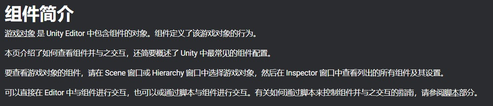

- 其实教程里说得已经挺明白了：

  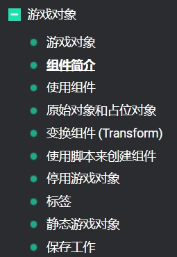

- 这里就是简单带着大家过一下：

  - 添加组件。
  - 编辑组件。
  - ......

- 组件就是积木，需要用到的时候就添加。

- 一个个组件共同构建起了 **功能完整**的游戏对象。

## 七、向量计算与脚本触发

### 1.向量计算和脚本触发与**运动计算**息息相关：

- 发射出去的子弹怎么判断是否打到人？
- 两人物靠太近就会触发负面效果，如何判断距离？
- 如何让子弹沿着一条直线飞行？
  - 我们知道，Updata 函数按照一定的频率，不断刷新（运行）。
  - 在 Updata 每次运行的时候就修改一下位置函数。
  - 存在哪些问题？如果刷新频率低，会不会有卡顿的现象?
  - 有没有更好的办法？让人物移动更流畅？
  - 有，插值法。

### 2.Unity 中的坐标：

- Unity 使用的 Vector3 类型，向量类型，（x,y,z）也称为三元数。

- 当然在 2D 中可以使用 Vector2 类型，只有 x，y 方向。直接不考虑 z 坐标。

- Unity 中表示角度有不少方法，常用的：欧拉角——用直观角度表示旋转。

  - 还有的比如 transform.rotation，是用四维向量表示旋转。

- 如何修改一个游戏对象的坐标？

- ```c#
  transform.position = new Vector3(1.0f, 2.0f, 0);
  transform.eulerAngles = new Vector3(0, 0, 90);
  ```

### 3.超级重要；世界坐标和本地坐标：

- 世界坐标：绝对坐标。

- 本地坐标：以父节点的坐标系计算。localPosition 与 localEulerAngles。

- 本地坐标设置方法：

  ```c#
  transform.localPosition = new Vector3(0, 1.0f, 0);
  ```

### 4.实现物体的移动：让闪电动起来

- 方法 1：在 Updata 函数中不断去修改位置。不像之前那样直接对 position 赋值，而是使用 transform.translate，使用增量（相对位置的小量）来修改位置。

  ```c#
  transform.Translate(dx,dy,dz,Space.self)  //relative motion
  ```

- 方法 2：

  - 先计算出具体的 position 向量。
  - 再更新 transform.position。

- Space.self：按照自己的本地坐标来运动。

- 试试把物体旋转一下，再运行一下游戏，看看运动的方向会不会变？

- 如果是世界坐标系，最后一个参数就使用 Space.world。这样的话，就算旋转物体，也不会对运动方向造成改变。

### 5.刚体与碰撞初阶：

      1. 先让你的皮卡丘成为刚体。如何实现？
         - 添加RigidBody组件，然后在Body Type中选择Dynamic。
         - Dynamic，Static，Kinematic这三个选项有什么区别？
           - Dynamic：普通刚体，有质量，有速度。
           - Static：静态刚体，质量无穷大，无速度。
           - Kinematic：运动学刚体，无质量。（忽略物理规律，用于碰撞检测）

         - 分别试试效果

      2. 怎么碰撞？
         - 默认情况下，两个物体不会有碰撞效果。
         - 添加Physics2D->Box Colider2D组件，刚体组件和碰撞组件一般都同时加载。

      3. 怎么反弹？
         - 得先造出一个能够反弹的**材质**。
         - 在Project窗口，Create->Physics Material 2D
         - 把弹性系数Bounciness设为0.8.
         - 选中皮卡丘的RigidBody2D组件，把材质换掉就行了。

### 6.碰撞检测：

- 检测到什么？用什么去检测？

  - 在碰撞瞬间得知消息，以做出相应的反应。
  - 用碰撞设置和代码去完成检测，以及对检测做出反应。

- 具体流程：以皮卡丘和地为例：
  1.  分别添加刚体组件 Rigidbody 2D，选择合适的类型。
  2.  分别添加碰撞组件 Box Collier 2D。并勾选 Is Trigger
  3.  重写脚本组件，增加事件函数 OnTriggerEnter2D()。
  4.  在 OnTriggerEnter2D()中，写具体的处理方法。

## 八、Unity 版 Hello，world！——课后作业

- 要求：用你自己的方式“输出”一个 Hello world！
- 可以在控制台输出。当然如果你愿意探索，也可以用别的呈现方式。
- 自由度很大，可以尽情发挥脑洞。
  - 比如用枪打靶，只有打中靶心才会输出。
  - 比如参考黄金矿工的玩法，挖到金子就输出。
  - ......
- 由于 Unity 的特殊性，最终的作业上传可以以三种方式进行：
  1. 打包 PC 端可执行 exe 文件。由于本次教程也未涉及，所以并不做强制要求。
  2. 把运行的效果录一段不超过 1min 的视频，必要时可以添加解说。
  3. 或者你觉得能够说明和体现游戏效果的任何方式，只要文件不太大都行。

:::tip

### 写给 THUAI6-Unity 开发组

- 有一些注意事项觉得直接写在这份文档里比较好，可以少走一些弯路吧。
- 虽然在开发前半个阶段都没什么具体的活，但是一定在学习 Unity 的同时去跟进其他组的进度，尤其是逻辑组。至少要知道整个比赛的逻辑是什么，如何跟 Unity 进行对接和配合，用什么通信，需要了解什么技术等等。
- 虽然我们使用的是游戏开发引擎，但其实主要工作并不是真正在开发游戏。我们的首要职责是两样东西：直播和回放，这两者至少要确保一个能正常工作。在完成这项工作的基础上，再去追求游戏的开发（单机版？）。所以在前期准备的时候，就可以去留意回放和直播的技术方式。
- 注意过一段时间就对项目进行备份。可以采用暴力的复制粘贴。
- 开发愉快！

:::

## 视频教程

**2020 年暑期培训**

import Video from "@site/src/component/video_player";

<Video
  url="https://player.bilibili.com/player.html?aid=243753051&cid=212402150&page=9&as_wide=1&high_quality=1&danmaku=0"
  source="direct"
/>

<br />

### 2022 年暑期培训

<Video
  url="https://player.bilibili.com/player.html?aid=470870299&bvid=BV1PT411J79F&cid=768687945&page=1"
  source="direct"
/>
