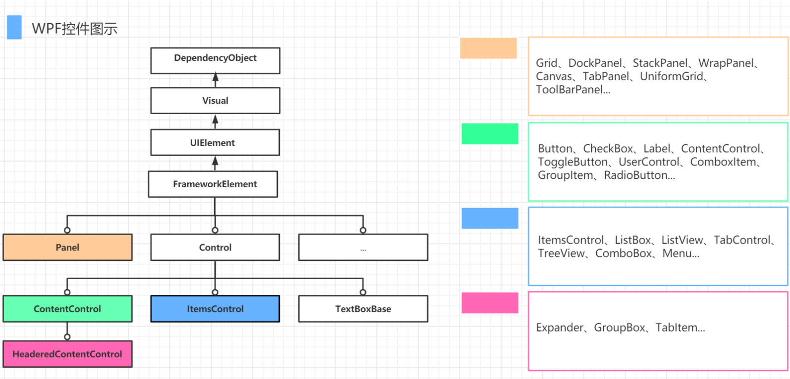

## 项目结构

- XAML 文档实际上也是类的一部分，最后也会被编译为 C#代码

- XAML 下的 C#代码构成类似于前后端的关系

- ```xaml
  App实际上是程序的入口
  StartupUri="MainWindow.xaml"
  ```

## 布局

- StackPanel

  > StackPanel 主要用于垂直或水平排列元素、在容器的可用尺寸内放置有限个元素，元素的
  > 尺寸总和(长/高)不允许超过 StackPanel 的尺寸, 否则超出的部分不可见。

- WrapPanel

  > WrapPanel 默认排列方向与 StackPanel 相反、WrapPanel 的 Orientation 默认为 Horizontal。
  > WrapPanel 具备 StackPanel 的功能基础上具备在尺寸变更后自动适应容器的宽高进行换行换列处理。

- DockPanel

  > 默认 DockPanel 中的元素具备 DockPanel.Dock 属性, 该属性为枚举具备: Top、Left、Right、Bottom。
  > 默认情况下, DockPanel 中的元素不添加 DockPanel.Dock 属性, 则系统则会默认添加 Left。
  > DockPanel 有一个 LastChildFill 属性, 该属性默认为 true, 该属性作用为, 当容器中的最后一个元素时, 默认该元素填充 DockPanel 所有空间。

- Grid

  > Grid 具备分割空间的能力。RowDefinitions / ColumnDefinitions 用于给 Grid 分配行与列。
  > ColumnSpan / RowSpan 则用于设置空间元素的 跨列与阔行。

## 控件



- ContentControl 类

  > 内容属性为 Content，只能设置一次，但可以嵌套

- ItemsControl 类

  > 此类控件大多数属于显示列表类的数据、设置数据源的方式一般通过 ItemSource 设置。

- HeaderedContentControl 类

  > 相对于 ContentControl 来说、这类控件即可设置 Content, 还有带标题的 Header。
  > 像比较常见的分组控件 GroupBox、TabControl 子元素 TabItem、它们都是具备标题和内容的控件。

- 常用控件

  - TextBlock: 用于显示文本, 不允许编辑的静态文本。

  - TextBox: 用于输入/编辑内容的控件、作用与 winform 中 TextBox 类似, Text 设置输入显示的内容。

  - Button: 简单按钮、Content 显示文本、Click 可设置点击事件、Command 可设置后台的绑定命令。

  - ComboBox: 下拉框控件, ItemSource 设置下拉列表的数据源, 也可以显示设置。

## 样式（重点：触发器）

- 可设置样式

  - 字体(FontFamily)
  - 字体大小(FontSize)
  - 背景颜色(Background)
  - 字体颜色(Foreground)
  - 边距(Margin)
  - 水平位置(HorizontalAlignment)
  - 垂直位置(VerticalAlignment)

- 写入位置

  - 写入 Windows.Resources

  - 写入 Application.Resources（推荐）

  - 样式中指定 key，和 TargetType，后文在相应控件中用代码指定：

    ```xaml
    <Style = "{StaticResources key}"/>
    ```

  - **实例优先级高于样式**

- 触发器

  - Triggers 指定方法

    ```xaml
    <style.triggers>
    	<trigger property = "" Value = "">
    		<setter property = "" value = "" target = ""/>
    	</trigger>
    </style.triggers>
    ```

  - MultiTrigger：指定 Conditions，在都满足的情况下，触发指定的 Setters

  - EventTrigger：指定 RoutedEvent 和 Actions

  - DataTrigger：用法类似

## 模板

- 控件模板：指定控件的样式

  ```xaml
  <Setter Property="Template">
      <Setter.Value>
          <ControlTemplate TargetType="{x:Type ListBoxItem}">
              <Grid>
                  <Border x:Name="back"/>
                  <Border x:Name="line" Margin="5 10 5 10 "/>
                  <ContentPresenter/>
              </Grid>
              <ControlTemplate.Triggers>
                  <Trigger Property="IsMouseOver" Value="True">
                      <Setter Property="Background" Value="#F0F6F6" TargetName="back"/>
                  </Trigger>
                  <Trigger Property="IsSelected" Value="True">
                      <Setter Property="Foreground" Value="{Binding Color}"/>
                      <Setter Property="FontWeight" Value="Bold"/>
                      <Setter Property="Background" Value="{Binding Color}" TargetName="back"/>
                      <Setter Property="Opacity" Value="0.05" TargetName="back"/>
                      <Setter Property="BorderThickness" Value="2 0 0 0" TargetName="line"/>
                      <Setter Property="BorderBrush" Value="{Binding Color}" TargetName="line"/>
                  </Trigger>
              </ControlTemplate.Triggers>
          </ControlTemplate>
      </Setter.Value>
  </Setter>
  ```

  - TemplateBinding：与外部属性联系
  - ControlTemplate.Triggers：触发器设置
  - 可独立于样式声明模板

- 数据模板（DataTemplate）

  - CellTemplate：适用于 DataGrid

    ```xaml
    <DataGridTemplateColumn Header="操作" Width="100" >
        <DataGridTemplateColumn.CellTemplate>
            <DataTemplate>
                <StackPanel Orientation="Horizontal" VerticalAlignment="Center" HorizontalAlignment="Left">
                    <Button Content="编辑"/>
                    <Button Margin="8 0 0 0" Content="删除" />
                </StackPanel>
            </DataTemplate>
        </DataGridTemplateColumn.CellTemplate>
    </DataGridTemplateColumn>
    ```

  - DataTemplate

    ```xaml
     <Window.Resources>
            <DataTemplate x:Key="comTemplate">
                <StackPanel Orientation="Horizontal" Margin="5,0">
                    <Border Width="10" Height="10" Background="{Binding Code}"/>
                    <TextBlock Text="{Binding Code}" Margin="5,0"/>
                </StackPanel>
            </DataTemplate>
        </Window.Resources>
        <Grid>
            <StackPanel Orientation="Horizontal" HorizontalAlignment="Center">
                <ComboBox Name="cob" Width="120" Height="30" ItemTemplate="{StaticResource comTemplate}"/>
                <ListBox Name="lib" Width="120" Height="100" Margin="5,0"  ItemTemplate="{StaticResource comTemplate}"/>
            </StackPanel>
        </Grid>
    ```

  - 关于模板的用法课上讲的不好，具体请参考：

    https://www.cnblogs.com/zh7791/p/11449492.html

    https://www.cnblogs.com/zh7791/p/11421386.html

## **Binding（绑定）**

- 绑定源

  1. 绑定至元素：指定 ElementName 与 Path

     - 例子

      ```xaml
      <!--将TextBlock的内容绑定到Name为Scroll的元素的Value属性-->
      <TextBlock Text="{Binding Value, ElementName=Scroll, StringFormat=0.00}"/>
      ```

  2. 绑定至 Source/RelativeSource，暂不介绍

  3. 绑定至 DataContext： 从当前的元素树向上查找到第一个非空的 DataContext 属性为源对象。

     方法（仍以TextBlock为例）：

     - 前端：

       ```xaml
       <Window.DataContext>
       	<local:Mainviewmodel/>
       </Window.DataContext>
       <!--anything else except </Window>-->
       <TextBlock Text="{Binding Txt}"/>
       ```

     - 后台

       ```C#
       public partial class MainWindow : Window
       {
         public MainWindow()
         {
             Mainviewmodel vm = new Mainviewmodel();
             this.DataContext = vm;
             InitializeComponent();
         }
       }
       //anything else
       public class Mainviewmodel
       {
         public string Txt {get; set;}
       }
       ```

- 绑定方法

  - OneWay：由数据源到显示
  - OneWayToSource ：由显示到数据源
  - TwoWay：双向变化
  - OneTime（根据第一次源的变化来绑定）
  - default：默认

  - **注意：OneWay绑定模式不会自动锁定相应的元素，若通过视图直接操作元素可能导致绑定失效，因此仍需注意将其用在不会被用户改变的元素上**

- 有关接口：INotifyPropertyChanged 与 ICommand

  - INotifyPropertyChanged

    当数据源发生变化时，与之绑定的视图元素并不会自动改变，而是需要等到相应接口通知才会更改
    通过 TwoWay 或 OneWayToSource 方法绑定到同一数据源的元素会产生通知，但大多数代码逻辑不会
    通过让 DataContext 对象的类继承接口 INotifyPropertyChanged, 可以通过`public event PropertyChangedEventHandler? PropertyChanged;`事件通知所有绑定到该属性的元素改变自己的状态

  - ICommand
    
    提供 `bool CanExecute(object? parameter)` 与 `void Execute(object? parameter)`, 一个ICommand对象可以绑定到元素或事件的Command属性，相应命令被调用时检查若CanExecute为true, 执行Execute。
    继承此接口时，一般通过委托将不同的函数传递给CanExecute和Execute, 使每个对象可以执行不同的功能。

  

## **MVVM**（视图通过绑定与 UI 分离）

- Model-View-ViewModel，目的是分离视图（view）与模型（model），降低代码的耦合程度

  > MVVM 旨在利用 WPF 中的[数据绑定](https://baike.baidu.com/item/数据绑定)函数，通过从视图层中几乎删除所有[GUI](https://baike.baidu.com/item/GUI)代码（代码隐藏），更好地促进视图层开发与模式其余部分的分离。不需要[用户体验](https://baike.baidu.com/item/用户体验)（UX）开发人员编写 GUI 代码，他们可以使用框架标记语言（如[XAML](https://baike.baidu.com/item/XAML)），并创建到应用程序开发人员编写和维护的视图模型的数据绑定。角色的分离使得[交互设计师](https://baike.baidu.com/item/交互设计师/3329267)可以专注于用户体验需求，而不是对业务逻辑进行编程。

- 常用框架：Prism，MVVMlight，CommunityToolkit.Mvvm

  - 它们都有效地实现了绑定部分提到的接口，封装为相应的基类以供使用；并提供层级间、对象间高效的信息传递手段。
  - 对比：
    Prism 强大而全面，适合较大的项目
    MVVMlight 简单小巧，但似乎已停止更新
    CommunityToolkit.Mvvm MVVMLight的继承者

- 绑定事件

  通过Microsoft.Xaml.Behaviors.Wpf，我们可以把窗口中发生的各种事件（如：MouseUp, MouseDown等）也绑定到ICommand对象上，如
   ```xaml
   <i:Interaction.Triggers>
     <i:EventTrigger EventName="MouseDoubleClick">
       <i:InvokeCommandAction Command="{Binding DoubleClick}"/>
     </i:EventTrigger>
   </i:Interaction.Triggers>
   ```

- 实现属性的动态绑定

## 案例分析：下载器

> 界面设计；下载 API 直接给出，略作讲解；MVVM 模式实现

- 文件下载器

  1. 将下载函数放在后台，使用 Click="..." 或 Command="{Binding ...}" 绑定

  2. 让 Viewmodel 与显示分离，用 MVVM 模式绑定响应函数

  > 使用现有框架：添加 Prism.Core

  3. 实现检测文件名，生成下载路径

  4. 用文件管理器窗口选择下载地址

  5. 使用多线程进行下载，不影响窗口正常操作

  6. 实现进度条管控，利用绑定改进（绑定的实时刷新需要用接口通知前端数据发生变化）

  7. 实现取消下载的操作，并同时删除目录下的文件

  8. 实现显示下载速率的操作（留作作业）
     p.s. 需要解决的问题还有很多，线程可能存在的并发死锁，下载期间对下载器的操作，暂停，压缩文件检测不出来等

## 作业

- 分值仅供参考，重在参与

- 小试身手（2 分）

  - 创建一个 TextBlock，实现下载状态的显示，要求使用绑定实现。

  - 没有下载任务或下载被取消时显示“Free”；下载中显示“Downloading...”；下载完成后显示“Complete”。

  - 下载任务可以由一组 Thread.sleep() 模拟

  - 允许对设计要求做出合理的调整或改进，但需要阐述理由

- 略有难度（2+1 分）

  1. 使用 ProgressBar, 实现下载进度的显示（依据文件数或依据总体积均可）（2分）
    - 文件体积可以用线程睡眠总时间不同模拟。

  2. 计算下载速度（按文件体积），并通过TextBlock显示出来（1分）
    - 请不要为了完成作业在 ViewModel 中放置按“字节”进行“下载”的代码。利用 mvvm 库提供的通信方式完成文件体积的显示吧。

- 您是大佬（1 分）

  1. 利用课上所学知识，对界面设计向符合自身审美的方向进行改进，颜值至上（0.5 分）
    - 课上较少讲到的模板可以有效地帮助你实现美观的界面。
    - wpf 的控件其实很丰富

  2. 服务器实战：给定地址，自动下载目录下所有文件（0.5 分）
    - 很可惜，我们并不能提供服务器
    - 各位可以自行创建一个存储桶来体验一下，但我也不知道它是否提供单个文件下载进度相关的接口

## References

https://www.cnblogs.com/zh7791/category/1528742.html （来自博客园大佬的教程，建议深度学习 orz）

---

## 视频教程

<div style={{ position: "relative", padding: "30% 45%" }}>
  <iframe
    style={{
      position: "absolute",
      width: "100%",
      height: "100%",
      left: 0,
      top: 0,
    }}
    src="https://player.bilibili.com/player.html?aid=765901878&bvid=BV1vr4y1e7pe&cid=491030440&page=7&as_wide=1&high_quality=1&danmaku=0"
    frameborder="no"
    scrolling="no"
    allowfullscreen="true"
  ></iframe>
</div>
