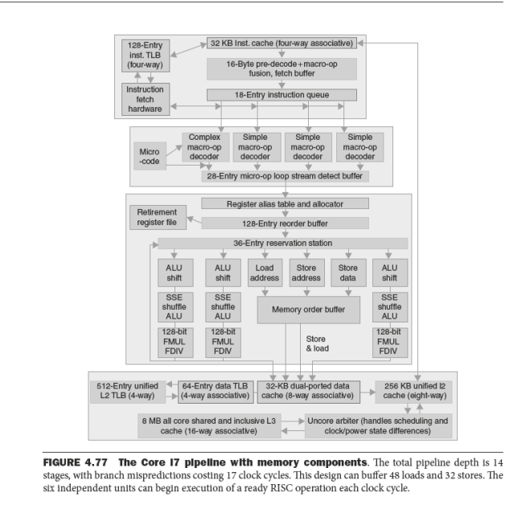
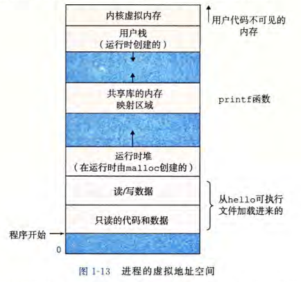
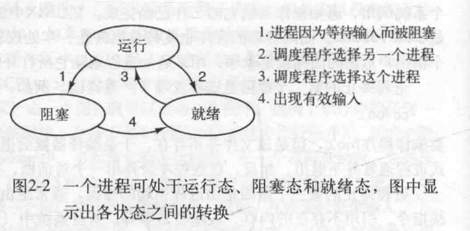
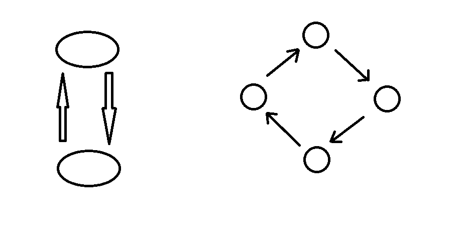

## 多线程  

### 现代计算机架构  

+ 冯·诺伊曼结构（是图灵机的一种等效描述）  
  + 存储单元  
  + 控制单元  
  + 算术逻辑单元  
  + 输入设备  
  + 输出设备  
+ 哈佛结构  
  + 数据存储单元  
  + 指令存储单元  
  + 控制单元  
  + 算术逻辑单元  
  + 输入设备  
  + 输出设备  

控制单元和算术逻辑单元组成了“中央处理单元（Central processing unit，CPU）”  。  

### 处理器  

处理器一般指中央处理器，即 CPU。现代 CPU 可以包含算术逻辑单元（ALU）、控制单元（CU）、寄存器、内存管理单元（MMU），高速缓存（cache），等等。  

不同厂家生产的 CPU 架构迥异，不同的架构一般也支持不同的指令集。常见的 CPU 架构有：x86（常见于 PC）、ARM（常见于手机等）、MIPS（已经停止支持）、RISC-V，等等。以 x86 架构为例，下图为 Intel Core i7 流水线结构（参考文献 2）：  



#### 寄存器  

寄存器（register）是 CPU 用来暂存指令、数据和地址的存储器。其特点是读写速度非常快。  

在 x86 架构中，我们经常直接使用的寄存器都是通用寄存器（当然还有专用寄存器）。16 位 8086 架构（x86 架构的鼻祖）有 8 个通用寄存器：  

+ AX: 累加器（Accumulator，AH、AL）  
+ BX: 基址寄存器（Base Address，BH、BL）  
+ CX：计数器（Counter，CH、CL）  
+ ·DX：数据寄存器（Data，DH、DL）  
+ SI：源变址寄存器（Source Index）  
+ DI：目的变址寄存器（Destination Index）  
+ BP：基址指针寄存器（Base Pointer）  
+ SP：栈指针寄存器（Stack Pointer）  

以上寄存器都是 16 位寄存器。当扩展到 32 位时，在原有的 16 位作为低 16 位，外加的 16 位作为高 16 位，则上述八个寄存器前面加上一个”E“字母（Extend），成为 EAX、EBX、ECX、EDX、ESI、EDI、EBP、ESP；当扩展到 64 位时，则加前缀”R“字母，即 RAX、RBX……并额外新增了 8 个寄存器，因此 64 位 x86 架构拥有 16 个通用寄存器了。    

#### 程序计数器  

处理器一般含有”程序计数器（PC）“，用于储存指令的存储地址，每次执行时，处理器会从按照程序计数器中的地址从指令存储器中取出指令来执行。  

> **主存**  
>
> 主存，即计算机的主存储器，是程序运行时使用的主要的存储器，一般是随机访问存储器（RAM）。程序运行时的代码、数据，一般都存储在主存当中。  

### 进程  

#### 进程的概念  

我们的程序在运行时，操作系统会给我们看到一种假象：仿佛只有我们一个程序在这台电脑上运行，我们的程序仿佛独占了处理器，即使在单核 CPU 上也是如此。但这是不可能的，因为我们总是有多个程序在并行地运行。要想实现这一点，只有多个正在运行的程序轮流占用处理器。但是我们编写程序时又丝毫察觉不到这一点——例如内存中变量的值、寄存器的值不会被无缘无故被其他程序修改。这是因为操作系统已经把这些不同的程序隔离开了，它们互相看不到对方。正在运行这样一个被隔离的单独的程序就是一个”进程“。我们可以看到，进程之间是相互独立的，互不干扰。  

但是仍然可以通过进程间通信的一些方式达到多个进程共享资源的目的。    

#### 虚拟内存  

虚拟内存也是一个重要工作，需要 CPU 内的内存管理单元（MMU）与操作系统的紧密协作。每个进程在运行时都被分配了一块虚拟的内存，让每个进程看起来都是自己独占了整个主存。每个进程看到的内存都相同，这个内存空间就叫做”虚拟地址空间“。下面是 Linux 系统的虚拟地址空间：  




#### 进程的三个状态  

进程一般有三个状态：  

+ 运行态  
+ 就绪态  
+ 阻塞态  




如果一个进程正在 CPU 上运行，那么这个程序就处在运行态；如果一个程序由于自身的原因，例如等待输入等，而不能向下执行，它就出于阻塞态；如果由于有其他进程抢占了 CPU 等一些原因导致进程无法继续运行而处在等待运行的状态，则这时进程出于就绪态。  

不过以上只是理论模型，实际上的操作系统实现可能更加复杂。  

#### 进程的调度  

要实现多个进程并行的执行，操作系统内核就需要安排这些进程轮流执行在 CPU 上，这个操作就叫做进程的调度。  

一个进程在执行过程中，需要用到很多状态信息，比如各个寄存器的值、主存的内容、程序计数器的值，等等。这些统一叫做进程的上下文。操作系统在进行进程二得调度时，需要保存刚刚执行的进程的上下文，并恢复即将运行的进程的上下文，再开始新的进程。这个过程就是上下文切换。  

一般情况下，在下面几种情况会出现进程的调度：  

+ 创建一个新进程时，是运行父进程还是子进程  
+ 一个进程退出时需要另外找一个就绪的进程来运行。如果没有就绪的进程，通常会运行一个系统的提供的空闲进程。  
+ 一个进程因为某些原因被阻塞  
+ I/O 中断  
+ 时间片轮转  

> 计算密集型和 I/O 密集型  

#### 创建一个进程   

##### Linux  

UNIX/Linux 下为每个进程赋予一个唯一的进城标识符 PID（Process ID），使用 `ps` 或 `htop` 可以查看进程的 PID，并可以通过 `kill` 命令根据 PID 杀死一个进程。  

Linux 进程分为前台进程和后台进程。前台进程占据当前的 shell，而后台进程不会占据当前的 Shell，创建后台进程需要在后面加上 `&`。使用 `jobs` 可以查看当前的所有后台进程，而使用 `fg` 可以讲后台进程转到前台。  

Linux 下可以使用 `fork` 函数创建一个新的进程，包含 unistd.h 可以使用该函数。fork 在成功时会创建一个子进程，子进程是父进程的一个复制（采用写时复制，并不是创建时便完全复制）。若 fork 失败，则父进程会返回一个负数；若 fork 成功，则父进程返回子进程的 PID，而子进程则返回 0：  

```c
#include <unistd.h>
int main(void)
{
    pid_t fpid = fork();
    if (fpid < 0)
    {
        // 创建子进程失败
    }
    else if (fpid == 0)
    {
        // 这里进入了子进程
    }
    else
    {
        // 这里继续父进程
    }
}
```

Linux 下还可以使用 `exec` 函数。该函数会启动一个新的程序，覆盖掉当前的正在执行的程序，开始执行新的程序，且进程的 PID 不变。`exec` 是一个函数族，该函数族有很多函数。这里只介绍其中一个 `execl`：  

```c
int execl(const char *path, const char *arg, ...);
```

`path` 是要执行的可执行文件或脚本的全路径，第二个参数是传递给新程序的 `argv[0]`，后面再接其他的参数，且必须以 `NULL`，结尾，例如：  

```c
execl("/bin/pwd", "pwd", NULL);
```

##### Windows  

Windows 下使用 `CreateProcess`  进行创建，该函数位于 Kernel32.dll 中（函数入口在 Kernel32.lib 中），使用该函数可以包含 Windows.h。实际上，`CreateProcess` 是一个宏，根据不同的编译器设置代表不同的函数：（`CreateProcessA` 或 `CreateProcessW` ），但它们的功能是一样的。  

这个函数的使用非常之复杂（Win32 API 的接口基本上都非常复杂），可以看到 `CreateProcessA` 的函数声明如下：  

```c
BOOL CreateProcessA(
  LPCSTR                lpApplicationName,
  LPSTR                 lpCommandLine,
  LPSECURITY_ATTRIBUTES lpProcessAttributes,
  LPSECURITY_ATTRIBUTES lpThreadAttributes,
  BOOL                  bInheritHandles,
  DWORD                 dwCreationFlags,
  LPVOID                lpEnvironment,
  LPCSTR                lpCurrentDirectory,
  LPSTARTUPINFOA        lpStartupInfo,
  LPPROCESS_INFORMATION lpProcessInformation
);
```

由于这个函数的使用过于繁琐，因此不在这里做过多展开。感兴趣的同学可以查阅官方文档 [https://docs.microsoft.com/en-us/windows/win32/api/processthreadsapi/nf-processthreadsapi-createprocessa](https://docs.microsoft.com/en-us/windows/win32/api/processthreadsapi/nf-processthreadsapi-createprocessa) 学习它的用法。  

这里仅提供一个笔者曾经写过的例子：  

```c++
bool SoundPlay::AllSound(int i) const
{
	const TCHAR* num[10] = { TEXT("0"), TEXT("1"), TEXT("2"), TEXT("3"), TEXT("4"), TEXT("5"), TEXT("6"), TEXT("7"),TEXT("8"), TEXT("9") };
	STARTUPINFO si;
	PROCESS_INFORMATION pi;
	memset(&si, 0, sizeof(si));
	memset(&pi, 0, sizeof(pi));
	si.cb = sizeof(si);

	TCHAR cmd[128];
	_stprintf(cmd, TEXT("%s %s"), GAME_SOUND_EXE_NAME, num[i]);

	if (!CreateProcess(NULL, cmd, NULL, NULL, FALSE, CREATE_NEW_CONSOLE, NULL, NULL, &si, &pi))
	{
		// Fail to create process
		return false;
	}

	CloseHandle(pi.hThread);
	CloseHandle(pi.hProcess);

	return true;
}
```


### 线程  

#### 线程的概念  

我们编写的很多程序并不一定只同时做一件事情，有时候，我们需要多件事情一同进行。对于我们之前所讲的进程来说，一个进程时从头到尾依次运行的，这种情况我们称之为单线程执行。但是对于我们要并行地做多件事情的时候，单线程执行并不能满足我们的要求。这时候，与之前所说的在 CPU 上同时运行多个进程一样，我们就需要在一个进程内同时运行多个”线程“。与多个进程不同，同一格进程之间的不同线程是共享这个进程的资源的，例如共享同一个虚拟地址空间，等等。  

|        进程        |    线程    |
| :----------------: | :--------: |
|      地址空间      | 程序计数器 |
|      全局变量      |   寄存器   |
|      打开文件      |     栈     |
|       子进程       |    状态    |
|  即将发生的定时器  |            |
| 信号与信号处理程序 |            |
|      账户信息      |            |

可以看到，线程比进程更加轻量级，因此线程之间的切换所需的事件更短，因此有时线程被称为”轻量级进程“。  

#### 多线程编程  

多线程编程时，我们有一些基本的线程操作：  

+  Create：创建一个新的线程  
+ Exit: 退出这个线程  
+ Join：等待一个线程退出  
+ yield：让线程主动让出 CPU，使得其他线程得以运行  

> **POSIX**  
>
> POSIX（Portable Operating System Interface of UNIX），可移植操作系统接口。是一套操作系统接口标准。实现了 POSIX 标准的操作系统应当提供相应的接口。POSIX 提供了 C 语言 接口，声明在头文件 pthread.h 中，可以由 C 或 C++ 直接调用。Windows、Linux 系统都对 POSIX 有不同程度的支持。  

例如下面的 C 程序使用 POSIX 创建一个线程并输出 "Hello, world!"：  

```c
#include <pthread.h>
#include <stdio.h>

void *thrd_func(void* args)
{
    printf("Hello, world!\n");
    pthread_exit(NULL);
}

int main(void)
{
    pthread_t thrd = 0;
    int stat = pthread_create(&thrd, NULL, thrd_func, NULL);
    if (stat)
    {
        perror("Fail to create thread!");
        return 1;
    }
    pthread_join(thrd, NULL);
    printf("end\n");
    return 0;
}
```

#### C# 中的线程库  

很多语言都具有线程库。例如 C11 引入了一个编译器可选支持的 `threads.h`，C++11 引入 `thread`，等等。  

##### 创建一个线程

C# 创建多线程的方式是使用 `Thread` 类，`Thread` 类位于 `System.Threading` 命名空间内，构造方法可以接收一个返回值为 `void`，无参数或只有一个 `object?` 作为参数的方法（或委托）作为参数，然后用 `Start` 开始线程的执行，并使用 `Join` 等待线程完成：  

```c#
using System.Threading;
var thr = new Thread
(
    n =>
    {
        for (int i = 0; i < 10000; i++)
        {
            Console.WriteLine($"In child thread: {n}");
        }
    }
);
thr.Start(999);
for (int i = 0; i < 10000; i++)
{
    Console.WriteLine("In main thread: 888");
}
thr.Join();
```

##### 前台线程与后台线程  

C# 的线程模型中，线程分为前台线程和后台线程。区别是，前台线程在整个程序退出时会阻塞程序的退出，当前台线程退出时，整个程序才会退出；而后台线程不同，程序退出时，后台线程自动终止。默认情况下，线程是前台线程。前台或后台进程由 `Thread` 对象的 `IsBackGround` 属性来指定：  

```c#
var thr = new Thread(() => { Console.WriteLine("thread"); });
thr.IsBackground = true;    // 指定为后台线程
thr.Start();
```

  或者简写为：  

```c#
new Thread
(
    () =>
    {
        Console.WriteLine("threads");
    }
)
{ IsBackground = true }.Start();
```

注意上述花括号是 C# 的一种语法，可以在 `new` 的同时设置该对象的属性。注意该种语法下对象属性的设置时间在构造方法执行之后。  

此外，`Thread` 类还有 `IsAlive` 属性用来标志该线程是否正在运行，`IsThreadPool` 属性用来标识该线程是否是托管线程池中的线程（线程池将在 稍后讲述）。  

此外，可以调用 `Thread `  类的静态属性 `CurrentThread` 来得到当前线程的句柄。  

##### 线程休眠  

可以让线程休眠一段时间，使用 `System.Threading.Thread` 类的静态方法 `Sleep`。该方法接收一个整数作为参数，代表睡眠的时间，单位是毫秒：  

```c#
using System.Threading;
Thread.Sleep(1000);		// 休眠 1000 毫秒，即 1 秒钟
```

##### 线程池  

创建线程和销毁线程带来的开销其实是不算小的，一个想法就是预先开辟多个线程，然后等到需要开辟线程的时候直接使用已经创建好的线程以减小开销。  

当向线程池申请线程执行时，如果线程池中的线程已经用完了，那么线程池会停顿一小段时间，观察是否有执行完毕的线程，如果有则使用该线程，如果没有则将线程池扩容。  

线程池的相关操作都在 `ThreadPool` 静态类中（静态类意味着不能实例化，其内都是静态的字段、属性、方法）。  

在对线程池进行操作之前，我们可以设置线程池线程的最大线程数和最小线程数。线程池扩容不会超过设置的最大线程数。  

我们可以通过 `SetMaxThreads`、`SetMinThreads` 静态方法来设置，通过 `GetMaxThreads` 和 `GetMinThreads` 静态方法来获取。这些方法都有两个参数，我们现在暂时只用关心第一个参数，设置的时候第二个参数使用原来的值即可。  

使用 `QueueUserWorkItem` 静态方法方法可以向线程池申请一个线程。该方法接收一个 `WaitCallBack` 对象作为参数。我们可以将要执行的方法作为 `WaitCallBack` 的构造方法的参数，然后将新创建的对象作为参数调用 `QueueUserWorkItem`。  

但是一般情况下我们可以使用封装好的 `Task`、`Timer` 等间接使用线程池，而不是直接使用，因此在此处不举例子。这些将在后文进行介绍。  

### 进程间通信  

#### 进程间通信的难题  

进程间通信的难题有三：  

+ 进程间互相传递信息  
  + linux  
    + 套接字（即 Socket，利用网络）  
    + 信号（例如 Ctrl + C）  
    + 管道  
    + 消息队列  
    + System V 信号量  
    + 共享内存（`mmap`）  
  + Windows  
    + 套接字  
    + 管道  
    + 共享内存（`GetProcAddress`）  
    + 邮件槽  
+ 资源竞争  
+ 执行顺序的正确性  

后两个问题和解决方法大多同样适用于线程通信，因此我们在介绍进程通信问题时，也可以将很多方法适用于线程通信，处理多线程问题。  

#### 原子操作  

观察下面的代码：  

```c#
using System;
using System.Threading;

#nullable disable
namespace ConsoleApp1
{
    class Program
    {
        static int n = 0;
        static void Func(object idx)
		{
            for (int i = 0; i < 1000000; ++i)
			{
                ++n;
			}
            Console.WriteLine($"Thread {idx} ended!");
		}

        static void Main(string[] args)
		{
            var thr1 = new Thread(Func);
            var thr2 = new Thread(Func);
            thr1.Start(1);
            thr2.Start(2);
            thr1.Join();
            thr2.Join();
            Console.WriteLine($"End: {n}");
        }
	}
}
```

多次运行，但是运行结果却未必是想象中的 2000000。这是因为 `++n` 这个操作是可以被打断的，我们至少需要先把 `n` 的值从内存中取出来，再给它加上 `1`，再给它放回存中。这时，如果一个线程取出 `n` 来之后，还没有等到将加一之后的结果写回内存，另一个线程便去出了 `n` 的值，这会导致者两次加法相当于只加了一次。  

最简单的解决办法就是使用原子操作。  

所谓原子操作，就是不可再分的操作，原子操作不会被打断，因此也就不会上述问题。  

C# 提供了原子操作库，位于 `System.Threading` 命名空间的 `Interlocked` 类中，其提供一下几种操作（作为静态方法）：  

+ `Add(ref a, b)`：`a += b`  
+ `And(ref a, b)`：`a &= b`  
+ `CompareExchange(ref a, b, c)`：`a = a == c ? b : a`  
+ `Decrement(ref a)`：`--a`  
+ `Exchange(ref a, b)`：`a = b`  
+ `Increment(ref a)`：`++a`  
+ `Or(ref a, b)`：`a |= b`  
+ `Read(ref a)`：`a`  

因此上面的代码应该将 `++n` 改成 `Interlocked.Increment(ref n)`，便可以得到正确的结果 2000000 了。  

很多问题，我们都可以选择适当的原语（原子操作），实现各种各样答的功能，来解决问题。  

#### 临界区  

有时候，多个进程要访问共享内存或共享文件等资源，或其他的一些导致资源竞争的操作。我们把访问共享数据的这部分程序片段称作“临界区”。如果我们能设计一个办法，使得两个进程不能同时进入临界区，那么我们就可以避免资源竞争，即，我们需要的是“互斥”。一般，一个好的办法设计需要满足下列条件：  

+ 任何两个进程不能同时处于临界区  
+ 对 CPU 的速度和数量没有要求  
+ 临界区外运行的进程不能阻塞到其他进程  
+ 不能让一个进程无限期等待进入临界区  

##### 锁变量  

这里有一种非常容易想到的防止互斥的做法，即使用锁变量，但它是错误的：  

```c
int lock;
 
while (lock == 1);
lock = 1;
// 临界区
lock = 0;
// 非临界区
```

这是因为，如果有一个进程，由于检测到 `lock` 为零而从 `while` 循环中跳出，但是还没来得及把 `lock` 设置为 `0`，这时候发生了进程调度，另一个进程也判断 `lock` 为零，也跳出了 `while` 循环，这样这两个进程便都进入了临界区，因此算法是错误的。此外，这个算法还存在着忙等待的问题。  

> 忙等待：  
>
> 上面的 `while` 循环一直在对 `lock` 进行判断，这意味着只要不满足条件，该进程就一直出于运行态或就绪态，即一直有占用 CPU 的需求。这会导致极高的 CPU 占用。  
>
> 此外，我们将会看到，忙等待还可能存在其他的一些问题。  
>
> 我们在日常的编程当中，要尽量避免忙等待。只有在能确认忙等待的时间非常短的情况下，才可勉强使用忙等待。  
>
> 用于忙等待的锁，称为自旋锁。  

##### 严格轮换法    

下面是一种自旋锁的方法：  

```c
int turn = 0;

void Process1()
{
    while (1)
    {
        while (turn == 1);
        // 临界区
        turn = 1;
        // 非临界区
    }
}

void Process2()
{
    while (1)
    {
        while (turn == 0);
        // 临界区
        turn = 0;
        // 非临界区
    }
}
```

这段代码确实能实现互斥。但是一方面，它可能违反条件 `3`，即一个进程可能被另一个进程的临界区外的代码阻塞；另一方面，它还可能存在优先级反转问题。  

此外还有 TSL 指令、XCHG 指令、Peterson 算法等用来实现这一功能。但是都存在忙等待的问题。  

##### 休眠与唤醒  

以上的算法存在忙等待本质上是因为它们的基本思路都是判断当前是否能进入临界区，如果不能，则一直在原地等待，并不停判断，直到能进入为止。因此我们换一个思路，我们当检测到当前无法进入临界区时，便让进程进行睡眠（`sleep`），而进程退出临界区时，便唤醒另一个进程 `wakeup`。  

很容易想到下面的一个错误的解决方案：  

```c
int cnt = 0;

void Process1()
{
    while (1)
    {
        if (cnt == 1) sleep();
        // 临界区
        cnt = 1;
        wakeup(2);
        // 非临界区
    }
}

void Process2()
{
    while (1)
    {
        if (cnt == 0) sleep();
        // 临界区
        cnt = 0;
        wakeup(1);
        // 非临界区
    }
}
```

可以看到，如果线程 1 判断 `cnt == 1` 为真后将要进行睡眠但是还尚未睡眠时发生了一次进程调度，进程 2 执行 `cnt = 0` 并唤醒进程 1，但是这时候进程 1 还未进入休眠状态，因此该唤醒信号发生丢失，因此两个线程均进入了睡眠状态，故该算法是错误的。  

#### 信号量  

针对上述问题，Dijkstra 提出了“信号量（Semaphore）”的概念。一个信号量包含一个整数变量用来计数，以及两个原子操作：  

+ P 操作：让计数变量的值减一，若结果小于 0，则进入休眠状态，也称为“down”操作  
+ V 操作：让计数变量的值加一，若结果不大于 0，则唤醒一个休眠的进程，也称为“up”操作  

```c
int sem = 1;
void Process1()
{
    while (1)
    {
        P(sem);
        // 临界区
        V(sem);
    }
}
void Process2()
{
    while (1)
    {
        P(sem);
        // 临界区
        V(sem);
    }
}
```

##### 生产者-消费者问题  

想象一个容量为 N 的仓库，生产者不定期向仓库里装一个产品，消费者不定期从中拿走一个产品。当仓库满了的时候 ，生产者便不能再向其中添加产品，需要等到仓库有空位再向其中放入产品；而当仓库空了的时候，消费者则需要等到仓库有产品了才能拿到产品。  

用信号量可以解决这个问题：  

```c#
#define N 100
int mutex = 1;	// 控制临界区
int empty = N;	// 空位数目
int full = 0;	// 满位数目

void producer(void)
{
    while (1)
    {
        // 生产产品
        P(empty);
        P(mutex);
        // 放仓库
        V(mutex);
        V(full);
    }
}

void consumer(void)
{
    while (1)
    {
        P(full);
        P(mutex);
        // 拿走东西
        V(mutex);
        V(empty);
        // 消耗产品
    }
}
```

##### 互斥量  

注意我们以上两个例子，对临界区的互斥控制有一个特殊性：信号量的初始值是 1，且 P、V 操作在一个线程中成对出现，先有 P，后有 V，两个操作之间是互斥的临界区。这意味着同时只能有一个进程进入两个 P、V 操作之间。因此我们对这个特殊的情况进行单独处理，对信号量进行简化，得到“互斥量（mutex）”。  

一个互斥量包含两个操作：加锁（lock，对应于 P 操作）和解锁（unlock，对应于 V 操作）。  

使用互斥量需要注意的点是，必须在同一个进程内为其加锁与解锁，且解锁在加锁之后。  

##### 条件变量  

条件变量（condition variable）是与互斥量配合使用的。在互斥量已经加锁的条件下，条件变量的基本操作有三个：  

+ 将互斥量解锁并进入休眠状态（被唤醒时会重新加锁互斥量）  
+ 唤醒一个被休眠的进程  

+ 唤醒所有休眠的进程  

使用条件变量需要注意的有：  

+ 条件变量也存在信号丢失的现象，即如果当前并没有休眠的进程，但是却进行了一次唤醒，那么这个唤醒的信号便丢失了。  
+ 条件变量存在虚唤醒的问题，因此通常需要循环 `while` 判断检查继续执行满足的条件，而不是简单的 `if` 判断，以避免虚唤醒。  
+ 条件变量对一个互斥量进行的上述三个操作都应当在该互斥量被加锁的前提下。  

有趣的是，C++17 及以前，并没有提供信号量的标准库，指提供了互斥量和条件变量的标准库，直到 C++20 才加入了信号量（`std::counting_semaphore`）。这是因为利用互斥量与条件变量，再加上一个整数变量用于计数，我们可以很轻松实现一个信号量。具体如何实现留给读者思考。  

下面用条件变量来解决生产者消费者问题。为了简单起见且便于理解，我们现在只考虑一个容量为 1 的仓库。  

````c
mutex mtx = 1;
condition_variable cvp, cvc;
int buffer = 0;

void producer()
{
    while (1)
    {
        mtx.lock();
        while (buffer != 0) cvp.wait(mtx);
        buffer = 1;
        cvc.signal_one();
        mtx.unlock();
    }
}

void consumer()
{
    while (1)
    {
        mtx.lock();
        while (buffer == 0) cvc.wait(mtx);
        buffer = 0;
        cvp.signal_one();
        mtx.unlock();
    }
}
````


##### C# 的库支持  

C# 中使用 `System.Threading` 命名空间的 `Semaphore` 类来支持信号量的操作。使用信号量时，将该类实例化即可。  

`Semaphore` 的最常用的构造方法接收两个参数，第一个是计数变量的初始值，第二个是计数变量的最大值，例如：  

```c#
var sem = new Semaphore(0, 5);
```

创建了一个计数变量最大值为 5 的信号量，计数变量初始值为 0。  

`sem` 的 `WaitOne` 方法实现 P 操作，而 `Release` 方法实现 V 操作。  

C# 提供了 `System.Threading.Mutex` 类支持互斥量，但是更常用的是 `System.Threading.Monitor` 类来实现的互斥量。而这个类不经常显式使用，而是使用 `lock` 关键字隐式使用。使用时，我们先要创建一个对象作为锁：  

```c#
object lockObject = new object();
```

然后我们便可以使用锁了：  

```c#
lock (lockObject)
{
    /*Some code*/
}
```

当程序进入 `lock` 语句块时，便进行加锁，然后执行语句块中的代码；当程序跳出 `lock` 语句块后，便进行解锁。  

C# 可以用 `Monitor` 类的 `Wait` 静态方法实现条件变量。例如在 `lockObject` 加锁的情况下，调用 `Monitor.Wait(lockObject)`，即可实现条件变量的睡眠操作；`Monitor.Pulse(lockObject)` 和 `Monitor.PulseAll(lockObject)` 两个方法的调用分别对应条件变量的另外两个操作。  

### 死锁  

死锁一般与资源的获取有关。如果一个进程想要获取资源，我们可以把资源用互斥量（或信号量）保护起来：  

```c
typedef int semaphore;
semaphore sem = 1;
void Process(void)
{
    P(sem);
    // 使用资源
    V(sem);
}
```

如果我们需要同时获取的资源很多，那么可能需要多个信号量来保护。假设两个进程都要获取两个资源，但是获取的顺序不同：  

```c
semaphore sem1 = 1;
semaphore sem2 = 1;
void Process1(void)
{
    P(sem1);
    // 使用资源 1
    P(sem2);
    // 使用资源 1、2
    V(sem2);
    V(sem1);
}
void Process2(void)
{
    P(sem2);
    // 使用资源 2
    P(sem1);
    // 使用资源 1、2
    V(sem1);
    V(sem2);
}
```

那么这就可能造成死锁。因为如果第一个进程持有资源 1，而第二个进程持有资源 2，这时它们都不放弃持有的资源而想要获取对方的资源，于是造成死锁。  

#### 死锁产生的条件  

Coffman 等人总结了死锁的产生条件：  

+ 互斥条件：资源要么分配给了某个进程，要么就是可用的  
+ 占有和等待条件：已经得到了某个资源的进程可以再请求新的资源（即一层锁不会导致死锁）  
+ 不可抢占条件：已经分配给一个进程的资源不能强制抢占，只能由占有它的进程自己释放  
+ 环路等待条件：死锁发生时，进程一定可以形成一个环路，环路中每一个进程都等待着下一个进程锁占有的资源  



#### 处理死锁问题的方法  

+ 鸵鸟算法：不处理死锁问题  
+ 死锁检测和死锁恢复  
+ 死锁避免  
+ 死锁预防  
  + 破坏互斥条件  
    + 假脱机打印机  
    + 避免分配不必需的资源  
  +   破坏占有并等待条件（不允许多层锁）  
  + 破坏不可抢占条件  
  + 破坏环路等待条件（给资源进行编号）  

避免死锁的最好方法就是不用锁。——著名哲学家、清华大学电子工程系八字班的一位学长（相对于笔者来说是学长）这样说。  

### 经典 IPC 问题  

#### 哲学家就餐  

> 5 个沉默寡言的哲学家围坐在圆桌前，每人面前一盘意面。叉子放在哲学家之间的桌面上。（5 个哲学家，5 根叉子）
>
> 所有的哲学家都只会在思考和进餐两种行为间交替。哲学家只有同时拿到左边和右边的叉子才能吃到面，而同一根叉子在同一时间只能被一个哲学家使用。每个哲学家吃完面后都需要把叉子放回桌面以供其他哲学家吃面。只要条件允许，哲学家可以拿起左边或者右边的叉子，但在没有同时拿到左右叉子时不能进食。
>
> 假设面的数量没有限制，哲学家也能随便吃，不需要考虑吃不吃得下。
>
> 设计一个进餐规则（并行算法）使得每个哲学家都不会挨饿；也就是说，在没有人知道别人什么时候想吃东西或思考的情况下，每个哲学家都可以在吃饭和思考之间一直交替下去。
>
> 
>
> 来源：力扣（LeetCode）
> 链接：https://leetcode-cn.com/problems/the-dining-philosophers
> 著作权归领扣网络所有。商业转载请联系官方授权，非商业转载请注明出处。  
>
> 

+ 方法一  

  

+ 方法二  

  ```c
  #define N 			5
  #define LEFT 		(i+N-1)%N
  #define RIGHT 		(i+1)%N
  #define THINKING 	0
  #define HUNGRY		1
  #define EATING		2
  typedef int semaphore;
  int state[N];
  semaphore mutex = 1;
  semaphore s[N];
  
  void philosopher(int i)
  {
      while (TRUE) {
          think();
          take_forks(i);
          eat();
          put_forks(i);
      }
  }
  
  void take_forks(int i)
  {
      P(&mutex);
      state[i] = HUNGRY;
      test(i);
      V(&mutex);
      P(&s[i]);
  }
  
  void put_forks(int i)
  {
      P(&mutex);
      state[i] = THINKING;
      test(LEFT);
      test(RIGHT);
      V(&mutex);
  }
  
  void test(int i)
  {
      if (state[i] == HUNGRY && state[LEFT] != EATING
         && state[RIGHT] != EATING) {
          state[i] = EATING;
          V(&s[i]);
      }
  }
  ```

#### 读者-写者问题  

在编程当中我们经常回遇到这样的问题：一个资源，我们可以需要对它进行读写。读操作是不对资源进行更改的，而写操作对资源进行更改。这对我们提出了要求：可以多个进程同时读，但是读的过程中不允许写；只能有一个进程对它写入，写的过程不允许任何其他进程同时写或读。  

以下是读者优先的一种解决方案：  

```c
typedef int semaphore;
semaphore mutex = 1;
semaphore db = 1;
int rc = 0;

void reader(void)
{
	while (TRUE) {
		P(&mutex);
		rc = rc + 1;
		if (rc == 1) down(&db);
		V(&mutex);
		read_data_base();
		P(&mutex);
		rc = rc - 1;
		if (rc == 0) up(&db);
		V(&mutex);
		use_data_read();
	}
}

void writer(void)
{
	while (TRUE) {
		think_up_data();
		P(&db);
		write_data_base();
		V(&db);
	}
}
```

##### C# 中的读写锁  

读者写者问题是我们进行多线程编程的常见问题，因此我们一般不需要自己来实现读写的同步。大部分语言都为我们提供了写好的读写锁（例如 C++ 提供了 `std::shared_mutex`）。C# 为我们提供了 `System.Threading.ReaderWriterLock` 和 `System.Threading.ReaderWriterLockSlim` 实现读写锁。据说后者的性能更高。 

以下代码创建一个读写锁：  

```c#
var rwLock = new ReaderWriterLockSlim();
```

使用 `EnterReadLock` 和 `ExitReadLock` 可以锁定和退出读者锁；使用 `EnterWriteLock` 和 `ExitWriteLock` 可以锁定和退出写者锁。  

由于加锁之后就一定要解锁。为了防止由于异常的抛出而导致没有解锁，因此读写锁一般采用 `try-finally` 语句：  

```c#
rwLock.EnterWriteLock();
try
{
    // 写者代码
}
finally
{
    rwLock.ExitWriteLock();
}

rwLock.EnterReadLock();
try
{
    // 读者代码
}
finally
{
    rwLock.ExitReadLock();
}
```

## 异步  

### `Task`  

#### 创建一个 `Task`

`System.Threading.Tasks` 命名空间内含有 `Task` 类，可以用于创建各种任务，底层是使用线程池。  

```c#
Task.Run(Method1);			// 无返回值的任务
Task<TResult>.Run(Method2);	// 有返回值的任务
```

`Run` 方法返回一个 `Task` 对象引用。  

还可以这样创建：  

```c#
var t = new Task(Method1);
t.Start();
```

可以调用 `Wait` 方法等待任务执行完毕。  

对于有返回值的任务，可以用 `Result` 属性获取返回值。若任务尚未完成，会等待其完成再返回。  

#### `Task` 的生命周期 

`Task` 具有 `Status` 属性，用于获取它的生命周期的状态（均为 `TaskStatus` 枚举的成员，例如 `TaskStatus.Created`）：  

+ `Created`：已经被创建但尚未开始  
+ `Running`：正在运行  
+ `RanToCompletion`：已经执行完毕  
+ ……

此外还有其他状态，再次不做过多展开。  

### `await` 与 `async`  

`async` 创建一个异步方法，一个异步方法的返回值必须是 `void`、`Task`、`Task<T>`、`IAsyncEnumerable<T>`、`IAsyncEnumerator<T>` ，或者是一个与 `Task` 相似的对象类型。现在我们记住前三个即： 

```c#
async void TestAsync();
```

`await` 顾名思义就是等待一个异步方法或一个任务的完成。例如下面的：  

```c#
await Task.Delay(1000);
```

上面的代码是等待 1000 毫秒。  

```c#
static async Task<int> TestAsync()
{
    Task<int> t = new Task<int>(() => 5);
    t.Start();
    return await t;
}
```

上面的代码执行到 `await` 时异步方法先返回任务 `t`，且该任务最终返回 5。  

需要注意的是，`await` 只能出现在异步方法中，而且执行到 `await` 时，异步方法会先行返回所要最终等待的任务，下面的代码均会在任务中执行。实际上，`await` 就是 `Task` 的语法糖。运行下面的代码：  

```c#
static async Task<int> TestAsync()
{
    Task<int> t = new Task<int>(() => 0);
    t.Start();
    Console.WriteLine("Before await.");
    var x = await t;
    await Task.Delay(1000);
    Console.WriteLine("After await.");
    return x;
}

static void Main(string[] args)
{
    var t = TestAsync();
    Console.WriteLine("Main");
    Console.WriteLine(t.Result);
}
```

得到输出：  

```
Before await.
Main
After await.
0
```

需要注意，`await` 关键字必须出现在 `async` 方法中； `async` 方法内也通常有 `await` 关键字，否则它和同步方法没有任何区别。  

### 异步 lambda  表达式

lambda 表达式也可声明为异步的，方法是在 lambda 表达式前加上 “async” 关键字：  

```c#
async () =>
{
    await Task.Delay(1000);
}
```

### 异步 `Main`方法  

从 C# 7.1 开始，`Main` 方法可以声明为异步的。异步 `Main` 方法有以下四种形式：  

```c#
public static async Task Main();
public static async Task<int> Main();
public static async Task Main(string[] args);
public static async Task<int> Main(string[] args);
```

  这样在 `Main` 方法内也可以使用 `await` 了。在 `Main` 外部会调用 `Main` 所返回的 `Task`  的 `Wait` 方法或 `Result`属性。  

## C#定时器

C# 里提供了几种定时器的实现方法。

### System.Threading.Timer

下面的代码展示了如何新建一个定时器

```csharp
System.Threading.Timer timer = new Timer(
    (o) =>
    {
        Console.WriteLine("Timer !");
    }, null, 1000, 200);
```

Timer() 的构造方法第一个参数为定时执行的回调函数，第二个参数为传递给回调的参数，第三个参数为 duetime ，即在开始计时前等待多长时间，第四个参数为 period ，即定时器周期。

也可以采用如下代码开始一个定时器：

```csharp
System.Threading.Timer timer = new Timer(
    (o) =>
    {
        Console.WriteLine("Timer !");
    });
timer.Change(1000, 200);
```

上面的定时器在构造时并没有开始运行，在调用 Change() 方法后才开始运行。

System.Threading.Timer 在运行过程中随时可以调用 Change() 方法改变定时器的周期。

### System.Timers.Timer

System.Timers.Timer 是比 System.Threading.Timer 更加灵活的一种定时器。

下面的代码展示了如何使用 System.Timers.Timer

```csharp
System.Timers.Timer timer = new System.Timers.Timer();
timer.Elapsed += (o, e) =>
{
    Console.WriteLine("Timer !");
};
timer.Interval = 300;
timer.Enabled = true;
```

timer.Elapsed 是一个 event ，每个周期都会被调用。

注意： System.Timers.Timer 比 System.Threading.Timer 更加灵活的地方就在于 Elapsed ，你可以在不重新 new 定时器的情况下改变定时器的回调函数。

```csharp
public static void CallBack(Object o, System.Timers.ElapsedEventArgs e)
{
    Console.WriteLine("Timer !");
}

System.Timers.Timer timer = new System.Timers.Timer();
timer.Elapsed += CallBack;
timer.Interval = 300;
timer.Enabled = true;
Thread.Sleep(1200);
timer.Elapsed -= CallBack; // 这里把 CallBack 函数剥离 Elapsed
```

System.Timers.Timer 的一些属性：

```csharp
bool Enabled; // 定时器是否正在运行
bool AutoReset; // 定时器是否周期执行，若为false，则表明定时器只执行一次。
int Interval; // 定时器执行的周期
```

---

## C# 线程池

线程池的作用是避免重复创建和销毁线程。

程序里常常会创建大量线程，但这些线程只使用了一小段时间就被挂起或进入休眠，一直等到程序结束都不会再使用。

C# 提供了线程池用于线程复用，当一个异步方法想要调用线程来运行，可以先到线程池里看看有没有空闲线程

如果有空闲线程则调用空闲线程完成任务。

```csharp
ThreadPool.QueueUserWorkItem(
    (o) =>
    {
        for (int i = 0; i < 5; i++)
        {
            Thread.Sleep(300);
            Console.WriteLine("Thread Pool !");
        }
    }
);
```

调用线程池非常简单，只要像上面这段代码一样把一个 Callback 塞进线程就行。

线程池在创建之初会有一个最小线程数，这与计算机的 CPU 核心数有关，可以用 ThreadPool.GetMinThreads() 方法获取。

```csharp
ThreadPool.GetMinThreads(out int workerThreads, out int IOThreads);
Console.WriteLine(workerThreads + "  " + IOThreads);
```

需要注意的是，Task 和 Timer 也是默认调用线程池里的线程来完成工作的。

如果线程池中的线程被用完了怎么办呢？这个时候系统会停顿 1 秒钟，观察线程池中其他线程是否执行完毕，如果有线程执行完毕的话则调用这个线程，如果没有的话则对线程池进行扩容，增加一个线程。

```csharp
for (int i = 0; i < 12; i++)
{
    int tmp = i;
    Task.Run(() =>
    {
        Console.WriteLine("Thread " + tmp);
        Console.ReadKey();
    });
}
```

上面这段代码展示了线程池是如何进行扩容的。

我们可以用 SetMinThreads() 方法设置线程池的最小线程数

```csharp
ThreadPool.SetMinThreads(16, 16);
```

设置了最小线程数后再执行上面的代码则不会出现新的任务要等待 1 秒的情况

我们也可以用 SetMaxThreads() 方法设置线程池的最小线程数

```csharp
ThreadPool.SetMaxThreads(8, 8);
```

像这样设置了线程池的最大线程数后，上面的代码中 Thread 8 ~ 11 则永远不会被执行，因为 Thread 8 ~ 11 要等到线程池有空闲时才能执行。

线程池的其他方法：

```csharp
ThreadPool.GetAvailableThreads(out int workerThreads, out int completionPortThreads); // 获取线程池中的空闲线程。
ThreadPool.ThreadCount; // 获取线程池中的线程数目
```

## 其他  

限于课时和篇幅的限制，很多有趣的内容我们没有涉及，例如：  

+ 时间片与进程优先级；用户级线程与内核级线程；Peterson 解法、TSL 指令、XCHG 指令；银行家算法  
+ Windows 与 Linux 的进程与线程模型、Linux 守护进程、Linux 信号编程  
+ 回调函数的概念与 C# 定时器 `System.Threading.Timer` 与 `System.Timers.Timer`  

略去上述内容不会对我们后续的学习产生太大影响，感兴趣的同学可以阅读《Computer Systems: A Programmer's Perspective》、《Modern Operating Systems》等等。  

## 习题

### 一、简答题（35 分）  

1. 试简述冯·诺伊曼结构和哈佛结构有什么异同（5 分）  
2. **32 位** x86 架构处理器的通用寄存器有哪些（5 分）  
3. 在本节课所讲授的进程模型当中，进程是否可以由运行态直接进入就绪态？是否可以由就绪态进入阻塞态？为什么？（15 分）  
4. 对于临界区互斥问题，一个良好的设计应当满足哪些条件？（5 分）  
5. 死锁产生的条件有哪些？（5 分）  

### 二、编程题（65 分）  

1. 使用 C# 语言实现哲学家就餐问题。（25 分）  

   要求：设计一个类，类名叫 “`DiningPhilosophers`”，命名空间名任意，含有一个共有（非静态）方法与一个共有的无参构造方法：  

   ```c#
   class DiningPhilosophers
   {
       public void WantsToEat(int idx, Action pickLeft, Action pickRight, Action eat, Action putLeftFork, Action putRightFork);
       public DiningPhilosophers();
   }
   ```

   私有字段、属性和方法可以任意定义。  

   其中，`WantsToEat` 的参数意义为：`idx` 为想要吃饭的哲学家编号，值位于 `0~4` 之间；`pickLeft` 为捡起左叉子方法；`putLeftFork` 为放下左叉子方法（放下和捡起右叉子同理）；`eat` 为吃食物【但是，注意这些函数所做的工作仅仅是向外部传递了你在做什么的信息（例如向控制台打印一行字符串等），并不保证并发安全】。你需要自己定义信号量、互斥量等来保证并发安全。即，你要做的事情是把课上所展示的哲学家就餐问题的代码或伪代码翻译成 C# 代码。  

2. 请使用互斥量和条件变量实现一个信号量类（40 分）  

   要求：使用 C# 语言、 C++ 语言或 C 语言中的任何一种均可。C# 使用 `Monitor` 或 `lock` 关键字；C++ 使用 `std::mutex`、`srd::unique_lock`、`std::condition_variable`，也可使用 `pthread.h`；C 语言使用 `pthread.h` 中提供的互斥量和条件变量。  

   P 操作为 `Down` 方法，V 操作为 `Up` 方法。构造方法接收两个参数，第一个参数是计数变量的初始值，第二个参数是计数变量的最大值。类名为 “`MySemaphore`”，命名空间名任意。  

## 习题答案

本答案仅作为参考，言之成理即可。  

### 一、简答题  

1. 同：两者都含有控制单元、算术逻辑单元、输入设备、输出设备；异：冯·诺伊曼结构的指令和数据存储器是在一起的，而哈佛结构的指令和数据存储器是分开的。  
2. EAX、EBX、ECX、EAX、ESI、EDI、EBP、ESP  
3. 运行态到就绪态是可以的，例如由于进程调度使得其他进程占有了 CPU；就绪态进入阻塞态是不可以的，因为就绪态的进程是在等待运行，并未在执行，不可能产生可以导致进入阻塞态的请求。  
4. 任何两个进程不能同时处于临界区、对 CPU 的速度和数量没有要求、临界区外运行的进程不能阻塞到其他进程、不能让一个进程无限期等待进入临界区  
5. 互斥条件、占有和等待条件、不可抢占条件、环路等待条件（具体写出每个条件的内容也可）  

### 二、编程题  

#### （一）参考答案  

题目答案以及作业评判程序已经放在了 github 与 gitee 上，两个网站上的内容完全相同，如果无法进入其中一个网站，可以去另一个网站上查看。  

|                          |                         github 地址                          |                          gitee 地址                          |
| :----------------------: | :----------------------------------------------------------: | :----------------------------------------------------------: |
|    哲学家就餐问题答案    | [DiningPhilosophers](https://github.com/Timothy-LiuXuefeng/JudgerForMultiThreading/tree/master/DiningPhilosophers) | [DiningPhilosophers](https://gitee.com/Timothy-LiuXuefeng/JudgerForMultiThreading/tree/master/DiningPhilosophers) |
|   信号量问题答案（C#）   | [CSharpSemaphore](https://github.com/Timothy-LiuXuefeng/JudgerForMultiThreading/tree/master/CSharpSemaphore) | [CSharpSemaphore](https://gitee.com/Timothy-LiuXuefeng/JudgerForMultiThreading/tree/master/CSharpSemaphore) |
|  信号量问题答案（C++）   | [CppSemaphore](https://github.com/Timothy-LiuXuefeng/JudgerForMultiThreading/blob/master/CppSemaphore/MySemaphore.hpp) | [CppSemaphore](https://gitee.com/Timothy-LiuXuefeng/JudgerForMultiThreading/blob/master/CppSemaphore/MySemaphore.hpp) |
|   信号量问题答案（C）    | [CSemaphore](https://github.com/Timothy-LiuXuefeng/JudgerForMultiThreading/tree/master/CSemaphore) | [CSemaphore](https://gitee.com/Timothy-LiuXuefeng/JudgerForMultiThreading/tree/master/CSemaphore) |
|  哲学家就餐问题评判程序  | [JudgerForDiningPhilosophers](https://github.com/Timothy-LiuXuefeng/JudgerForMultiThreading/tree/master/JudgerForDiningPhilosophers) | [JudgerForDiningPhilosophers](https://gitee.com/Timothy-LiuXuefeng/JudgerForMultiThreading/tree/master/JudgerForDiningPhilosophers) |
| 信号量问题评判程序（C#） | [CSharpSemaphoreJudger](https://github.com/Timothy-LiuXuefeng/JudgerForMultiThreading/tree/master/CSharpSemaphoreJudger) | [CSharpSemaphoreJudger](https://gitee.com/Timothy-LiuXuefeng/JudgerForMultiThreading/tree/master/CSharpSemaphoreJudger) |

#### （二）注意事项  

在评判作业中发现一些小问题：  

+ 个别同学在 C# 代码中使用了 `System.Threading.Mutex`。`Mutex` 耗费的资源比较大，更多用于不同进程间的互斥，在进行多线程编程的时候建议使用 `lock` 关键字或 `Monitor`。  

+ 在使用互斥锁或读写锁等的过程中，要特别注意异常安全。一般将加锁到解锁之间的代码写在 `try` 块内，而将解锁的代码写在 `finally` 块内，以避免中间抛出异常导致未解锁的情况，例如：  

  ```c#
  obj.lock();
  try
  {
      // codes
  }
  finally
  {
      obj.unlock();
  }
  ```

+ 由于 UNIX 信号等一系列原因，条件变量可能存在虚假唤醒的问题（参见复习资料条件变量部分），因此使用条件变量一般使用 `while` 循环判断进入等待的条件，使用 `if` 有可能会出现一些问题，由此条件变量也产生了用 `while` 进行条件判断的范式。  

+ 有一点在作业中忘记了说明，信号量在计数达到最大值时再进行 V 操作属于非法操作，抛出一个异常即可，不需要等待。这是本人的疏忽所致，再此表示歉意。  

+ 有很多同学犯了同一个错误，是关于数组的使用。下面的代码：  

  ```c#
  var arr = new object[5];
  ```

  创建了一个含有五个元素的 `object` 数组。但是，需要注意 `object` 是引用类型，数组的每个元素都是 `object` 的引用，默认值为 `null`，此时并没有创建五个 `object` 对象，因此必须为每个元素各实例化出一个 `object` 对象：  

  ```c#
  for (int i = 0; i < arr.Length; ++i)
  {
      arr[i] = new object();
  }
  ```

  很多同学由于没有创建 `object` 对象，因此 `lock` 失败抛出异常。  

## 参考文献  

1. https://en.wikipedia.org/wiki/Central_processing_unit，2021 年 7 月 14 日  
2. Computer Organization Design, David A. Patterson, John L. Hennessy, Fifth Edition  
3. [https://zh.wikipedia.org/zh-cn/%E5%AF%84%E5%AD%98%E5%99%A8](https://zh.wikipedia.org/zh-cn/%E5%AF%84%E5%AD%98%E5%99%A8)  
4. 《深入理解计算机系统》Randal E. Bryant、David R. O'Hallaron 著作，龚奕利、贺莲 译，机械工业出版社，2021 年 3 月第一版  
5. 《现代操作系统》Andrew S. Tanenbaum、Herbert Bos 著，陈向群、马洪兵 译，机械工业出版社，2019 年 7 月第一版  
6. https://docs.eesast.com/docs/tools/os，2021 年 7 月 14 日  
7. https://leetcode-cn.com/problemset/all/，2021 年 7 月 15 日  
8. https://docs.eesast.com/docs/languages/CSharp_2_multithread，2021 年 7 月 15 日  

---

## 视频教程

<div style={{ position: "relative", padding: "30% 45%" }}>
  <iframe
    style={{
      position: "absolute",
      width: "100%",
      height: "100%",
      left: 0,
      top: 0,
    }}
    src="https://player.bilibili.com/player.html?aid=765901878&bvid=BV1vr4y1e7pe&cid=491024762&page=5&as_wide=1&high_quality=1&danmaku=0"
    frameborder="no"
    scrolling="no"
    allowfullscreen="true"
  ></iframe>
</div>
