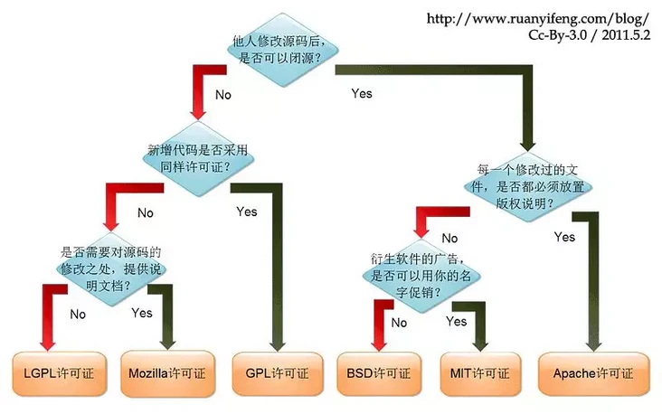

⽂档过程属于软件⽣存周期过程的重要部分，包括⼯作陈述（SOW），软件项⽬管理计划（SPMP），软件⽣存周期管理计划（SLCMP），软件配置管理计划（SCMP）以及软件质量保证计划（SQAP）等⽂档。对于规模相对较小的项⽬，可以重点关注需求规约（SRS），设计⽂档，api ⽂档以及产品⽂档。

## 需求文档

IEEE 830-1998 规定需求需要有以下⼏个性质：

- Necessary
- Unambiguous
- Testable
- Traceable
- Measurable

在软件的⽣命周期中，我们⼀般从以下⼏⽅⾯考虑：功能；性能；外部接口；设计约束；质量属性

### 功能

功能需求规约了系统必须执⾏的功能。除此之外，还规约以下内容：

- 关于该功能输⼊的所有假定，或为了验证该功能输⼊，有关检测的假定。
- 功能内的任⼀次序，这⼀次序是与外部有关的。
- 对异常条件的响应，包括所有内外部所产⽣的错误。
- 需求的时序或优先程度。
- 功能之间的互斥规则。
- 系统内部状态的假定。
- 为了该功能的执⾏，所需要的输⼊和输出次序。
- ⽤于转换或内部计算所需要的公式。

### 性能

性能需求规约了系统必须具有的性能特性，例如需要多少的平均响应时间，最⼤的响应时间，以及需要处理怎样⾼的并发请求等

### 外部接口

外部接口需求 规约了系统或系统构件必须与之交互的硬件、软件或数据库元素，也可能规约其格式、时间或其他因素。

- 系统接口：描述⼀个应⽤如何与系统的其他应⽤进⾏交互。
- ⽤⼾接口：规约了软件产品和⽤⼾之间接口的逻辑特性。即规约 对给⽤⼾所显⽰的数据，对⽤⼾所要求的数据以及⽤⼾如何控制该⽤⼾接口。
- 硬件接口：如果软件系统必须与硬件设备进⾏交互，那么就应说明所要求的⽀持和协议类型。
- 软件接口：允许与其它软件产品进⾏交互，如，数据管理系统、操作系统或数学软件包。
- 通讯接口：规约待开发系统与通讯设施（如，局域⽹）之间的交互。如果通讯需求包含了系统必须使⽤的⽹络类型（TCP/IP），那么有关类型的信息就应包含在需求规约（SRS）中。
- 内存约束：描述易失性存储和永久性存储的特性和限制，特别应描述它们是否被⽤于与⼀个系统中其它处理的通讯。
- 操作：规约⽤⼾如何使系统进⼊正常和异常的运⾏以及在系统正常和异常运⾏下如何与系统进⾏交互。应该描述在⽤⼾组织中的操作模式，包括交互模式和⾮交互模式；描述每⼀模式的数据处理⽀持功能；描述有关系统备份、恢复和升级功能⽅⾯的需求。
- 地点需求 ：描述系统安装以及如何调整⼀个地点，以适应新的系统。

### 设计约束

设计约束限制了系统或系统构件的设计⽅案。就约束的本⾝而⾔，对其进⾏权衡或调整是相当困难的，甚⾄是不可能的。它们必须予以满⾜。这⼀性质，是与其它需求的最主要差别。为了满⾜功能、性能和其它需求，许多设计约束将对软件项⽬规划、所需要的附加成本和⼯作产⽣直接影响。对于产品开发，需要考虑：

- 法规政策（Regulatory policies)；
- 硬件限制（Hardware limitations），例如：处理速度、信号定序需求、存储容量、通讯速度以及可⽤性等；
- 与其它应⽤的接口（Interfaces to other applications），如，当外部系统处于⼀个特定状态时，禁⽌新系统某些操作；
- 并发操作（Parallel operations），例如，可能要求从 / ⾃⼀些不同的源，并发地产⽣或接收数据。对此，必须清晰地给出有关时间的描述；
- 审计功能（Audit functions），规约软件系统必须满⾜的数据记录准则或事务记录准则。如，如果⽤⼾察看或修改数据，那么就可能要求该系统为了以后复审，记录该系统的动作；
- 控制功能（Control functions）：可以对系统的管理能⼒进⾏远程控制、可以对其他外部软件以及内部过程进⾏控制；
- ⾼级语⾔需求（Higher order language requirements);
- 握⼿协议（Signal handshake protocols）：通常⽤于硬件和通讯控制软件，特别当给出特定的时间约束时，⼀般就要把“握⼿协议”作为⼀项约束
- 应⽤的关键程度（Criticality of the application），许多⽣物医学、航空、军事或财务软件属于这⼀类；
- 安全考虑（Safety and security considerations）。

### 质量属性

质量属性 (Quality attribute) 规约了软件产品必须具有的⼀个性质是否达到质量⽅⾯⼀个所期望的⽔平。例如：

|   属性   |                               描述                               |
| :------: | :--------------------------------------------------------------: |
|  可靠性  |           软件系统在指定环境中没有失败而正常运⾏的概率            |
|  存活性  | 当系统的某⼀部分系统不能运⾏时，该软件继续运⾏或⽀持关键功能的可能性 |
| 可维护性 |    发现和改正⼀个软件故障或对特定的范围进⾏修改所要求的平均⼯作     |
| ⽤⼾友好性 |                  学习和使⽤⼀个软件系统的容易程度                  |
|  安全性  |            在⼀个预定的时间内，使软件系统安全的可能性             |
| 可移植性 |                      软件系统运⾏的平台类型                       |

### 需求规约（SRS）

⼀个需求规约是⼀个软件项 / 产品 / 系统所有需求陈述的正式⽂档，是⼀个软件产品 ∕ 系统的概念模型。IEEE 标准 830-1998 给出格式

1. 引言
   1. 目的
   2. 范围
   3. 定义，缩略语
   4. 参考文献
   5. 概述（项目范围）
2. 总体描述
   1. 产品概述
   2. 产品功能
   3. 用户特性
   4. 约束
   5. 假设和依赖
3. 特定需求

- 附录
- 索引

其中，⽂档的技术核⼼在第三部分特定需求。这⼀部分写法⽐较⾃由，例如：可以根据系统运⾏模式，把第三部分划分为⼀些小节，并在⼀个小节中给出系统性能的规约。也可以：通过⼀种可选的模式划分，把第三部分划分为⼀些小节，其中每种模式的性能包含在该模式的规约中。

更为详细的内容，可以了解形式化规约以及半形式化规约。

基于 SRS，还会产⽣以下两个⽂档：初始测试计划和⽤⼾系统操作描述。

- 初始测试计划：对未来系统中的哪些功能和性能指标进⾏测试，以及达到何种要求。
- ⽤⼾系统操作描述：相当于⼀份初步的⽤⼾⼿册，从⽤⼾使⽤系统的⻆度，简要描述系统功能和性能，使⽤系统的主要步骤和⽅法，以及系统⽤⼾的责任等。

[https://github.com/cuizhenjie/software-engineering-document](https://github.com/cuizhenjie/software-engineering-document)

## 设计文档

- 概要设计
- 详细设计
- 业务流程图、程序结构图
- 测试计划

## api 文档

⽀持过程是软件⽣存周期过程的另⼀部分，编写并更新开发⽂档以及 api ⽂档在软件项⽬中有重要作⽤。

### 结构

- 请求地址
- 接口信息
- 功能描述
- 参数说明
- 返回值说明
- 其他限制
- 维护信息

### api 文档规范格式

以下部分参考 [google developer documentation](https://developers.google.com/style/api-reference-comments)

API ⽂档必须包括以下内容：

- `class`、`interface`、`struct`、`struct`
- `const`、`field`、`enum`、`typedef`
- `method`（参数说明、返回值以及异常处理）

API ⽂档推荐包含：

- 对于每⼀⻚，顶部包含⼀段 5-20 ⾏的代码样例
- 在⾸⻚写出 API 名称、类名、⽅法名等，并链接⾄对应⻚码
- 字符串使⽤代码字体，并加双引号
- 使⽤斜体表⽰参数

#### `class`、`interface` 与 `struct`

在 `class` 注释的第⼀⾏，简单说明⽆法从 `class` 名称中推断出的信息。

#### `Methods`

在 `Method` 注释的第⼀⾏，简要说明 `Method` 执⾏的⾏为。接下来，解释为什么以及如何去调⽤此⽅法，并陈述调⽤前需要的准备，此外需要给出异常的具体信息。

此外，需要写清调⽤⽅法时的依赖以及权限，并写清某⼀依赖缺失时此⽅法的⾏为。例如对于安卓开发中 [`Activity.isChangingConfigurations()`](https://developer.android.com/reference/android/app/Activity.html#isChangingConfigurations()) ⽅法，说明为：

```
Checks whether this activity is in the process of being destroyed in order to be recreated with a new configuration. This is often used in onStop() to determine whether the state needs to be cleaned up or will be passed on to thenext instance of the activity via onRetainNonConfigurationInstance().
```

#### 参数

对于参数的描述遵循以下约定：

- ⾸字⺟⼤写，句⼦以“.”结束。
- ⾮布尔型参数以 The/A 开头，例如 `The ID of the bird you want to get.`
- 对于调⽤某种⾏为的布尔型参数，以 `if ture ..., if false ...` 描述。
- 对于设置某种状态的布尔型参数，以 `True if ..., false otherwise` 描述。
- 解释默认参数，格式为 `Default: ...`

#### 返回值

与参数类似。

#### 工具

**swagger**

参见 [swagger editor](https://swagger.io/tools/swagger-editor/)

## 产品文档

产品⽂档⾯向客⼾，内容上应忽略技术性的内容。我们常在 github 上写的 readme 可以看作⼀种简化的产品⽂档。

### 文档结构

⼀般来说，开发⽂档主要包括项⽬简介、代码样例、issue 以及问题、作者/社区联系⽅式（如何得到 support）、贡献者名单、安装说明、license。
以下是⼀个简单的[模板](https://www.writethedocs.org/guide/writing/beginners-guide-to-docs/)：

```
$project
========

$project will solve your problem of where to start with documentation,
by providing a basic explanation of how to do it easily.

Look how easy it is to use:

    import project
    # Get your stuff done
    project.do_stuff()

Features
--------

- Be awesome
- Make things faster

Installation
------------

Install $project by running:

    install project

Contribute
----------

- Issue Tracker: github.com/$project/$project/issues
- Source Code: github.com/$project/$project

Support
-------'

If you are having issues, please let us know.
We have a mailing list located at: project@google-groups.com

License
-------

The project is licensed under the BSD license.
```

#### LICENSE

license 的选取取决于作者对代码的限制。下图简洁地表⽰了 license 的选取。



⼀般来说，常⽤ MIT 协议、GPL 协议、BSD 协议，等等。

- MIT：被授权⼈有权利使⽤、复制、修改、合并、出版发⾏、散布、再授权及贩售软件及软件的副
  本；被授权⼈可根据程式的需要修改授权条款为适当的内容；在软件和软件的所有副本中都必须包
  含版权声明和许可声明；此授权条款并⾮属 copyleft 的⾃由软件授权条款，允许在⾃由/开放源码软
  件或⾮⾃由软件（proprietary software）所使⽤；MIT 条款可与其他授权条款并存；另外，MIT 条
  款也是⾃由软件基⾦会（FSF）所认可的⾃由软件授权条款，与 GPL 相容。
- GPL：代码的开源/免费使⽤和引⽤/修改/衍⽣代码的开源/免费使⽤，但不允许修改后和衍⽣的代
  码做为闭源的商业软件发布和销售。只要在⼀个软件中使⽤ GPL 协议的产品，则该软件产品必须
  也采⽤ GPL 协议。
- BSD：使⽤者可以⾃由的使⽤，修改源代码，也可以将修改后的代码作为开源或者专有软件再发
  布。使⽤ BSD 协议需要满⾜以下条件：
  - 如果再发布的产品中包含源代码，则在源代码中必须带有原来代码中的 BSD 协议
  - 如果再发布的只是⼆进制类库/软件，则需要在类库/软件的⽂档和版权声明中包含原来代码中的 BSD 协议
  - 不可以⽤开源代码的作者/机构名字和原来产品的名字做市场推⼴。

除了上述开源协议外，还有一个虽然不是很常用但是也值得一提的便是 CC0 协议。使用 CC0 协议便意味着自己放弃了该产品和代码的任何权益，任何人都可以任意使用其产品和源代码。

常用的开源协议内容均可以在 [https://opensource.org/licenses](https://opensource.org/licenses) 中找到。
