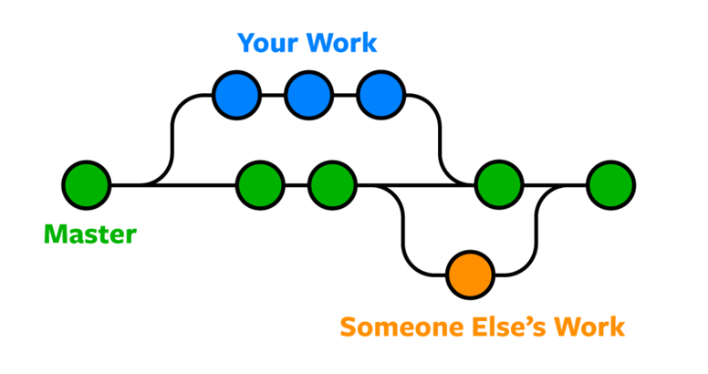

## Git简介

- Git是一个开源的分布式版本控制系统。

- 版本控制系统：一种记录一个或若干文件内容变化，以便将来查阅特定版本修订情况的系统。

- 手动进行版本控制（复制，粘贴，重命名……）虽然操作简单，但当文件比较多时很容易产生混淆，降低工作效率。并且不同版本之间有大量重复内容，也占据了不必要的存储空间。

- Git只记录每次commit更改的内容，可以方便地进行分支的切换与版本回退，提高了开发效率，尤其是需要多人协作开发的场景。

- 分布式：区别于集中式，每位开发者都会在本地保存一份副本，即使主服务器出现问题，也不会导致大家的努力付诸东流。

## Git和GitHub

- 前面说过，Git是一个分布式版本控制系统，它最初由Linus Torvalds为了帮助管理Linux内核开发而开发。

- 而GitHub[https://github.com/](https://github.com/) 是全球最大的~~同性交友网站~~，提供基于Git的源代码托管服务，并且在此基础上提供了图形界面。除此之外，GitHub还提供了更加丰富的功能，如issue，wiki，organization等。软件部的项目基本都托管在GitHub，方便大家协同开发。

## Git基本操作

### Git安装与配置

- 下载地址：[https://git-scm.com/downloads](https://git-scm.com/downloads) 

- 安装完成后（一路默认配置就可以），通过开始菜单找到Git Bash；首先，Git需要知道一些个人信息：名字和email。

- 执行如下指令：

- ```shell
  git config --global user.name <username>
  git config --global user.email <email>
  ```

- 添加`global`参数表示整台机器上所有的git仓库都会使用这个配置，需要使用不同信息配置时可以自行修改。

- `git config`可以帮助我们设置控制git外观和行为的配置变量，其他`config`指令操作可以通过`git help config`进行查看。

### Git本地操作

#### 初始化仓库

- 版本库又名仓库，英文名**repository**，可以简单理解成一个目录，这个目录里面的所有文件都可以被Git管理起来，每个文件的修改、删除，Git都能跟踪，以便任何时刻都可以追踪历史，或者在将来某个时刻可以“还原”。

- 如果我们希望在本地搭建一个项目，并通过Git进行版本控制，那么第一件事就是初始化一个仓库。

- 在shell中cd到项目所在目录，并运行命令：
- `git init`

- 即可完成初始化，可以看到该目录下生成`.git`目录。

#### 添加更改

- Git项目的三个工作区域概念：git仓库、工作目录和暂存区域；对应的文件有三种状态：已提交、已修改和已暂存。

- Git 仓库目录是 Git 用来保存项目的元数据和对象数据库的地方。 这是 Git 中最重要的部分，从其它计算机克隆仓库时，拷贝的就是这里的数据。

- 工作目录是对项目的某个版本独立提取出来的内容。 这些从 Git 仓库的压缩数据库中提取出来的文件，放在磁盘上供你使用或修改。

- 暂存区域是一个文件，保存了下次将提交的文件列表信息，一般在 Git 仓库目录中。 有时候也被称作“索引”，不过一般说法还是叫暂存区域。

- 基本工作流程：

1. 在工作目录中修改文件。
2. 暂存文件，将文件的快照放入暂存区域。
3. 提交更新，找到暂存区域的文件，将快照永久性存储到git仓库目录。

- ```shell
  git add [<path>…]
  # 可以是多个路径，如git add a.txt b.txt
  git commit –m <msg>
  # msg应当简要描述本次commit的关键信息。如git commit –m “添加了a.txt和b.txt”
  ```

#### 其他一些操作

- `git status`：命令用于显示工作目录和暂存区的状态。使用此命令能看到那些修改被暂存到了, 哪些没有。
- `git diff <path>`：`git status`只能显示哪些文件被修改，而`git diff`用于显示具体的修改内容。
- `git log`：用于显示提交日志信息，即前面每次commit留下的信息。
- `git reset`：用于撤销更改。`git reset <commit-id>`可以回到指定id的commit，`git reset HEAD~<x>`可以回退x个版本。
- `.gitignore`：规定了哪些目录或文件不会被Git管理。

#### 分支

- 为什么需要分支？可以在新的分支上进行相应的开发，而不会影响到主分支。当开发完成后，再将新的分支合并回主分支即可。

- `git branch <name>`：用于创建一个新的分支。

- `git checkout <name>`：用于切换到相应分支。

- `git merge <name>`：用于将某个分支合并到当前分支上。当存在冲突时需要手动解决冲突。

- `git stash`：将当前工作区内的内容暂存起来，通过`git stash pop`可以恢复工作区。从而你可以先去解决其他分支的问题。



### Git远程操作

#### 使用GitHub

- 仅仅在本地仓库中进行操作无法达到多人协作开发的目的。为了能够和别人一起开发，我们可以在GitHub上创建一个repo作为远程仓库，大家借助这个远程仓库来完成协作。

- Step1 注册github账号

- 由于你的本地Git仓库和GitHub仓库之间的传输是通过SSH加密的，所以，需要一点设置：

- Step2 创建SSH Key

- 在用户主目录下查看是否有.ssh目录，如果有，看一下是否有`id_rsa`和`id_rsa.pub`两个文件。

- 如果没有，可以打开Git Bash，输入如下指令：

- `ssh-keygen -t rsa -C <email>`；然后一路回车，采用默认设置即可。

- Step3 登陆GitHub，点击右上角打开`Settings`，找到`SSH and GPG keys`；然后点击`New SSH `。

- `Key`、`Title`随便输入点东西，将`id_rsa.pub`用notepad打开，将里面内容复制到`Key`。

#### 常用命令

- `git remote add <name> <url>`：将远程仓库与本地仓库进行关联，之后通过其他操作就可以实现本地与远端同步。例如`git remote add origin git@github.com:EESAST/test.git`。

- `git clone`：该命令将远程仓库克隆到新目录中。假如你的GitHub上已经有一个仓库名为homework（假设你的github账号名为god），你需要使用它，就执行如下指令：`git clone git@github.com:god/homework.git`。这样，在当前的目录内你就可以获得该仓库的内容。
- `git push`：推送分支，就是把该分支上的所有本地提交推送到远程库。推送时，要指定本地分支，这样，Git就会把该分支推送到远程库对应的远程分支上。示例：`git push origin master`将master分支推送到远程分支上；当然，也可以推送其他分支，例如推送dev分支：`git push origin dev`。
- `git pull`：取回远程主机某个分支的更新，再与本地的指定分支合并；Pull过程伴随merge操作，因此之前merge时存在的问题这里也会存在。当然也可以`git fetch`之后手动merge或者rebase。为了避免大面积冲突，建议及时push，以及push之前先pull。

#### GitHub的其他功能

- Fork：当你想要在别人的库的基础上开发时，只需要Fork一份到自己的仓库就好了。想要参与别人的项目的开发，一般要先fork一份，开发完毕后提pull request，通过review后即可merge到原仓库。

- Issue：当你有疑问或者发现bug时，可以在别人的仓库下提issue。一个issue就像一个帖子，大家可以在下面展开交流。

- 你可以在GitHub上发现各种好玩实用的开源项目，并且为你所用。你也可以将自己的代码开源到Github上，和世界各地的开发者分享。

#### 开发流程

- 见[Git开发实例](./git_instance.md)。

