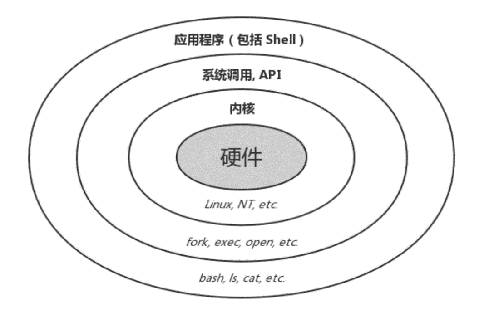

> 更多相关知识，可参考：[missing-semester](https://missing.csail.mit.edu/2020)
> [中文版](https://missing-semester-cn.github.io/)

## 一、简介与基本概念

###  1.发展简史——Unix、Minix到Linux

**Unix**是一种古老的操作系统（上世纪七十年代）。在Unix之前，操作系统基本都只能进行批处理作业，相当于你给计算机一批任务，然后计算机逐项去自动执行，执行完了反馈给你结果，在此过程中是不具可交互性的。为了满足交互性、及时性和多用户同时访问的需要，人们希望研制分时操作系统——通过时间片轮转为很多用户同时提供交互式服务。早期的尝试能支持的用户量很有限（MIT推动的MAC计划只能让30名左右的使用者同时共享IBM的大型计算机，到了1965年还最终不堪负荷），于是MIT决定研制更大型的分时计算机系统——MULTICS——其中通用电子公司参与了硬件开发，贝尔实验室承包了软件也就是操作系统。但是这一由众多大名鼎鼎的机构联合执行的计划最终失败了，MULTICS被传为笑柄。

但是，当时在贝尔实验室参与分时操作系统开发的成员在此项目中获得了宝贵的经验。贝尔实验室虽然退出了MULTICS项目，但为创建交互式计算环境的努力从未停止，后来汤姆森(Ken Thompson) 与里奇(Dennis Ritchie)在一些机缘巧合之下开发了Uniplexed Information and Computing System，被简称Unix，其中Uniplexed是对MULTICS首字母Multiplexed的嘲讽。历经很多版本的改进（其中重大的改进如将内核从由汇编语言写改成由高级语言写，他们尝试过世界上第一个被正式推广使用的高级语言Fortran，后来又产生出了B语言，但是都不理想，最后改良了B语言，开发出了C语言，因而里奇被称作C语言之父。这一改进大大增强了Unix的多平台可移植性），人们发现Unix相比于批处理系统有很多优势，应用规模逐渐扩大，最终贝尔实验室的所有者AT&T公司宣布要将Unix商业化。由于众多衍生版的出现， 在随后的几十年中，Unix的发展经常伴随着产权纠纷。 目前它的商标权由国际开放标准组织所拥有。 

20世纪80年代，随着硬件计算能力的提升，计算机市场不断扩大。可供选用的操作系统中，Unix是商业软件，AT&T制定的价格昂贵；DOS系统是单用户单任务的，且源代码被微软当作商业秘密；MacOS系统只能用于苹果电脑。这在教学上为老师提了难题，因为找不到开源的例子。一名教授就编写了一个操作系统**Minix**来讲解操作系统内部工作原理。虽然Minix比较简单，但好处是完全开源的。

全世界学计算机的学生都通过钻研Minix的源代码来学习操作系统，芬兰赫尔辛基大学大学二年级的学生Linus Torvalds就是其中一个。借鉴了Minix和Unix的思想，Linus在1991年写出了Linux操作系统。他把Linux的源码放到网上，所有人都可以免费获取，甚至可以进行商业应用。这就使得Linux迅速得到了全世界计算机企业和爱好者的支持，出现了很多发行版，用户可以根据自己的需要自由增添、剪裁Linux系统。这样以来，一个庞大的社区来不断更新和维护使Linux具有了长久的生命力。

### 2.Linux主要特点

（1）Linux是开源的，遵循GNU通用公共许可证（GPL）。这意味着任何人都可以基于Linux底层代码创建一个符合自己需求的Linux 发行版。

（2）一切皆文件。我们说Linux是类Unix系统，借鉴的思想主要就是这一点。无论是大家通常理解的文件，还是外设、命令、各种进程，对于操作系统内核而言都是文件，只不过文件的类型不同而已。

（3）多用户、多任务。同Unix一样，Linux是分时操作系统，各个用户可以同时登陆，由操作系统来保证各用户对于各类文件有合适的权限。Linux系统可以同时连接多个终端并且每隔一段时间重新扫描进程，重新分配进程的优先级，动态分配系统资源，从而在多进程同时运行时保持良好性能。

（4）交互性。Linux具有良好的交互性，用户可以得到及时响应。一般我们用的是字符界面，但是如果想要图形界面的话也可以单独安装GUI软件。

支持多平台（还可嵌入式）、支持多处理器、有强大的网络功能等等。

### 3.Shell是什么？——CLI、Terminal、Console、Shell的区别与联系

**CLI** = Command-line Interface，即命令行界面，与**GUI** =  Graphical User Interface，即图形用户界面相对。CLI\GUI只是一种界面形式，对应着敲命令或点鼠标，并不代表着某类具体软件。

**Terminal**，即终端，是人与计算机进行交互的接口。一台大型机可以连接很多终端机，用户在这些终端机上跟计算机进行交互，这些早期终端一般是电传打字机（**TTY**），电传打字机也是第一个Unix终端。因此，在历史上，终端是连接到计算机上的一种带输入输出功能的外设。

**Console**，即控制台，是一个特殊的终端。这个终端的特殊之处在于，它是计算机自身的一个组成成分，是系统管理员的终端，拥有比普通用户的终端更大的权限。一台大型机一般只有一个控制台，却可以连接很多终端。在个人计算机上，由于你既能做一般工作，也能做管理员的工作，因此控制台与终端的界限也就消失了。

随着个人计算机的普及和进化，大型机时代的专门的终端硬件早已消失，我们只用自己的键盘、鼠标来控制计算机。但是终端的思想保留了下来，变成了操作系统中的软件——**终端模拟器**（如Win32控制台）。终端模拟器可以捕获你的键盘输入，发送至命令行程序，拿到输出结果后再调用图形接口，将输出渲染至屏幕上。由于人们除了在博物馆再也见不到TTY这样的终端硬件了，于是就直接称终端模拟器为**终端**。

特别的，由于在早期Unix多用户系统当中的终端都是TTY，于是所有的终端硬件设备在Unix/Linux系统当中都以TTY命名，这一习惯延续至今。在现在，TTY和终端设备已不再区分了。

**Shell**，即“壳层”，是帮助用户与内核交互的一类程序。操作系统内核直接负责管理计算机硬件，处于操作系统最底层，由于其重要性是不能轻易由用户直接操作的，因此需要有Shell程序来作为用户操作系统的入口。Shell是一类程序，可以有CLI形式的（如sh、bash、zsh；cmd、powershell等），也可以有GUI形式的（如Windows资源管理器explorer.exe等）。

至于为什么叫“壳层”，看下面这张图或许就感觉有点形象了。



或许现在你仍有些困惑，我们再来梳理一下。在用户用键盘和鼠标输入后，**终端（Terminal）**将这些输入发送给你选用的**壳层（Shell）**，Shell解析你的命令发送给操作系统内核去执行，并把执行结果返回给终端，终端调用图形接口将结果显示到屏幕上。

<u>以上这些基础知识我们有一些了解就可以，目的是让我们跟计算机打交道时头脑更清楚，如果现在没搞清楚也不要紧，每个人对理论知识的理解角度都可能不同。只要熟练掌握下面讲的实用技能，就足以在日常工作中得心应手。</u>


## 二、Linux用户管理

在**多用户**的Linux系统中，每个用户账号都拥有一个唯一的用户名和密码。用户在登录时键入正确的用户名和密码后，会进入自己的主目录（通常是/home下面的文件夹），Linux用户系统还有用户组的概念。

### 1.用户账号的新建、修改、查看与删除

**新建用户**

```bash
sudo useradd [options] [username]
```

常用选项：

- -d（可指定用户主目录，如果此目录不存在，则同时使用-m选项，可以创建主目录）
- -g（指定用户所属的用户组，有关用户组稍后讲解）
- -G（指定用户所属的附加组）
- -s（指定用户的登录Shell）

这一命令要用超级用户权限执行。在Linux中，命令前加sudo表明用超级用户权限执行该命令，但要保证当前用户拥有超级用户权限。如果没有的话，可以用su命令切换至root用户操作。

例如，我们可以执行：

```shell
sudo useradd test
```

**切换用户**

```bash
su [username]
```

如果不加用户名，则默认切换到超级用户（root）。当我们尝试切换到刚创建的用户时，会发现要求输入密码，而无论输入什么都是验证失败，因为我们还没有设密码，账户处于锁定状态。

**修改密码**

```sh
passwd [options]                     # 修改自己的密码，需要知道自己的现有密码
sudo passwd [options] [username]     # 修改别人的密码，需要超级用户权限
```

通过options可以锁定密码（-l）、解锁密码（-u）、使账号无密码（无法登录，-d）、 强迫用户下次登录时修改密码（-f），一般不常用。当我们为刚才新建的用户指定一个密码后，再切换用户就可以输入密码登录了。

**修改用户**

```shell
sudo usermod [options] [username]
```

修改已建立用户的属性，其选项同新建用户时一样。例如：

```shell
usermod -s /bin/bash test
```

此时再登录test时，我们会发现默认shell从sh切换到了bash。

**查看用户**

我们可以通过查看/etc/passwd文件来查看当前系统中的全部用户和属性：

```shell
cat /etc/passwd
```

每行用户信息都以 ":" 作为分隔符，划分为7个字段，每个字段所表示的含义如下：

用户名：密码（被隐藏）：UID（用户ID）：GID（组ID）：描述性信息（在创建用户时或修改用户时添加，不添加就为空）：主目录：默认Shell。例如：

```shell
test:x:1001:1001::/home/test:/bin/bash
```

**赋予用户超级用户权限**

我们可以通过修改/etc/sudoers文件来设置用户权限。请注意，这一文件是系统自动生成的，且一旦修改错误会出现很严重的影响，因此不要直接用文本编辑器修改，而是用visudo工具进行修改。

```shell
sudo visudo
```

之后进入visudo软件交互界面，可以阅读文件中的注释和最下面的按键说明进行操作。权限配置格式如下：

```shell
root     ALL       =(ALL:ALL)               ALL
用户名 允许登录的主机  =(可使用的身份 用户:用户组) 授权命令(绝对路径)

%wheel   ALL        =(ALL:ALL)               ALL
%组名  被管理主机的地址 =(可使用的身份 用户:用户组) 授权命令(绝对路径)
```

注意：对于字段三，如果省略，相当于(root:root)，表示可以通过sudo提升权限到root；如果为(ALL)或者(ALL:ALL)，表示能够提升权限到(任意用户:任意用户组)。 如果没省略，必须使用( )双括号扩起来。

当然，提升权限的办法除了将该用户或用户组赋予更高权限，还可以将该用户添加到有更高权限的组当中。除了可以修改权限，在/etc/sudoers当中还有一些其他有趣的配置。例如，如下修改可以让下次输入sudo密码时不是什么都不显示，而是显示星号：

```
Defaults env_reset,pwfeedback
```

**删除用户**

```shell
sudo userdel [options] [username]
```

常用选项：

- -r（同时删除用户主目录）

  ​	我们可以删除掉刚才创建的用户，此时如果再查看用户，会发现那一行已经消失了。

### 2.用户组

每个用户都属于某个用户组；一个组中可以有多个用户，一个用户也可以属于不同的组。当一个用户同时是多个组中的成员时，在刚才看到的/etc/passwd文件中记录的是用户所属的主组，也就是登录时所属的默认组，而其他组称为附加组。

**查看用户组**

我们可以通过查看/etc/group文件来查看当前系统中的全部用户组：

```shell
cat /etc/group
```

每行用户组信息都以 ":" 作为分隔符，划分为4个字段，每个字段所表示的含义如下：

组名 : 用户组密码（一般没有密码） : 组标识号 : 组内用户列表。

**新建用户组**

```bash
sudo groupadd [options] [groupname]
```

选项不常用。

**修改用户组**

```shell
sudo groupmod -n [new groupname] [old groupname]
```

一般用作修改用户组名。

**删除用户组**

```shell
sudo groupdel [groupname]
```

**切换用户组**

用户可以在登录后，自由切换到自己所属的其他用户组，以便拥有该用户组的权限。

```shell
newgrp [groupname]
```

如果想将某个用户添加到某个用户组或从某个用户组当中删除，可以参照“修改用户”当中介绍的方法指定用户所属的用户组。

### 3.用户 用户组权限

**查看目录下所有文件的权限**

```shell
ll(基本等于ls -al)  \  ls -l
```

我们会得到如下的若干条记录：

```sh
drwxr-xr-x 1 liudu liudu 4096 Jul  1 16:25 liudu
```


其中第一段的”drwxr-xr-x“的意思为


文件类型常见的有d（目录）、-（文件）、l（链接）。接下来以三个字母为一组表明了文件权限：属主权限指的是文件所有者对该文件的权限， 属组权限指的是文件所有者的同组用户对该文件的权限，其他用户权限顾名思义。r、w、x分别代表读、写和执行的权限，如果没有此项权限则会出现减号。 

第二段的“1”表明文件只有一个硬链接。Linux文件系统为树状结构，硬链接就相当于一条指向该文件节点的路径，只有一个硬链接的文件可以看作是叶子节点。与之相对的软链接则相当于Windows当中的快捷方式。只有将文件的所有硬链接都删除后，文件节点才会被释放；而删除文件节点和软连接是各自独立存在的，只不过如果将文件删除后软连接将指向无效的地址。具体操作在之后还会介绍。

第三段的“liudu”表明该文件属于用户“liudu”，第四段的“liudu”表面该文件属于用户组“liudu”。后面还有大小，最后修改时间和文件名属性。

**修改文件权限**

可以通过chmod命令通过符号方法或者数字方法来修改文件权限。

<u>符号方法：</u>

```bash
chmod [–R] [u/g/o/a] [+/-/=] [r/w/x] [file]
```

其中u（user）代表改变属主的权限，g（group）代表改变属组的权限，o（owner）代表改变其他用户的权限，a（all）代表改变所有用户的权限。+代表增加权限，-代表删除已有权限，=代表设定权限。r/w/x代表读、写、执行。如果加上-R，则表明要递归修改权限，如果文件参数是一个目录，就会将该目录下的所有文件都修改。这些参数可以灵活地组合使用，下面举两个例子。

（1）为所有用户赋予1.txt的执行权限

```bash
chmod u+x,g+x,o+x 1.txt  # 等价于chmod a+x 1.txt
```

（2）为属主赋予读、写、执行权限，删除属组和其他用户的执行权限

```bash
chmod u=rwx,g-x,o-x 1.txt
```

<u>数字方法：</u>

数字方法可以更简洁地修改文件权限。表示方法是为每个权限赋予权重，读的权重为4，写的权重为2，执行的权重为1（想一想为何如此编码？3bit的信息）。在表示每类用户的权限时，把该类用户所拥有的全部权限的权重相加，得到一个0-7的数，再按属主、属组、其他用户的顺序排列起来，得到一个三位数，表示该文件的权限。数字方法只能直接设定文件权限，不能增添或者删除权限。

例如，为所有用户赋予所有权限，用数字方法表示为：

```bash
chmod 777 1.txt
```

**修改文件属主和属组**

可以通过chown命令来修改文件的属主和属组：

```bash
sudo chown [–R] [owner] [file]
sudo chown [-R] [owner]:[group] [file]
```

跟刚才一样，-R表示对目录递归地进行修改。这一命令只能用超级用户权限执行，哪怕你是该文件的所有者且拥有全部权限，也不能作为普通用户修改文件的属主和属组。

**修改文件属组**

可以通过chgrp命令来单独修改文件的属组：

```sh
sudo chgrp [-R] [group] [file]
```


## 三、Linux文件管理

还记得之前讲过Linux的设计哲学：**一切皆文件**，下面就来初识Linux文件。

### 1.文件路径

Linux的文件结构为**树状结构**，之前提到的硬链接就与此相关。文件的路径可以用绝对路径或相对路径来表示，绝对路径要从根目录写起，例如“/mnt/d/hello/a.txt”；相对路径则基于当前所在的路径寻址，例如现在在“/mnt/d/hello/b”目录下，则刚才的a.txt的路径为“../a.txt”。常用的符号有："./"表示当前目录下；“../”表示上一级目录下，“../../”表示上两级目录下，以此类推；"~/"表示家目录。

### 2.系统目录结构

**系统文件：**

- **/boot：**存放着启动Linux时使用的内核文件，包括连接文件以及镜像文件。

- **/etc：**存放所有的系统需要的配置文件和子目录列表。

- **/lib**：存放基本代码库（比如c++库），几乎所有的应用程序都需要用到这些共享库。

- **/sys**： 该目录下安装了Linux2.6内核中新出现的一个文件系统 sysfs ，当一个内核对象被创建的时候，对应的文件和目录也在内核对象子系统中。

**指令\程序（文件）：**

- **/bin：**存放着最常用的程序和指令。

- **/sbin：**只有系统管理员能使用的程序和指令。

**外部设备（文件）：**

- **/dev ：**Device的缩写，存放的是Linux的外部设备。**注意：**在Linux中访问设备和访问文件的方式是相同的。

- **/media**：类windows的**其他设备，**例如U盘、光驱等等，识别后linux会把设备放到这个目录下。

- **/mnt**：用于临时挂载别的文件系统，在讲docker时可能还会遇到。

**临时文件：**

- **/run**：是一个临时文件系统，存储系统启动以来的信息。

- **/lost+found**：一般情况下为空的，系统非法关机后，这里就存放一些文件。

- **/tmp**：这个目录是用来存放一些临时文件的。

**账户文件：**

- **/root**：系统管理员的用户主目录。

- **/home**：用户的主目录，以用户的账号命名。

- **/usr**：用户的很多应用程序和文件都放在这个目录下，类似于Windows下的program files目录。

- **/usr/bin：**系统用户使用的应用程序与指令。

- **/usr/sbin：**超级用户使用的比较高级的管理程序和系统守护程序。

- **/usr/src：**内核源代码默认的放置目录。

**程序运行中文件：**

- **/var**：存放经常修改的数据，比如程序运行的日志文件（/var/log 目录下）。

- **/proc**：管理**内存空间。**虚拟的目录，是系统内存的映射，我们可以直接访问这个目录来获取系统信息。这个目录的内容不在硬盘上而是在内存里，我们也可以直接修改里面的某些文件来做修改。

### 3.磁盘管理

大家在熟悉的Windows系统上可以通过文件资源管理器和磁盘管理工具轻松地进行磁盘分区等操作，那在Linux系统上怎么操作呢？

**列出文件系统的整体磁盘用量**

```bash
df [options] [file or directory path]
options -h 以人们较易阅读的 GB, MB, KB 等格式自行显示
        -a 列出所有的文件系统
        -k 以 KB 为单位显示各文件系统
        -m 以 MB 为单位显示各文件系统
df命令会把file or directory path所在的文件系统的磁盘用量展示出来
```

**列出某个文件或目录占用的磁盘空间**

```shell
du [options] [file or directory path]
options -h 以人们较易读的容量格式 (G/M) 显示
        -a 列出所有的文件与目录容量，因为默认仅统计目录底下的文件量而已
        -s 列出总量而已，而不列出每个各别的目录占用容量
        -S 不包括子目录下的总计，与 -s 有点差别
        -k 以 KB 为单位显示容量
        -m 以 MB 为单位显示容量
du命令会把file or directory path自身占用的磁盘空间大小展示出来
```

 **操作Linux磁盘分区表**

```bash
sudo fdisk [option] [device name]
option -l 可以把整个系统内能够搜寻到的装置的分区均列出来
```

一般使用时，先通过df命令找出某个文件\目录所在的磁盘名称，然后再使用fdisk [找到的磁盘名称]对该磁盘进行分区管理。操作时，fdisk工具会有一步步的提示，只需跟着提示去做就可以了。离开时，按q不会保存修改；而按w会保存修改。

**磁盘格式化**

```shell
mkfs [option] [device name]
option -t [filesystem] 将指定的磁盘格式化为指定文件系统格式
```

**磁盘挂载与卸载**

```shell
mount [device name] [directory]      # 将文件系统挂载到某个目录下
unmount [device name or directory]   # 将某个文件系统或者某个目录挂载的文件系统卸载
```


## 四、常用Shell命令

在Linux系统中，我们可选的与内核交互的shell有很多，我们在这里讲解应用广泛的Bourne Again Shell（bash），一般都已经安装在了/bin目录下。在之前的Linux讲解中，我们其实已经用到了很多shell命令，在这里就不再赘述了。另外，许多shell命令有非常多的参数和用法，为了便于理解和日常使用我们只列举一些常用的参数和用法，在以后的应用中如果需要用到可以再行检索。在Linux系统中，可以查看命令的帮助：

```bash
man [command name]
```

### 1.目录、文件操作

**以列表显示指定目录下的内容**

```shell
ls [options] [directory name]
options -a 显示所有文件及目录(“.”开头的隐藏文件也会列出)
		-l 除文件名称外，亦将文件型态、权限、拥有者、文件大小等资讯详细列出
		-r 将文件以相反次序显示(原定依英文字母次序)
		-t 将文件依建立时间之先后次序列出
		-A 同 -a ，但不列出 "." (目前目录) 及 ".." (父目录)
		-F 在列出的文件名称后加一符号；例如可执行档则加 "*", 目录则加 "/"
		-R 若目录下有文件，则以下之文件亦皆依序列出
directory name可省略，表明显示当前工作目录下的文件及目录
```

如果我们执行man ls，会发现实际上ls有多得多的用法，但一般我们不需要用这么多。


**以树状图显示指定目录下的内容**

```shell
tree [options] [directory name]
options -a 显示所有文件和目录
        -d 显示目录名称而非内容
        -D 列出文件或目录的更改时间
        -f 在每个文件或目录之前，显示完整的相对路径名称
        -F 在执行文件，目录，Socket，符号连接，管道名称名称，各自加上"*","/","=","@","|"号
        -L [level] 限制目录显示层级
        -p 列出权限标示
        -u 列出文件或目录的拥有者名称，没有对应的名称时，则显示用户识别码
directory name可为绝对路径或相对路径
```

tree命令有可能没有预置在系统当中，需要按提示安装。

**切换当前目录**

```shell
cd [directory name]
directory name可为绝对路径或相对路径
```

**在目录下查找文件**

```shell
find [path] [options]
options -path [p], -ipath [p] 路径符合 p 的文件，ipath 会忽略大小写
        -name [name], -iname [name] 文件名符合 name 的文件，iname 会忽略大小写
        -type [type] 文件类型是 type=d\f\l... 的文件
        -amin [n] 在过去 n 分钟内被读取过的文件
        -exec [command] 将find处理好的结果交给其他命令继续处理
```

find -path/name只支持普通的通配符如“*”，要想使用正则表达式，要用到-regex参数，这个参数匹配的是完整的文件路径；要想使用拓展的正则表达式，还需要用其他参数。

如果要查找二进制文件、 源代码文件和man手册页 （一般查找命令或者程序的时候用），还可以用whereis命令。

```bash
whereis [options] [file name]
options -b 只查找二进制文件
		-B [directory] 只在设置的目录下查找二进制文件
		-m 只查找说明文件
		-M [directory] 只在设置的目录下查找说明文件
		-s 只查找原始代码文件
		-S [directory] 只在设置的目录下查找原始代码文件
```

**创建目录**

```shell
mkdir [option] [directory name]
option -p 如果所建目录的上级路径不存在，则新建
```

```shell
liudu@L0510410:~$ mkdir ./test1/test2
mkdir: cannot create directory ‘./test1/test2’: No such file or directory
liudu@L0510410:~$ mkdir -p ./test1/test2
liudu@L0510410:~$ tree
.
├── 1.txt
└── test1
    └── test2
```

**创建文件**

创建文件的方法很多。touch命令本来用作修改文件或者目录的时间属性，但可以新建文件用。

```shell
touch 1.txt # 在当前目录下新建1.txt
```

还可以使用重定向符直接创建文件。有关重定向的内容稍后还会详述。

```shell
> 1.txt # 功能同上
```

echo指令可以显示一个字符串，我们可以将其重定向到一个文件当中。

```shell
echo "test" > 1.txt
```

这样如果1.txt不存在，就会新建一个，且里面已经存入了“test”。

**创建链接**

之前已经简单介绍了硬链接和软链接的区别，下面我们可以用ln命令来创建链接。一般不允许对目录制作硬链接，但是特别地可以通过-d选项允许超级用户制作目录的硬链接。

```shell
ln [options] [source path] [destination path]
options -b 覆盖以前建立的链接
        -d 允许超级用户制作目录的硬链接
        -f 强行建立文件或目录的连接，不论文件或目录是否存在
        -i 覆盖既有文件之前先询问用户
        -n 把软链接视为一般目录
        -s 建立软链接（快捷方式）
        -v 显示详细的处理过程
如果不加参数-s，则默认建立的是硬链接。
```

**复制\移动文件或目录**

（1）复制

```shell
cp [options] [source path...] [destination file or directory]
options -a 通常在复制目录时使用，它保留链接、文件属性，并复制目录下的所有内容。其作用等于dpR参数组合
        -d 复制时保留软链接，相当于Windows系统中的快捷方式
        -f 覆盖已经存在的目标文件而不给出提示
        -i 与-f选项相反，在覆盖目标文件之前给出提示，要求用户确认是否覆盖，回答y时目标文件将被覆盖
        -p 除复制文件的内容外，还把修改时间和访问权限也复制到新文件中
        -r 若给出的源文件是一个目录文件，此时将复制该目录下所有的子目录和文件
        -l 创建文件的硬链接（指向同一节点的新边）
        -s 创建文件的软链接（快捷方式）
source path可以不只一个，也可以使用通配符（*），表明目录下的全部文件
```

（2）移动（也可用作重命名文件）

```shell
mv [options] [source path...] [destination file or directory]
options -b 当目标文件或目录存在时，在执行覆盖前，会为其创建一个备份
        -i 如果指定移动的源目录或文件与目标的目录或文件同名，则会先询问是否覆盖旧文件
        -f 如果指定移动的源目录或文件与目标的目录或文件同名，不会询问，直接覆盖旧文件
        -n 不要覆盖任何已存在的文件或目录
        -u 当源文件比目标文件新或者目标文件不存在时，才执行移动操作
source path可以不只一个，也可以使用通配符（*），表明目录下的全部文件
```

```shell
# 将源文件名 source_file 改为目标文件名 dest_file
mv source_file(文件) dest_file(文件)
# 目录名 dest_directory 已存在，将 source_directory 移动到目录名 dest_directory 中；目录名 dest_directory 不存在则 source_directory 改名为目录名 dest_directory
mv source_directory(目录) dest_directory(目录)
```

**删除空目录**

```shell
rmdir [option] [directory path]
option -p 若子目录被删除后使它也成为空目录的话，则顺便一并删除
```

```shell
liudu@L0510410:~$ tree test
test
└── test1

1 directory, 0 files
liudu@L0510410:~$ rmdir -p test/test1
```

执行完毕后，由于有-p选项，test/test1均被删除。注意：rmdir命令只能删除空目录，否则会报错。

**删除文件或目录**

```shell
rm [options] [file or directory path...]
options -i 删除前逐一询问确认
        -f 忽略不存在的文件，即使文件只读也从不给出提示
        -r 递归地删除目录及其下的全部文件
        -v 显示详细的处理过程
file or directory path可以是多个，也可以使用通配符（*）
```

### 2.系统管理

诸如用户管理、磁盘管理等命令我们之前已经接触过了，下面我们再介绍一些常用的系统管理命令。

**查看CPU占用率和内存占用情况**

使用top命令，可以进入一个定时刷新的动态显示界面，刷新频率可以由参数指定。


**查看进程**

```bash
ps [options]
ps = process status，相当于Windows任务管理器的显示功能。
options -a 列出所有的进程（包括其他用户的）
        -u 显示较详细的信息
        -x 也显示没有控制终端的进程
```

**终止进程**

kill指令用于向进程发送信号，最终如何响应由该进程决定。一般用作“杀死”一个进程，但无法“杀死”系统进程和守护进程。

```shell
kill -l		# 列出全部可以发送的信号名称和编号
```

```shell
kill [options] [PID]
options -s [要发送的信号名称或编号]		# 如不指定该项参数，默认发送SIGTERM(15)，一般可终止进程
		-u [用户名] 向指定用户的所有进程发送信号
```

一般在终止一个进程时，先用ps查询该进程的PID，然后用kill [PID]即可；如发现该进程不能正常终止，可以用kill -s 9/KILL [PID]或者省略s，用kill -9/KILL强制终止进程。但要注意，所谓“强制”只是向进程发送了一个不同的信号，并不代表一定能终止进程，一般都是可以的。

**软件安装**

在Debian和Ubuntu发行版当中，apt是一个软件包管理工具。我们可以通过它方便地实现软件包的安装、更新、删除等操作。运行apt需要超级用户权限。

```bash
sudo apt install [package name...]   # 可以一次性安装多个软件包
```

**软件更新**

```bash
sudo apt update			# 列出所有可更新的软件清单
sudo apt upgrade		# 升级全部可升级的软件包
sudo apt upgrade [package name...]	# 指定升级软件包
sudo apt full-upgrade	# 升级全部可升级的软件包，并且在升级前将旧的包先卸载
```

**软件查询**

```shell
apt list --installed	# 列出所有已安装的软件包
apt list --all-versions # 列出所有已安装的软件包的版本信息
sudo apt show [package name]	# 显示指定软件包的具体信息

sudo apt search [keyword]   # 查找可供安装的软件包
```

**软件卸载**

```bash
sudo apt remove [package name]	# 卸载软件包
sudo apt autoremove				# 清理不再使用的依赖和库文件
```

除了apt之外，还有一种软件管理工具snap，在Ubuntu 16.04 LTS或更高版本上可以使用。基本用法如下：

```shell
sudo snap list						# 列出计算机上所有snap安装情况
sudo snap find [package name]       # 在应用商店中查找snap
sudo snap install [package name]    # 安装snap软件
sudo snap refresh [package name]	# 更新snap软件
sudo snap refresh all				# 更新所有的snap软件包
sudo snap revert [package name]		# 将snap还原到以前安装的版本
sudo snap remove [package name]		# 卸载snap软件
```

### 3.文档显示与编辑

**连接并显示文件**

cat（= concatenate）命令可用于连接文件并打印到标准输出设备上。 

```shell
cat [options] [file name...]
options -n 由1开始对所有输出的行数编号
		-b 由1开始对所有输出的行数编号，只不过对于空白行不编号
		-s 当遇到有连续两行以上的空白行，就代换为一行的空白行
		-E 在每行结束处显示'$'
如果file name不只一个文件，则会将它们连接起来，并按照参数指定的方式显示。如果将输出重定向，还可以用于制作镜像文件等。
```

**根据文本内容过滤文件**

grep命令可以查找拥有与给定正则表达式相匹配的内容的文件，如果发现匹配成功的文件，grep命令默认会把含有匹配字符串的那一行显示出来。如果没有指定文件，则grep命令会从标准输入设备（键盘）读取数据。

```shell
grep [options] [想要匹配的正则表达式] [文件或目录...]
options -a 将二进制文档也以文本形式处理
		-A [n] 除了显示匹配的那一行之外，还显示该行之后的n行（after）
		-B [n] 除了显示匹配的那一行之外，还显示该行之前的n行（before）
		-C [n] 除了显示匹配的那一行之外，还显示该行之前和之后的n行（contest）
		-c 计算总匹配的行数
		-r 查找目录而非文件时，必须加上这一参数，否则会报错
		-e 使用正则表达式进行匹配，默认也是这样
		-E 使用拓展的正则表达式进行匹配
		-i 忽略字符大小写的差别
		-l 列出含有匹配成功内容的文件名
		-n 在显示匹配的行之前，标示出该行的行号
		-v 显示不包含匹配表达式的所有行，相当于反向选择
```

 注意：为了避免shell的保留关键字对正则表达式的影响，建议将正则表达式用单引号括起来，但不要用双引号括起来。 

 **补充：正则表达式的基础写法**

| **表达式**    | **含义**                                                     |
| :------------ | :----------------------------------------------------------- |
| **`^word`**   | 搜寻以word开头的行                                           |
| **`word$`**   | 搜寻以word结束的行                                           |
| **`.`**       | 匹配任意一个字符                                             |
| **`\c`**      | 转义\后面的特殊字符c，在正则表达式中有特殊含义的字符必须要先转义才能使用 |
| **`c*`**      | 表示*前面的字符c可以重复0次到多次                            |
| **`[list]`**  | 匹配一系列字符中的一个                                       |
| **`[n1-n2]`** | 匹配一个字符范围，如[0-9]、[a-z]中的一个字符                 |
| **`[^list]`** | 匹配一系列字符以外的字符                                     |
| **`\<word`**  | 匹配以word开头的单词                                         |
| **`word\>`**  | 匹配以word结尾的单词                                         |

**补充：拓展正则表达式的几个例子**

| **表达式** | **含义**                                         |
| :--------- | :----------------------------------------------- |
| **`c？`**  | 匹配0个或1个字符c，即c既可以出现也可以不出现     |
| **`c+`**   | 表示+前面的字符c可以重复1次到多次，注意跟*有区别 |
| **`|`**    | 表示“或“，匹配一组可选的字符或字符串             |

**编辑文档**

如果你在使用服务器并且想简单地对一个文件进行编辑，使用 vim 是十分方便的（大量编辑可以使用 VSCode 等远程连接）。Linux系统自带vim文本编辑器，其功能十分丰富，可以作为程序开发工具使用，虽然比较难以掌握。一般我们只要掌握其最基本的用法就够了。下面这张键盘图可能有点吓人：

 

当我们用vim [file]打开一个文件时，就进入了正常模式，在这一模式下我们可以输入命令，比如摁下i（代表insert）可以切换至输入模式，摁下:可切换至底线命令模式（可以输入更多命令）。 vim 中有这些模式：

- **Normal**: for moving around a file and making edits
- **Insert**: for inserting text
- **Replace**: for replacing text
- **Visual** (plain, line, or block): for selecting blocks of text
- **Command-line**: for running a command

在输入模式当中，我们可以上下左右移动光标，用键盘在光标处进行输入等，基本上跟我们习惯的输入方式一样。如想退出，或者执行其他指令，要先摁ESC键退出输入模式到命令模式，再摁:键切换至底线命令模式。在底线命令模式当中，最常用的命令就是q（退出）和w（保存）。如想不做修改直接退出，用q:如想保存并退出，用wq。如果对更多vim的快捷键感兴趣，可以上网查阅更多资料。

### 4.输入输出重定向

**输入重定向**

| 命令格式       | 作用                                                         |
| -------------- | ------------------------------------------------------------ |
| 命令 < 文件    | 将指定文件作为命令的输入设备。                               |
| 命令 << 分界符 | 表示从标准输入设备（键盘）中读入，直到遇到分界符才停止（读入的数据不包括分界符），这里的分界符其实就是自定义的字符串。 |

**输出重定向**

| 命令格式                             | 作用                                                         |
| ------------------------------------ | ------------------------------------------------------------ |
| 命令 > 文件                          | 将命令执行的标准输出结果重定向输出到指定的文件中，如果该文件已包含数据，会清空原有数据，再写入新数据。 |
| 命令 2> 文件                         | 将命令执行的错误输出结果重定向到指定的文件中，如果该文件中已包含数据，会清空原有数据，再写入新数据。 |
| 命令 >> 文件                         | 将命令执行的标准输出结果重定向输出到指定的文件中，如果该文件已包含数据，新数据将写入到原有内容的后面。 |
| 命令 2>> 文件                        | 将命令执行的错误输出结果重定向到指定的文件中，如果该文件中已包含数据，新数据将写入到原有内容的后面。 |
| 命令 >> 文件 2>&1 或者 命令 &>> 文件 | 将标准输出或者错误输出写入到指定文件，如果该文件中已包含数据，新数据将写入到原有内容的后面。 |

### 5.管道

 所谓**管道（pipe）**，就是将两个或者多个命令连接到一起，把一个命令的输出作为下一个命令的输入。 Linux管道使用竖线`|`，即管道符连接多个命令。 语法格式如下：

```
[command1] | [command2] | [command3] ...
```

 此时，管道符`|`左边命令的正确输出就变成了右边命令的输入，后续命令无法处理之前命令的错误输出。你可能会好奇，**管道有什么用？**下面我们举一个简单的例子。

**查看某文件是否处于当前目录下**

我们之前讲过的find命令可以完成这项工作，但如果不用find呢？

```shell
ls | grep [file name]
```

我们把ls命令的输出，也就是当前目录下的文件列表（不包含隐藏文件），送入“管道”作为grep命令的输入，之后grep命令匹配某文件名是否存在于文件列表当中，这样就达到了我们的目的。


## 五、Shell脚本

Shell脚本是一种在Shell中运行的脚本程序，由Shell作为脚本解释器，Shell脚本的一行就相当于一个命令，也可以用分号分隔一行之中的不同命令。

### 1.Shell脚本基础写法

**注释**

在shell脚本中，#开头的行的后续内容为注释。

```shell
# hello!
```

**变量**

定义变量时，注意变量名和等号间不允许有空格。变量名也有限制，如只能包含英文字母、数字和下划线且不能以数字开头等。如：

```shell
a=1
```

引用变量时，注意要在变量名前加“$”符号。如：

```shell
echo $a
```

我们还可以查看环境变量。如显示家目录：

```shell
echo $HOME
```

删除变量用unset命令。如：

```shell
unset a
```

**数组**

定义数组：

```shell
array=(value0 value1 value2 value3)
```

读取数组元素：

```shell
echo ${array[0]}
```

使用 **@** 符号可以获取数组中的所有元素：

```shell
echo ${array_name[@]}
```

**分支**

if else 语法格式：

```shell
if condition
then
    command1 
    command2
    ...
    commandN
else
    command
fi
```

if else-if else 语法格式：

```shell
if condition1
then
    command1
elif condition2 
then 
    command2
else
    commandN
fi
```

**循环**

for循环语法格式：

```shell
for var in item1 item2 ... itemN
do
    command1
    command2
    ...
    commandN
done
```

while循环语法格式：

```shell
while condition
do
    command
done
```

在循环中，也可以跟C语言一样使用break和continue。此外，还有until循环，但一般不用。

### 2.Shell函数

```shell
function test(){
    echo "参数1： ${1} !";             # 通过${n}来获取传入函数的第n个参数
    echo "参数10： ${10} !";    		# 双引号括起来的字符串中可以引用变量
    n=$((${1}+${10}));
    return $n;   					  # 如果不加return，则返回值为最后一条命令的结果
}

test 1 2 3 4 5 6 7 8 9 10;            # 调用函数时依序传递参数
echo $?;                              # 可以通过变量$?来获取函数的返回值或者上一条命令的结果
```

### 3.运行Shell脚本

**直接运行shell脚本**

在确保脚本具有可执行权限的前提下，可以直接执行脚本。

```shell
./test.sh	# 注意不能写成test.sh，否则会去环境变量中查找
```

在运行shell脚本时可以跟函数调用一样传递参数。

**作为解释器参数运行shell脚本**

```shell
bash test.sh	# 参数是脚本路径
```


## 六、Shell环境变量

环境变量是存储有关`shell`的工作环境的数据，以便程序或`shell`中运行的脚本能够访问到它们。系统会创建好一些环境变量，我们在安装新程序等操作时也要留意是否需要设置环境变量，否则会出现“command not found”的错误。 

### 1.查看环境变量

```shell
env					# 查看全部全局变量
printenv HOME   	# 查看个别全局变量（HOME）
echo $HOME			# 查看个别全局变量（HOME）
```

**常用环境变量**

- `HOME`：当前用户的主目录
- `PATH`：`shell`查找命令的目录列表，由冒号分隔
- `PWD`：当前工作目录

### 2.设置环境变量

**设置临时环境变量**

可通过将局部变量导出到环境当中来设置环境变量，在该进程及其所创建的子进程中，该环境变量都是可见的，且子进程中的修改不会作用到父进程的环境变量。但是，这种设置是临时的，一旦退出当前shell就消失了。 

```shell
variable="test"
export variable		# 导出环境变量
unset variable		# 删除环境变量
```

**设置持久环境变量**

如想设置持久的环境变量，就需要修改系统启动时用于加载环境变量的文件。这些文件各自有不同功能，首先，/etc目录下的文件是系统级的，所有用户的终端都会加载；而~/也就是用户主目录下的文件是用户级的，只有该用户的终端会加载。其次，profile文件在交互式登录shell当中加载，而bashrc文件在交互式非登录shell当中加载，不过由于profile文件当中引用了bashrc文件中的环境变量，因此也可认为在登录shell当中将二者都加载了。所谓登录就是指“用户登录到系统的shell” ，而其他的都是非登录shell。

因此，一般我们修改的文件有以下四个（其实绝大多数情况下修改~/.bashrc就够了）：

```shell
/etc/profile		# 系统级，登录shell当中加载
/etc/bashrc			# 系统级，可认为都会被加载
~/.profile			# 用户级，登录shell当中加载
~/.bashrc			# 用户级，可认为都会被加载
```

修改PATH环境变量时，一般采用追加导出的方式，即在文件的最后一行加上：

```shell
export PATH=/usr/local/src/mongodb/bin:$PATH
```

**使设置的环境变量立即生效**

如果想不重启终端使设置的环境变量立即生效，可以用source命令。source命令本意是在当前shell中依次执行一个文件中的每行命令，而不像sh file name与./file name 那样会建立一个子shell。通过执行profile或者bashrc中的全部命令，就重置了当前shell的全部环境变量。

```shell
source [file name]
```


## 七、SSH简介

### 1.何为SSH

 SSH = Secure Shell，即安全外壳协议，是为远程登录会话提供安全性的协议，一般用作远程登录到服务器。有关SSH的通信过程和加密原理在此就不做介绍了，感兴趣的同学可以查找网络资料。

### 2.SSH基础用法

**通过用户名和主机名连接到服务器**

```shell
ssh user@hostname  # 主机名可以是IP地址或者域名
```

如果有密码验证，会要求输入密码。注意：输入密码时密码不会显示在屏幕上。

**连接时指定端口**

```shell
ssh -p [port] user@hostname   # SSH默认连接到目标主机的22端口，可以通过-p指定其他端口
```

**在远程主机执行一条命令**

```shell
ssh user@hostname [command]   # 仅执行一条命令，之后返回本地工作
```

### 3.补充：tmux

我们在使用 ssh 方法登录到服务器的时候是和服务器进行一次会话，而当我们从服务器断开的时候，会话结束，会话中的各个进程也会被终止，而 tmux 是用来解绑会话与打开的终端窗口的，可以让你启动的进程在断开连接之后继续运行。

直接输入 tmux 命令会新建一个只有编号的 tmux 窗口，我们可以这样来新建命名的窗口。

```shell
$ tmux new -s <session-name>
```

在 tmux 窗口中，按下`Ctrl+b`，然后按`d`，可以从当前窗口分离，而窗口中的进程仍在后台运行。可以查看所有 tmux 会话：

```shell
$ tmux ls
# or
$ tmux list-session
```

然后使用`tmux attach`来重新接入会话：

```shell
# 使用会话编号
$ tmux attach -t 0

# 使用会话名称
$ tmux attach -t <session-name>
```

可以在会话中直接使用`Ctrl+d`或者输入`exit`来关闭，也可以在外部使用`tmux kill-session`命令杀死某个会话。

```shell
# 使用会话编号
$ tmux kill-session -t 0

# 使用会话名称
$ tmux kill-session -t <session-name>
```

以上为 tmux 的最基础操作，更多可以参考[这里](http://www.ruanyifeng.com/blog/2019/10/tmux.html)。

## 八、课后练习

1.在Linux上新建一个用户并赋予超级用户权限，设置家目录和默认shell（为bash），并设置Linux在输入sudo密码时显示星号。请将全部命令及输出截图打包。

2.请编写Shell脚本，求100以内的奇数和。结果打印到标准输出设备。

3.请编写Shell脚本，在家目录下新建data目录并向其中新建100个名为test1.txt,…,test100.txt的文件。之后查找到data目录下所有文件名包含“5”的文件，并向其中分别写入文件名中的数字这么多行的“abcd”。