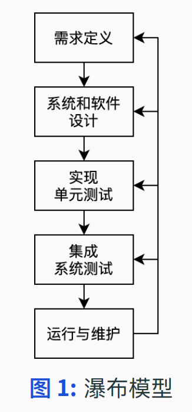
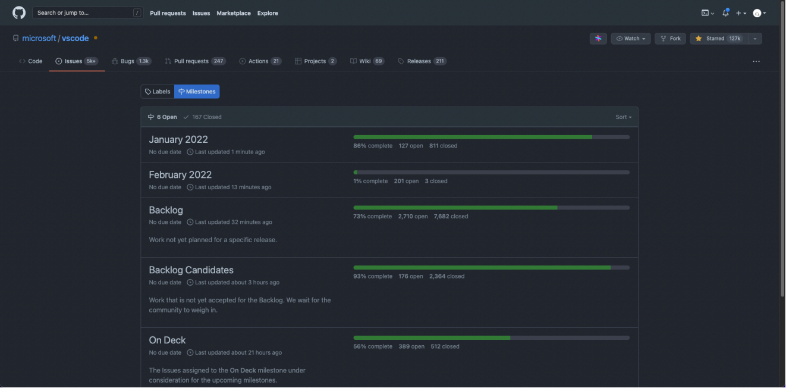
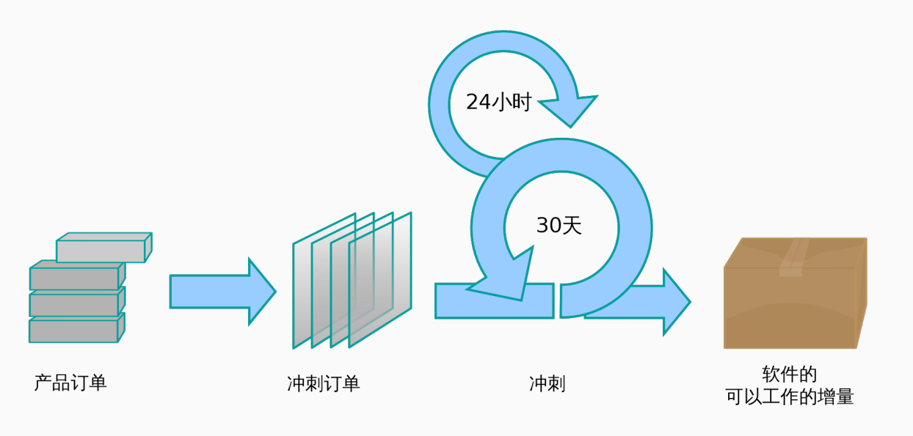
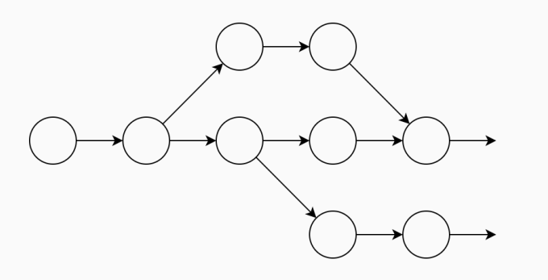
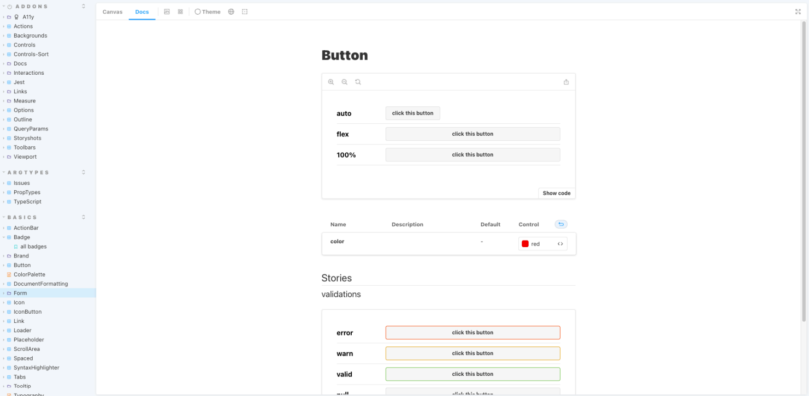
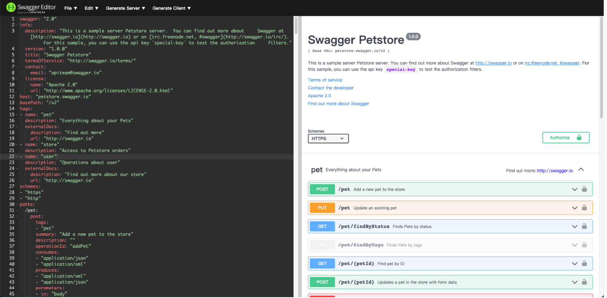
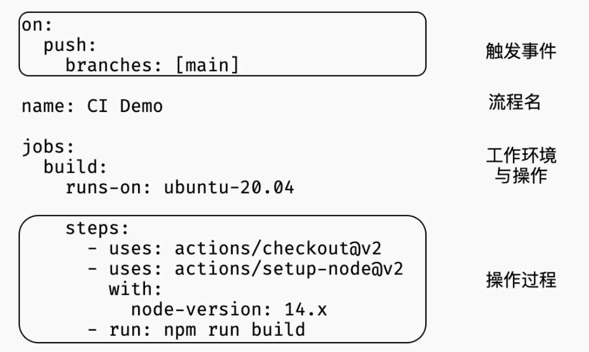
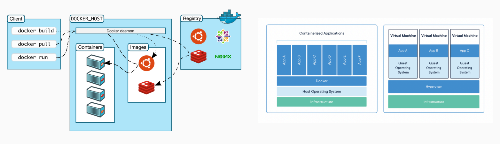

## 软件过程

对于各式各样的软件系统，不存在“银弹”——通用开发方法  
总结提炼软件开发中的关键活动，是为**软件过程**  

**软件过程**：完成软件产品生产的一组相互关联的活动  

### 如何开发

基本流程：  

1. 讨论需求
2. 敲代码
3. 测试
4. debug
5. 重复 1-4

下图为瀑布模型：  

可能遇到的问题：  

+ 临时大规模设计变更
+ 意料之外的缺陷
+ 遗漏的未解决 bug
+ 时间安排混乱

### 计划

在整个过程之前、之中，计划都是至关重要的，而好的计划需要精确的估计。  

**例**  

+ 独立开发一个网页五子棋游戏
+ 三人开发一个手机棋类游戏

假设朝九晚五，需要工作几天呢？

### Milestone 里程碑

为了更好评估任务的用时，Milestone 在大型软件开发中广泛应用

**Milestone**：明确的子任务完成节点

+ 方便管理，已知悉哪些工作已经完成，哪些仍需努力
+ 整理经验教训，协助开发

## 敏捷开发

敏捷开发是应对快速变化的需求诞生的开发方法论

+ 规格说明、设计和实现过程交织在一起
+ 系统按照一系列增量进行开发
+ 使用广泛的工具来支持开发过程

### Scrum

Scrum 是一种典型的敏捷开发框架。

+ 小型团队
+ 迭代、增量开发 (15‑30 天开发周期，每日例会调整)  

## DevOps

**DevOps**：开发（Dev）+ 运营（Ops）的实践  

+ 工作流自动化
  + 编码 => 版本控制
  + 构建 => 持续集成
  + 测试 => 自动测试
  + 部署 => 持续部署
+ 快速反馈

### 版本控制

**回顾**  

分布式版本管理工具 git  
记录两次 commit 之间的“变更”   

+ 源代码是纯文本
+ 文档也可以是纯文本  

### 文档

+ 静态页面生成工具：VuePress、mdBook
+ 交互式文档工具：StoryBook、Swagger
+ 注释即文档：Doxygen、Rustdoc

   

### CI

**CI**  

CI（Continuous Integration 持续集成）  
使用自动化工具，频繁同步开发工作以减少冲突保障质量  

+ 维护协作库 => 通过下述工作保障工作流程
+ 自动化构建 => 验证是否能够构建，即是否引入无法构建的修改
+ 自动化测试 => 自动进行测试工作，并记录测试结果
+ 测试环境 => 构建与生产环境相近的测试环境，进行上述过程

**Github Actions**  

Github Actions 是 Github 提供的 CI 工具，使用 YAML 语言来描述自动化流程  

  

### Docker 容器

Docker 利用 OS 级别的虚拟化，提供了“容器”的隔离环境，大幅简化了部署的复杂度  

  

## Reference

+ Sommerville 著 Software Engineering
  中文版：机械工业出版社《软件工程》
+ CMU 17‑313 Foundations of Software Engineering
+ Github Actions Documents
+ Docker Guides
