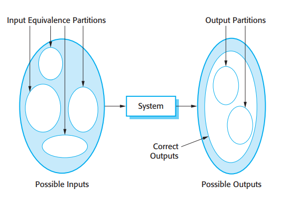
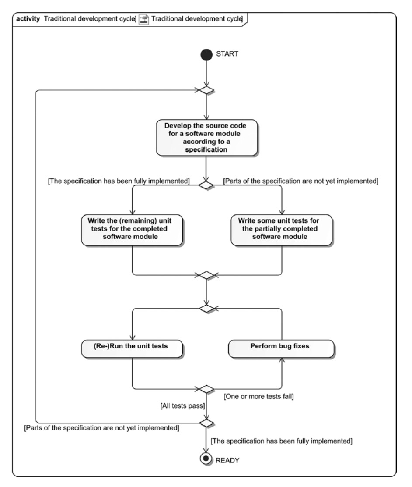
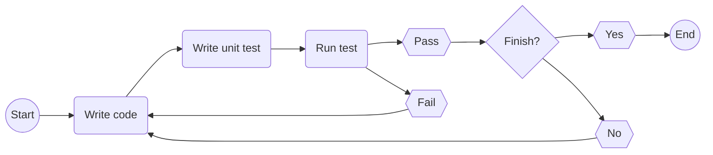
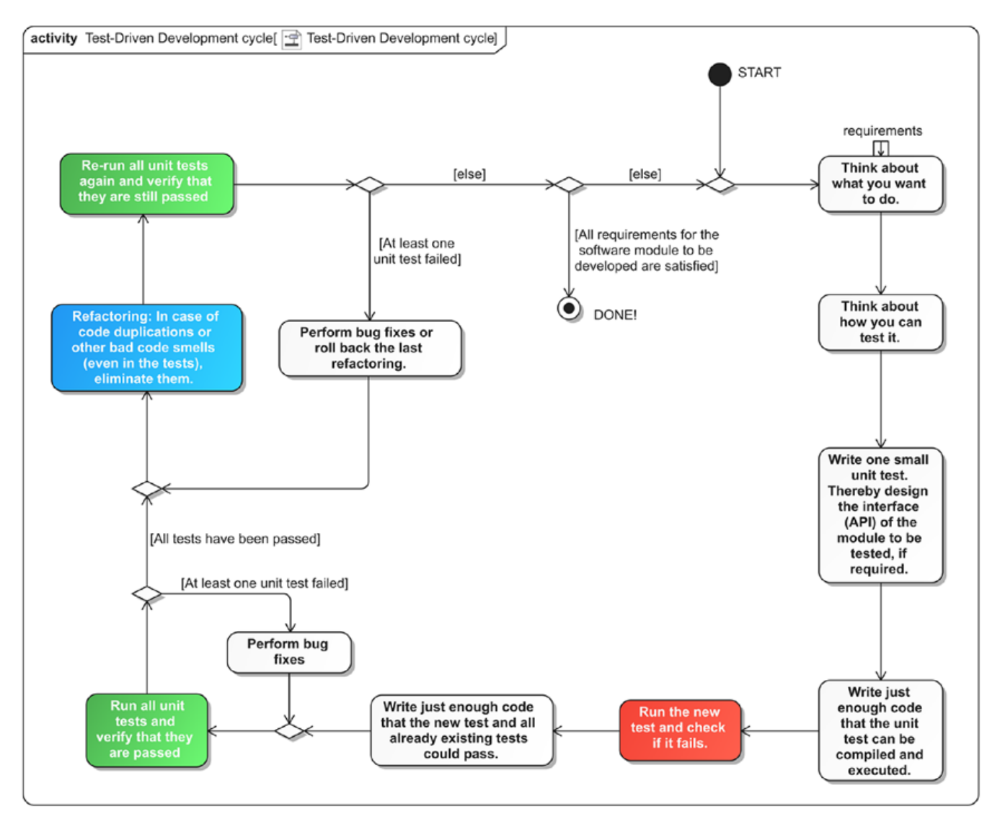
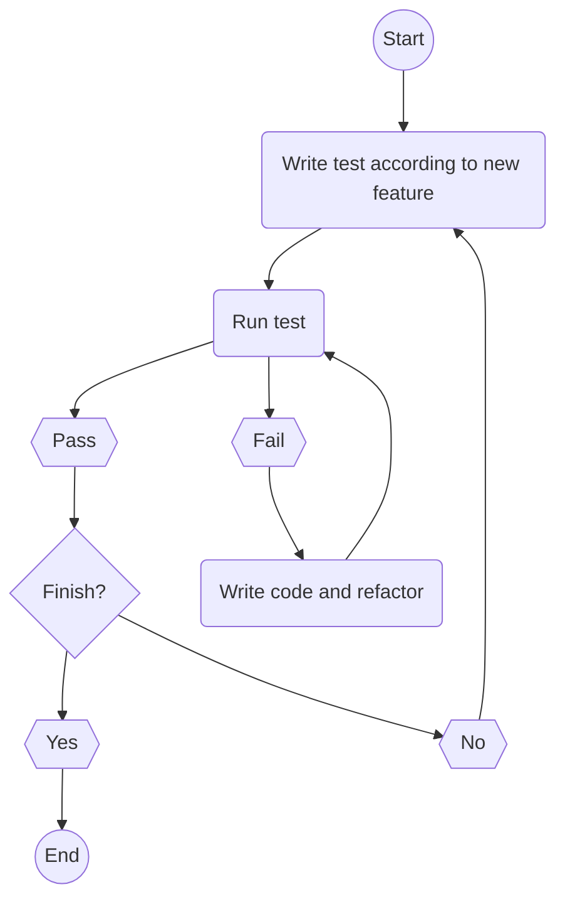

## 什么是测试

我们在进行软件的开发过程中，难免会写出各种各样的 bug。如果我们不能及时地去发现，那么这些 bug 就会存在于我们发布的软件之中，进而造成用户的不便与不满。而对我们编写的代码进行测试的目的之一便是及时地检查出我们代码中存在的缺陷。一般来说，测试可以有以下情形：

1. 测试我们的软件是否满足的用户提出的需求。这种情况下，我们应当对需求文档中的每一个需求都要编写测试样例进行测试，观察在合法输入下我们的软件是否能给出期望的输出。
2. 测试我们的软件是否存在缺陷，以找出可能导致软件行为异常甚至崩溃的输入序列，从而避免这种情况的发生。

第一种情形中，我们通常是选用合法的输入，以检查软件是否能给出正确的输出；而第二种情形中，我们相比之下要更侧重一些非法输入造成的后果。不过这两种情形也没有明确的界限，第一种情形下我们也可能会发现软件的缺陷，第二种情形下我们也可能发现软件没有满足预期的需求。

需要注意的是，测试一般只能检验出程序存在缺陷，而无法证明程序没有缺陷。即使通过了测试，程序也是可能存在缺陷的。

一般来说，软件产品的测试包含三个阶段：开发测试、发布测试和用户测试。作为一名编写代码的程序员，我们主要关心的是开发测试，即在软件开发过程中进行的测试以发现 bug 和缺陷。而开发测试则一般包含三个阶段：

- 单元测试：对程序的各个单元进行测试。程序的单元可能是函数、方法、类对象，等等；
- 构件测试：对多个不同的单元、构件进行集成以创建一个复合构件，专注于不同构件的接口之间的关系； ’
- 系统测试：对整个系统的一部分或全部的构件集成并作为一个整体进行测试

我们本章将主要讲解单元测试。

## 单元测试

单元测试是一种软件测试方法，可以测试源代码的各个单元。对于一个测试对象，单元测试应当尽量做到对该对象的全部特征进行测试。

在进行单元测试时，选择恰当的测试用例非常重要。首先，测试用例应当能表现软件达到了它的预期功能；而且，测试用例还要能够尽可能地发现软件中存在的缺陷。

一种选择测试用例的策略是基于划分来选择测试用例。在所有可能的输入或输出数据当中，可能一些数据具有共同的某些特性，使得程序对这些具有共同特性的数据理应做相似的处理。即，我们可以分别把输入数据集合和输出数据集合分成几个子集，这就构成了输入数据和输出数据的“等价划分”。例如，这种划分可能是基于正负数进行划分、整数和小数进行划分，等等。如下图：

一旦我们确定了等价划分，我们便可以在每个等价划分中选择测试用例。一个经验是，选取划分边界上的用例，和靠近划分中点处的用例。因为划分的中点附近一般是一些典型的输入，出现频率较高；而划分边界一般是一些极端用例，容易被程序员所忽略。

## 测试驱动的开发（TDD）

测试驱动的开发（Test-driven development，TDD）是一种软件开发方法，将测试与代码开发交织在一起。在进入测试驱动的开发之前，我们先来看看我们传统的单元测试是如何进行的。

传统的单元测试可以用下面这张流程图来表述：

或者可以简化为下面的流程图：

可以看到，这种方式的特点是，先进行代码的编写，然后再编写测试代码，再进行测试。测试通过后，再进行新功能的编写。这种方法看起来很合理，实际上也有很多项目是遵循着这个思路进行开发的。但是这样的思路存在一定的问题：

- 大量实践表明，当程序员实现了一项功能，那么他很有可能就会对编写测试代码失去兴趣，而尽快转手实现下一个功能更符合很多程序员心理，因此单元测试经常草草了事，或被彻底遗忘；
- 程序员的代码可能并不适用于单元测试。由于多项原因，程序员可能会写出各个模块耦合性很强的代码，每个模块相互之间不独立，难以进行单元测试；
- 测试难以保证高的代码覆盖率。因为我们在编写测试代码的时候，我们很难保证我们的测试覆盖了之前编写的全部代码，很容易就会有一些隐蔽的代码没有测试到，因此这些代码如果存在缺陷则无法有效检测出来。

基于这些考量，我们就来看一看一种新的单元测试方式——测试驱动的开发。

测试驱动的开发流程图如下：

为了突出测试驱动开发的核心思想，我们先来看这个简易的流程图：

可以看到，在测试驱动的开发中，我们首先基于需求来编写测试，然后运行测试。如果测试失败，那么我们将编写我们的代码来实现需求或修复 bug，然后重新运行测试，直至测试成功。如果测试成功了，那么我们如果已经实现了全部需求，就可以交付了；如果还有需求没有实现，就回到最开始，为还没有实现的需求编写测试。

> 当然，第一次测试一定要是失败的，因为我们并没有编写任何代码来实现需求。但是这一次的运行也有它的意义——因为如果第一次测试结果是成功，那么说明我们的代码不需要任何依赖便可以成功运行，起不到测试的功能。

然后我们回到原来的流程图：

这个流程图的描述更加详细，它将代码的重构考虑了进去。在我们编写新功能通过了测试后，由于我们之前的代码可能写的不是很好，有一些重复的、结构不清晰的代码，我们便可以对代码进行重构（refactor）。重构之后，仍然运行测试，如果测试不通过还要重新进行修改，直至测试通过即可。

在测试驱动的开发中，有一些需要注意。我们在编写代码时，尽可能做到刚好使得代码能够通过测试即可，尽量不要编写额外的与通过测试无关的代码；同时，我们在编写测试的时候，也不应当编写多余的测试；另外，当且仅当我们的测试失败的时候，我们才会去编写代码，当测试没有失败的时候，我们也不应当额外添加代码。具体原因我们在之后将会看到。

那么，测试驱动的开发有什么好处呢：

- 高的代码覆盖率。在测试驱动的开发中，由于我们为了通过测试而编写代码的，所以原则上我们所有的代码都会在测试中被执行到，即我们测试的代码覆盖率接近于 100%。这也是我们上面要求不要写多余代码的原因。
- 回归测试。我们在为已有的代码添加新的功能，或进行修改，即进行增量开发时，由于代码之间可能有错综复杂的相互作用，因此可能导致我们之前已经实现的功能受到影响而不能正常工作，或者以前没有浮现的 bug 浮出水面。而在测试驱动的开发中，我们之前所编写的测试也是保留的，这有利于我们对以前的功能重新进行测试。
- 简化调试。测试驱动的开发中，一旦在测试中发现了问题，我们可能更容易定位到代码出现问题的位置。因为问题很可能出现在失败的测试所测试的代码处，或者至少与之有关。
- 系统文档化。我们所编写的测试就是我们实现的功能，因此测试本身就是对我们软件功能的描述，可以作为我们代码一种形式的”文档“，有利于其他人阅读我们的代码。

## 测试框架

一般来说，社区里有很多为我们的测试提供便利的框架。我们在进行测试的时候，依赖于这些现有的框架进行测试，会为我们的测试带来很大的便利。例如 C++ 语言的测试框架 Google Test、.NET 平台的测试框架 MSTest，等等。大家在进行开发的时候可以选择合适的测试框架为自己的代码编写测试。

## 参考文献

- Stephan Roth. (2017). _Clean C++_. New York: Springer Science+Business.
- Ian Sommerville. (2011). _Software Engineering_. Boston, Massachusetts: Pearson Education. 9th edition.
- Ian Sommerville 著. 彭鑫、赵文耘 译.《软件工程》. 北京：机械工业出版社. 2020 年 11 月第 1 版.
