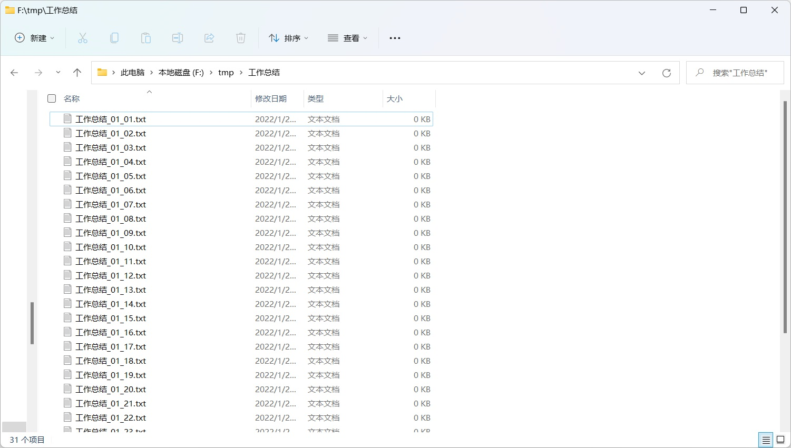
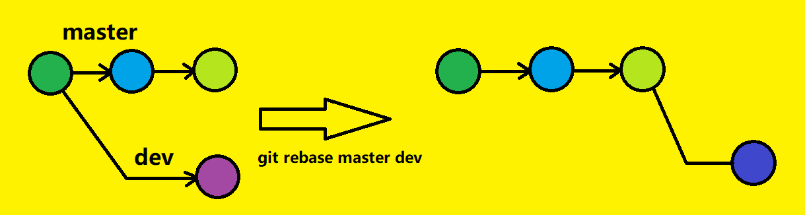
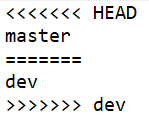
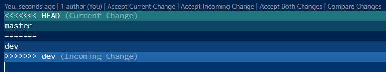
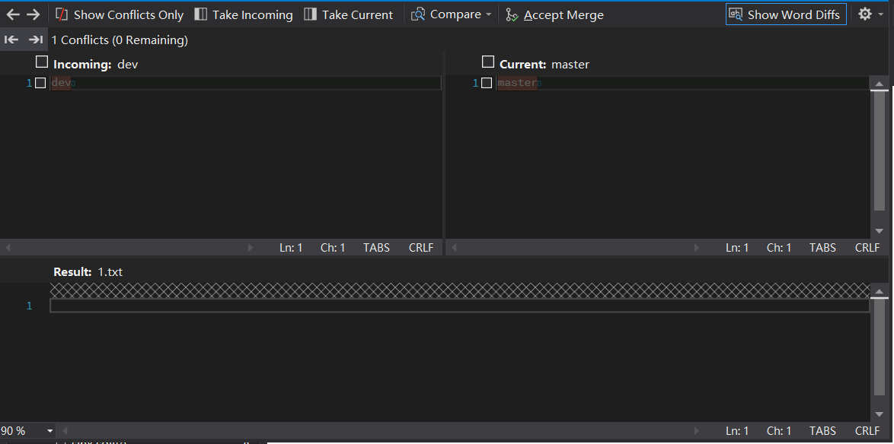
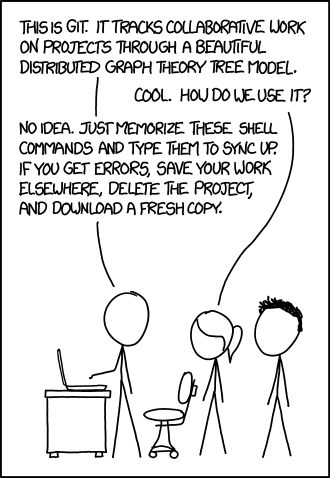

## 从重命名文件谈起

在我们正式谈及“版本管理”之前，我们想象一个这样的场景：  

1 月 1 日，我们要提交一份工作总结，我们将其命名为“工作总结.txt”。1 月 2 日，我们被要求修改工作总结。但是，当我们要修改这段文字的时候，我们要保留昨天的版本，防止我们改的更糟，还要该回去。但是为了防止命名冲突，我们不得不把之前的工作总结重命名为 “工作总结\_01\_01.txt”，而本次的工作总结命名为“工作总结\_01\_02.txt”。1 月 3 日……  

久而久之，我们的文件夹就变成了下面这个样子：  

  


这不得不让人感到汗颜。  

同样，我们在编写代码的时候也是如此。如果我们想要修改一段代码，但是又想保留之前的代码版本，以防止自己把代码改得更糟，或是意外删除了一些有用的代码，又或者我们要保留一个稳定的发布版本，那么我们就要把整个代码工程的文件夹进行类似的操作。可以看到，这样的操作带来的结果是一团乱麻！  

因此，一个具有版本管理功能的工具是必不可少的。而这样的工具我们通常称之为“版本控制（Version Control, VC）系统”。著名的版本控制系统有 Subversion、Git，等等。一个好的版本控制系统应当考虑一些问题：  

+ 每一个版本都要有一个唯一的标识  
+ 变更的历史记录：需要记录版本之间文件的变更内容  
+ 独立开发：通常，一个项目的同一个文件可能在同一时间由不同的开发者进行开发与修改，这些修改之间的相互影响问题  
+ 存储管理：版本控制系统需要使用合适的方式对存储空间进行优化。例如如果两个版本之间某个较大的文件只变更了很少的内容，那么存储两份这样的文件是不划算的  
+ ……  

## git——风靡全球的版本管理工具  

### Git 简介  

Git（读音：/ɡɪt/，参见 [维基百科](https://en.wikipedia.org/wiki/Git)），是用于跟踪文件更改的版本控制系统（VCSs），通常用于在软件开发过程中对协作开发的程序员之间进行协调工作，其目标包括速度、数据完整性、支持分布式非线性工作流（运行在不同操作系统上的数以千计的并行分支）。  

Git 的开发工作于 2005 年 4 月开始，最初目的是为了作为 Linux 内核代码的版本管理工具，现在已经成为全世界程序员必备的工具之一。  

### Git 的安装与配置

Git 可以在 [https://git-scm.com/downloads](https://git-scm.com/downloads) 里下载到相应的版本，运行安装包，按照提示即可安装。  

<!-- Windows Git 右键菜单 -->

安装完成后，首先我们需要设置我们的用户名和电子邮箱：  

```sh
$ git config --global user.name <username>
$ git config --global user.email <email>
```

### Git 的基本使用  

#### 基础操作

1. 查看帮助：`git help [command]`  

2. 初始化仓库：`git init`  

3. 添加更改到暂存区：`git add [options] <file>`   

   + 暂存区：Git 存在一个暂存区，我们如果要让 Git 保存我们的更改，我们需要先将其提交到暂存区，当我们真正完成了一个阶段性的任务，需要记录一个版本的时候，再将其提交到仓库  
   + 一个很常用的命令是 `git add .`——添加当前目录下所有的更改到暂存区  

4. 提交：`git commit -m"<message>"`

   将当前暂存区的内容全部提交到 Git 仓库中，并且创建一次“提交”（即记录了一次版本），通过 `git log` 可以查看历史提交以及他们的 ID，其中当前所处的提交用 `HEAD` 标识    

   `<message>` 用于对本次提交进行描述  

   更改提交信息：`git commit --amend -m"<message>"`  

5. 查看提交历史：`git log`  

   如果提交历史过长，可以按 `q` 键退出  

6. 删除一个文件：`git rm <file>`  

   该删除只是在暂存区中删除，并没有形成新的提交  

7. 查看当前仓库状态（为保存的更改、暂存区的改动，等等）：`git status`  

8. 比较文件差异：`git diff`  

   + `git diff <filename>`：比较当前目录中文件与暂存区中文件的差异（若不指定文件名则显示所有有差异的文件的差异）  
   + `git diff <commit> <filename>`：比较当前目录中文件与某个历史提交的差异  
   + `git diff <commit> <commit> <filename>`：比较两个历史提交中某文件的差异  

#### 撤销操作

1. `git commit --amend`（已经在前文中提及）  
2. `git reset`  
   + `git reset <commit>`：将 Git 仓库的 `HEAD` 回退到某版本，清空暂存区，但是不修改目录中的文件  
   + `git reset <commit> <filename>`：将暂存区中内容回退到某版本，但不修改 Git 仓库的 `HEAD` 和目录中的文件  
   + `git commit <commit> --hard`：除了会将 Git 仓库回退到某版本，还会把目录内的所有文件都改为该版本的内容  

### Git 分支

#### 分支简介

可以看到，我们以上介绍的 Git 的使用会产生线性的提交历史：  


显然，随着我们的开发工作，Git 的提交历史在一条线上排成一条线逐渐推进，即，我们的工作流程是线性的。  

但是，很多时候，线性的工作流并不能满足我们的需求。  

先抛开写代码的工作不谈，我们在很多工作中都未必是线性的工作流程。例如，我们在准备一次晚餐，“煮饭”和“炒菜”并不是线性的工作。我们完全可以在等待电饭锅煮饭的过程中去炒菜，因此“煮饭”和“炒菜”并不能安排到一根线上。但是对于单独的“炒菜”而言，它的一系列操作：洗菜、放油、放菜、翻炒……等等操作却是线性的。这意味着，我们需要两条线来记录煮饭和炒菜两个工作。但是，在最后享用晚餐的时候，我们需要把饭和菜都端上桌子，然后一起食用，因此我们便需要把这两条线路合并到一条“晚餐”线路上。  

我们编写软件的时候也是类似。我们设计一款软件的时候，通常要编写很多不同的功能，或是存在很多不同的分工，它们之间便未必是一个线性的关系。例如，设计一款对战游戏的过程中，需要设计宠物、武器、地图场景，等等等等。  

Git 便提供了这样一个的功能——分支。在每条分支上，我们都可以像之前那样线性地作业，也可以将一些分支的工作汇总到另一条分支上。  

#### Git 分支简述

Git 的每条分支是存在名称的。我们在创建仓库的时候，不进行分支的创建便进行了提交，则默认的分支名称为 `master`（不过由于一些争议，在后面我们会看到，GitHub 网站上的仓库默认分支名已经改成了 `main`）。也就是说，我们之前的操作都是在 `master` 分支上进行的。  

Git 分支名也是一个类似于目录一样的树结构，可以用 `/` 进行分隔。例如，`vegetable`、`animal/dog`、`animal/cat`  ，都是不同的分支。但是注意，不允许一个分支名是另一个分支名的前缀，例如 `animal` 和 `animal/dog` 是不能同时存在的。  

#### 与分支有关的操作 

1. 创建与切换分支  

   + `git branch <name>`：创建一个新的分支，并命名为 `<name>`  
   + `git checkout <name>`：切换到名称为 `<name>` 的分支  
   + `git checkout -b <name>`：创建分支 `<name>` 并切换到该分支。相当于 `git branch <name> && git checkout <name>`  

2. 查看分支：`git branch`  

   会显示当前存在的所有分支

3.  合并分支：`git merge` 

   + `git merge <branch>`：将分支 `<branch>` 的提交合并到本分支  
   
4. 变基：

   + `git rebase <branch>`：让当前分支以 `<branch>` 为基进行变基  

   当进行 `git merge` 时，如果目标分支进行了其他的更改，那么此操作将会创建一个新的 commit 用于记录本次 merge。但有时我们不希望看到这个多余的 commit 信息，这时候，我们需要使用 `git rebase` 进行变基：  

   

   

   上图中，我们在 `dev` 分支执行 `git rebase master`。可以看到，`git rebase` 会更改 `dev` 的提交历史，从而在 `master` 分支上执行 `git merge dev` 时，不会再在 `master` 上产生一个新的 commit。   

   + 优点：可以减少无意义的 `merge` 提交，使提交历史更加清晰；  
   + 缺点：变基操作会更改提交历史，并且会打乱时间线~~；还可能会发生一些玄学的冲突~~  

   具体在 merge 前是否需要 rebase，还是要视实际情况而定。  

#### 冲突

在进行多个分支的开发过程中，如果不同分支对同一处有不同的修改，使得 Git 无法决定该如何合并，即不知道应当使用哪种修改方式，那么在 merge 的时候就可能会发生冲突。下图便是一处冲突的情形：  



我们创建 `master` 和 `dev` 两个分支，在一个文件相同位置进行修改：`master` 分支在该处添加一行“master”，而 `dev` 分支在该处添加一行“dev”，并将 `dev` 分支的修改合并到 `master` 分支上，便会出现上述冲突——因为 git 无法确定应该使用哪种修改。  

从图中，可以看到，两个分支的不同更改被 `=======` 所分隔，我们可以根据自己的意愿修改该处内容，然后再把修改之后的内容进行一次新的 commit，便“解决了冲突”。  

> 很多工具内置了图形化的 Git 工具，可以清晰看出冲突的情况。例如 Visual Studio Code 和 Visual Studio 分别提供不同的图形界面，可以让冲突更一目了然：  
>
> 
>
> 
>
> 

### gitignore

我们经常遇到这样的事情：有一些文件，或者一些更改，我们是不想进行提交的。

例如，我们在写一个 C 语言的程序，我们一般情况下并不需要提交它编译之后的文件。首先，编译之后的二进制文件体积较大，会增大我们的 Git 仓库；第二，我们仅通过源代码和指定的编译环境，便可以将该二进制文件进行复现，因此该文件是没有必要提交到 Git 仓库中的；第三，我们在看提交历史的时候，也会看到这个文件的更改信息，但程序员直接更改的是源代码文件，而这个二进制文件并不是程序员直接更改的文件，并不能代表更改历史。我们大部分情况下只需要提交能够复现此项目所需的最少文件即可。  

再比如，一些编辑器会在目录中创建一些文件来记录编辑器的配置，而这可能只是程序员的个人偏好设置，或是面向该电脑本身的一种配置（例如该电脑安装的第三方库的路径），这些也是没必要提交到 Git 仓库的。  

也鉴于此，我们不能直接愉快地使用 `git add .` 来添加当前目录下的所有更改了，而且，我们还很有可能因为误操作而将不想提交的文件也提交了上去。但 gitignore 便解决了这一问题。  

Gitignore 的作用是设置文件的忽略规则，让 Git 根据该规则有选择地忽略文件的更改。使用 gitignore 的方式便是在目录中创建名为 `.gitignore` 的文本文件，在该文本文件里编写忽略规则。最简单的规则便是在该文件里写上某个文件的文件名，那么 Git 就会忽略该具有该文件名的文件：  

```gitignore
main.out
```

那么，`.gitignore`  文件所在的目录，及其所有子目录下的 `main.out` 文件的更改均会被忽略。  

如果要指定某一个文件被忽略，则需要指定它所在的路径，例如：  

```gitignore
./main.out
./bin/main.out
```

即忽略当前目录下的 `main.out` 文件和当前目录的 `bin` 子目录下的 `main.out` 文件。  

有时，我们还想忽略一个文件夹内的所有文件，方法是类似的（gitignore 使用 `#` 作为行注释）：  

```shell
# 忽略当前目录及所有子目录下的 build 文件夹内的所有文件
build/

# 忽略当前目录下的 bin 文件夹内的所有文件
./bin/

# 一个例外——虽然 build 文件夹已经被忽略，但是 build 文件夹内的 publish.sh 文件并不忽略
!build/publish.sh
```

除此之外，还有很多其他的语法，例如使用 `*` 表示通配符（e.g. `*.bin` 忽略所有后缀名为 .bin 的文件），等等，在此不一一赘述。  

当然，很多编辑器、集成开发环境，都具有很多的配置文件、缓存文件、代码生成中间文件，等等，这些都是我们不需要进行提交的。而对于一款工具来说，每个项目需要忽略的文件都是相同的，如果我们写项目还要花心思钻研我们使用的工具生成的文件中哪些需要忽略而那些不需要忽略，那么就太麻烦了！我们很自然地想到，很多工具都会有它自己的 gitignore 模板，这样我们就可以直接使用模板了！  

下面这个网址是一个非常可靠的 gitignore 模板集合，我们可以把它们给我们自己的项目使用：  

[https://github.com/github/gitignore](https://github.com/github/gitignore)

例如，[Visual Studio 和 Visual Studio Code](https://github.com/github/gitignore/blob/main/VisualStudio.gitignore)、[CMake](https://github.com/github/gitignore/blob/main/CMake.gitignore)、[Unity](https://github.com/github/gitignore/blob/main/Unity.gitignore)、[UE](https://github.com/github/gitignore/blob/main/UnrealEngine.gitignore)、[Qt](https://github.com/github/gitignore/blob/main/Qt.gitignore)、[JetBrains](https://github.com/github/gitignore/blob/main/Global/JetBrains.gitignore) 等的模板均在里面可以找到。  

### gitattributes

Gitattributes 用于设置文件的属性。和 gitignore 类似，gitattributes 是在目录内创建 `.gitattributes` 文本文件，用于设置文件的属性，一般用于设置行尾转换、字符编码等等一系列属性。正常情况下，Git 默认的设置都能够使我们达到要求，也能够自动识别文件，不需要单独使用 gitattributes 进行指定。但是一些特殊情况下还是有必要的。在这里，我们仅对 gitattributes 做一个简短的介绍，想要深入了解的读者可以自行查阅相关资料进行学习，读者也可以跳过本部分。  

> 举一个比较常见的例子。Windows 下文本文件的行尾是 CRLF（即一个字节 13 加上一个字节 10），而 Linux 下文本文件的行尾是 LF。如果无论什么系统均是逐个字节提交到 Git 仓库，则该 Git 仓库很难达到跨操作系统的目的。因此，默认情况下，Windows 平台上的 Git 会进行行尾转换，把文本文件的 CRLF 转换为 LF 提交到 Git 仓库，而把 Git 仓库调入到当前目录时则把 LF 转换回 CRLF；而 Linux 平台下则不进行行尾转换。这样以保证 Git 仓库内的文本文件文件均为 LF 行尾。但是存在一种情况，我们在一些意外情况下使得 Linux 系统上也出现了 CRLF 结尾的文件（例如 Linux 远程共享了 Windows 系统的文件夹），这样由于 Linux 系统的 Git 不进行行尾转换，便使得 Git 仓库中出现了 CRLF 行尾的文件，污染了 Git 仓库。这可以通过 `git config`，让 Linux 系统上的 Git 开启行尾转换而解决。但是，我们在多人合作开发的时候，很难要求所有人都进行设置。因此，使用 gitattributes 便可以让所有人的 Git 忽略自己的默认设置，而使用 `.gitattributes` 则可以让 Git 自动识别文本文件并进行行尾转换。
>
> Gitattributes 一般的语法为：`<filename> <attributes>`。要达到上述目的，只需要在 `.gitattributes` 中写一行：  
>
> ```shell
> * text=auto
> ```
>
> 其中，`*` 代表所有文件，`text=auto` 是让 Git 自动判断文件是二进制文件还是文本文件并进行行尾转换。  


### 小结

到这里，相信你已经掌握了 Git 工具的基本使用。当然，在使用 Git 的过程中难免会遇到各种各样的问题、各种各样的~~玄学~~冲突。每当遇到这种情况，我们的解决方案正如下面这张著名的图：  




## 基于 Git 的代码托管平台——GitHub

### 远程仓库  

很多时候，我们的开发工作并不是一个人，而是很多人在一起协同开发；或者，我们将代码在网上公布，让社区大众一起来维护我们的代码。这个时候，我们便需要一个云端的平台，来帮助我们达到这一目的。Git 作为一个流行的版本管理工具，很多云平台都是基于 Git 来管理代码的。例如：  

+ GitHub（[https://github.com/](https://github.com/)）：世界公认的代码托管平台，也是我们本章的主角  
+ GitLab（[https://about.gitlab.com/](https://about.gitlab.com/)）：GitHub 有力的竞争对手  
+ Gitee（码云，[https://gitee.com/](https://gitee.com/)）：中国大陆流行的代码托管平台  
+ 清华 GitLab（[https://git.tsinghua.edu.cn/](https://git.tsinghua.edu.cn/)）：清华大学的代码托管平台，基于 GitLab 打造  

下面，我们以 GitHub 为例进行介绍，其他的平台是类似的。  

### GitHub 初探

由于此部分依赖于网页操作，难以使用文字记述，因此此处仅列出大致内容，建议自己动手操作。  

+ 拉取远程仓库：`git clone <url>`（`url` 可为 HTTPS，也可为 SSH）  

+ 如果 `url` 使用 HTTPS 链接，则可能由于一些特殊的原因出现无法联网的情况。此时需要进行下面的设置（其中 `port` 是主机的网络的代理端口）：  

  + git config --global http.proxy http://127.0.0.1:\<port\>  
  + git config --global https.proxy https://127.0.0.1:\<port\>

+ 如果 `url` 使用 SSH 链接，则需要配置 ssh：

  ```shell
  $ ssh-keygen -t rsa -C <email>  
  ```

  然后将用户文件夹（Linux 为 `~` 文件夹，Windows 为 %USERPROFILE% 文件夹）内的 `ssh` 文件夹下的公钥（`id_rsa.pub`）上传到 GitHub 的“个人设置->SSH keys”中  

### Git 远程操作  

+ `git push <url>`：将本地 Git 仓库提交到远程 Git 仓库  

+ `git remote add <name> <url>`：将一个远程仓库链接储存为某个名字，便于直接使用该名字指代该远程仓库  
+ `clone` 的链接来源不需要手动 add，默认已经储存为 `origin`，即很多情况下，我们使用 `git push origin` 即可  
  
+ `git remote`：查看目前所储存的所有远程仓库链接  
  + `git remote get-url <name>`：查看 `<name>` 所代表的链接  
  + `git remote set-url <name>`：重新设置 `<name>` 所代表的链接  
  + `git remote remove <name>`：删除该链接  
  
+ `git pull <url> <branch> `：拉取远程仓库 `url` 的 `<branch>` 分支的更改，并 merge 到当前分支上。若不指定 `<branch>`，则为远程仓库的默认分支  

### 使用 GitHub 进行协作开发  

GitHub 既是一个版本管理平台，也是一个多人协作开发平台。在使用 GitHub 时，通常会有如下的操作：  

+ fork：在参与一项多人项目的开发时，我们通常要把该仓库复制一份到我们自己的 GitHub 账号的仓库中。我们的 `git clone` 通常也是从我们自己的远程仓库中 clone，并且所做的任何修改优先 push 到我们自己的仓库内。将该仓库复制到我们自己的账号下的过程即为“fork”  
+ clone：使用 `git clone` 将我们自己的仓库下载到本地  
+ 将公共的仓库中最新的更改拉取到本地（`git pull <url> <branch>` ）  
  + 习惯上我们把该仓库的链接命名为 `upstream`。在命名后，便可以使用 `git pull upstream`。如果我们是从默认分支 `pull` 的则可以省略分支名  
+ 将自己本地的更改提交到自己的远程仓库（`git push origin`）  
+ pull request：当自己的 GitHub 仓库已经更改了一个阶段性成果之后，可以从自己的分支向原来的仓库的某个分支提出一个“Pull Request（PR）”，即向该仓库发起一个请求，请求将自己的更改合并到该仓库  

## 各有优劣的工作流

现在我们先暂时忘记 GitHub，来探讨一个新的问题。  

工作流（workflow），即工作的流程。在使用 Git 的过程中，我们的开发流程在 Git 的分支策略中可以得到体现。常见的 Git 工作流程有 Git Flow、GitHub Flow、GitLab Flow。  

### Git Flow

Git Flow 是一种比较早的工作流。它设计了以下的分支模型：  

+ master：作为主干分支，master 分支记录正式版本发布的历史，只能由其他分支合并而来，其最新的提交总是当前最新的正式发布的版本；  
+ develop：作为开发分支，develop 记录合并而来的最新的开发成果；  
+ feature：特性分支通常由 develop 分支而来。特性分支不仅仅有一个分支，通常每个新特性均开辟一个新的分支，开发人员在 feature 分支上进行开发，开发完成后向 develop 分支合并；  
+ release：当 develop 分支开发到可以发布新的版本时，新的 release 分支便可以由 develop 分支而来，然后便在 release 分支进行测试。当测试无误后，便可将 release 分支合并到 master 和 develop 分支中，master 分支便可以发布新的版本。  
+ hotfix：当 master 分支发现 bug 等问题后，新建这个临时的修复分支，修复完毕后合并到 master 分支和 develop 分支  

可以看到，Git Flow 对分支具有明确清晰的分工，但是也由于分支过多而造成代码冲突增多、操作繁琐等一系列问题。而且，现在 CI/CD 技术已经普及的情况下，CI/CD 技术在很大程度上代替了 release 和 hotfix 分支的作用  

### GitHub Flow

GitHub Flow 的分支相比之下非常简单。它包含一个 master 分支，由特定的管理员进行维护，其他人并没有权限对其进行操作。每当有新特性要加入，或有新 bug 要修复时，便基于 master 分支创建新的分支。在该分支上开发完成后，便可以向 master 分支提出 Pull Request，通知管理员进行代码 review，管理员通过后就将代码合并入 master 分支。开发完毕后，特性分支或 bug 修复分支便可以删除。  

显而易见，GitHub Flow 的分支策略非常简单，只有一条 master 分支用于发布。但是这也带来一些问题，例如 GitHub Flow 中，每次开发完新特性并合并入 master 中时，master 分支的代码是立即发布的，但是这有时并不能满足要求。  

### GitLab Flow

GitLab Flow 是 GitLab 中推荐的做法（在 GitLab 中，GitHub 中的“Pull Request”被叫做“Merge Request”）。  

GitLab Flow 考虑软件发布的两种情形：持续发布和版本发布。持续发布适用于类似 Web 网页等，当用于发布的分支更新时，随时将新代码进行发布；而版本发布则适用于一些有发布计划的程序进行发布，例如某软件的 1.0 版本、2.0 版本，等等。  

1. 对于持续发布，固定的分支有三个：master、pre-production 和 production 分支。我们在进行新功能的添加或 bug 修复等工作时，要基于 master 分支创建新的 feature 分支或 fix 分支作为开发工作的临时分支。当开发完毕后，将该分支向 master 提出 Merge Request（此时 GitLab CI 会自动对代码进行测试），然后管理员便可以将代码合并到 master 分支。然后临时分支便可以删除。  

   GitLab Flow 规定只能从“上游”向“下游”进行 merge。其中，master 分支是 pre-production 分支的上游，pre-production 是 production 分支的上游。上游需要向下游提出 merge request，然后 GitLab CI 可能会对代码进行测试，测试通过后管理员便可以把上游分支的更改合并到下游分支。即合并流程为 master -> pre-production -> production，最终 production 分支进行持续发布。  

2. 对于版本发布，仍然存在 master 分支用于开发。但每次需要发布新版本时，便从 master 分支创建一个新的 stable 分支用于发布新的版本。Stable 分支一旦创建，每次更改 stable 分支便修改一次小版本号  


以上便是三种不同的工作流。在实际的开发过程中，使用什么样的工作流还是需要视具体情况而定。  


## 开源开发

### 什么是开源

开源，即开放源代码（Open Source）。开源开发是一种软件开发方法，将源代码公之于众。社区人员可以自愿为开源的项目贡献自己的代码，同时用户也可以修改源代码而按照自己的意愿进行定制。  

但是，虽然源代码已经公之于众，但并不等于任何人都能随便使用该产品，也并不意味着代码所有者已经放弃了产品的所有权。代码所有者有权对产品的使用范围和使用方式进行限制，而限制的方式便是在代码中添加**开源许可证**，或称作**开源协议**。  ‘

### 开源许可证

添加开源协议的方式，一般是在代码的根目录添加文件 `LICENSE` 或 `LICENSE.TXT`，里面写上协议的内容；也有的项目还要把协议粘贴在所有的源代码文件顶部（也可能只粘贴了所有权声明等内容）。对于一个项目来说，选择一款合适的开源协议也是重要的。常用的开源协议很多，例如 GPL、BSD、MIT、LGPL、Apache，等等。不同的开源协议也对代码的使用方式提出了不同的要求。例如，GPL 协议要求，如果某产品引用了 GPL 协议开源的产品，那么它必须也要使用 GPL 协议进行开源，也不允许闭源；MIT 协议要求，若产品引用了 MIT 协议开源的产品，则该产品需要包含该协议的许可声明和复制权声明。对于常用的协议，可以用下面的图来概括：  


除了上述开源协议外，还有一个虽然不是很常用但是也值得一提的便是 CC0 协议。使用 CC0 协议便意味着自己放弃了该产品和代码的任何权益，任何人都可以任意使用其产品和源代码。之前所提到的 gitignore 模板合集便是使用的 CC0 协议，因此我们可以放心大胆地使用里面的 gitignore 模板。  

常用的开源协议内容均可以在 [https://opensource.org/licenses](https://opensource.org/licenses) 中找到。  

## 发布版本管理  

### 无处不见的版本号  

我们在日常使用软件的时候，通常在“关于”中看到各种各样的“版本号”。例如，在本篇教程编写时，安卓手机 QQ 的版本 8.8.68.7265、Chrome 浏览器~~（也是版本号通货膨胀的元凶）~~的版本 96.0.4664.45，等等。不难发现，版本号大都是以 `.` 作为分隔，前面的版本号相对于后面的版本号是大版本号，而大版本号的更改通常意味着更大的更新，小版本号的更改通常是一些修补的小更新。 

软件的发布版本一般包含可执行的代码、配置文件、数据文件、安装程序、产品文档（用于对产品进行说明）、包装和相关的宣传工作，等等。当需求发生新的变化、增加新的特性、需要适配新版本的操作系统、软件出现了 bug 时，都要发布新的版本。同样，我们在版本控制系统中，自然地也需要记录每一个发布的版本。在之前关于工作流的介绍中，我们便看到在不同的工作流中是在何处记录发布的版本的。  

### 在 GitHub 中发布产品  

GitHub 为每个仓库提供了 release 功能（位于仓库页面的右侧），用于发布产品。每一次新版本的发布，都需要创建一个 release，并新建一个 tag（通常以版本号作为 tag 的名称），然后选择一个分支，将本次发布绑定到该分支的当前最新的这次提交上。我们可以把我们的产品上传到该 release 上，那么产品就将和我们所绑定这次提交一起发布。  

## 小结

在本节课程中，我们学习了版本管理系统的相关知识，掌握了 Git 和 GitHub 的基本用法。但是由于课时限制，很多有用的知识没有提及，例如：  

+ Git 更高级的用法，例如合并提交、submodule、定制 Git、Conventional commits……  
+ GitHub 仓库的权限管理、Issue、Project、tag、review、……  
+ ……

略去上述内容不会对我们后续内容的学习产生太大影响，感兴趣的读者可以自行了解更多相关内容。  

## 参考文献

+ [https://en.wikipedia.org/wiki/Git](https://en.wikipedia.org/wiki/Git)，2022 年 1 月 24 日  
+ [https://zh.wikipedia.org/wiki/Git)](https://zh.wikipedia.org/wiki/Git)，2022 年 1 月 24 日  
+ [https://missing.csail.mit.edu/2020/version-control/](https://missing.csail.mit.edu/2020/version-control/)，2022 年 1 月 24 日  
+ 《软件工程》，Ian Sommerville 著，彭鑫、赵文耘 译，机械工业出版社，北京，2020 年 11 月 第 1 版  
+ [https://docs.eesast.com/docs/tools/git](https://docs.eesast.com/docs/tools/git)，2022 年 1 月 25 日  
+ [https://en.wikipedia.org/wiki/GitHub](https://en.wikipedia.org/wiki/GitHub)，2022 年 1 月 25 日  
+ [https://docs.gitlab.com/ee/topics/gitlab_flow.html](https://docs.gitlab.com/ee/topics/gitlab_flow.html)，2022 年 1 月 26 日  
+ [https://bbs.huaweicloud.com/blogs/281789](https://bbs.huaweicloud.com/blogs/281789)，2022 年 1 月 26 日  
+ [https://weihongyu.com/基于gitlab的工作流程设计/](https://weihongyu.com/基于gitlab的工作流程设计/)，2022 年 1 月 26 日  
+ 《复变函数与数理方程》课件，吴昊  

