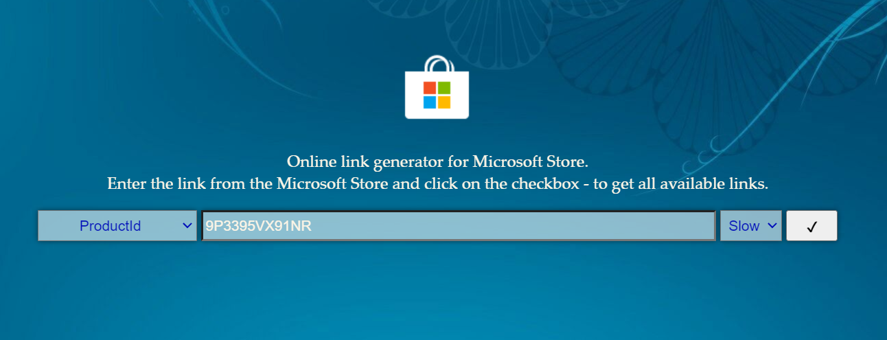

## WSA 的安装

### 操作系统要求

安装适用于 Android™️ 的 Windows 子系统至少需要 Windows 11 操作系统。为了保证您的良好安装体验和使用体验，建议您在“设置→时间和语言→语言和区域”中将您的地区设置为**美国**，以免遇到类似于“您所在的区域不支持”的现象。

### 启用 Windows 功能

参见 [WSL](./wsl) 中“安装 WSL 2”的“第二步：检查 BIOS 是否开启了虚拟化”和“第四步：启动虚拟机平台功能”。

### 下载安装包

首先，进入网址：[https://store.rg-adguard.net/](https://store.rg-adguard.net/)，在搜索框中输入 `9P3395VX91NR`，左侧选择“ProductId”，右侧选择“Slow”，如下图所示：



点击搜索，出现类似如下图所示的搜索结果：


在搜索结果中，我们现在关注最下方的超过 1G 大小的且以 `.msixbundle` 结尾的文件（其他的文件我们在随后还可能会用到，所以暂时不要关闭此页面）。如果直接点击该文件名无法启动下载，那么右击该文件名选择复制链接，在地址栏输入并跳转，即可开始下载。如果此处出现安全问题而导致浏览器拒绝访问，则可以打开无痕窗口（In Private 窗口）进行访问。

### 安装软件包

假设下载的文件名为 `blablabla.msixbundle`。使用管理员 / Administrator 权限或 Administrator 用户打开 Windows Powershell，输入：

```powershell
> Add-AppxPackage -Path blablabla.msixbundle
```

然后回车即可开始安装。

安装过程中可能会出现缺少依赖的报错信息，例如：

> Add-AppxPackage : 部署失败，原因是 HRESULT: 0x80073CF3, 包无法进行更新、相关性或冲突验证。Windows 无法安装程序包因为此程序包依赖于找不到的框架。提供由框架"Microsoft.UI.Xaml.2.6"

这时，我们在之前的搜索页面中寻找适合自己 CPU 架构的相应的软件包，下载以 `.appx` 结尾的相应文件，并安装即可。然后重新运行 `Add-AppxPackage` 命令安装 WSA。

## 参考文献

+ [https://pureinfotech.com/install-windows-subsystem-android-wsa-windows-11/](https://pureinfotech.com/install-windows-subsystem-android-wsa-windows-11/)
