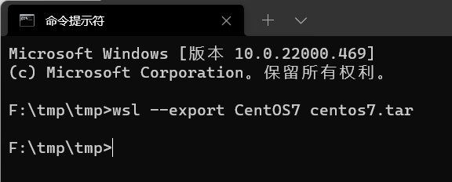

## WSL 简介

WSL（Windows Subsyetem for Linux，适用于 Linux 的 Windows 子系统），是 Microsoft 公司于 2016 年在 Windows 10 平台发布的一项功能，其使得用户可以在 Windows 操作系统上运行 ELF 格式的 Linux 可执行文件。

WSL 目前已发布两代产品：WSL 1 和 WSL 2。WSL 1 实现了 Linux 兼容层，将 Linux 系统调用转换为 Windows NT 系统调用；而 WSL 2 则利用 Windows 的 Hyper-V 功能，通过虚拟化技术直接运行 Linux 虚拟机，更接近原生 Linux 操作系统体验。

## 微软官方文档安装教程

本教程部分参考了安装 WSL 2 的微软官方教程链接：

+ 英文版：<https://learn.microsoft.com/en-us/windows/wsl/install>
+ 中文版：<https://learn.microsoft.com/zh-cn/windows/wsl/install>

按照官方教程的步骤安装可能发生一系列问题，因此建议读者参考下面的图文教程进行安装。

**注意**：WSL 2 并不是 WSL 1 的升级版本，因此安装 WSL 2 不需要先安装 WSL 1！

## 安装 WSL 1

### 第一步：检查 Windows 版本

WSL 需要 **Windows 10 1709 专业版** 或者 **Windows 10 1803 及以上的家庭版**，WSL 2 需要 **Windows 10 1903** （内部版本 18362）或更高版本（x64）。如果版本较低，请更新 Windows 10 系统。本教程采用 Windows 10 21H1 家庭版（内部版本 19043.1083）和 Windows 11 21H2 家庭版（内部版本 22000.856）。

查看方法：按键 `Win+Q`（`Win` 即 Windows 徽标键），搜索“设置”：

 

点击“系统”，找到“关于”，即可查看 Windows 版本：


### 第二步：启动 WSL 功能

+ 方法一：使用命令开启：在开始菜单中搜索 `powershell`、`Windows Powershell` 或 `pwsh`（`pwsh` 需要手动安装），点击“以管理员身份运行”或“Run As Administrator”，输入命令：

  ```powershell
  > dism.exe /online /enable-feature /featurename:Microsoft-Windows-Subsystem-Linux /all /norestart
  ```

  然后**重启计算机**即可。

+ 方法二：按 `Win+Q`，搜索“启用或关闭 Windows 功能”：

  

  在里面勾选“适用于 Linux 的 Windows 子系统”：

  

  然后**重启计算机**即可。

### 第三步：安装 Ubuntu

按键 `Win+Q`，搜索“store”找到 Microsoft Store 并打开，搜索“ubuntu”：


找到“Ubuntu 20.04 LTS”，点击“获取”，并安装 Ubuntu 20.04 LTS。

安装完毕后，点击“启动”，或者按 `Win+R`，输入 `wsl`，即可开始按照提示创建用户名（username）和密码（password）了。

之后，可以在 `Win+R` 中输入 `wsl`，开始运行你的 WSL。

## 安装 WSL 2

WSL 实际上并不是 Linux 内核，很多 Linux 应用与功能无法使用；如果要使用 Linux 内核，需要安装 WSL 2。

需要注意的是，对于旧版一旦使用 WSL 2，便无法使用安卓模拟器，以及旧版的 VMWare Workstation。对于有使用虚拟机需求的同学（例如电电 CAD），需要使用新版 VMWare Workstation，但是可能会有一些性能损失。

此外，根据微软官方建议，WSL 2 尽量使用自己的文件系统，不建议与 Windows 文件系统做交互。

### 第一步：检查 Windows 版本

参见“安装 WSL 1”中的第一步。

### 第二步：检查 BIOS 是否开启了虚拟化

按 `Ctrl+alt+delete`，打开任务管理器，进入“性能”，查看“CPU”：


如上图，如果“虚拟化”一栏显示“已启用”，则没有任何问题，进入第三步。如果显示“已禁用”，则继续阅读：

打开 BIOS（不同电脑的 BIOS 进入方式不尽相同，关于 BIOS 的进入方式，可以自行上网搜索自己电脑的进入方式。一般情况下是在电脑的开机过程中不断狂按或一直按住 `F2`、`F10` 或 `F12`）。进入 BIOS 后，选择在上方的【Configuration】选项，然后将最下方的【Intel Virtual Technology】，设置为【Enable】的状态（现在的 BIOS 也可能是中文的，只需要把上述英文单词翻译成中文即可），再退出 BIOS，重新开机即可。以下是笔者电脑的 BIOS，不同电脑的 BIOS 不尽相同，仅作参考：


### 第三步：启动 WSL 功能

参见“安装 WSL 1”中的第二步。

### 第四步：启动虚拟机平台功能

+ 方法一：在开始菜单中搜索 `powershell`、`Windows Powershell` 或 `pwsh`（`pwsh` 需要手动安装），点击“以管理员身份运行”或“Run As Administrator”，输入命令：

  ```powershell
  > dism.exe /online /enable-feature /featurename:VirtualMachinePlatform /all /norestart
  ```

  然后**重启计算机**即可。

+ 方法二：仍然打开“启用或关闭 Windows 功能”，勾选“虚拟机平台”，再**重启计算机**即可。

### 第五步：安装 WSL 2 内核组件

访问网址：<https://wslstorestorage.blob.core.windows.net/wslblob/wsl_update_x64.msi> 即可开始下载，得到“wsl_update_x64.msi”。

> 如果处理器是 ARM 架构，需要下载 <https://wslstorestorage.blob.core.windows.net/wslblob/wsl_update_arm64.msi>（应该很少有 ARM 架构的吧 2333333）

然后运行 wsl_update_x64.msi，一步步全按“Next”进行安装即可。

下面将路线分为多条。如果你已经拥有了 WSL 1，那么你可以直接将其升级到 WSL 2，不过默认是安装在系统盘。如果系统盘容量不足，不建议使用这种方式，而是建议参照 <二\> 中所述，将其安装在其他磁盘。

### <一\> 基于 WSL 1 升级到 WSL 2

本条分支假定你已经完成了上面“安装 WSL 1” 的三个步骤。

#### 第六步：将 WSL 2 设置为默认版本

打开 cmd 或 powershell（可以使用普通用户，也可以使用管理员 / Administrator 身份或 Administrator 用户），输入以下命令：

```powershell
> wsl --set-version Ubuntu-20.04 2
```

```powershell
> wsl --set-default-version 2
```

#### 第七步：检查是否升级到了 WSL 2

输入：

```powershell
> wsl --list --verbose
```

如果显示的 VERSION 是 2，则成功升级到了 WSL 2。

### <二\> 在其他磁盘中安装 WSL 2（推荐）

<一\> 中所述默认安装在系统盘内。实际上，WSL 2 也可以在任意磁盘下的任意目录内安装。

#### 第六步：下载 WSL 2 发行版

进入 <https://learn.microsoft.com/en-us/windows/wsl/install-manual#downloading-distributions>，下载任意一个 Linux 发行版。

#### 第七步：安装 WSL 2 发行版

以 Ubuntu 20.04 为例，下载之后会得到一个 .appx 文件。将其重命名，后缀名改成 .zip，并解压。运行 ubuntu2004.exe，即可在该目录下进行安装【注：新的安装包此时并没有 ubuntu2004.exe，而是会得到一系列的 .appx 文件。选择使用自己电脑架构的 .appx 文件，重复上述操作并解压，方可得到 .exe 文件】。安装后在该目录下会生成虚拟磁盘 ext4.vhdx。然后按照提示输入用户名和密码即可。

在 cmd 或 powershell 中输入 `wsl --list` 可以看到已经成功安装的 Linux 发行版：


然后输入 `wsl` 即可进入标有”默认“字样的 Linux 版本。

如果要指定进入某个发行版（以进入 CentOS 为例），可以输入 `wsl -d CentOS7`。

## 安装 WSLg

Windows Subsystem for Linux GUI 是在 WSL 中使用 Linux 图形界面程序的一种方式，可以在 WSL 中任意使用 Linux 的图形界面程序。

WSLg 需要电脑已经安装了 WSL 2 内核组件。

### 第一步：检查 Windows 版本

在 Windows 中，检查操作系统版本，需不低于 19044（对于个人操作系统来说需要 **Windows 10 Build 19044+** 或 **Windows 11** 及以上版本的 Windows）。

### 第二步：查看本机的显卡品牌

按 `Ctrl+alt+delete`，打开任务管理器，进入“性能”，查看“GPU”，记住右上角显示的 GPU 厂家。支持该功能的显卡厂商必须是 Intel、AMD 和 NVIDIA 中的一个。

### 第三步：安装虚拟显卡驱动

进入 <https://learn.microsoft.com/en-us/windows/wsl/tutorials/gui-apps#prerequisites>，安装适合自己的 GPU 的虚拟显卡驱动，并重启电脑。

### 第四步：更新 wsl 内核版本

使用**管理员 / Administrator 身份或 Administrator 用户**打开 cmd 或 powershell，运行：

```cmd
> wsl --update
```

如果有更新，等待更新完成，然后运行：

```cmd
> wsl --shutdown
```

将 WSL 2 关机以重启

### 第五步：检查是否安装成功

打开自己的 WSL 2，任意寻找一款 GUI 程序（例如 gedit），观察是否能够启动成功（每次开机初次启动可能会有较长的冷启动时间，需要耐心等待）。

## WSL 镜像的导入与导出

使用 WSL 可以导出发行版的镜像，进而实现对任意一个发行版的复制和迁移（甚至可以与 Docker 镜像互通，导入 Docker 导出的镜像或导出 Docker 可以导入的镜像）。

输入 `wsl --list` 查看安装了哪些发行版：


可以看到，在该电脑上安装了 Ubuntu 20.04、Ubuntu 18.04、CentOS 7 等版本。

### 导出

现在可以将它们导出，从而复制或迁移到其他的磁盘甚至其他的电脑上。

使用 cmd 或 powershell 打开某一个文件夹，输入 `wsl --export <发行版名称> <导出的文件名>`，如下图：



则在该文件夹将会看到已经把 CentOS7 导出为了文件 centos7.tar（文件名可以任意命名，但是应当以 .tar 作为后缀名）。然后便可以将该文件移动至其他位置或者发送到其他计算机。

### 导入

一旦得到了一个镜像文件（例如上面导出的 centos7.tar），便可以将其导入到 WSL 中，成为一个新的发行版。命令格式：`wsl --import <发行版名称> <安装位置> <tar 文件名>`。例如：


便是将刚才导出的 centos7.tar 文件导入为一个 WSL 发行版，将该发行版命名为 “CentOS7-Copy”，安装路径为当前目录。然后再查看 `wsl --list`，即可看到成功导入了该发行版。同时在当前目录下多出了一个虚拟磁盘文件。
