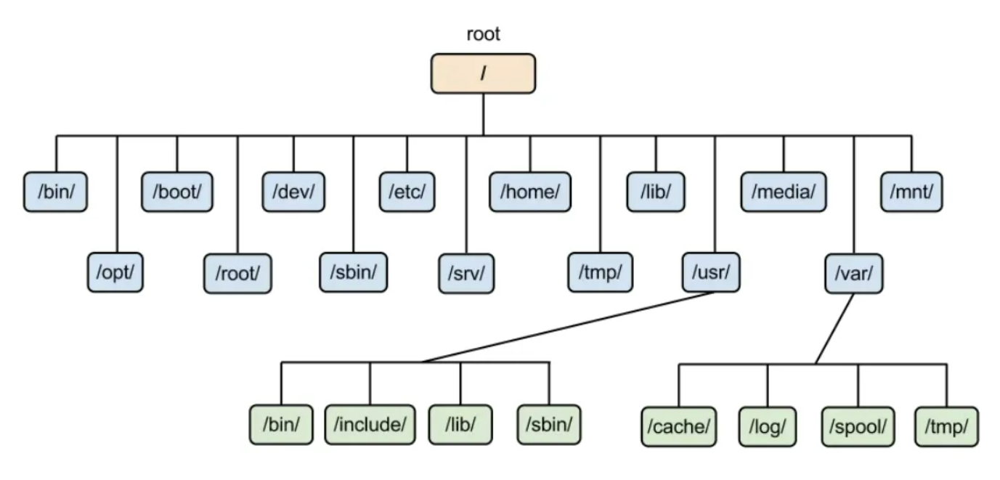
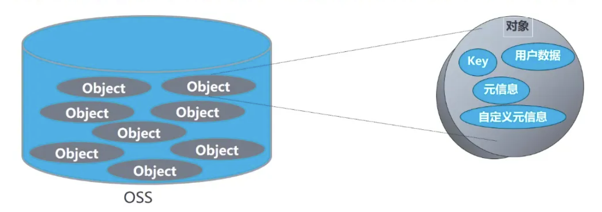

## 1.OSS 简介

### 何为 OSS？

OSS = Object Storage Service，即对象存储服务。如果非要下正式定义，那么对象存储是一种使用 **RESTful API** 存储和检索**非结构化**<u>数据</u>和<u>元数据</u>对象的工具。如果用正常语言来解释，可以把 OSS 类比为云盘，只不过我们可以通过网络请求进行下载、上传等操作。

所谓“非结构化数据和元数据”，就是说 OSS 将数据和元数据（描述其他数据的数据，目的是便于查找等）封装到对象中，而这些对象存储在**平面结构**或地址空间中。每个对象都分配一个对象 ID（唯一标识符），使它们可以从**单个**存储库中检索。这就跟平常存储中结构化的数据很不一样。

Linux 文件系统是这样的树状结构（结构化的）：



OSS 文件系统是这样的扁平结构（非结构化的）：



### OSS 与云盘的区别

除了数据组织方式不同之外，OSS 与云盘还有诸多区别：

- 一般 OSS 按实际存储量计费，云盘按购买的大小计费，实际上 OSS 是灵活的分布式存储，一般没有容量限制
- OSS 需要调用 API 访问，一般不直接挂载到系统里面使用，云盘要挂载到系统里面直接使用
- OSS 可以设置外网直接访问，云盘只能通过服务器访问
- 以阿里云的产品为例，OSS 比云盘便宜

### OSS 的优势

- 提供标准 RESTful API 接口，丰富的 SDK 工具，还有客户端和控制台
- 可扩展性强，一般不会出现“满了”的情况
- 由于冗余存储等机制，数据可靠性非常高，阿里 OSS 号称可提供 99.9999999999%的数据持久性
- 支持内容分发网络 CDN 加速
- 支持流式写入和读出

### OSS 的劣势

- 无法在其上建立数据库，因为维护起来成本极高。这是由于对象存储不允许只更改一个数据对象的一部分，要想更改对象，哪怕只是重命名，也只能先删除再上传，而在普通文件系统当中可以轻松修改文件的一行。因此，OSS 只适用于存储**静态**数据，如网站上的图片、视频、博客等等。
- 一般来说，操作系统无法像常规磁盘一样安装对象存储。尽管在控制台上 OSS 似乎跟一块云硬盘一样，但是它不能直接挂载到系统上。

<u>
  {" "}
  阿里OSS提供了完善的技术文档，同学们可以很方便的搜索到官网上的文档，后面的介绍也大多来源于官方文档
</u>

## 2.OSS 基本概念

### 存储空间（Bucket）

存储空间是用户用于存储对象（Object）的容器，所有的对象都必须隶属于某个存储空间。存储空间具有各种配置属性，包括地域、访问权限、存储类型等。用户可以根据实际需求，创建不同类型的存储空间来存储不同的数据。

- 同一个存储空间的内部是扁平的，没有文件系统的目录等概念，所有的对象都直接隶属于其对应的存储空间。
- 每个用户可以拥有多个存储空间。
- 存储空间的名称在 OSS 范围内必须是全局唯一的，一旦创建之后无法修改名称。
- 存储空间内部的对象数目没有限制。

存储空间的命名规范如下：

- 只能包括小写字母、数字和短划线（-）。
- 必须以小写字母或者数字开头和结尾。
- 长度必须在 3~63 字符之间。

### 对象（Object）

对象是 OSS 存储数据的基本单元，也被称为 OSS 的文件。和传统的文件系统不同，对象没有文件目录层级结构的关系。对象由元信息（Object Meta），用户数据（Data）和文件名（Key）组成，并且由存储空间内部唯一的 Key 来标识。对象元信息是一组键值对，表示了对象的一些属性，比如最后修改时间、大小等信息，同时用户也可以在元信息中存储一些自定义的信息。

对象的命名规范如下：

- 使用 UTF-8 编码。
- 长度必须在 1~1023 字符之间。
- 不能以正斜线（/）或者反斜线（\）开头。

### ObjectKey

在各语言 SDK 中，ObjectKey、Key 以及 ObjectName 是同一概念，均表示对 Object 执行相关操作时需要填写的 Object 名称。例如向某一存储空间上传 Object 时，ObjectKey 表示上传的 Object 所在存储空间的完整名称，即包含文件后缀在内的完整路径，如填写为 abc/efg/123.jpg。

### Region（地域）

Region 表示 OSS 的数据中心所在物理位置。用户可以根据费用、请求来源等选择合适的地域创建 Bucket。一般来说，距离用户更近的 Region 访问速度更快。

Region 是在创建 Bucket 的时候指定的，一旦指定之后就不允许更改。该 Bucket 下所有的 Object 都存储在对应的数据中心，目前不支持 Object 级别的 Region 设置。

### Endpoint（访问域名）

Endpoint 表示 OSS 对外服务的访问域名。OSS 以 HTTP RESTful API 的形式对外提供服务，当访问不同的 Region 的时候，需要不同的域名。通过内网和外网访问同一个 Region 所需要的 Endpoint 也是不同的。例如杭州 Region 的外网 Endpoint 是 oss-cn-hangzhou.aliyuncs.com，内网 Endpoint 是 oss-cn-hangzhou-internal.aliyuncs.com。具体的内容请参见[各个 Region 对应的 Endpoint](https://help.aliyun.com/document_detail/31837.htm#concept-zt4-cvy-5db)。

### AccessKey（访问密钥）

AccessKey 简称 AK，指的是访问身份验证中用到的 AccessKeyId 和 AccessKeySecret。OSS 通过使用 AccessKeyId 和 AccessKeySecret 对称加密的方法来验证某个请求的发送者身份。AccessKeyId 用于标识用户；AccessKeySecret 是用户用于加密签名字符串和 OSS 用来验证签名字符串的密钥，必须保密。对于 OSS 来说，AccessKey 的来源有：

- Bucket 的拥有者申请的 AccessKey。
- 被 Bucket 的拥有者通过 RAM 授权给第三方请求者的 AccessKey。
- 被 Bucket 的拥有者通过 STS 授权给第三方请求者的 AccessKey。

### 强一致性

Object 操作在 OSS 上具有原子性，操作要么成功要么失败，不会存在有中间状态的 Object。OSS 保证用户一旦上传完成之后读到的 Object 是完整的，OSS 不会返回给用户一个部分上传成功的 Object。

Object 操作在 OSS 同样具有强一致性，用户一旦收到了一个上传（PUT）成功的响应，该上传的 Object 就已经立即可读，并且 Object 的冗余数据已经写成功。不存在一种上传的中间状态，即 read-after-write 却无法读取到数据。对于删除操作也是一样的，用户删除指定的 Object 成功之后，该 Object 立即变为不存在。

### OSS 与文件系统的对比

| 对比项   | OSS                                                                                                                                                                                                                                                                                                                                                                                                                                                       | 文件系统                                                                                                                       |
| :------- | :-------------------------------------------------------------------------------------------------------------------------------------------------------------------------------------------------------------------------------------------------------------------------------------------------------------------------------------------------------------------------------------------------------------------------------------------------------- | :----------------------------------------------------------------------------------------------------------------------------- |
| 数据模型 | OSS 是一个分布式的对象存储服务，提供的是一个 Key-Value 对形式的对象存储服务。                                                                                                                                                                                                                                                                                                                                                                             | 文件系统是一种典型的树状索引结构。                                                                                             |
| 数据获取 | 根据 Object 的名称（Key）唯一的获取该 Object 的内容。虽然用户可以使用类似 test1/test.jpg 的名字，但是这并不表示用户的 Object 是保存在 test1 目录下面的。对于 OSS 来说，test1/test.jpg 仅仅只是一个字符串，与 example.jpg 并没有本质的区别。因此不同名称的 Object 之间的访问消耗的资源是类似的。                                                                                                                                                           | 一个名为 test1/test.jpg 的文件，访问过程需要先访问到 test1 这个目录，然后再在该目录下查找名为 test.jpg 的文件。                |
| 优势     | 支持海量的用户并发访问。                                                                                                                                                                                                                                                                                                                                                                                                                                  | 支持文件的修改，比如修改指定偏移位置的内容、截断文件尾部等。也支持文件夹的操作，比如重命名目录、删除目录、移动目录等非常容易。 |
| 劣势     | OSS 保存的 Object 不支持修改（追加写 Object 需要调用特定的接口，生成的 Object 也和正常上传的 Object 类型上有差别）。用户哪怕是仅仅需要修改一个字节也需要重新上传整个 Object。OSS 可以通过一些操作来模拟类似文件夹的功能，但是代价非常昂贵。比如重命名目录，希望将 test1 目录重命名成 test2，那么 OSS 的实际操作是将所有以 test1/开头的 Object 都重新复制成以 test2/开头的 Object，这是一个非常消耗资源的操作。因此在使用 OSS 的时候要尽量避免类似的操作。 | 受限于单个设备的性能。访问越深的目录消耗的资源也越大，操作拥有很多文件的目录也会非常慢。                                       |

## 3.访问权限

文件的访问权限（ACL）有以下四种：

| 访问权限    | 描述                                                                   | 访问权限值        |
| :---------- | :--------------------------------------------------------------------- | :---------------- |
| 继承 Bucket | 文件遵循存储空间的访问权限。                                           | default           |
| 私有        | 文件的拥有者和授权用户有该文件的读写权限，其他用户没有权限操作该文件。 | private           |
| 公共读      | 文件的拥有者和授权用户有该文件的读写权限，其他用户只有文件的读权限。   | public-read       |
| 公共读写    | 所有用户都有该文件的读写权限。                                         | public-read-write |

## 4.OSS SDK

由于科协网站采用的是阿里云的 OSS，在这里我们只介绍阿里云 OSS 的 SDK。又由于我们的前端和后端都是以 JavaScript 为基础的，因此我们只关心基于 Node.js 的 SDK。可以用 yarn 包管理器安装 ali-oss 包：

```
yarn add ali-oss
```

### 初始化

```typescript
import OSS from "ali-oss";

let client = new OSS({
  // yourRegion填写Bucket所在地域。以华东1（杭州）为例，Region填写为oss-cn-hangzhou。
  region: "yourRegion",
  accessKeyId: "yourAccessKeyId",
  accessKeySecret: "yourAccessKeySecret",
});
```

### 存储空间（Bucket）操作

<u>创建存储空间：</u>

```typescript
// 创建存储空间。
async function putBucket() {
  try {
    const options = {
      storageClass: "Standard", // 存储空间的默认存储类型为标准存储，即Standard。如果需要设置存储空间的存储类型为归档存储，请替换为Archive。
      acl: "private", // 存储空间的默认读写权限为私有，即private。如果需要设置存储空间的读写权限为公共读，请替换为public-read。
      dataRedundancyType: "LRS", // 存储空间的默认数据容灾类型为本地冗余存储，即LRS。如果需要设置数据容灾类型为同城冗余存储，请替换为ZRS。
    };
    // 填写Bucket名称。
    const result = await client.putBucket("examplebucket", options);
    console.log(result);
  } catch (err) {
    console.log(err);
  }
}

putBucket();
```

处于简便，后续实例不再写出完整函数，而是给出 sdk 方法和说明。

<u>列举存储空间：</u>

```typescript
// 列举当前账号所有地域下的存储空间。
const result = await client.listBuckets();
// 列举当前账号所有地域下指定前缀的存储空间。
const result = await client.listBuckets({
  // 指定前缀。
  prefix: "example",
});
// 列举当前账号所有地域下名称的字母序排在examplebucket之后的存储空间。
const result = await client.listBuckets({
  // 指定Marker。
  marker: "examplebucket",
});
// 列举500个Bucket。
const result = await client.listBuckets({
  // max-keys用于限定此次返回Bucket的最大个数，max-keys取值不能大于1000。如果不指定max-keys，则默认返回100个Bucket。
  "max-keys": 500,
});
```

<u>查询存储空间信息：</u>

```typescript
async function getBucketInfo() {
  try {
      // 填写存储空间名称，例如examplebucket。
  	  const bucket = 'examplebucket'
      const result = await client.getBucketInfo(bucket)
      // 获取存储空间所在的地域。
      console.log(result.bucket.Location)
      // 获取存储空间的名称。
      console.log(result.bucket.Name)
      // 获取存储空间的拥有者ID。
      console.log(result.bucket.Owner.ID)
      // 获取存储空间的拥有者名称，目前和拥有者ID一致。
      console.log(result.bucket.Owner.DisplayName)
      // 获取存储空间的创建时间。
      console.log(result.bucket.CreationDate)
      // 获取存储空间的存储类型。
      console.log(result.bucket.StorageClass)
      // 获取存储空间的版本控制状态。
      console.log(result.bucket.Versioning)
  }  catch (error) {
    // 判断指定的存储空间是否存在。
      if (error.name === 'NoSuchBucketError') {
          console.log("No such bucket!")
      } else {
          console.log(error)
      }
}
```

<u>删除存储空间</u>

```typescript
const result = await client.deleteBucket("yourbucketname");
```

### 文件上传

```typescript
const headers = {
  // 指定该Object被下载时网页的缓存行为。
  // 'Cache-Control': 'no-cache',
  // 指定该Object被下载时的名称。
  // 'Content-Disposition': 'oss_download.txt',
  // 指定该Object被下载时的内容编码格式。
  // 'Content-Encoding': 'UTF-8',
  // 指定过期时间。
  // 'Expires': 'Wed, 08 Jul 2022 16:57:01 GMT',
  // 指定Object的存储类型。
  // 'x-oss-storage-class': 'Standard',
  // 指定Object的访问权限。
  // 'x-oss-object-acl': 'private',
  // 设置Object的标签，可同时设置多个标签。
  // 'x-oss-tagging': 'Tag1=1&Tag2=2',
  // 指定CopyObject操作时是否覆盖同名目标Object。此处设置为true，表示禁止覆盖同名Object。
  // 'x-oss-forbid-overwrite': 'true',
};

async function put() {
  try {
    // 填写OSS文件完整路径和本地文件的完整路径。OSS文件完整路径中不能包含Bucket名称。
    // 如果本地文件的完整路径中未指定本地路径，则默认从示例程序所属项目对应本地路径中上传文件。
    const result = await client.put(
      "exampleobject.txt",
      path.normalize("D:\\localpath\\examplefile.txt")
    );
    // const result = await client.put('exampleobject.txt', path.normalize('D:\\localpath\\examplefile.txt'), { headers });
    console.log(result);
  } catch (e) {
    console.log(e);
  }
}
```

### 文件下载

```typescript
const result = await client.get(
  "exampleobject.txt",
  "D:\\localpath\\examplefile.txt"
);
```

### 文件权限设置

```typescript
// yourObjectName填写不包含Bucket名称在内的Object的完整路径。
const result = await client.getACL("yourObjectName"); // 获取权限
// yourObjectName填写不包含Bucket名称在内的Object的完整路径。
await client.putACL("yourObjectName", "public-read"); // 修改权限
```

### 列举文件

```typescript
const result = await client.list({
  // 设置按字母排序最多返回前10个文件。
  "max-keys": 10,
  // 列举文件名中包含前缀foo/的文件。
  prefix: "foo/",
  // 设置正斜线（/）为文件夹的分隔符。
  delimiter: "/",
  // 列举文件名在xyz之后（字典序）的文件。
  marker: "xyz",
});
```

通过 delimiter 和 prefix 两个参数可以模拟文件夹功能：

- 如果设置 prefix 为某个文件夹名称，则会列举以此 prefix 开头的文件，即该文件夹下所有的文件和子文件夹（目录）均显示为 objects。
- 如果在设置了 prefix 的情况下，将 delimiter 设置为正斜线（/），则只列举该文件夹下的文件和子文件夹（目录），该文件夹下的子文件夹（目录）显示为 CommonPrefixes，子文件夹下的文件和文件夹不显示。

### 删除文件

```typescript
// 填写Object完整路径。Object完整路径中不能包含Bucket名称。
let result = await client.delete("exampleobject.txt");
// 填写需要删除的多个Object完整路径并设置返回模式为详细模式。Object完整路径中不能包含Bucket名称。
let result = await client.deleteMulti([
  "exampleobject-1",
  "exampleobject-2",
  "testfolder/sampleobject.txt",
]);
console.log(result);
// 填写需要删除的多个Object完整路径并设置返回模式为简单模式。Object完整路径中不能包含Bucket名称。
let result = await client.deleteMulti(
  ["exampleobject-1", "exampleobject-2", "testfolder/sampleobject.txt"],
  { quiet: true }
);
console.log(result);
```

有关 OSS SDK 的相关内容还有很多，大家可以在需要使用时进行查询，官网文档上有详细介绍：https://help.aliyun.com/document_detail/32067.html。

## 1.CDN 简介

### 何为 CDN？

CDN = Content Delivery Network，即内容分发网络，指的是一组分布在各个地区的服务器组成的网络。这些服务器存储着数据的副本，因此服务器可以根据哪些服务器与用户距离最近，来满足数据的请求。CDN 有如下优势：

- 通过 CDN 向用户分发传输静态资源文件，可以降低我们自身服务器的请求压力。
- 大多数 CDN 在全球都有服务器，所以 CDN 上的服务器在地理位置上可能比你自己的服务器更接近你的用户。地理距离会按比例影响延迟。

### CDN 工作流程


1. 当终端用户向`www.aliyundoc.com`下的指定资源发起请求时，首先向 Local DNS（本地 DNS）发起请求域名`www.aliyundoc.com`对应的 IP。
2. Local DNS 检查缓存中是否有`www.aliyundoc.com`的 IP 地址记录。如果有，则直接返回给终端用户；如果没有，则向网站授权 DNS 请求域名`www.aliyundoc.com`的解析记录。
3. 当网站授权 DNS 解析`www.aliyundoc.com`后，返回域名的 CNAME `www.aliyundoc.com.example.com`。
4. Local DNS 向阿里云 CDN 的 DNS 调度系统请求域名`www.aliyundoc.com.example.com`的解析记录，阿里云 CDN 的 DNS 调度系统将为其分配最佳节点 IP 地址。
5. Local DNS 获取阿里云 CDN 的 DNS 调度系统返回的最佳节点 IP 地址。
6. Local DNS 将最佳节点 IP 地址返回给用户，用户获取到最佳节点 IP 地址。
7. 用户向最佳节点 IP 地址发起对该资源的访问请求。

## 2.CDN 配置

以阿里云的 CDN 服务为例：

### 开通 CDN 服务

1. 登录[阿里云 CDN 平台](https://www.aliyun.com/product/cdn)。
2. 单击**立即开通**。
3. **计费类型**默认按使用流量计费，并选中**服务协议**。
4. 单击**立即开通**。

### 添加加速域名

1. 登录[CDN 控制台](https://cdn.console.aliyun.com/)。
2. 在左侧导航栏，单击**域名管理**。
3. 单击**添加域名**，完成基础信息和业务信息配置。
4. 完成基础信息和业务信息配置后，单击**新增源站信息**。
5. 在**新增源站信息**页面，完成配置。
6. 完成源站配置后，单击**下一步**。
7. 等待人工审核。

### 验证域名归属权

- [方法一：DNS 解析验证（推荐）](https://help.aliyun.com/document_detail/169377.html#section-71y-34l-3h8)：需要[添加 TXT 记录](https://help.aliyun.com/document_detail/169377.html#step-prk-avu-3j4)
- [方法二：文件验证](https://help.aliyun.com/document_detail/169377.html#section-13t-acf-xbp)
- [方式三：通过 API 验证](https://help.aliyun.com/document_detail/169377.html#section-cdf-gbs-rlf)

### 配置 CNAME

成功添加加速域名（完成源站配置）后，CDN 会自动分配一个 CNAME 域名（也就是源站域名将作为 CNAME 域名的别名）。只有在域名解析服务商处将源站域名的 DNS 解析记录指向 CNAME 域名，访问请求才能转发到 CDN 节点上，实现 CDN 加速。

配置 CNAME 的方法随源站域名的服务商不同而不同，在此不再赘述。需要用到的同学可以参考：https://help.aliyun.com/document_detail/27144.html。

## 3.CDN 常用功能

### 资源刷新

强制删除 CDN 所有节点上的缓存资源，当用户向 CDN 节点请求资源时，CDN 会直接回源站获取对应的资源并返回，同时将资源重新缓存到 CDN 节点。刷新功能会降低缓存命中率，但是能保证用户获取到最新的内容。

一般用于资源更新和发布，以及违规资源清理等。

### 资源预热

源站主动将对应的资源缓存到 CDN 节点，当客户首次请求资源时，即可直接从 CDN 节点获取到最新的资源，无需再回源站获取。预热功能会提高缓存命中率，但是会造成源站短时高负载。

一般用于运营大型活动，以及安装包发布等。
