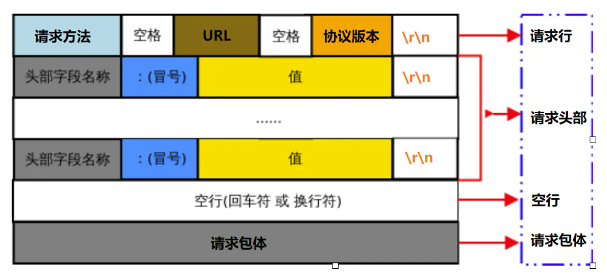

## 1.Express 简介与环境配置

### 为什么要用 Express？

Node.js 使 JavaScript\TypeScript 脚本能够脱离浏览器环境在服务端（后端）运行（实际上是对 Chrome V8 引擎进行了封装），为我们开发后端提供了一种选项。不像前端有统一的浏览器标准，如果不遵循的话浏览器就没法正常显示；后端的开发相对就自由许多，开发语言有很多选项，如 Java，PHP，python，C，Go 等，我们科协网站采用的是 TypeScript 语言，有关 TypeScript 的知识在之前课程当中已有介绍。

如想自己动手建立一个简单后端，理论上只需调用 http-server 之类的库就能接收和发送 http 请求了。尽管这些库已经帮我们处理了很多底层问题，但是要想实现复杂一些的功能还是相当麻烦的。Express 是一个基于 Node.js 的开源框架，把接收和发送 http 请求进行了更高级别、更用户友好的封装。官网上称其“快速、开放、极简”，表明 Express 在保证性能的同时，代码书写非常容易且是开源的。它能够使用开发者所选择的各种 http 实用工具和中间件，快速方便地创建强大的 API。

### 安装 Express

首先需要安装 Node.js，官网链接：https://nodejs.org/en/download/。

在 Windows 系统上，可选择下载安装包或二进制文件并按提示安装。在 Linux 系统上，可选择下载二进制文件然后自行设置环境变量（nodejs/bin/node、nodejs/bin/npm 都应添加到环境变量，或建立软链接至/usr/local/bin），或者在 Ubuntu 上可以用 apt 命令安装：

```shell
sudo apt install nodejs npm
```

注：上次没有讲 apt 换源，如果下载过慢或失败可以采用清华源，换源方法见https://mirrors.tuna.tsinghua.edu.cn/help/ubuntu/。换源后，使用如下命令检验是否换源成功并更新软件：

```shell
sudo apt update
sudo apt upgrade
```

在安装好 Node.js 后，建议用其 npm 包管理工具全局安装 yarn 包管理工具（弥补 npm 的一些缺陷，不过拉取的包依然来自 npm 仓库，因此要想搜索库文档，可至https://www.npmjs.com/查询）：

```bash
sudo npm install -g yarn	# 全局安装，在本机所有项目中可用，需要超级用户权限
```

在此基础上，你可以新建一个工作目录，并在其中执行：

```bash
yarn init
```

此命令将此目录初始化为 yarn 管理的目录，会自动创建一个 package.json 文件。在初始化过程中需要输入程序的名称、版本、入口文件等信息，这些都可以直接回车设成默认值（这里配置的入口文件我们不需要用）。下面我们在此目录下安装 Express：

```shell
yarn add express
```

### 准备工作

在刚才创建的安装有 Express 的工作目录当中，我们新建一个文件夹 src，用于保存源码，并在其中新建入口文件 app.ts。然后在其中导入 Express 包并创建 Express 类的实例：

```typescript
import express from "express"; // 导入Express包
const app = express(); // 创建Express类的实例
```

这样导入的 Express 包是 JavaScript 编写的，缺乏 TypeScript 语法所要求的类型声明文件，因此会在 import 那一行出现提醒。我们可以使用如下命令安装类型声明：

```shell
yarn add @types/express --dev
```

安装完成后，我们看到提醒已经消除。

之后我们让程序监听 3000 端口，这样发送至 http://localhost:3000 的请求就能够被我们捕获了。

```typescript
app.listen(3000, () => {
  // 开始监听
  console.log(`listening on port ${port}`);
});
```

问题来了，我们如何才能运行后端呢？大家之前可能尝试过用 tsc 将 TypeScript 代码转为 Javascript 代码然后再用 node 作为解释器运行，这样对于我们日常开发就十分繁琐。Babel 工具链能够将较新的 JavaScript 以及 TypeScript 语法转化为向后兼容的 JavaScript 语法，以便运行在当前的浏览器环境当中。我们使用 Babel 来进行语法转换，同时用 nodemon 工具检测代码改动，在代码改动时为我们重启后端，这就方便了开发调试。

首先，我们安装开发时所需的包：

```shell
yarn add @babel/core @babel/cli @babel/preset-env @babel/preset-typescript @babel/node nodemon --dev
# @babel/core是Babel的核心库，@babel/cli是Babel的命令行工具，@babel/preset-env是一组将最新JavaScript语法转化的预设工具集，@babel/preset-typescript是一组将TypeScript语法转化的预设工具集，@babel/node可以应用所选的Babel工具并像node一样运行JavaScript代码，nodemon可以检测代码修改并自动重启程序
```

其次，我们对 Babel 进行配置。在工作目录下新建 babel.config.json 文件，并向其中写入（删去注释）：

```json
{
  "presets": [
    // 指定要使用的工具集。更多配置详见官方文档：https://www.babeljs.cn/docs/
    "@babel/preset-env",
    "@babel/preset-typescript"
  ]
}
```

然后，我们对 nodemon 进行配置。打开工作目录下的 package.json 文件，向其中新建一个如下字段（删去注释）：

```json
"nodemonConfig": {		// 更多配置详见官方文档：https://www.npmjs.com/package/nodemon
    "watch": [			// 监听的文件目录
      "src"
    ],
    "ext": "ts, json",	// 监听的文件后缀
    "exec": "babel-node --extensions \".ts\" src/app.ts"	// 当运行nodemon命令时执行
    // babel-node与node的区别在于应用了babel.config.json中配置的工具，src/app.ts是你的入口文件
  }
```

最后，我们设定 yarn 的执行脚本以简单运行 node_modules 中的程序。在 package.json 文件中新建一个如下字段（删去注释）：

```json
"scripts": {
    "start": "nodemon"	// 等价于./node_modules/nodemon/bin/nodemon.js
  }
```

这样，只要我们在终端中输入 yarn start，就会看到 nodemon 启动并用 Babel 生成和运行了 JavaScript 代码。此时输入 rs 回车，会使后端重启；摁下 Ctrl+C，会使后端停止。

### 安装 Postman

Postman 是一个 API 调试工具，可以模拟前端向后端发送请求，这在我们开发后端时非常有用。大家可以进入其官网注册账号（好处是你的 HTTP 请求会被备份并同步在不同设备）https://www.postman.com/，然后点击download desktop app 相关选项或者直接链接到https://www.postman.com/downloads/，下载安装程序并安装。

打开 Postman 并登录后，可以在 Collections 中点击加号，新建一个 Collection，然后在上方栏中点击加号，新建一个 Request 并保存到这个 Collection。这样就可以编辑、保存和发送这个 Request 了。针对同一类 API 的 Request 可以保存在同一个 Collection 下以方便管理。建议大家阅读 Postman 官方文档（https://learning.postman.com/docs/getting-started/introduction/）以学习更多Postman的实用知识。

## 2.Express 路由

### 何为路由？

路由决定了后端 API 响应前端请求的方式，通过解析 URI 和 HTTP 请求方法来实现。在 Express 中，可以非常方便地在路由匹配时执行一个或多个处理函数并给出响应。简单地说，当前端向后端发送 HTTP 请求时，Express 根据 URI 和 HTTP 请求方法来匹配相应的 API，之后执行由开发者设计的处理程序，最后将响应发送回前端。

### HTTP 请求基本结构

要想弄清楚 Express 是如何路由的，有必要先了解 HTTP 请求的格式与结构。HTTP（超文本传输协议）基于 TCP/IP 协议来传递数据，是为客户端与服务器之间的通信而设计的。客户端请求的格式如下：



服务器响应的格式如下：


Express 根据的是 HTTP 请求方法和 URI/URL 来进行路由，由开发者编写的 API 处理请求后将状态码和其他响应内容发回客户端。下面先来了解一下 HTTP 请求方法：

| 序号 | 方法    | 描述                                                                             |
| :--- | :------ | :------------------------------------------------------------------------------- |
| 1    | GET     | 向指定资源发出请求，用于获取资源，数据被包含在 URL 中                            |
| 2    | HEAD    | 等同于向服务器发送 GET 请求，但不获取响应包体，只获取响应头                      |
| 3    | POST    | 向指定资源提交数据进行处理请求（例如提交表单或者上传文件），数据被包含在请求体中 |
| 4    | PUT     | 向指定资源处上传其最新内容                                                       |
| 5    | DELETE  | 请求服务器删除 Request-URL 所标识的资源                                          |
| 6    | CONNECT | HTTP/1.1 协议中预留给能够将连接改为管道方式的代理服务器                          |
| 7    | OPTIONS | 返回服务器针对特定资源的支持，允许客户端查看服务器的性能                         |
| 8    | TRACE   | 回显服务器收到的请求，主要用于测试或诊断                                         |
| 9    | PATCH   | 是对 PUT 方法的补充，用来对已知资源进行局部更新                                  |

一般我们常用的是 GET、POST 和 PUT 请求。接着我们来了解一下 HTTP 响应状态码，下表列举了一些可能遇到的状态码及描述：

| 状态码 | 英文描述              | 中文描述                                                                       |
| ------ | --------------------- | ------------------------------------------------------------------------------ |
| 200    | OK                    | 请求成功                                                                       |
| 400    | Bad Request           | 客户端请求的语法错误，服务器无法理解                                           |
| 401    | Unauthorized          | 客户端请求的身份认证缺失或有误，认证失败                                       |
| 403    | Forbidden             | 服务器理解请求客户端的请求，但是拒绝执行此请求                                 |
| 404    | Not Found             | 服务器无法根据客户端的请求找到资源（网页）                                     |
| 500    | Internal Server Error | 服务器内部错误，无法完成请求                                                   |
| 501    | Not Implemented       | 服务器不支持请求的功能，无法完成请求                                           |
| 502    | Bad Gateway           | 作为网关或者代理工作的服务器尝试执行请求时，从远程服务器接收到了一个无效的响应 |

### HTTP URL

URL = uniform resource locator，即统一资源定位系统，是在网络上标识地址的方法。具体在 HTTP 协议的应用上，形式如下：

`http://[host]:[port]/[path]?[searchpart]`

其中，`<port>`默认为 80（对于 HTTPS 协议默认为 443），`<path>`是一个 HTTP 选择器，`<searchpart>`是查询字符串。例如：

https://baike.baidu.com/item/%E7%BB%9F%E4%B8%80%E8%B5%84%E6%BA%90%E5%AE%9A%E4%BD%8D%E7%B3%BB%E7%BB%9F/5937042?fromtitle=url&fromid=110640

协议是`https`，主机地址是`baike.baidu.com`（会被 DNS 解析成 IP 地址），采用默认的`443`端口；路径为`/item/%E7%BB%9F.../5937042`，其中带有路径参数`/%E7%BB%9F.../5937042`；查询字符串为`fromtitle=url&fromid=110640`。

### 路由的基本用法

在准备工作完成的基础上，我们开始运用 Express 编写后端。路由的基本格式是：

```typescript
app.METHOD(PATH, HANDLER);
```

其中：

- `app` 是 `express` 类的实例。
- `METHOD` 是 HTTP 请求方法。
- `PATH` 是服务器上的路径。
- `HANDLER` 是在路由匹配时执行的函数。

例如：

```typescript
// “/”路径接收到的GET方法匹配至该路由
app.get("/", (req, res) => {
  res.status(200).send("GET request");
});

// “/”路径接收到的POST方法匹配至该路由
app.post("/", (req, res) => {
  res.status(200).send("POST request");
});

// “/”路径接收到的所有方法匹配至该路由
app.all("/", (req, res) => {
  res.status(200).send("Any request");
});
```

对于 Handler 函数，Express 会在路由匹配时调用，调用时传进的参数有三个（一般依次命名为 req、res、next）：req 对象代表“请求”，常用的属性是 body（请求的包体）、query（请求的查询字符串）和 params（请求的路径参数）；res 对象代表“响应”，常用的方法是 status（设定响应状态码）和 send（设定响应内容）；next 函数在调用时表示移交给下一个中间件进行处理。

如果请求匹配了前面的路由，则不会再去匹配后面的路由。在写好代码并启动后端后，大家就可以打开 Postman，向 http://localhost:3000/发送不同类型的请求并查看响应。

### 路由的匹配路径

匹配路径可以是普通字符串、字符串模板和正则表达式。

普通字符串如：

```typescript
app.get("/", (req, res) => {
  // 可匹配“/”
  res.send("root");
});
app.get("/about", (req, res) => {
  // 可匹配“/about”
  res.send("about");
});
app.get("/random.text", (req, res) => {
  // 可匹配“/random.text”
  res.send("random.text");
});
```

字符串模板如：

```typescript
app.get("/ab?cd", (req, res) => {
  // 可匹配“acd”或“abcd”
  res.send("ab?cd");
});
app.get("/ab+cd", (req, res) => {
  // 可匹配“abcd”,“abbcd”,“abbbcd”等
  res.send("ab+cd");
});
app.get("/ab*cd", (req, res) => {
  // 可匹配“abcd”,“abxcd”,“abRANDOMcd”,“ab123cd”等
  res.send("ab*cd");
});
app.get("/ab(cd)?e", (req, res) => {
  // 可匹配“abe”或“abcde”
  res.send("ab(cd)?e");
});
```

正则表达式如：

```typescript
app.get(/a/, (req, res) => {
  // 可匹配任何带有‘a’的路径
  res.send("/a/");
});
app.get(/.*fly$/, (req, res) => {
  // 可匹配“butterfly”,“dragonfly”
  res.send("/.*fly$/"); // 但不可匹配“butterflyman”,“dragonflyman”
}); // 相当于匹配以“fly”结尾的所有路径
```

### 路径中的参数与查询字符串

路径中的参数（route parameter）是指将参数直接作为 URL 路径一部分的传参方式，而查询字符串（query string）是 URL 在路径后面用问号分割的部分，二者虽然都是在 URL 中传递参数，但用法不同。

仍举上述 URL 的例子：https://baike.baidu.com/item/%E7%BB%9F%E4%B8%80%E8%B5%84%E6%BA%90%E5%AE%9A%E4%BD%8D%E7%B3%BB%E7%BB%9F/5937042?fromtitle=url&fromid=110640。则可通过以下路由解析：

```typescript
app.get("/item/:param1/:param2", (req, res) => {
  console.log(req.params.param1); // 统一资源定位系统
  console.log(req.params.param2); // 5937042
  console.log(req.query.fromtitle); // url
  console.log(req.query.fromid); // 110640
  res.status(200).send("ok");
});
```

此外还有一些高级用法，如在路径中插入短线(`-`) 和点 (`.`)，甚至在路径中引入正则表达式：

```typescript
// Request URL: http://localhost:3000/flights/LAX-SFO
app.get("/flights/:from-:to", (req, res) => {
  console.log(req.params.from); // LAX
  console.log(req.params.to); // SFO
  res.status(200).send("ok");
});

// Request URL: http://localhost:3000/date/2020.2.1
app.get("/date/:year.:month.:day", (req, res) => {
  console.log(req.params.year); // 2020
  console.log(req.params.month); // 2
  console.log(req.params.day); // 1
  res.status(200).send("ok");
});
```

### 路由处理函数

Express 的路由处理函数十分灵活，可以传递多个函数、函数数组或二者的混合。当需要从上一个处理函数过渡到下一个处理函数时，需调用传入的 next 函数。

```typescript
var cb0 = function (req, res, next) {
  console.log("CB0");
  next();
};

var cb1 = function (req, res, next) {
  console.log("CB1");
  next();
};

app.get(
  "/example/d",
  [cb0, cb1],
  function (req, res, next) {
    console.log("the response will be sent by the next function ...");
    next();
  },
  (req, res) => {
    res.send("Hello from D!");
  }
);
```

### Router

express.Router 类可以用于构建模块化的路由处理函数（中间件）。我们在 src 文件夹下面新建一个 route1.ts 文件，然后写入：

```typescript
import express from "express";
const router = express.Router(); // 实例化express.Router类

router.get("/", (req, res) => {
  res.status(200).send("ok!");
});

export default router; // 导出后，这个Router就成为了一个中间件
```

然后修改 app.ts 类：

```typescript
import express from "express";
import route1 from "./route1"; // 导入route1中间件

const app = express();
const port = 3000;

app.use("/route1", route1); // 在route1路径下使用route1中间件

app.listen(port, () => {
  console.log(`Example app listening on port ${port}`);
});
```

## 3.Express 中间件

中间件是模块化的路由处理函数，我们刚才已经看到了路由级中间件的用法（通过 express.Router 创建中间件，然后通过 app.use 导入中间件），此外广义上刚才讲过的所有路由处理函数也都可以视为是最普通的中间件。在创建和使用中间件时，还有以下注意事项：

用 app.use 加载的中间件无论什么 HTTP 请求方法都会调用，如想限定一种 HTTP 请求方法，需使用 app.METHOD。同时，如果没有给出路径参数，则默认任何路径的请求都会调用中间件。

中间件是按顺序加载和执行的，如果前面已经出现了匹配的路由，那么后面的路由即使匹配，也不会调用相应的中间件。next 函数默认将控制权移交给当前路由的下一个处理函数，如想将控制权移交给下一个路由，需调用 next('route')。如果将非"route"的参数传递给了 next 函数，则 Express 会认为该中间件出错，从而越过其他的正常处理函数直接执行异常处理函数。

```typescript
app.get(
  "/user/:id",
  (req, res, next) => {
    // if the user ID is 0, skip to the next route
    if (req.params.id === "0") next("route");
    // otherwise pass the control to the next middleware function in this stack
    else next();
  },
  (req, res, next) => {
    // send a regular response
    res.send("regular");
  }
);

// handler for the /user/:id path, which sends a special response
app.get("/user/:id", (req, res, next) => {
  res.send("special");
});
```

### 异常处理

对于同步编程的中间件，当抛出一个异常时且没有自建异常处理函数时，Express 会自己来处理这个异常。Express 会根据错误的`err.status` (或`err.statusCode`)来设定状态码、错误信息等。我们也可以自己创建一个异常处理函数，如果为 Express 中间件传入四个参数，通常命名为(err, req, res, next)，则 Express 会把这一中间件当作异常处理函数。

```typescript
app.get("/", (req, res) => {
  throw new Error("error occurs!"); // 异常由Express自建异常处理函数来处理
});
```

```typescript
app.use((err, req, res, next) => {
  res.status(500).send("error occurs!"); // 或者可以自己编写异常处理函数
});
```

对于异步编程的中间件，要想进行异常处理，需要调用 next 函数并向其中传递一个值。如果中间件返回的是一个 Promise，则会自动调用 next(value)。下面的异步函数返回 Promise，如果中间抛出了异常或者 reject，则 Express 会默认调用 next 函数并传入异常信息。

```typescript
app.get("/user/:id", async (req, res, next) => {
  var user = await getUserById(req.params.id);
  res.send(user);
});
```

更多时候，我们在中间件内部来处理异常，而不用将异常传递给 Express：

```typescript
app.get("/", async (req, res) => {
    try{
    ...
    return res.status(200).send("ok");
    } catch(err) {
	...
    return res.status(500).send("Internal Server Error");
    }
})
```

### 常用中间件

Express 提供了一些内建中间件供用户选择，比如常用的 express.json 会以 json 格式来解析请求体，express.urlencoded 会以 urlencoded 格式来解析请求体。还有一些第三方的中间件可以通过包管理器来安装，如 cookie-parser。
