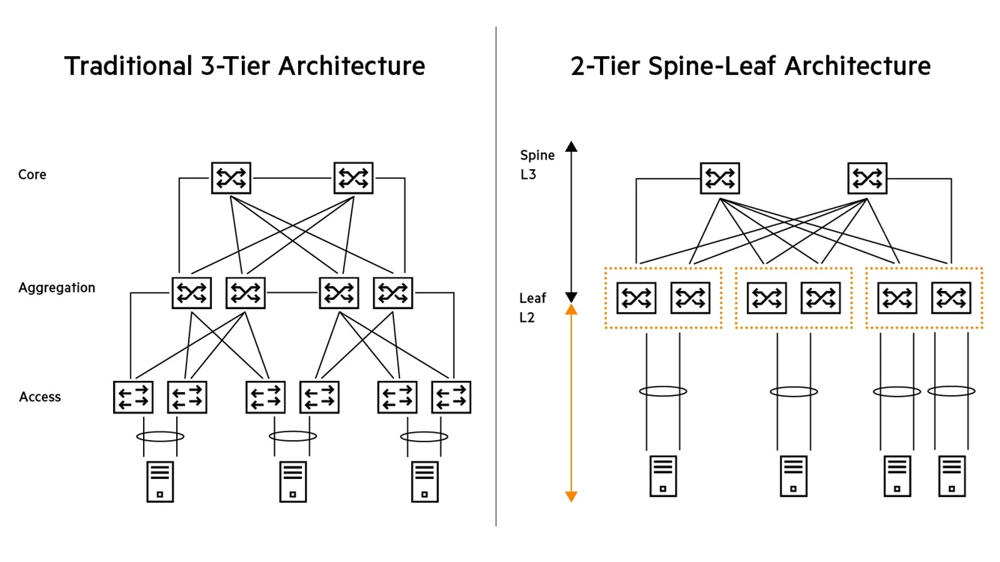
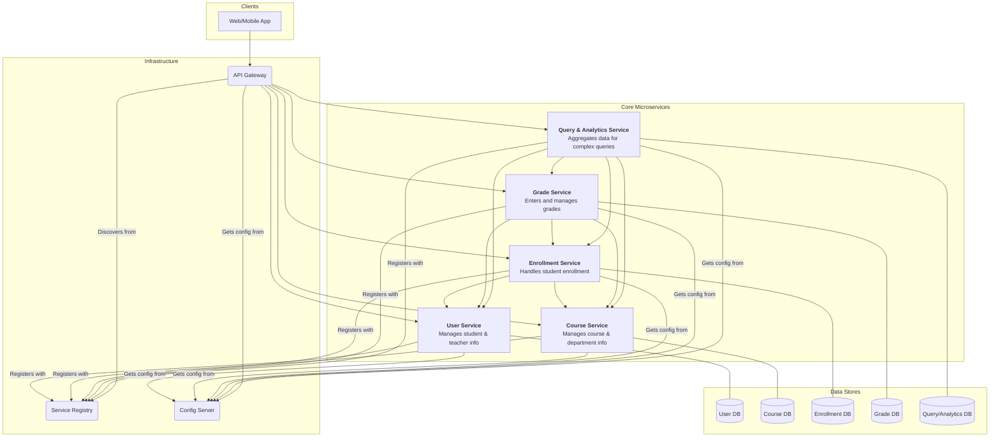
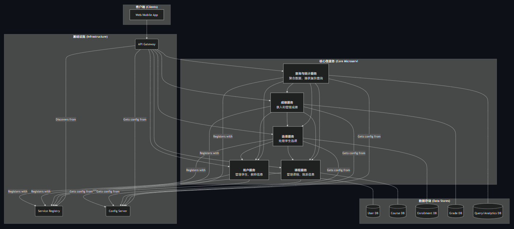
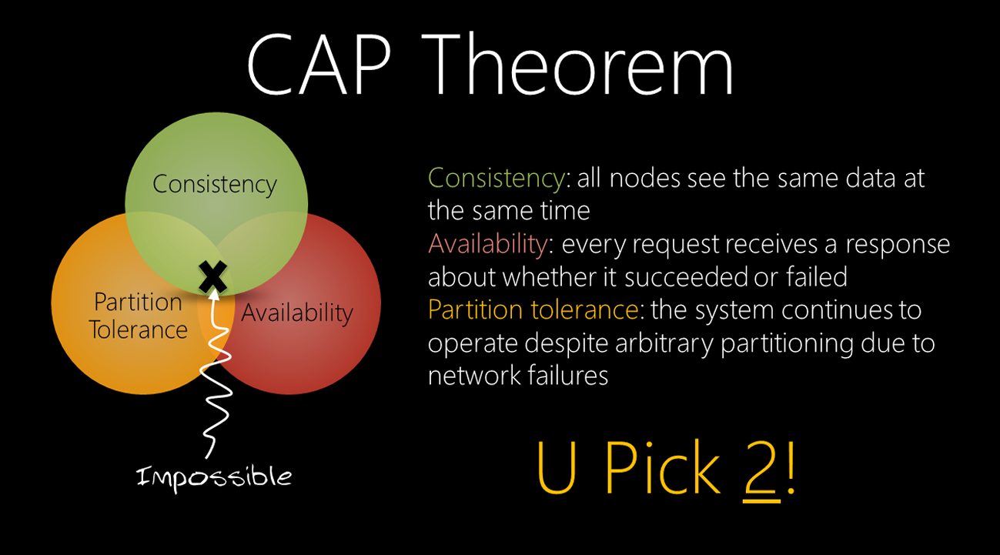
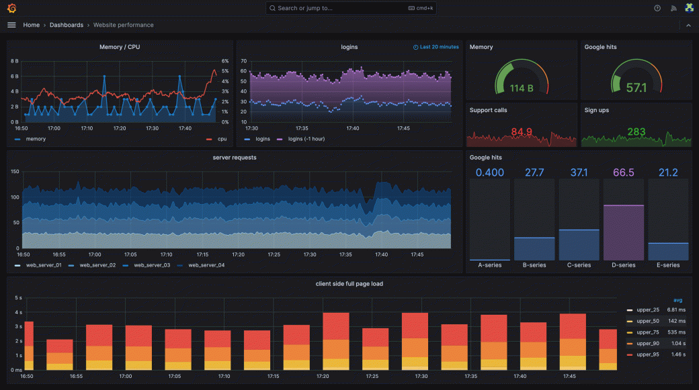

<!--
## 目录

[TOC]
-->

## 第〇章 讲在前面

与之前侧重技术的课程不同，我们这一节是侧重科普性、知识性和概念性的讲座式课程，所以建议大家吃零食喝汽水放轻松，没有零食没有汽水就沉浸在美妙的云原生当中。

***<span style={{ color: '#236DF6' }}>“富有的、贫穷的，带着酒杯的或一无所有的子民们，举起酒杯吧！没有的就用手代替。”[^1]</span>***
***<span style={{ color: '#236DF6' }}>“嗓音状态很棒，糖分也补充完毕。巡演，出发！”[^2]</span>***

***<span style={{ color: '#236DF6' }}>——芙宁娜 • 德 • 枫丹</span>***


import furinaVideo from '../assets/cloud_native/fundamental/furina.mp4';

<video controls style={{ width: "80%" }}>
  <source src={furinaVideo} type="video/mp4" alt="furina" />
</video>


## 第一章 走进云原生

在本章节里，我们将一起来熟悉云原生的基本概念，对云原生有一个概念性的认识。

### 认识云

#### 什么是云

什么是云？这个问题可能不是很好回答，因为“云”包含了现代互联网的绝大多数的内容，我们在生活中几乎随处可以见到“云” ~~（例如随处可见的云玩家喷子，或是我们云了一个游戏）~~，例如我们耳熟能详的云盘，或是近年来流行起来的云游戏，苹果用户在使用一台新的苹果设备时还会见到“云上贵州”，等等。似乎“云”已经成为现代生活中必不可少的一部分。但是，我们还从来没有系统地认识过“云”。

云计算的起源可以追溯到计算技术的早期，当时使用大型计算机为多个用户处理数据。20 世纪 60 年代，出现了"分时"这一概念，多个用户因此可以同时访问同一计算机。通过引入在多个用户之间共享资源的理念，此方法奠定了现代云计算的基础。Internet 则在云计算的兴起中发挥了关键作用。20 世纪 90 年代，Internet 的广泛采用使得从世界任何地方访问数据和应用程序成为可能。这促成了基于云的服务的发展，例如电子邮件、文件存储和软件应用程序。云通过 Internet 提供存储、计算能力和应用程序的服务。用户无需将数据保留在本地设备上，而是将其数据和应用程序存储在云中并进行访问。从本质上讲，Internet 是连接全球设备的基础性基础结构，而云使用此基础结构来提供各种服务和资源。[^3]

#### 数据中心

我们在新闻中通常听到诸如“某某公司在何处新建了数据中心”，而云和数据中心也是密不可分的。简单来说，数据中心是存储计算机及其相关硬件设备的物理位置，包含了云所需的计算基础设施，例如服务器、数据存储驱动器和网络设备，是存储任何公司数字数据的物理设施[^4]。在一个数据中心中，物理设备统一地以一定的网络结构放置在机房之中，例如两个常用的数据中心网络结构如下图[^5]：



图中左侧是一个传统的三层数据中心网络架构。其中，最底层代表机柜，Access 层是每个机柜顶部的 ToR（Top of Rack）交换机，用于实现机柜内各个主机的互联，而不同机柜之间通过不同层级的交换机相连。这样的结构组织，让不同的主机之间以一定的拓扑结构相互连接，同时，不同的主机之间也可能存在不同的带宽、跳数，云供应者可以按需选择。

图中右侧是一个近年来新兴的网络架构——Spine-Leaf 架构。

import clos from '../assets/cloud_native/fundamental/clos.png';

> 当然，不同层级的交换机之间的链路如何互联也有讲究。以上两种架构都来源于经典的 Clos 网络[^6]：
>
> 

#### 私有云、公有云和混合云

根据云基础设施（数据中心）的所有权，我们通常可以把云分为私有云、公有云和混合云。

简单来说，公有云是由第三方的云供应商通过 Internet 向多个客户提供计算资源（例如服务器、存储、网络和应用程序）[^7]，例如我们熟悉的腾讯云、阿里云、Amazon AWS、Google Cloud、Microsoft Azure 等。

私有云是企业或组织自己拥有物理资源，自建机房或委托第三方机构来维护计算资源，它们是该企业或组织独占的，企业或组织可以按照自己的喜好来任意地使用这些计算资源。当然，也有很多的产品来帮助企业或组织进行云的管理，例如开源的 OpenStack、商业的 VMware ESXi、国产的 [NSP](https://www.yunshan.net/products/nsp.html) 等等。

混合云顾名思义则是将私有云和公有云环境组合在一起，并在它们之间共享数据和应用程序[^3]。

#### 多种多样的云服务

根据之前的讲述，我们知道，在云环境下，存在众多的异构的物理设备、错综复杂的网络拓扑，等等。利用这些资源来提供计算服务，我们通常称作“云计算”。在云上，我们要给云计算应用开发者提供什么样的服务是一个历久弥新的问题。即，我们应该给开发者提供怎样的基础设施，或者说，我们要将基础设施封装或抽象到什么层次。

我们来看这样一张图[^8]：


我们知道，在硬件 system 领域当中，经常使用 XPU 的概念，如中央处理单元叫 CPU，图形处理单元叫 GPU，张量处理单元叫 TPU，数据处理单元叫 DPU，用来处理什么的就叫什么 PU（笑）。在我们云计算也有类似的概念——XaaS（X as a Service）：我们给用户提供什么服务，就叫什么 aaS。

想象一下，最开始如果我们要用电脑，需要向电脑的售卖商来购买整台的电脑，并把电脑搬到自己的机房里、组装各种硬件、安装操作系统和各类驱动、配置网络，等等等等。电脑商给我们提供的服务是这一整台电脑，以及一系列的售后保修服务等等。

但是这未免太过复杂——很多时候，我们并不希望自己去做这些很复杂的硬件上的操作，或者是把电脑的使用和电脑的维护分开来让不同的人去做，因为维护这些硬件并不是我们使用它的目的。因此，这时候我们希望只购买已经完全配置好的电脑，而不购买电脑的硬件本身。如果电脑的这些硬件坏了，或者是网络出现了故障，我们希望由供应商去做这件事情，我们无需负责。那么，这样一台配置好的电脑，我们称作一个实例（instance）。一台实例，可能是一台单独的电脑，也可能是一个虚拟机，当然它们看上去是没有差别的。物理设备由云供应商来保管，而供应商给我们提供的只有实例，我们可以远程通过 SSH、VNC 等手段连接到实例来使用它。例如我们平时所说的“租一台服务器”就是指的这种情况。例如[阿里云 ECS](https://www.aliyun.com/product/ecs)、[腾讯云 CVM](https://cloud.tencent.com/product/cvm)、[亚马逊 AWS EC2](https://aws.amazon.com/cn/ec2/)，等等，都属于此类。像这种提供给用户实例的服务，我们称作实例即服务（IaaS，Instance as a Service）。

进一步，我们在开发应用程序的时候，通常需要配置很多复杂的运行环境，如果在多台机器上配置这些环境，有大量的重复工作。同时，一台机器上如果要运行不同的应用程序，还会有各种环境冲突等问题。此外，像负载均衡、反向代理等机制下，我们直接使用运行在裸机或虚拟机上的操作系统，也是有很多不方便的。我们在 docker 一讲中提到，这些问题都可以用容器来解决。容器可以让我们一次性打包好所有所需的环境，并且可以在任何 Linux 机器上运行。因此，我们更希望能够将我们的所有程序容器化。这样，操作系统我们也不需要关心了，因此我们希望将操作系统的维护也交给云供应商去做，我们只需要使用容器就好了。因此，容器即服务（CaaS，Container as a Service）应运而生。在 CaaS 下，云供应商给我们的是创建容器的权限，我们可以通过云供应商给定的接口（通常是 Kubernetes）来创建若干个我们打包好的容器，以及相关的配置，来运行我们的应用程序。例如，[阿里云 ACS](https://www.aliyun.com/product/acs)、[腾讯云 TKE](https://cloud.tencent.com/product/tke) 等都是公有云上的 CaaS 服务。

更进一步，云计算应用程序通常是用来处理用户请求的，即用户向应用程序发出了一次请求（request），应用程序返回给用户一个响应（response），这类应用程序的核心就在于如何处理用户的请求，并发回给用户什么样的响应——这很像我们所熟悉的“函数”的概念——调用者把参数传递给函数，函数返回给调用者以返回值，函数本身处理参数并返回。因此，我们的应用程序也可以用以接收用户的请求作为参数，以发送给用户的响应作为返回值的函数来表示。这样，我们所要做的，就是写好这一个函数，仅仅而已。这时，这个函数需要哪些运行时环境、运行的容器如何打包，就成了无用的繁琐工作了。我们更加希望将容器的打包工作也去交给云供应商去做，而我们只需写一个函数就好了。这就是函数即服务（FaaS，Function as a Service）。常见的公有云 FaaS 服务有[阿里云 FC](https://www.aliyun.com/product/fc)、[腾讯云 SCF](https://cloud.tencent.com/product/scf)、[亚马逊 AWS Lambda](https://aws.amazon.com/cn/pm/lambda/)、[微软 Azure Functions](https://azure.microsoft.com/zh-cn/products/functions) 等。

而 CaaS 和 FaaS 便是在我们即将学习的云原生当中常用的基础设施供应服务。

### 云原生初探

#### 什么是云原生

那么什么是云原生（Cloud Native）呢？要给云原生一个确切的文字上的定义，是很难的，也难免会非常空泛。比如 Amazon 对云原生的定义就是一段废话：

> 云原生是在云计算环境中构建、部署和管理现代应用程序的软件方法。现代企业希望构建高度可扩展、灵活且具有弹性的应用程序，可以快速更新以满足客户需求。为此，他们使用现代工具和技术，这些工具和技术本质上支持云基础设施上的应用程序开发。这些云原生技术支持快速、频繁地更改应用程序，而不会影响服务交付，从而为采用者提供了创新的竞争优势。[^9]

CNCF（Cloud Native Computing Foundation）也给出了一段非常宽泛的定义：

> 云原生技术有利于各组织在公有云、私有云和混合云等新型动态环境中，构建和运行可弹性扩展的应用。云原生的代表技术包括容器、服务网格、微服务、不可变基础设施和声明式 API。[^10]

大体来说，云原生是一种云计算服务应用程序的开发范式。它主要有几个特点：

+ 应用容器化：云原生的应用程序都是运行在容器当中的
+ 微服务架构：云原生应用程序大都采用微服务架构
+ 容器编排调度：编排调度是指能够对容器应用的部署、扩展、运行和生命周期进行自动化管理

同时，微服务、容器技术、服务网格、声明式设计以及 DevOps 等都是云原生应用的代表技术。

#### 认识微服务

我们在程序设计课程中学习的应用都是单体应用，即我们会在程序中编写许许多多的应用程序的函数，这些函数通过相互调用的形式来构成整个应用程序。在一个单体的应用程序运行的过程中，实质上就是这些函数（已经被编译为一个个“过程”）相互调用的过程。

但这种情况在大规模网络应用程序中会遇到很多问题：

+ 代码耦合问题：单体应用随着功能增长变得庞大，代码很容易耦合严重，即使有好的架构师，也难免掉入软件熵[^11]的陷阱
+ 团队协作问题：大型的应用程序通常由一个或多个团队，许许多多的人共同来维护，它们共同对一个项目进行维护难免会发生很多冲突问题
+ 应用程序更新问题：一旦一个哪怕很小的函数要更改，整个应用程序都要重新地编译，造成极大的效率底下
+ 部署问题：单体应用的任何修改都需要重新构建、测试、部署整个应用，导致迭代慢。且在所有机器上运行的改应用都需要重新部署，很容易造成服务不可达
+ 技术栈与团队独立性：单体应用通常绑定某一技术栈，团队协作容易受限
+ 可靠性与容错：单体应用中，一个模块或函数出错可能导致整个系统崩溃
+ 可维护性和可测试性：单体应用庞大，单元测试覆盖困难，回归风险高

由此，微服务（microservice）架构应运而生。

什么是微服务？用一句最粗俗的话来说，就是把单体应用的每个模块或函数给拆开，每个模块或函数都改造成一个单独的应用程序，应用程序之间通过网络相连接，把原来的函数调用改为网络请求。这样，每个应用程序只干一件很小的事情，非常微小，因此被称作微服务。同时，这样做可以讲每个微服务交给不同的团队来维护，不同团队之间只需要约定好网络请求与响应的协议与格式即可。

一个最简单的微服务的架构如图所示[^12]：


可以看到，一个微服务至少包含以下几个部分：

+ 网关（Gateway）：用于为用户提供总的访问接口，以及实现负载均衡、流量控制等功能
+ 微服务：即微服务本身
+ 持久化存储（如数据库等）：用于存储数据
+ 其他：如服务发现、可观测性、流量过滤等多种功能需要如服务网格等多种技术来实现

#### 微服务实例

下面是我用 [Google Gemini](https://gemini.google.com/) 给我设计的一个学生成绩管理系统的微服务架构，可供参考:





#### 无状态应用

值得一提的是，在微服务架构当中，与我们以往在程序设计课程上所编写的应用程序不同，微服务通常倾向于设计成无状态（stateless）的应用。什么是无状态应用呢？

我们在程序设计课程里都编写过函数。我们知道，有这样一类函数，只要我们给定一个确定的参数，那么它就会给出确定的返回值。即函数的输出只与输入有关，例如我们计算加法的函数：

```c
int add(int a, int b) {
    return a + b;
}
```

这样的函数，我们在命令式语言中通常称作“纯函数”。

还有几种函数，它会改变它所在的上下文，例如：

```c
int count = 0;
int add(int a, int b) {
    count++;
    return a + b;
}
```

对 `count` 的修改，我们称作函数的“副作用（side effect）”。

更进一步，有些函数的返回值不知取决于参数，而是具有累积性，例如：

```c++
int sum = 0;
int calculate(int n) {
    sum += n;
    return sum;
};
```

再比如，我们 C 语言当中的 [`strtok`](https://en.cppreference.com/w/c/string/byte/strtok.html) 也属此类。以及，绝大部分需要修改成员变量的成员函数也都属此类，以及我们在命令式语言中“闭包”（如 C++ 的 lambda 表达式）的概念也有部分属于此类。

> 有趣的是，在函数式编程当中，函数仅指命令式编程当中的纯函数。但现如今很多命令式语言也加入了函数式语言的因素来使代码更加整洁，例如 [Rust 的 `iter`](https://doc.rust-lang.org/std/iter/)、[C++20 的 管道运算符](https://en.cppreference.com/w/cpp/header/ranges.html) 等等。常见的函数式语言有 Haskell、F\# 等等。

其中，只有纯函数，我们才称之为“无状态”的函数。也就是说，在微服务架构中，每一个微服务本身通常都是不存储任何状态的，其给出的响应通常仅仅取决于请求本身。那么，微服务为什么要设计成无状态的呢？无状态有什么好处呢？

+ 弹性与可伸缩性：无状态服务可以很容易地水平扩展。通常，每个微服务可能要开启多个实例来应对高频率的用户请求。而由于每个实例不依赖本地状态，所以可以随时增加或删除实例以应对流量波动
+ 负载均衡：由于每个实例都是完全相同的，请求可以分发给任意实例，而无需考虑实例在进行某些操作后其内部状态被改变而造成结果错误
+ 高可用性：当某个实例故障时，其他实例可以立即接管请求，无需恢复本地状态
+ 升级与部署：无缝滚动升级，因为实例之间没有状态依赖

那么，无状态微服务的那些需要储存的状态要保存在那里呢？答案很简单，要保存在持久性存储如数据库当中。当然，在这种情况下使用的数据库需要考虑到不同结点、不同实例的数据一致性问题，同时，对状态的修改也要顾及到幂等性即 call once 语义等，这些都是分布式系统的设计要考虑的问题。

#### 微服务的通信

之前我们提到，微服务之间是通过网络互相调用的，用户和网关之间也要通过网络进行交互。通常来讲，最常用的交互方式是通过 RESTful API 和 RPC。

RESTful API 是基于 HTTP 协议所暴露的 API，包含 GET、POST、PUT、DELETE 等数种方法，同时还可以带有一些 payload，其优点是使用简单，且是标准化的；但同时，它也没有办法来处理复杂的业务逻辑。

而 RPC（Remote Procedure Call）则是一种类似函数调用方式的接口，向服务器发送请求就仿佛调用一个函数一样，这种方式可以处理相对比较复杂的业务逻辑。常见的 RPC 框架如 gRPC、Apache Thrift 等等。

一般来说，我们更倾向于对外部的用户暴露 RESTful API 接口，来让用户更加易于使用，而内部各个微服务之间更倾向于使用可以处理复杂业务逻辑的 RPC。


## 第二章 Kubernetes 简介

在这一章节里，我们将讲解一些稍偏实用性的内容，带你初步了解 Kubernetes 和 Serverless，让你对上一章中的抽象概念有一个具象化的理解。

### Docker Compose（补）

我们在之前已经学习了容器的基本概念和 Docker 的使用。Docker 可以快速帮助我们讲运行环境打包为一个镜像，并依据该镜像在一个隔离环境中启动一个容器来运行。

之前讲解的 Docker 没有涉及到 docker compose，在这里补充一下（这一部分和云原生关系不大，仅作补充）。

我们之前学习的 docker，在启动容器的时候，需要使用 `docker run` 命令。但这样比较复杂：我们每次启动容器，或者更改容器的配置和参数，都需要重新地执行命令，这未免太过繁琐。我们于是引发了思考：能不能启动容器的配置放置在一个单独的配置文件里，需要启动容器的时候只需要根据该配置文件进行启动就可以呢？Docker Compose 就是解决这个问题的。

需要注意的是，在旧版本当中，Docker Compose 是需要手动安装的，例如 Ubuntu 中：

```shell
$ sudo apt install -y docker-compose
```

在运行的时候需要使用 `docker-compose` 命令。

而新版本的 Docker 已经内置了 Docker Compose，运行时只需要 `docker compose` 即可（注意到中间没有连字符 `-`，是 `docker` 命令内置了 `compose` 子命令）。

例如，我们在 Docker 中运行一个容器：

```shell
$ docker run -v /tmp:/app -it ubuntu
```

使用 Docker Compose，我们需要先在工作目录创建一个 `docker-compose.yml`，写上内容：

```yaml
version: "3.8"
services:
  ubuntu:
    image: ubuntu:latest
    stdin_open: true
    tty: true
    volumes:
      - /tmp:/app
```

然后运行：

```shell
$ docker compose up -d
```

即可在后台启动容器（不加 `-d` 会在前台启动）。

若要停止并删除容器，只需：

```shell
$ docker compose down
```

即可。从 `docker ps -a` 可以看到它顺便帮助我们把容器也删除了。

另一个例子，我们可以参照 [Minecraft 服务器的 Docker Compose](https://github.com/itzg/docker-minecraft-server/blob/master/docker-compose.yml) 来方便地搭建一个 Minecraft 服务器：

```yaml
services:
  mc:
    image: itzg/minecraft-server
    environment:
      EULA: "true"
    ports:
      - "25565:25565"  // 指定端口映射
    volumes:
      - data:/data     // 指定数据挂载位置
    stdin_open: true
    tty: true
    restart: unless-stopped
volumes:
  data: {}
```

此外，我们很多服务需要多个容器进行协同，例如前后端、数据库、Nginx 等需要同时部署，我们可以一次性指定多个容器：

```yaml
version: "3.9"
services:
  srv1:
    image: ubuntu:latest
    stdin_open: true
    tty: true
  srv2:
    image: ubuntu:latest
    stdin_open: true
    tty: true
```

### 容器编排与调度

我们已经学习了 Docker 的使用和容器的基本概念。容器可以帮助我们快速地启动运行时环境，并部署应用。但在微服务场景下，我们会遇到种种问题：

+ 多容器管理问题。微服务场景下，我们难免会需要许许多多的容器。这些容器各司其职，其中有一些容器需要进行数据互通和网络互联，有一些容器需要相互隔离，有一些容器属于不同的租户，等等。这些都需要对容器的一套系统的编排功能，能够赋予容器各种职责、隔离、互通等语义
+ 集群行为的一致性：通常，我们的微服务部署在一台机器上是不够的，我们需要多台机器共同来运行这项服务。我们通常称多台机器组成了一个集群（cluster）。我们希望我们在将容器部署到集群上时，能够有一个系统帮助我们掩盖住集群中不同机器的差异性，让我们在使用这个系统来部署微服务的时候，仿佛就在一台机器上一样，异构基础设施之间的差异可以被屏蔽掉
+ 负载均衡和扩展问题。有一些微服务为了应对高并发的请求，我们需要对一个微服务在同一台乃至多台机器上开启多个实例来应对用户请求，实现高并发。这时，我们就需要能在用户请求到来时，将其调度到合适的实例上。在语义上，我们需要一个“replica”的概念，即这些容器是完全一样的复制品。同时，当用户请求突然上升时，我们还希望能够弹性地扩展实例的数量来应对突发请求
+ 容器的迁移和高可用性。很多时候，当有一台机器发生宕机，上面部署的微服务不再可用，我们需要在其他的机器上开启这些微服务的实例，来保证服务的可用性；或者我们购入了一台新的机器，我们也可以将一些容器迁移到这台新的机器上来均衡负载
+ 此外，我们还需要诸如服务发现、按需组网、域名解析等多种需求

我们接下来要介绍的 Kubernetes 就是解决这个问题的。


### Kubernetes

[Kubernetes](https://kubernetes.io/zh-cn/)，也简称 K8S（K 和 S 直接按有 8 个字母，缩写类似于 i18n、l10n），是一款开源的容器编排系统，由 Go 语言开发，目前在云原生应用程序开发中应用广泛，已经可以被称为云原生的事实标准。

Kubernetes 的前端部分我们接触到的主要有三个：

+ `kubeadm`：用来管理和配置 K8S
+ `kubectl`：用来使用 K8S 集群，管理集群上的资源
+ `kubelet`：常驻在 systemd 内的守护进程，对外提供 K8S 服务

#### 安装 Kubernetes

对于 WSL2 用户想要体验 K8S 来说，Docker Desktop 的设置中就可以选择开启 K8S，只需要打开开关，再重启 WSL2 即可使用 `kubectl`。

对于租用公有云的用户来说，在租用 CaaS 服务时，云供应商会给你一个包含访问密钥的配置文件，将该配置文件放置并重命名为 `~/.kube/config` 文件，即可使用 `kubectl` 来远程使用集群。

对于私有云的用户，或者是你要在自己的 Linux 机器或虚拟机上安装并搭建 K8S 的话，那么我劝你善良。由于种种原因，包括新手对 K8S 的架构不了解，经常遗漏一些组件如 CNI、CoreDNS 等，再包括一些版本的兼容性问题，再比如使用的安装教程不对（K8S 曾经换过一次后端引擎，从 Docker 换为 Containerd），再包括一些其他的形形色色问题，你将浪费你人生中宝贵的若干天。

总之，在安装完成过后，运行：

```shell
$ kubectl get pods -A
```

你将看到很多用于支持 K8S 运行的容器。

#### 声明式 API

与我们熟悉的 Docker 不同，Kubernetes 使用一套声明式 API 来声明资源。我们将需要的资源写在一个 YAML 文件里，并向 K8S 的客户端 CLI `kubectl` 来使用集群。这与 Docker Compose 有几分相似。

除了 K8S 之外，声明式 API 在云应用中也很普遍，例如 [OpenAPI](https://swagger.io/specification/)、[TOSCA](https://alien4cloud.github.io/#/documentation/1.3.0/devops_guide/dev_ops_guide.html) 等等。声明式 API 以其方便、无状态的特性十分受欢迎。对 K8S 来说，只需在 YAML 文件（例如 `example.yml`）里写好自己想要的资源，之后运行：

```shell
$ kubectl apply -f example.yml
```

即可在 K8S 中启动所需的资源，如果有资源增量或配置变更直接修改 YAML 文件并再次运行该命令即可，无需考虑重复创建等在命令式 API 当中的常见问题。若要删除资源，则只需：

```shell
$ kubectl delete -f example.yml
```

即可。

注：有部分的配置变更需要先 `delete` 再重新 `apply`。

下面我们来介绍 K8S 的常见概念与资源类型。K8S 是一个非常宏大的系统，概念非常多，我们只挑选一些常见的概念进行介绍。

#### Node

Node 是最好理解的概念。对 K8S 来说，一台机器通常被称作一个 Node。其中，K8S 存在一个控制整个 K8S 系统的特殊的 Node，称作“master node”；而其他的 Node 称作“worker node”或“slave node”。默认情况下，手动安装和部署的 K8S 中 master node 不调度运行用户的容器，但可以命令其取消这个限制。

#### Pod

[Pod](https://kubernetes.io/zh-cn/docs/concepts/workloads/pods/) 是 K8S 中最重要的概念之一，它是 K8S 进行调度的最基本单位。一般来说，一个 Pod 由一个或多个容器组成。Pod 可以自动对其中的容器进行生命周期管理，例如管理运行结束后的重启策略等等。同时，Pod 内还可以定义 [Volume](https://kubernetes.io/docs/concepts/storage/volumes/) 等资源。隶属于同一个 Pod 之间的各个容器可以共享网络、volume 资源等等。

我们可以通过 `kubectl get pod`、`kubectl describe pod`、`kubectl delete pod` 等对其进行管理，也可以用 `kubectl get pods` 来查看全部 Pod（注意单复数）。

#### ReplicaSet

我们之前说过，我们通常给一个服务启动多个实例，而 [ReplicaSet](https://kubernetes.io/zh-cn/docs/concepts/workloads/controllers/replicaset/) 的功能就在于此。Replicaset 负责维护多个完全相同的 Pod 副本，而具体的调度由 K8S 系统内部完成。但通常我们不直接使用 ReplicaSet，而是通常通过即将介绍的 Deployment 来使用它。

#### Deployment

[Deployment](https://kubernetes.io/zh-cn/docs/concepts/workloads/controllers/deployment/) 封装好了 ReplicaSet，我们可以利用 Deployment 来部署我们的应用程序。

同样，我们可以通过 `kubectl get deployment`、`kubectl describe deployment`、`kubectl delete deployment` 等对其进行管理，也可以用 `kubectl get deployments` 来查看全部 Pod。

#### Namespace

我们的 K8S 中的任何资源都可以指定自己的 Namespace 来防止命名冲突和进行隔离。K8S 系统运行本身的组件在 `kube-system` 这个 Namespace 下，而如果不指定 Namespace 则默认在 `default` 这个 Namespace 下。我们上面的 `kubectl` 命令也都可以传递 `--namespace` 来指定命名空间，也可以传递 `-A` 来操作所有的命名空间。

#### Service

在 K8S 中，所有的容器默认不能直接对外提供网络服务，即它们监听的端口都是 K8S 内部的网络端口，并不绑定到宿主机上。如果我们要选择一些服务，让它们对外提供服务（例如 Gateway、数据库等等），就需要 [Service](https://kubernetes.io/zh-cn/docs/concepts/services-networking/service/)。Service 通过一个 `selector` 字段来筛选为哪些资源提供对外服务，`selector` 用于匹配资源的 `label`。

#### 其他

时间原因，我们不介绍更多的组件了。其他的常用组件还有例如用于存放配置数据的 ConfigMap、存放敏感数据的 Secret、用于权限控制的 Role 与 RoleBinding、用于持久存储是 Volume，等等。以及一些对象存储服务也提供 K8S 接口。感兴趣的同学可以在能够使用到这些功能的时候进行搜索，或是查阅 K8S 官方文档，或者询问 LLM 等等方式进行学习。


### Serverless 一瞥

Serverless Computing（无服务器计算）是近年来流行的一种云服务方式。我们在之前提到了函数即服务（FaaS）的概念，而 Serverless 通常与 FaaS 一起出现。这两个概念自然是不同层级的概念，是存在区别的，Serverless 除了 FaaS 服务还包含诸如 BaaS（Backend as a Service）等其他的服务，但在这里我们所介绍的 Serverless 只有 FaaS。我们仅对 Serverless 进行初步的介绍。

绝大多数的 Serverless 框架都是基于 K8S 的，常见的 Serverless 框架有 [Knative](https://knative.dev/docs/)、[OpenFaaS](https://www.openfaas.com/) 等等。我们之前在介绍 FaaS 时提到，应用程序开发者只需关心一个消息收发函数的编写即可。我们以 OpenFaaS 为例来看一下 Serverless 程序的编写。首先我们安装 OpenFaaS 的 CLI 客户端：

```shell
$ curl -sSL https://get.arkade.dev | sudo -E sh
```

然后使用 `faas-cli` 生成一个 Go 语言示例项目：

```shell
$ faas-cli new --lang golang-http gohash
```

我们可以在 `gohash/handler.go` 中看到请求处理函数：

```go
package function

import (
        "fmt"
        "net/http"

        handler "github.com/openfaas/templates-sdk/go-http"
)

// Handle a function invocation
func Handle(req handler.Request) (handler.Response, error) {
        var err error

        message := fmt.Sprintf("Body: %s", string(req.Body))

        return handler.Response{
                Body:       []byte(message),
                StatusCode: http.StatusOK,
        }, err
}
```

在租用公有云上提供的 FaaS 服务时，云平台会给我们提供上传这样的函数代码的接口或在线编辑器，底层的部署工作都由云平台维护，我们可以在云平台上设置域名等服务用来访问。


## 第三章 云原生背后的网络原理

本章介绍的内容将会更偏向于原理。虽然在云原生开发当中不会用到，但是却是支撑着云原生应用背后的网络原理。

### 计算机网络基础知识回顾

在计算机网络课程中，第一节课程，任何老师、任何讲义都会给出这样一幅计算机网络分层架构图[^13]：

import osi from '../assets/cloud_native/fundamental/osi.png';


左图是国际标准化组织 ISO 所提出的网络分层模型，而右边是目前实际互联网所应用的分层模型。但对于学习来讲，OSI 模型更有价值，因此我们通常是基于左侧的 OSI 模型并去掉会话层和表示层来讨论计算机网络的，即：物理层、数据链路层、网络层、传输层、应用层。

+ 物理层即数据传输的物理介质，例如波导、传输线、双绞线等等，大家有兴趣可以选修电子系的《电磁场与波》课程和《微波与光波技术基础》课程来深入了解。此外还有诸多无线的介质。

+ 数据链路层主要分两个部分。第一个部分用于作为二进制与波形的媒介，以及进行差错控制、信道上的冲突处理等等，大家有兴趣可以选秀电子系的《信号与系统》课程、《通信与网络》课程和《编码引论》课程来深入了解。另一个部分是进行数据帧的收发：在当前互联网所使用的以太网（Ethernet）中，将不同的物理设备赋予唯一的 MAC 地址，不同的相邻设备之间可以通过 MAC 地址来收发数据链路层的以太网帧，同时存在交换机（switch）设备可以进行设备间的互联。

  > 数据链路层的网络不只有以太网，以太网只是当前所使用的互联网（Internet）的事实标准。实际上，在互联网以外的领域还有其他的网络，例如车载网络中存在 CAN 网络和 LIN 网络。

+ 网络层则会给每一台主机赋予全球唯一的 IP 地址（此处的唯一指公网 IP 地址唯一，而内网 IP 地址在当前局域网内部唯一），网络中的任何两台主机都可以指定对方的 IP 地址来向对方发送 IP 层数据包。同时，负责进行寻路的过程称作路由（Routing），中间的中继设备称作路由器（Router）。

+ 传输层中最著名的两个协议是 TCP 协议和 UDP 协议。

+ 而使用传输层进行数据包收发之上，还需要在用户层面上规定内容格式，这就是应用层协议。

在这里介绍一些行业黑话，例如我们通常将数据链路层的基于 MAC 地址互联并发送以太网帧的网络称作 L2 网络或二层网络，将网络层的基于 IP 地址互联并发送 IP 保温的网络称作 L3 网络或三层网络，将应用层的网络称作 L7 网络或 L5\~L7 网络或七层网络。

### 网络虚拟化——从容器间通信说起

我们知道各个微服务需要相互通信，而常用的通信手段都是建立在 IP 协议上通过三层网络来实现互联的。容器之间在实现通信的过程中，通常需要使用 K8S 中的 CoreDNS 解析为目标容器的 IP 地址或直接使用目标容器的 IP 地址进行通信。但这引入了一个新的问题：K8S 的存在需要看起来抹平不同 Node 之间的差异，但容器通常是可以根据调度策略或横向扩展等在 Node 之间迁移——这就造成了容器所在的 Node 的实际 IP 地址是经常变动的，这给我们的通信造成了很大的麻烦。同时，一个 Node 上可能运行着成千上万个 Pod，它们都只具有同一个实际的 IP 地址，即使存在 NAT 技术也可能存在端口不足的现象，且会给系统增加复杂性。基于此，我们需要一种虚拟化技术，在 K8S 内部构建一套与实际 Node 无关的虚拟的网络来实现容器通信。

### Linux 网络虚拟化

首先我们来聚焦 Linux 本身带有的网络虚拟化的方案。首先，我们需要知道，Linux 上用来进行网络配置的最经典的命令是 `ip` 命令（部分同学可能听说过 `ifconfig` 命令，但这并不能保证每一台 Linux 机器都具有 `ifconfig` 命令，但 `ip` 命令是绝大多数 Linux 机器都具有的）。例如，我们可以通过 `ip a` 命令来查看当前机器具有的全部网卡的配置。

#### 网络命名空间

和编程语言的命名空间一样，Linux 网络也存在命名空间。网络命名空间允许 Linux 系统内创建多个独立的网络环境，每个环境拥有独立的网络资源，如防火墙规则、网络接口、路由表、ARP 邻居表及完整的网络协议栈。当进程运行在某个网络命名空间内时，就像独享一台物理主机。通过网络命名空间，我们可以实现对网络资源的隔离。

`ip` 命令的子命令 `netns` 集成了网络命名空间的各项功能。

例如，创建一个名为 `ns1` 的网络命名空间（`#` 开头代表需要 `root` 权限，即 `root` 用户或 `sudo`）：

```shell
# ip netns add ns1
```

可以查看当前具有的网络命名空间：

```shell
$ ip netns show
```

`ip link list` 用于查询网络设备信息，而在 `ns1` 命名空间中查询需要使用 `exec` 子命令：

```shell
# ip netns exec ns1 ip link list
1: lo: <LOOPBACK> mtu 65536 qdisc noop state DOWN mode DEFAULT group default qlen 1000
    link/loopback 00:00:00:00:00:00 brd 00:00:00:00:00:00
```

我们还可以使用 `iptables` 命令：

```shell
# ip netns exec ns1 iptables -L -n
Chain INPUT (policy ACCEPT)
target     prot opt source               destination

Chain FORWARD (policy ACCEPT)
target     prot opt source               destination

Chain OUTPUT (policy ACCEPT)
target     prot opt source               destination
```

由于这是一个新的网络命名空间，所以目前还没有任何 iptables 规则。

最后我们可以删除这个网络命名空间：

```shell
# ip netns delete ns1
# ip netns show
```

#### 虚拟网卡 Veth 和虚拟交换机 Linux Bridge

Linux 内核提供了虚拟网卡 Veth（Virtual Ethernet）机制。在内核中，Veth 将发送端的数据包转换为接收端的新数据包，并重新交由内核网络协议栈处理。通俗的解释，Veth 就是一根带着两个“水晶头”的“网线”，从网线的一头发送数据，另一头就会收到数据。因此，Veth 也被说成是“一对设备”（Veth-Pair）。

Veth 设备的典型应用场景是连接相互隔离的网络命名空间，使它们能够进行通信。假设存在两个网络命名空间 ns1 和 ns2，其网络拓扑结构如图所示：

import veth from '../assets/cloud_native/fundamental/veth.jpg';


首先，使用以下命令创建一对 Veth 设备，命名为 veth1 和 veth2：

```shell
# ip link add veth1 type veth peer name veth2
```

接下来，我们将分别将它们分配到不同的网络命名空间：

```shell
# ip netns add ns1
# ip netns add ns2
# ip link set veth1 netns ns1
# ip link set veth2 netns ns2
```

Veth 作为虚拟网络设备，具备与物理网卡相同的特性，因此可以配置 IP 和 MAC 地址。接下来，我们为 Veth 设备分配 IP 地址，使其处于同一子网 172.16.0.0/24，然后激活设备：

```shell
# ip netns exec ns1 ip link set veth1 up
# ip netns exec ns1 ip addr add 172.16.0.1/24 dev veth1
# ip netns exec ns2 ip link set veth2 up
# ip netns exec ns2 ip addr add 172.16.0.2/24 dev veth2
```

> 注：172.16.0.0/24 这种 IP 地址加前缀长度的表示方式通常称作 CIDR（Classless Inter-Domain Routing）

Veth 设备配置 IP 后，每个网络命名空间都会自动生成相应的路由信息。如下所示：

```shell
# ip netns exec ns1 ip route
172.16.0.0/24 dev veth1  proto kernel  scope link  src 172.16.0.1
```

在 ns1 中执行 ping 测试，可以验证两个网络命名空间已经成功互通了：

```shell
# ip netns exec ns1 ping -c4 172.16.0.2
PING 172.16.0.2 (172.16.0.2) 56(84) bytes of data.
64 bytes from 172.16.0.2: icmp_seq=1 ttl=64 time=1.37 ms
64 bytes from 172.16.0.2: icmp_seq=2 ttl=64 time=0.024 ms
64 bytes from 172.16.0.2: icmp_seq=3 ttl=64 time=0.021 ms
64 bytes from 172.16.0.2: icmp_seq=4 ttl=64 time=0.030 ms

--- 172.16.0.2 ping statistics ---
4 packets transmitted, 4 received, 0% packet loss, time 3333ms
rtt min/avg/max/mdev = 0.021/0.361/1.370/0.582 ms
```

最后不要忘记删除（由于我们的 veth 已经交给了 `netns1` 和 `netns2`，因此只需删除命名空间，里面的 veth 会随着命名空间被删除）：

```shell
# ip netns delete ns1
# ip netns delete ns2
```

这样我们就通过 Veth 实现了命名空间之间的互联。

在物理网络中，交换机可以连接多台主机构成一个二层的互联网络。同样，如果我们要讲多个网络命名空间连接起来，如果只靠 Veth 两两互相连接，那么这需要构造一个完全图，简直太繁琐了。因此，Linux 提供了 Bridge 机制作为虚拟交换机来解决这个问题。

首先，创建一个 Linux Bridge 设备。如下命令所示，创建一个名为 br0 的虚拟交换机，并将其激活：

```shell
# ip link add name br0 type bridge
# ip link set br0 up
```

> 如果创建 Bridge 失败，可能是桥接模块没加载，可以手动加载：
>
> ```shell
> # modprobe bridge
> # modprobe br_netfilter
> ```

接着，创建一对 Veth 设备，并将它们分别分配给两个命名空间：

```shell
# ip netns add ns1
# ip netns add ns2
# ip link add veth1 type veth peer name veth2
# ip link set veth1 netns ns1
# ip link set veth2 netns ns2
```

将 veth1 和 veth2 接入到 br0 桥接设备，从而让它们成为同一二层网络的一部分：

```shell
# ip link set dev veth1 up
# ip link set dev veth1 master br0
# ip link set dev veth2 up
# ip link set dev veth2 master br0
```

接下来我们按照之前的方法配置 IP 并 `ping` 进行验证即可。最后不要忘记删除：

```shell
# ip netns delete ns1
# ip netns delete ns2
# ip link delete br0
```

#### Overlay 与 Underlay：直击虚拟网络通信技术 VLAN 与 VXLAN

接下来的内容是重中之重，也是现代数据中心网络中最常用的技术之一。

基于物理设备实现的“原生”网络拓扑结构相对固定，很难跟得上云原生时代下系统频繁变动的频率。例如，容器的动态扩缩容、集群跨数据中心迁移等等，都要求网络拓扑随时做出调整。因此，物理设备实现的网络不再能够满足我们的需求。我们希望能够在现有物理网络之上构建一层虚拟网络来使用，这个构建的虚拟网络用起来仿佛就像物理网络一样，但是可以由我们用软件对其直接配置，而不需修改物理拓扑。我们用一个形象的示意图来表示这种思想：

import overlay from '../assets/cloud_native/fundamental/overlay.png';


图中分为两个部分：

+ Underlay 网络：由路由器、交换机等硬件设备组成的物理网络，负责底层数据传输
+ Overlay 网络：基于网络虚拟化技术构建在 Underlay 之上的逻辑网络，实现虚拟机、容器等计算资源之间的互联

##### 虚拟局域网 VLAN

在二层的以太网通信中，数据帧必须包含目标 MAC 地址才能正常传输。因此，计算机在通信前通常会先广播 ARP 请求，以获取目标 MAC 地址。VLAN 的核心职责是划分广播域，使每个 VLAN 形成独立的广播域，从逻辑上隔离同一物理网络中的设备。

下面是一个支持 VLAN 功能的以太网数据帧的帧格式：

import vlan from '../assets/cloud_native/fundamental/vlan.png';


可以看到，支持 VLAN 功能的以太网数据帧的帧头含有一个 VLAN Tag 字段。我们可以将一个网段（如 172.16.0.0/16）划分为多个子网（如 172.16.1.0/24、172.16.2.0/24、172.16.3.0/24、……），每个子网赋予一个不同的 VLAN ID，例如 1、2、3、……。这样，每个 VLAN 拥有独立的广播域，实现了子网之间的隔离。

但 VLAN 存在如下缺陷：

+ VLAN ID 一共只有 12 位，去掉两个保留的 VLAN ID（0 和 4095），最多只能支持 4,094 个 VLAN。对于大型数据中心或运营商网络，这个数量远远不够，很容易造成 VLAN ID 枯竭
+ 跨数据中心通信困难：VLAN 是二层网络技术，而两个独立数据中心之间只能通过三层网络互通。这使得在云计算环境中，尤其是在业务跨多个数据中心部署时，传递 VLAN Tag 成为一种麻烦的工作。特别是在容器化环境中，一台物理机上可能运行数百个容器，每个容器都有独立的 IP 和 MAC 地址，这给路由器、交换机等设备带来了巨大的压力

##### 虚拟可扩展局域网 VXLAN

为了解决 VLAN 的设计缺陷，IETF 定义了 VXLAN（Virtual eXtensible Local Area Network，虚拟可扩展局域网）规范。虽然从名字上看，VXLAN 似乎是 VLAN 的一种扩展协议，但实际上，它与 VLAN 在设计理念和实现方式上有着本质的不同。VXLAN 才是能够真正完美地实现我们前述所说的 Overlay 网络的技术。

一个 VXLAN 报文如下图所示：

import vxlan from '../assets/cloud_native/fundamental/vxlan.png';


可以看到，VXLAN 封装了原始的在 Overlay 网络上传输的二层以太网帧，依托三层 Underlay 网络上运行的 UDP 协议进行数据传输。VXLAN 报文从内到外依次是：

+ Original Ethernet Frame：用户在 Overlay 网络上传输的原始以太网帧
+ VXLAN Header：包含 24 位的 VNI（VXLAN Network Identifier）字段，用于定义 VXLAN 网络中的不同租户，支持的最大数量为 1,677 万个
+ UDP Header：在 UDP 头中，目的端口号（图中的 VXLAN Port）固定为 4789，源端口随机分配
+ Outer IP Header：封装目的 IP 地址和源 IP 地址，这里 IP 指的是 Underlay 网络的 IP 地址
+ Outer MAC Header：封装源 MAC 地址，目的 MAC 地址，这里 MAC 地址指的是 Underlay 网络的 MAC 地址

这样，在 Underlay 网络上看来，这就是一个普普通通的 IP 数据包，完全是进行正常的路由和转发的。区别只在于，在接收端的端点设备上，会对这个报文进行处理。

在 VXLAN 隧道网络中，负责“封装/解封”的设备被称为 VTEP 设备（VXLAN Tunnel Endpoints，VXLAN 隧道端点），在 Linux 系统中，它实际上是一个虚拟的 VXLAN 网络接口。当源服务器中的容器发送原始数据帧时，首先由起点的 VTEP 设备将其封装为 VXLAN 格式的报文，然后通过主机的 IP 网络传输到目标服务器的 VTEP 设备。目标服务器中的 VTEP 设备解封 VXLAN 报文，恢复原始数据帧，并将其转发到目标容器。

从上述分析可以看出，VXLAN 完美弥补了 VLAN 的不足：

+ 首先，VXLAN 使用 24 位的 VNI 字段，理论上可支持超过 1,600 万个逻辑二层网络，远超 VLAN 的 4,094 个限制
+ 其次，VXLAN 本质上构建了跨越多个物理网络的“隧道”，通过将原始二层以太网帧封装在三层网络中进行传输，实现不同物理网络之间的通信，仿佛就好像处于同一个广播域。无论虚拟机或容器迁移到哪里，它们仍然处于同一个 Overlay 的二层网络中，而由于容器之间通信直接使用此 Overlay 网络，因此无需调整任何容器的配置，改变的只有 Overlay 和 Underlay 之间的映射关系，交给 VTEP 去做即可

VXLAN 具备高灵活性、可扩展性和易于管理的特点，已成为构建数据中心及容器网络的主流技术。绝大多数公有云的 VPC（虚拟私有云）及容器网络均采用 VXLAN 技术构建大型二层网络。

### 容器通信与 CNI 插件

在 K8S 中，K8S 本身并不直接实现容器间的通信，而是通过 CNI（Container Network Interface，容器网络接口）把网络变成外部可扩展的功能。第三方可以通过编写自己的 K8S 程序，来实现容器之间的 IP 地址分配以及容器之间通信的功能，这种应用程序通常称作 CNI 插件。K8S 定义了一套 CNI 接口，任何 CNI 插件的开发者都需要让自己的 CNI 插件去适配 K8S 接口。这套接口包含了分配 IP 地址、创建 veth pair 设备、清除容器的网络配置，等等。容器运行时会通过标准输入将上述参数传递给 CNI 插件，CNI 插件执行完毕后，会将容器的 IP 地址等信息返回给容器运行时，并由 kubelet 更新到 Pod 的状态字段中。常见的 CNI 插件有 [flannel](https://kubernetes.feisky.xyz/extension/network/flannel)、[Calico](https://docs.tigera.io/calico/latest/about/)、[Cilium](https://cilium.io/) 等等。

例如如下是一个在创建新的容器时调用 flannel 插件的接口：

```bash
$ echo '{
  "cniVersion": "0.4.0",
  "name": "flannel",
  "type": "flannel",
  "containerID": "abc123def456",
  "namespace": "default",
  "podName": "my-pod",
  "netns": "/var/run/netns/abc123def456",
  "ifname": "eth0",
  "args": {
    "isDefaultGateway": true
  }
}' | /opt/cni/bin/flannel add abc123def456
```

不同的插件会选择不同的容器通信方案。我们详细介绍了 Overlay 网络的设计思想，简而言之，它在现有三层网络之上“叠加”了一层由内核 VXLAN 模块管理的虚拟二层网络。而 flannel 插件的 VXLAN 模式就采用了这个工作原理。

此外，flannel 还有 host-gw 模式，它的工作原理是利用宿主机的三层路由功能，通过修改宿主机的 `ip route`，将目标 Node 设置成路由的下一跳来完成容器通信的。相似地，Calico 也有类似的三层路由模式，但更进一步 Calico 还有利用了 BGP（Border Gateway Protocol，边界网关协议）机制，将每一个 Node 视为互联网上的 AS（Autonomous system，自治域）来实现路由规则的自动化分发。

此外，Cilium 更是利用了我们之后要介绍的 eBPF 机制实现了高性能的容器通信。

顺带一提，由于 CNI 插件是第三方定制的，因此我们在自己安装和部署 K8S 的时候，CNI 插件时需要自己手动 `kubectl apply` 的。如果缺少了这一步，在后续使用 K8S 的过程中可能会遇到多种多样的问题，例如跨 Node 无法通信甚至难以获取容器的 log 等等。因此在最开始我说，如果对 K8S 的架构不熟悉，很难自己在机器上安装好 K8S，这是原因之一。当然，还有很多其他的原因。


## 第四章 分布式系统

我们的应用程序是分布在多个容器乃至多台机器上的，之间通过网络相互连接，这样的系统我们称作分布式系统。分布式系统的问题一直是一个值得学习的，也是非常困难的，甚至是难以解决、充满妥协的问题。正因为这个问题十分困难，所以在这里不打算做讲授。

> 有兴趣的同学可以学习 MIT 的 6.5840 课程：[http://nil.csail.mit.edu/6.5840/2024/schedule.html](http://nil.csail.mit.edu/6.5840/2024/schedule.html)。
>
> 学习过后还可以做一下 MIT 著名的分布式系统大作业——基于 Raft 的分布式 K/V 存储系统：[http://nil.csail.mit.edu/6.5840/2024/](http://nil.csail.mit.edu/6.5840/2024/)。
>
> 当然，这个 Raft 大作业是 Go 语言写的。如果你对 Go 语言不熟悉，可以来试一试我根据该 Go 语言实验框架 1:1 复刻的 C++ 语言实验框架，顺便帮助我 Debug（笑）：[https://github.com/Timothy-Liuxf/MIT-6.5840-cpp](https://github.com/Timothy-Liuxf/MIT-6.5840-cpp)
>
> 当然，我的这个 C++ 框架现在点进去你一定还看不到，因为我还没写完，它还是 private 的。大概过了半年到一年左右你可能就看到它写完了（不是）。当然那个时候，可能分布式系统你也刚刚学习完毕。
>
> 特别注意：这个大作业十分困难，可能需要比写代码多倍的时间进行反复地 Debug，没有充足时间不要轻易尝试。
>
> 
>
> 或者，你也可以选修我们学校章明星于每年春季开设的研究生课程《分布式系统导论》来学习。

在这里，我仅提出一些分布式系统独有的、在单体应用中不存在的一些问题，来进行一些启发。

+ 对 K8S 来说，很多配置是需要多个 Node 共享的，例如容器的 IP，等等等等。那么就出现了一个在多线程常见的读写的冲突问题。多个 Node 同时对配置进行读写，怎么保证这些 Node 的配置是不存在冲突的？或者，当一个 Node 写入了配置之后，怎么保证它能很快就对其他 Node 可见？这涉及到了分布式系统的数据一致性问题（在计算机体系结构里的多核 cache 一致性是否有共通之处？）。通常的数据库是没有这样的强一致性保证的，K8S 采用 `etcd` 这种强一致的存储系统来解决这个问题。而诸如 `etcd` 如何保证一致性，是分布式系统研究的一个问题。

  + Paxos 算法和新兴的 Raft 算法是解决的关键

+ 如果一个容器向另一个容器发送一个网络请求，如何保证这个请求正确运行？在单体应用中很简单，因为是简单的调用函数。但是在分布式系统中就没那么容易了。首先，如果网络链路发生丢包或突然断掉呢？何时丢包或断掉？

  1. 如果发送方向接收方发送时网络链路发生了丢包，导致接受方没有收到，也没有进行数据处理，接收方根本不知道有这个请求
  2. 如果发送方向接收方发送成功，但接收方恰好 crash 了
  3. 如果发送方向接收方发送成功，接收方也正确处理了请求，但是发回响应的时候网络链路断掉了

  我们会发现，发送方是无法区分这三种情况的，发送方看来都是请求发送出去之后收不到响应。对第一种情况，发送方理应进行重传；但是如果恰好遇到第三种情况，贸然重传可能会导致同一个操作执行两次，这种结果是不符合预期的。

  因此，需要有一种 Call Once 语义来解决问题。

+ 在分布式系统，多个服务修改一个数据时，和多线程一样，我们需要加锁。而分布式系统需要依托网络的分布式锁。这种分布式锁，如果保证自己锁的时候没有其他人在锁？如果保证锁状态的一致性？这也是一个难的问题

  + 2PL（Two Phase Locking，两阶段锁）、2PC（Two Phase Commit，两阶段提交）等方法被提出

+ 对于主从结构，从结点均听从主节点的情况下，如何选取唯一的主结点？如果这个分布式系统由于链路断掉，造成一分为二，如何避免选取出两个主结点（Brain Split Problem，脑裂问题），进而导致两个部分的数据不一致？如果主结点宕机了，从结点怎么确定主节点宕机进而开始选取新的主结点？

以上都是分布式系统存在的难题，且这些难题很难都同时完美地解决。实际上分布式系统存在一个著名的 CAP 原则[^14]：



即 C、A、P 构成不可能三角。

当然，已经存在很多分布式系统的框架帮助我们解决这些问题，可以直接拿来使用，例如分布式数据库 Redis、分布式文件系统 GFS（Google File System）、分布式计算框架 Hadoop 和 Zookeeper，等等。


## 第五章 可观测性

什么是可观测性（Observabilty）？可观察性是指通过系统生成的数据来了解系统的性能，它使工程师能够快速分析系统行为并采取主动措施来提升性能和可靠性[^15]。我们可以根据可观测性的结果来分析系统的运行状态，例如使用了多少 CPU 和内存、是否有服务发生中断、如何定位错误的响应发生的位置、延迟为何异常升高，等等。

可观测性通常有三个角度进行入手：

+ Metrics（性能指标）
+ Tracing（事件轨迹）
+ Logging（运行日志）

### Metrics

Metrics 的代表性的两项技术是 [Prometheus](https://prometheus.io/)（普罗米修斯）和 [Grafana](https://grafana.com/)。

Prometheus 是继 Kubernetes 之后，云原生计算基金会（CNCF）的第二个正式项目。该项目发展至今，已成为云原生系统中处理指标监控的事实标准。作为监控系统，Prometheus 通过 pull（拉取）方式收集被监控对象的指标数据，并将其存储在 TSDB（时序数据库）中。其他组件（如 Grafana 和 Alertmanager）配合这一机制，实现指标数据可视化和预警功能。

下图是 Grafana 可视化的监控数据：



我们可以利用这些数据来分析系统的运行状态。

### Logging

日志我们很熟悉。我们在写程序的时候，通常会通过输入 `cout`、`print` 等输出一些信息，这些其实就是日志，只不过是非常不规范的日志。

通常来讲，日志首先包含日志级别，例如 Fatal、Error、Warning、Info、Debug、Trace 等等。

此外，日志还分为结构化日志、半结构化日志和非结构化日志。结构化日志存在固定的格式，例如以特定的数据格式如 JSON 等输出信息，相对更易于分析；而非结构化日志则更贴近自然语言；半结构化日志则两者兼有。

### Tracing

在 Tracing 中，我们需要两个概念：

- Trace：Trace 表示一次完整的分布式请求生命周期，它是一个全局上下文，包含了整个调用链所有经过的服务节点和调用路径。例如，用户发起一个请求，从前端服务到后端数据库的多次跨服务调用构成一个 Trace。
- Span：Span 是 Trace 中的一个基本单元，表示一次具体的操作或调用。一个 Trace 由多个 Span 组成，按时间和因果关系连接在一起。Span 内有描述操作的名称 span name、记录操作的开始时间和持续时间、Trace ID、当前 Span ID、父 Span ID（构建调用层级关系）等信息。

可以用下面的图来形象地展示：

import tracing from '../assets/cloud_native/fundamental/tracing.png';


例如，[OpenTelemetry](https://opentelemetry.io/) 是一个常用的可观测性框架，包含了 Tracing 功能；[Datadog](https://www.datadoghq.com/) 包含了一系列的可观测性服务，甚至有时下流行的的 [LLM 可观测性服务](https://www.datadoghq.com/product/llm-observability/)；[Deepflow](https://github.com/deepflowio/deepflow) 是一套开源的基于 eBPF 的非侵入式可观测性框架，等等。


## 第六章 eBPF 技术初探

### 什么是 eBPF

eBPF（extended Berkeley Packet Filter）是 Linux 内核提供的一项功能，可以让程序员方便地对内核功能进行扩展，它允许开发人员在不修改内核代码的情况下运行特定的功能。eBPF 的概念源自于 Berkeley Packet Filter（BPF），后者最初是由贝尔实验室开发的一种捕获和过滤网络数据包的过滤器。eBPF 经过不断的发展和功能完善已经被广泛应用于网络监控、安全过滤、性能分析等多种场景中。例如，我们之前提到的 Cilium 就是基于 eBPF 开发的。

Linux 内核提供了一个资源有限的虚拟机，可以执行 eBPF 字节码程序，称作 BPF 程序。用户可以编写伪 C 代码，通过 Clang 编译器即可编译为 eBPF 字节码。在运行时，为了防止内核崩溃，Linux 内核首先运行一个 eBPF Verifer 对 BPF 程序进行安全检查，检查出所有可能的问题，例如数组越界、死循环等等（就好像在写 Rust 一样），之后将其加载进内核，并挂载到程序指定的挂载点，当挂载点被触发时执行 eBPF 程序。

### eBPF 环境配置

要开发与执行 eBPF 程序，首先需要一台 Linux 机器。

> 注：不要试图使用 WSL2 来开发 eBPF 程序，首先你需要自己去编译支持 eBPF 的 WSL2 内核，另外由于 WSL2 本质上每个发行版也是一个类似于容器一样的东西，其属于某一个 PID namespace，因此[在内核态获取进程号时会和发行版内获取到的进程号不一致](https://github.com/microsoft/WSL/issues/12115)，造成很多困难。除非你知道自己在做什么，否则不要使用 WSL2 来开发和运行 eBPF 程序。

然后，你需要安装对应的 Linux 内核版本的内核开发 SDK：

```shell
$ sudo apt install -y linux-image-unsigned-$(uname -r)
```

然后，你需要安装 eBPF 相关工具。注意到，在 Ubuntu 24.04 中可以直接使用 `apt` 进行下载，其他的 Linux 发行版请自行从 GitHub 上下载源码进行编译安装。这里只列出在 Ubuntu 24.04 上使用 `apt` 下载的命令：

```shell
$ sudo  apt install -y libbpf-dev libbpf-tools libbpfcc-dev
```

随后，你需要生成包含你这一台 Linux 机器的一些数据类型的头文件：

```shell
$ bpftool btf dump file /sys/kernel/btf/vmlinux format c > vmlinux.h
```

随后，你可以创建 `test.bpf.c` 编写 eBPF 程序，以及用户态程序如 `test.c` 来加载 eBPF 程序并与之交互。[如下是一个示例 `Makefile`](https://github.com/Timothy-Liuxf/ebpf-examples/blob/master/Makefile)：

```makefile
PROG=test # 程序名称
CC=clang  # 编译器
ARCH=x86  # 机器架构
CFLAGS=-g -O2
BPFTOOL=bpftool
SKEL=$(patsubst %,%.skel.h,$(PROG))
BPF_TMP_OBJS=$(patsubst %,%.tmp.bpf.o,$(PROG))
BPF_TMP_DEPS=$(patsubst %.o,%.d,$(BPF_TMP_OBJS))
BPF_OBJS=$(patsubst %,%.bpf.o,$(PROG))
OBJS=$(patsubst %,%.o,$(PROG))
DEPS=$(patsubst %.o,%.d,$(OBJS))

.PHONY: all
all: $(PROG)
	@:

$(BPF_TMP_OBJS): %.tmp.bpf.o: %.bpf.c
	$(CC) -c $< -o $@ -target bpf $(CFLAGS) -D__TARGET_ARCH_$(ARCH)

$(BPF_OBJS): %.bpf.o: %.tmp.bpf.o
	$(BPFTOOL) gen object $@ $<

$(SKEL): %.skel.h: %.bpf.o
	$(BPFTOOL) gen skeleton $< > $@

$(OBJS): %.o: %.c
	$(CC) -c $< -o $@ $(CFLAGS)

$(PROG): %: %.o
	$(CC) -o $@ $< $(CFLAGS) -lbpf -lelf -lz

$(DEPS): %.d: %.c %.skel.h
	$(CC) -MM -MP -MT $(@:.d=.o) $< -o $@

$(BPF_TMP_DEPS): %.tmp.bpf.d: %.bpf.c
	$(CC) -MM -MP -MT $(@:.d=.o) $< -o $@

include $(DEPS)
include $(BPF_TMP_DEPS)

.PHONY: clean
clean:
	-$(RM) $(PROG) $(OBJS) $(BPF_TMP_OBJS) $(BPF_OBJS) $(SKEL) $(DEPS) $(BPF_TMP_DEPS)
```

### eBPF 功能

eBPF 具有很多功能，这里只列出几个常见的功能。

+ kprobe：可以对一个进程执行到的内核函数添加钩子
+ uprobe：可以对一个应用程序的函数添加钩子
+ tracepoint：可以对一个进程执行的系统调用等添加钩子
+ XDP：可以进行快速的网络包处理

关于程序实例，可以参看这个仓库：[https://github.com/Timothy-Liuxf/ebpf-examples](https://github.com/Timothy-Liuxf/ebpf-examples)

更多关于 eBPF 的教程，可以学习：[https://eunomia.dev/zh/tutorials/](https://eunomia.dev/zh/tutorials/)

### XDP

XDP 是基于 eBPF 的在内核空间根据用户的逻辑处理数据包的方案。例如如下的小程序（来自 [https://github.com/xdp-project/xdp-tutorial/blob/main/packet01-parsing/xdp_prog_kern.c](https://github.com/xdp-project/xdp-tutorial/blob/main/packet01-parsing/xdp_prog_kern.c)）：

```c
struct hdr_cursor {
	void *pos;
};

static __always_inline int parse_ethhdr(struct hdr_cursor *nh,
					void *data_end,
					struct ethhdr **ethhdr)
{
	struct ethhdr *eth = nh->pos;
	int hdrsize = sizeof(*eth);

	if (nh->pos + 1 > data_end)
		return -1;

	nh->pos += hdrsize;
	*ethhdr = eth;

	return eth->h_proto;
}

SEC("xdp")
int  xdp_parser_func(struct xdp_md *ctx)
{
	void *data_end = (void *)(long)ctx->data_end;
	void *data = (void *)(long)ctx->data;
	struct ethhdr *eth;

	__u32 action = XDP_PASS;

	struct hdr_cursor nh;
	int nh_type;

	nh.pos = data;

	nh_type = parse_ethhdr(&nh, data_end, &eth);
	if (nh_type != bpf_htons(ETH_P_IPV6))
		goto out;

	action = XDP_DROP;
out:
	return xdp_stats_record_action(ctx, action);
}

char _license[] SEC("license") = "GPL";
```

该程序解析以太网帧，并判断网络层协议类型。如果是 IPv6 协议就放行，如果是 IPv6 协议就进行丢包动作。`xdp_stats_record_action` 用于统计执行的动作次数，如果不需统计也可以直接返回 `action`。

XDP 的 5 种返回码及其含义如下：

+ `XDP_ABORTED`：表示 XDP 程序处理数据包时遇到错误或异常。
+ `XDP_DROP`：在网卡驱动层直接将该数据包丢掉，通常用于过滤无效或不需要的数据包，如实现 DDoS 防护时，丢弃恶意数据包。
+ `XDP_PASS`：数据包继续送往内核的网络协议栈，和传统的处理方式一致。这使得 XDP 可以在有需要的时候，继续使用传统的内核协议栈进行处理。
+ `XDP_TX`：数据包会被重新发送到入站的网络接口（通常是修改后的数据包）。这种操作可以用于实现数据包的快速转发、修改和回环测试（如用于负载均衡场景）。
+ `XDP_REDIRECT`：数据包重定向到其他的网卡或 CPU，结合 [`AF_XDP`](https://www.thebyte.com.cn/network/XDP.html#footnote2)可以将数据包直接送往用户空间。


## 第七章 相关科研工作

这里简要介绍一些相关的科研工作。

### Serverless

Serverless 相关的科研工作在前些年比较热门，其中最著名的是冷启动问题。即由于 Serverless 属于按需提供资源，即只有有用户请求到来时，才会分配一个容器来处理用户请求，并进行计费，其他时候可能容器根本没有启动。因此，如何缩短冷启动时间成为一个问题。例如 REAP[^16] 提出了使用一种类似操作系统的分页机制来优化冷启动时延，Catalyzer[^17] 提出了检查点机制来优化冷启动时延，等等。

此外，还有关于函数调度的工作。这类工作致力于优化函数的调度方案，以优化 JCT 来尽可能满足用户的 SLA。例如，Caerus[^18] 提出一种流水线方案，Ditto[^19] 提出了一套图算法来解决这个问题。

### Observability

可观测性也是一项值得研究的工作。

例如，Sage[^20] 提出了一套机器学习驱动的 tracing 方案，tprof[^21] 实现了一套基于分布式 tracing 的性能分析系统，Deepflow[^22] 提出了以网络为中心的无侵入追踪方案并基于 eBPF 实现了可观测性系统，TraceWeaver[^23] 设计了非侵入式追踪中对请求的父子关心进行推断的概率模型。

此外，Canopy[^24] 是 Facebook 公司的 Facebook 网站所使用的 tracing 系统。


## 特别鸣谢

本文章较多参考了《深入高可用系统原理与设计》一书：

[深入高可用系统原理与设计 https://www.thebyte.com.cn/](https://www.thebyte.com.cn/)

对作者表示由衷的感谢！

同时，同学们也可以自行阅读，来了解更多的云原生相关知识。


## 参考文献

[^1]: 《原神》魔神任务第四章第一幕 白露与黑潮的序诗. 米哈游. 2023 年 8 月.
[^2]: 《原神》角色演示-「芙宁娜：世界皆舞台」. 米哈游. 2023 年 11 月. [https://www.bilibili.com/video/BV1ZG411X71k](https://www.bilibili.com/video/BV1ZG411X71k).
[^3]: 什么是云？. Microsoft Azure. 2025. [https://azure.microsoft.com/zh-cn/resources/cloud-computing-dictionary/what-is-the-cloud](https://azure.microsoft.com/zh-cn/resources/cloud-computing-dictionary/what-is-the-cloud).
[^4]: 什么是数据中心？. Amazon Web Services, Inc. 2024.  [https://aws.amazon.com/cn/what-is/data-center/](https://aws.amazon.com/cn/what-is/data-center/).
[^5]: What is spine-leaf architecture?. Hewlett Packard Enterprise Development LP. 2025. [https://www.hpe.com/emea_europe/en/what-is/spine-leaf-architecture.html](https://www.hpe.com/emea_europe/en/what-is/spine-leaf-architecture.html).
[^6]: 《通信与网络课件》之《数据交换》. 周盛. 2021.
[^7]: 什么是公有云？. Microsoft Azure. 2025.[https://azure.microsoft.com/zh-cn/resources/cloud-computing-dictionary/what-is-a-public-cloud/](https://azure.microsoft.com/zh-cn/resources/cloud-computing-dictionary/what-is-a-public-cloud/).
[^8]: What Is Function-as-a-Service (FaaS)?. Abhishek Ghosh. 2017 年 5 月. [https://thecustomizewindows.com/2017/05/function-service-faas/](https://thecustomizewindows.com/2017/05/function-service-faas/).
[^9]: 什么是云原生？. Amazon Web Services, Inc. 2024. [https://aws.amazon.com/cn/what-is/cloud-native/](https://aws.amazon.com/cn/what-is/cloud-native/).
[^10]: CNCF Cloud Native Definition v1.1. CNCF. 2024. [https://github.com/cncf/toc/blob/main/DEFINITION.md](https://github.com/cncf/toc/blob/main/DEFINITION.md).
[^11]: Clean C++. Stephan Roth. Apress. 2017.
[^12]: Microservice Architecture pattern. Chris Richardson. 2020.[https://microservices.io/patterns/microservices.html](https://microservices.io/patterns/microservices.html).
[^13]: 计算机网络（第 5 版）. Andrew S. Tanenbaum, David J. Wetherall 著 严伟, 潘爱民 译 李晓明 审. 清华大学出版社. 2012 年 3 月第 1 版
[^14]: A plain English Introduction to the CAP Theorem. Saleem Ahmed。 2018 年 7 月. [https://medium.com/@sahmed9/a-plain-english-introduction-to-the-cap-theorem-237d491927c3](https://medium.com/@sahmed9/a-plain-english-introduction-to-the-cap-theorem-237d491927c3).
[^15]: What is observability?. Yoram Mireles. 2024 年 12 月..[https://newrelic.com/blog/best-practices/what-is-observability](https://newrelic.com/blog/best-practices/what-is-observability).
[^16]: Ustiugov, D., Petrov, P., Kogias, M., Bugnion, E., & Grot, B. (2021, April). Benchmarking, analysis, and optimization of serverless function snapshots. In Proceedings of the 26th ACM international conference on architectural support for programming languages and operating systems (pp. 559-572).
[^17]: Du, D., Yu, T., Xia, Y., Zang, B., Yan, G., Qin, C., ... & Chen, H. (2020, March). Catalyzer: Sub-millisecond startup for serverless computing with initialization-less booting. In Proceedings of the Twenty-Fifth International Conference on Architectural Support for Programming Languages and Operating Systems (pp. 467-481).
[^18]: Zhang, H., Tang, Y., Khandelwal, A., Chen, J., & Stoica, I. (2021). Caerus: NIMBLE task scheduling for serverless analytics. In 18th USENIX Symposium on Networked Systems Design and Implementation (NSDI 21) (pp. 653-669).
[^19]: Jin, C., Zhang, Z., Xiang, X., Zou, S., Huang, G., Liu, X., & Jin, X. (2023, September). Ditto: Efficient serverless analytics with elastic parallelism. In Proceedings of the ACM SIGCOMM 2023 Conference (pp. 406-419).
[^20]: Gan, Y., Liang, M., Dev, S., Lo, D., & Delimitrou, C. (2021, April). Sage: practical and scalable ML-driven performance debugging in microservices. In Proceedings of the 26th ACM International Conference on Architectural Support for Programming Languages and Operating Systems (pp. 135-151).
[^21]: Huang, L., & Zhu, T. (2021, November). tprof: Performance profiling via structural aggregation and automated analysis of distributed systems traces. In Proceedings of the ACM Symposium on Cloud Computing (pp. 76-91).
[^22]: Shen, J., Zhang, H., Xiang, Y., Shi, X., Li, X., Shen, Y., ... & Nie, R. (2023, September). Network-centric distributed tracing with deepflow: Troubleshooting your microservices in zero code. In Proceedings of the ACM SIGCOMM 2023 Conference (pp. 420-437).
[^23]: Ashok, S., Harsh, V., Godfrey, B., Mittal, R., Parthasarathy, S., & Shwartz, L. (2024, August). Traceweaver: Distributed request tracing for microservices without application modification. In Proceedings of the ACM SIGCOMM 2024 Conference (pp. 828-842).
[^24]: Kaldor, J., Mace, J., Bejda, M., Gao, E., Kuropatwa, W., O'Neill, J., ... & Song, Y. J. (2017, October). Canopy: An end-to-end performance tracing and analysis system. In Proceedings of the 26th symposium on operating systems principles (pp. 34-50).

