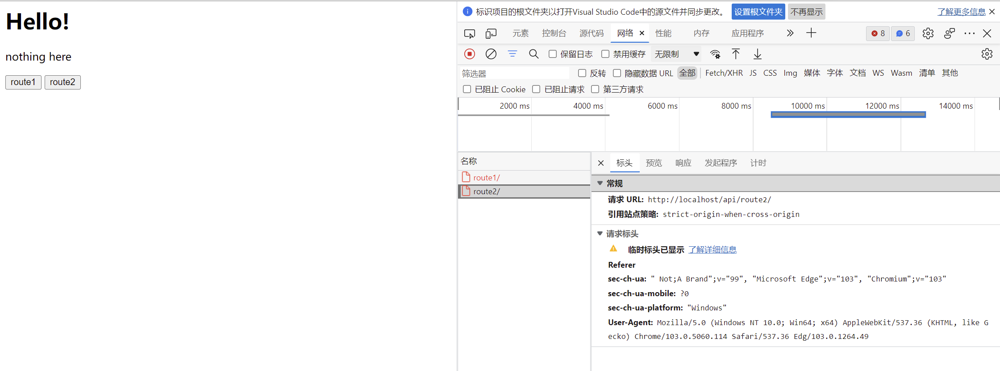
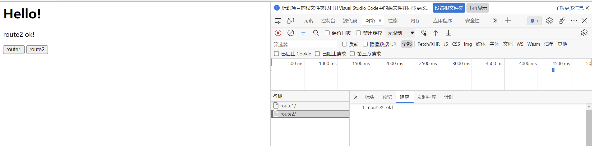
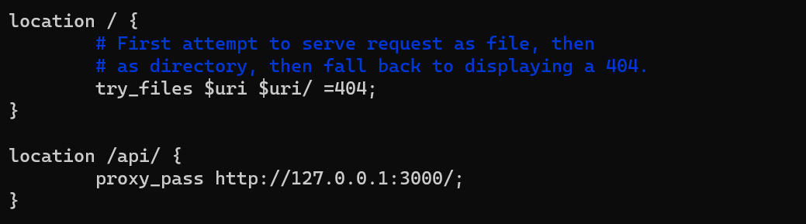
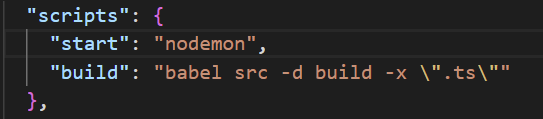
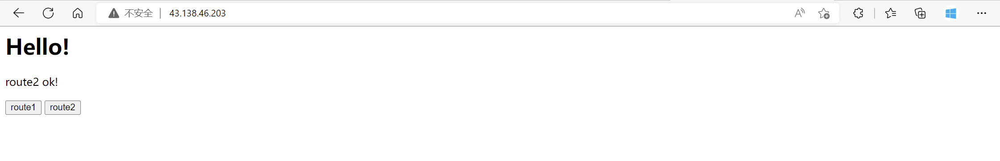

## 1.请求-响应流程与代理简介

### 域名解析

当我们在浏览器上输入一个域名发送网络请求时，发生了什么呢？

首先，浏览器会去搜索浏览器自身的 DNS（域名服务器）缓存，如果存储有域名对应的 IP 地址，则缓存命中；否则去搜索操作系统自身的 DNS 缓存和 host 配置文件，如果没找到则去请求本地 DNS 服务器（一般在同一城市）进行解析，如果本地 DNS 服务器上还没有，则要由本地 DNS 服务器去请求 13 台 IPv4 或 25 台 IPv6 根服务器，最终将域名映射到 IP 地址。只要是用域名发送的网络请求，都要经历域名解析这一过程。

### 请求和响应

有了服务器的 IP 地址以后，客户端就可以同服务器经历握手建立 TCP/IP 连接。在连接建立后，客户端就可以向服务器发起 HTTP 请求，请求格式在之前已经讲解。服务器处理完毕后会将 HTTP 响应发回客户端，响应格式在之前也已经讲解。如果是浏览器向服务器发送请求，得到的响应是 HTML 文件，浏览器解析 HTML 文件来渲染页面，当遇到 js/css 或者图片等资源时，则再向服务器发送 HTTP 请求确认本地缓存的文件是否有修改，如果有修改则再次下载；当要进行 API 调用时，则通过本地的前端代码向服务器后端发送请求，由后端作出响应。

如果使用代理，那客户端就不再是直接同目标服务器建立连接，而是同代理服务器或反向代理服务器建立连接，间接地访问目标服务器。下面来详细介绍代理：

### 代理与反向代理

正向代理是指，客户端先将请求发送至代理服务器这一中转站，再由代理服务器发送至目标服务器。在此过程中，客户端知道目标服务器的地址，但目标服务器不知道客户端的地址，只知道请求是从代理服务器发来的。反向代理则相反，反向代理服务器接受外部网络用户的请求并代表外部网络用户向内部服务器发出请求，对外表现为一个服务器。在此过程中，目标服务器知道客户端的地址，但客户端并不知道真正处理请求的内部服务器地址，其请求都发送给了反向代理服务器。下面这张图比较形象：


在服务端使用反向代理可以带来诸多好处，例如通过隔离外部网络用户和内部服务器增强了内部服务器上数据的安全性，减小了系统受攻击的危险。

## 2.Nginx

### Nginx 安装与使用

Nginx 是一款著名的 Web 和反向代理服务器，此外还有 Apache 等。在 Ubuntu 上，我们通过 apt 工具安装 Nginx：

```shell
sudo apt update
sudo apt install nginx
```

下面介绍 Nginx 的常用命令：

```shell
nginx -v			# 查看nginx版本
nginx -c filename 	# 设置配置文件(默认是:/etc/nginx/nginx.conf)

nginx				# 启动nginx服务
nginx -s stop		# 强制停止nginx服务
nginx -s quit 		# 正常停止nginx服务（即处理完所有请求后再停止服务）
nginx -s reload		# 重新加载nginx，适用于当nginx.conf配置文件修改后，使用下面命令可以使得配置文件生效
```

### Nginx 配置

最终生效的配置文件默认地址：/etc/nginx/nginx.conf，这一地址可以通过 nginx -c 命令修改。但是我们一般不去直接改这个文件，大家可以进这个文件看一下，这个文件实际上引用了/etc/nginx/sites-enabled 里的配置文件，因此凡是/etc/nginx/sites-enabled 里的配置文件都会被加载生效（enable）。而进到/etc/nginx/sites-enabled 目录会发现，里面的 default 是一个软链接，指向/etc/nginx/sites-available。因此实际的配置流程是这样，在 sites-available 目录下写好可能要用到的配置文件，将希望生效的配置文件软链接到 sites-enabled 目录下，然后用`sudo service nginx restart`命令即可重启 nginx 服务。

配置文件的结构如下：

第一部分：全局块

```nginx
# 每行配置必须有分号结束
worker_processes  [number/auto];   	# 允许启动的进程数，影响服务器并发处理能力
user [user] [user group];  			# 配置nginx工作进程（处理请求的进程）所属的用户或者组，默认为nobody nobody
pid [....../nginx.pid];		   		# 指定nginx进程运行文件存放地址，一般不用改
error_log [log addr] debug;	    	# 指定日志路径和级别（默认为error）
```

第二部分：events 块

```nginx
events {
    accept_mutex on;   			# 设置网路连接序列化，防止惊群现象发生，默认为on
    multi_accept on;  			# 设置一个进程是否同时接受多个网络连接，默认为off
    use epoll;      			# 事件驱动模型，select|poll|kqueue|epoll|resig|/dev/poll|eventport
    worker_connections 1024;	# 最大连接数，默认为512
}
```

第三部分：http 块

```nginx
http {
    # http全局块
    include       mime.types;   			# 文件扩展名与文件类型映射表
    default_type  application/octet-stream; # 默认文件类型，默认为text/plain
    access_log off; 						# 取消服务日志
    log_format myFormat '$remote_addr–$remote_user [$time_local] $request $status $body_bytes_sent $http_referer $http_user_agent $http_x_forwarded_for'; # 自定义日志格式
    access_log log/access.log myFormat;  	# combined为日志格式的默认值
    sendfile on;   							# 允许sendfile方式传输文件，默认为off
    sendfile_max_chunk 100k;  				# 每个进程每次调用传输数量不能大于设定的值，默认为0，即不设上限
    keepalive_timeout 65;  					# 连接超时时间，默认为75s

    upstream mysvr {
      server 127.0.0.1:7878;
      server 192.168.10.121:3333 backup;  	# 热备
    }
    error_page 404 https://www.baidu.com; 	# 错误页
    server {
        keepalive_requests 120;				# 单连接请求上限次数。
        listen       4545;   				# 监听端口
        server_name  127.0.0.1;   			# 主机名称
        location / { 		      			# 请求的url过滤，正则匹配，~为区分大小写，~*为不区分大小写。
           root path;  						# 定义根目录
           index index.html;  				# 设置默认页
           proxy_pass  http://mysvr;  		# 请求转向mysvr定义的服务器列表
           deny 127.0.0.1;  				# 拒绝的ip
           allow 172.18.5.54; 				# 允许的ip
        }
    }
}
```

### 用 Nginx 部署前后端

由于本节课的重点是后端，因此我们的前端采用最简单的一个 html 文件，功能是在点击“route1”按钮或“route2”按钮时向后端发送一个请求，并将返回的文本显示出来，代码如下：

```html
<h1>Hello!</h1>

<p id="text">nothing here</p>

<button onclick="change1()">route1</button>
<button onclick="change2()">route2</button>

<script>
  function change1() {
    fetch("http://localhost/api/route1/", { method: "GET" })
      .then((data) => {
        return data.text();
      })
      .then((text) => {
        console.log(text);
        document.getElementById("text").innerHTML = text;
      })
      .catch((error) => console.error("error:", error));
  }
  function change2() {
    fetch("http://localhost/api/route2/", { method: "GET" })
      .then((data) => {
        return data.text();
      })
      .then((text) => {
        console.log(text);
        document.getElementById("text").innerHTML = text;
      })
      .catch((error) => console.error("error:", error));
  }
</script>
```

我们将上述代码写在 index.html 当中，作为前端的入口文件（事实上是唯一文件），然后保存在一个目录下，比如 D:\server（路径中最好不要有空格、中文之类的，容易出错）。可以双击这一文件用浏览器预览一下，现在如果点击按钮则什么都不会发生。可以摁 F12 打开浏览器的开发人员工具（以 Edge 为例），在上方栏点更多找到网络标签，进去后再次点击按钮会发现请求失败。



用超级用户权限打开/etc/nginx/sites-available 目录下面的 default 文件，修改这一文件就能起到配置 nginx 的目的。我们把这一文件修改成下面这样：

```nginx
# 省略一些注释
server {
        listen 80 default_server;		# 监听端口，http默认80
        listen [::]:80 default_server;

        # 省略一些注释

        root /mnt/d/server;				# 将服务器根目录设为自己index.html所在的目录
        # Add index.php to the list if you are using PHP
        index index.html index.htm index.nginx-debian.html;
        server_name _;

        location / {					# 其他路径匹配至此
                # First attempt to serve request as file, then
                # as directory, then fall back to displaying a 404.
                try_files $uri $uri/ /index.html =404;
        }

        location /api/ {				# /api路径设为后端专用路径，优先匹配
                proxy_pass http://127.0.0.1:3000/;    # 转发至后端监听的端口（代理）
        }

        # 省略一些注释
}
# 省略一些注释
```

保存并退出后，用`sudo service nginx restart`命令重启 nginx 服务，用`yarn start`命令启动后端（感兴趣的同学可以用 babel 将后端 build 成 JavaScript 代码再用 node 运行入口文件，但简便起见用开发启动也能达到相同效果），然后在浏览器中进入 localhost（127.0.0.1），就会看到我们在 index.html 中写的简单前端，同时如果点击按钮也能看到显示文字的改变。



## 3.在云服务器上部署网站

理论上来讲，每一台安装有基本网络协议的计算机都可以做客户端与服务器，也可以像我们刚才的例子那样既做客户端又做服务器。只要做好防火墙入站规则等一系列设置，再向运营商申请一个公网 IP，就能把你的电脑变成大家都能访问的服务器。但是由于性能和管理的诸多原因，一般用户大都选择购买云服务器，由云服务商负责相关运维，节省用户的精力。

下面简要介绍在云服务器上部署简易网站的方法：

首先，在任一家服务商购买相关产品，根据提示完成配置后进入系统（假设为 Ubuntu），确保有超级用户权限。同时，在控制台开放 80 端口（用于 HTTP）和 22 端口（用于 SSH），根据需要开放 443 端口（用于 HTTPS）。

然后，在系统内安装 Nginx 和 Node.js，按照之前的方法配置 Nginx（如根目录直接路由至前端的 index.html 以呈现主页，/api 目录代理至本机的 3000 端口供后端监听处理）。注意前端发送请求不能再到 localhost，而要到 http://[主机 ip]/api 下面。



最后，用 Babel 或其他工具将 TypeScript 后端转换成 JavaScript，生成到 build 目录下，上传到服务器，在服务器后台运行 node ./build/app.js 以启动后端。



这样，我们的简易网站就完成了。在浏览器中直接输入 ip 地址（暑培测试用：43.138.46.203），就能看到网站了。



以上介绍了一些基本操作，在实际部署中还要更复杂一些，但原理是类似的，感兴趣的同学建议查阅网络资料。
