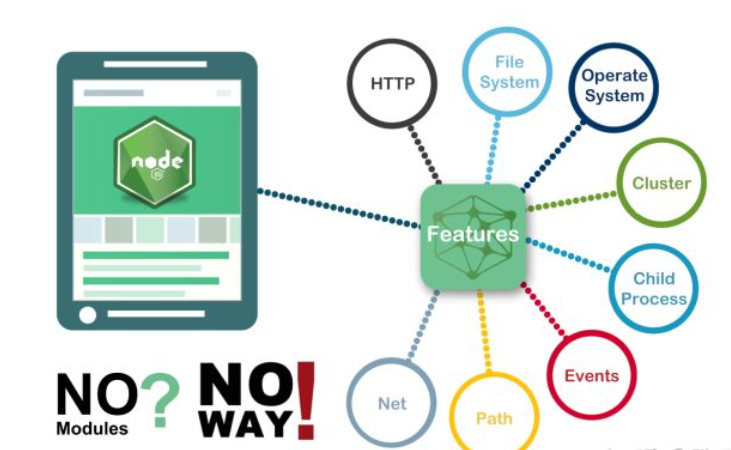

## 前言

本节课的最终目的是让大家对Webpack这一技术有一简单的了解与理解，并初步学会应用。接下来会讲一系列Webpack的前置知识，在未来开发中，我们不需要直接应用它们，但了解它们是怎么工作的有助于我们更好地运用Webpack。

在此之前，我们先讲讲学习这些知识的必要性👇。

> 前端页面的发展
>
> * 动态页面完全由PHP生成
> * 加入JS片段达成更好的交互
> * 使用jQuery及其插件
> * 更多的库和更多插件可以直接调用

我们纯纯地在JS中引入jQuery需要怎么做呢？

```html
<body>
<!--At the end of body block...-->
<script src="js/jquery.js"></script> <!--jQuery first-->
<script src="js/jquery.datepicker-zh-CN.min.js"></script>
<script src="js/jquery-ui.js"></script>
</body>
```

需要关注引入位置、引入顺序，甚至是一些插件的运行时机。

老式的任务运行器：HTML、css、JS三者完全分离，程序员需要分别关注和管理每一个，更需要思考如何使它们在生产环境中联合在一起。

这不是轻松愉快的活。

能否让系统自动处理依赖关系，只根据最终需求自我构建与自我管理？

敬请期待。

:::tip

- 本节内容及例程已上传至[Github 仓库](https://github.com/chen-yy20/2022SummerTraining)。

:::

---

## CommonJS

Node.js从诞生以后便经久不衰，离不开它成熟的模块化实现，而Node.js的模块化是在CommonJS规范的基础上实现的。

### 是什么

> 维基百科
>
> CommonJS 是一个项目，其目标是为 JavaScript 在网页浏览器之外创建模块约定。创建这个项目的主要原因是当时缺乏普遍可接受形式的 JavaScript 脚本模块单元，模块在与运行JavaScript 脚本的常规网页浏览器所提供的不同的环境下可以重复使用。

### 前端模块化发展

JS模块化概念并非与生俱来。直到Node.js的诞生把JS带到了服务端，面对文件系统、网络、操作系统等复杂的业务场景，模块化才逐渐变得不可或缺。



由此可见，CommonJS 最初是服务于服务端的，但它的载体是前端语言 JavaScript，为后面前端模块化的盛行产生了深远的影响，奠定了结实的基础。

JavaScript 诞生之初只是作为一个脚本语言来使用，做一些简单的表单校验等等。所以代码量很少，最开始都是直接写到 `<script>` 标签里，如下所示：

```html
// index.html
<script>
    var name = 'morrain'
    var age = 18 
</script>
```

随着业务进一步复杂，Ajax 诞生以后，前端能做的事情越来越多，代码量飞速增长，开发者们开始把 JavaScript 写到独立的 js 文件中，与 html 文件解耦。像下面这样：

```html
// index.html
<script src="./mine.js"></script>

// mine.js
var name = 'morrain'
var age = 18
```

再后来，更多的开发者参与进来，更多的 js 文件被引入进来:

```html
// index.html
<script src="./mine.js"></script>
<script src="./a.js"></script>
<script src="./b.js"></script>
```

```javascript
// mine.js
var name = 'morrain'
var age = 18

// a.js
var name = 'lilei'
var age = 15

// b.js
var name = 'hanmeimei'
var age = 13
```

JavaScript 在 ES6 之前是没有模块系统，也没有封闭作用域的概念的，所以上面三个 js 文件里申明的变量都会存在于全局作用域中。随着js文件数量与复杂度增加，越来越容易与其它 js 文件冲突。**全局变量污染**开始成为开发者的噩梦。

**命名空间？**

开发者尝试使用命名空间来解决全局变量污染问题。

```html
// index.html
<script src="./mine.js"></script>
<script src="./a.js"></script>
<script src="./b.js"></script>
```

```javascript
// mine.js
app.mine = {}
app.mine.name = 'morrain'
app.mine.age = 18

// a.js
app.moduleA = {}
app.moduleA.name = 'lilei'
app.moduleA.age = 15

// b.js
app.moduleB = {}
app.moduleB.name = 'hanmeimei'
app.moduleB.age = 13
```

在此，模块化的思想已经初现端倪。这样在一定程度上是解决了命名冲突的问题，但 b.js 模块的开发者，可以很方便的通过 `app.moduleA.name` 来取到模块A中的名字，但是也可以通过 `app.moduleA.name = 'rename'` 来任意改掉模块A中的名字，而这件事情，模块A却毫不知情！这显然是不被允许的。

**函数作用域？**

开发者尝试利用JS函数作用域的闭包特性解决此问题。

```html
// index.html
<script src="./mine.js"></script>
<script src="./a.js"></script>
<script src="./b.js"></script>
```

```javascript
// mine.js
app.mine = (function(){
    var name = 'morrain'
    var age = 18
    return {
        getName: function(){
            return name
        }
    }
})()

// a.js
app.moduleA = (function(){
    var name = 'lilei'
    var age = 15
    return {
        getName: function(){
            return name
        }
    }
})()

// b.js
app.moduleB = (function(){
    var name = 'hanmeimei'
    var age = 13
    return {
        getName: function(){
            return name
        }
    }
})()
```

现在 b.js 模块可以通过 `app.moduleA.getName()` 来取到模块A的名字，但是各个模块的名字都保存在各自的函数内部，没有办法被其它模块更改。

但这显然不够优雅，而且仍有不足。譬如上例中，模块B可以取到模块A的东西，但模块A却取不到模块B的，因为上面这三个模块加载有先后顺序，互相依赖。当一个前端应用业务规模足够大后，这种依赖关系又变得异常难以维护。

**综上所述，前端需要模块化，并且模块化不光要处理全局变量污染、数据保护的问题，还要很好的解决模块之间依赖关系的维护。**

### CommonJS规范

CommonJS 就是解决上面问题的模块化规范，规范就和编程语言的语法一样，没有为什么。当全世界的开发者都遵循这一规范时，生产力就大大提高了。👇

* Node.js 应用由模块组成，每个文件就是一个模块，有自己的作用域。在一个文件里面定义的变量、函数、类，都是私有的，对其他文件不可见。

* 每个模块内部有两个变量可以使用，`require` 和 `module`。

  * `require` 用来加载某个模块

  * `module` 代表当前模块，是一个对象，保存了当前模块的信息。`exports` 是 `module` 上的一个**属性**，保存了当前模块要导出的接口或者变量，使用 `require` 加载的某个模块获取到的值就是那个模块使用 `exports` **导出的值**。

  ```javascript
  // a.js
  var name = 'morrain'
  var age = 18
  module.exports.name = name
  module.exports.getAge = function(){
      return age
  }
  
  //b.js
  var a = require('a.js')
  console.log(a.name) // 'morrain'
  console.log(a.getAge())// 18
  ```

到了ES6，`import`和`import(url)` 还有`export`都被支持了。其中`import(url)`函数会返回一个`promise`。

```javascript
import transform from './transform.js' /* default import */
import { var1 } from './consts.js' /* import a specific item */
import('http://example.com/example-module.js').then(() => { console.log('loaded') })
export const MODE = 'production' /* exported const *
```

---

## Babel

Babel可以把 JavaScript 中 es2015/2016/2017 的新语法转化为 es5，让低端运行环境(如浏览器和 node )能够认识并执行，ES5的规范可以覆盖绝大部分的浏览器，因此把JS转换为es5是安全且流行的做法。（暑培所讲授的JS语法基于ES6，实际使用时也是经过了转换的）

> ES6语法input
>
> ```javascript
> let test = { a: 1, b: 2 }
> const { a, b } = test
> console.log(a)
> ```
>
> 经过babel后的IE6可以理解的output
>
> ```javascript
> "use strict";
> var test = { a: 1, b: 2 };
> var a = test.a, b = test.b;
> console.log(a)
> ```

### 运行方式

babel 总共分为三个阶段：**解析，转换，生成**。

babel 本身不具有任何转化功能，它把转化的功能都分解到一个个 plugin 里面。因此当我们不配置任何插件时，经过 babel 的代码和输入是相同的。

插件总共分为两种：

- **语法插件** 

  在**解析**这一步使得 babel 能够解析更多的语法。

  举个简单的例子，当我们定义或者调用方法时，最后一个参数之后是不允许增加逗号的，如 `callFoo(param1, param2,)` 就是非法的。如果源码是这种写法，经过 babel 之后就会提示语法错误。

  但最近的 JS 提案中已经允许了这种新的写法(让代码 diff 更加清晰)。为了避免 babel 报错，就需要增加语法插件 `babel-plugin-syntax-trailing-function-commas`

- **转译插件**

  在**转换**这一步把源码更充分地转换。

  比如箭头函数 `(a) => a` 就会转化为 `function (a) {return a}`。完成这个工作的插件叫做 `babel-plugin-transform-es2015-arrow-functions`。

同一类语法可能同时存在语法插件版本和转译插件版本。**如果我们使用了转译插件，就不用再使用语法插件了。**

### 安装plugin

既然插件是 babel 的根本，那如何使用呢？总共分为 2 个步骤：

1. 将插件的名字增加到配置文件中 (根目录下创建 .babelrc 或者 package.json 的 `babel` 里面，格式相同)
2. 使用 `npm install babel-plugin-xxx` 进行安装

### 使用preset

比如说，ES6 是一套规范，包含大概十几二十个转译插件。如果每次要开发者一个个添加并安装，配置文件很长不说，`npm install` 的时间也会很长，更不谈我们可能还要同时使用其他规范呢。

为了解决这个问题，babel 还提供了一组插件的集合。因为常用，所以不必重复定义 & 安装。(单点和套餐的差别，套餐省下了巨多的时间和配置的精力)

### 配置

简略情况下，插件和 preset 只要列出字符串格式的名字即可。但如果某个 preset 或者插件需要一些配置项(或者说参数)，就需要把自己先变成数组。第一个元素依然是字符串，表示自己的名字；第二个元素是一个对象，即配置对象。(后面细嗦)

### env

env 可以说是最为常用也最重要的配置项。

env 的核心目的是通过配置得知目标环境的特点，然后只做必要的转换。例如目标浏览器支持 es2015，那么 es2015 这个 preset 其实是不需要的，减小转化后代码体积(一般转化后的代码总是更长)，构建时间也可以缩短一些。

如果不写任何配置项，env 等价于 latest，也等价于 es2015 + es2016 + es2017 三个相加。env 包含的插件列表维护在[这里](https://link.zhihu.com/?target=https%3A//github.com/babel/babel-preset-env/blob/master/data/plugin-features.js)

下面列出几种比较常用的配置方法：

```json
{
  "presets": [
    ["env", {
      "targets": {
        "browsers": ["last 2 versions", "safari >= 7"]
      }
    }]
  ]
}
```

如上配置将考虑所有浏览器的最新2个版本(safari大于等于7.0的版本)的特性，将必要的代码进行转换。而这些版本已有的功能就不进行转化了。

```json
{
  "presets": [
    ["env", {
      "targets": {
        "node": "6.10"
      }
    }]
  ]
}
```

如上配置将目标设置为 nodejs，并且支持 6.10 及以上的版本。也可以使用 `node: 'current'` 来支持最新稳定版本。例如箭头函数在 nodejs 6 及以上将不被转化，但如果是 nodejs 0.12 就会被转化了。

### Polyfill

Polyfill 是一块代码（通常是 Web 上的 JavaScript），用来为旧浏览器提供它没有原生支持的较新的功能，可以理解为“补丁”。

比如说，所有版本的IE浏览器都不支持`Promise`的API，那我们就没办法在IE上运行带有Promise的JS代码了吗？

我们可以使用Polyfill去修复此功能。这与babel的转码有一定的不同，babel 默认只转换 js 语法，而不转换新的 API，比如 Iterator、Generator、Set、Maps、Proxy、Reflect、Symbol、Promise 等全局对象，以及一些定义在全局对象上的方法(比如 `Object.assign`)都不会转码。

举例来说，es2015 在 Array 对象上新增了 `Array.from` 方法。babel 就不会转码这个方法。如果想让这个方法运行，必须使用 `babel-polyfill`。(内部集成了 `core-js` 和 `regenerator`)。

> core-js是完全模块化的javascript标准库。 包含ECMA-262至今为止大部分特性的polyfill，如promises、symbols、collections、iterators、typed arrays、etc，以及一些跨平台的WHATWG / W3C特性的polyfill，如WHATWG URL。 它可以直接全部注入到全局环境里面，帮助开发者模拟一个包含众多新特性的运行环境，这样开发者仅需简单引入core-js，仍然使用最新特性的ES写法编码即可；也可以不直接注入到全局对象里面。它是一个完全模块化的库，所有的polyfill实现，都有一个单独的module文件，既可以一劳永逸地把所有polyfill全部引入，也可以根据需要，在自己项目的每个文件，单独引入需要的core-js的modules文件。


---

## Webpack

千呼万唤始出来，我们终于要开始讲黑魔法Webpack了！

### 是什么

Webpack是一个模块打包器，主要目标是把杂乱无章的JavaScript文件(以及其他各种类型的资源文件)打包在一起。使得结构变得简单，减轻程序员的负担。

> 官方文档：Webpack 是当下最热门的前端资源模块化管理和打包工具。它可以将许多松散的模块按照依赖和规则打包成符合生产环境部署的前端资源。还可以将按需加载的模块进行代码分隔，等到实际需要的时候再异步加载。
>
> 通过 loader 的转换，任何形式的资源都可以视作模块，比如 CommonJs 模块、 AMD 模块、 ES6 模块、CSS、图片、 JSON、Coffeescript、 LESS 等。
>
> 

### 为什么使用Webpack

前文已述。

Webpack给出一种解决方式：如果 Webpack 了解依赖关系，它会仅捆绑我们在生产环境中实际需要的部分。我们通过 JavaScript 向webpack传递依赖关系，使得构建过程更加容易。

换句话说：你只需要把项目代码**写明白**，并加以适当的**配置**，Webpack就会自动持续地工作。

### 如何使用Webpack

本质上，*webpack* 是一个现代 JavaScript 应用程序的**静态模块打包器(module bundler)**。当 webpack 处理应用程序时，它会递归地构建一个**依赖关系图(dependency graph)**，其中包含应用程序需要的每个模块，然后将所有这些模块打包成一个或多个 *bundle*。

#### 配置

从 webpack v4.0.0 开始，可以不用引入配置文件。然而，webpack 仍然还是[高度可配置的](https://webpack.html.cn/configuration)。

##### 核心概念

关于Webpack配置，先理解四个**核心概念**：

* **入口（entry）**

  **入口起点(entry point)**指示 webpack 应该使用哪个模块，来作为构建其内部依赖图的开始。进入入口起点后，webpack 会找出有哪些模块和库是入口起点（直接和间接）依赖的。

  每个依赖项随即被处理，最后输出到称之为 *bundles* 的文件中。

* **出口（output）**

  **output** 属性告诉 webpack 在哪里输出它所创建的 *bundles*，以及如何命名这些文件，默认值为 `./dist`。基本上，整个应用程序结构，都会被编译到你指定的输出路径的文件夹中。

* **加载器（loader）**

  **loader** 让 webpack 能够去处理那些非 JavaScript 文件（webpack 自身只理解 JavaScript）。loader 可以将所有类型的文件转换为 webpack 能够处理的有效[模块](https://webpack.html.cn/concepts/modules)，然后你就可以利用 webpack 的打包能力，对它们进行处理。

  本质上，webpack loader 将所有类型的文件，转换为应用程序的依赖图（和最终的 bundle）可以直接引用的模块。

* **插件（plugins）**

  loader 被用于转换某些类型的模块，而插件则可以用于执行范围更广的任务。插件的范围包括，从打包优化和压缩，一直到重新定义环境中的变量。[插件接口](https://webpack.html.cn/api/plugins)功能极其强大，可以用来处理各种各样的任务。

  想要使用一个插件，你只需要 `require()` 它，然后把它添加到 `plugins` 数组中。`new`可以实例化一个或多个插件。

  > webpack 开箱可用插件列表：[插件列表](https://webpack.html.cn/plugins)


##### 配置文件实例

**webpack.config.js**

```javascript
const HtmlWebpackPlugin = require('html-webpack-plugin'); // 通过 npm 安装
const path = require('path');
const webpack = require('webpack'); // 用于访问内置插件

const config = {
  entry:'./path/to/my/entry/file.js', // 入口文件绝对路径
  output: {
    path: path.resolve(__dirname, 'dist'), // 输出目录绝对路径
    filename: 'my-first-webpack.bundle.js' // 输出文件名
  },
  module: {
    rules: [
      { test: /\.txt$/, use: 'raw-loader' }
    ]
  },
  plugins: [
    new webpack.optimize.UglifyJsPlugin(),
    new HtmlWebpackPlugin({template: './src/index.html'})
  ]
};

module.exports = config; // 
```

## 视频教程

### 2022 年暑期培训

import Video from '@site/src/component/video_player';

**Node, Babel, CommonJS**
<Video url="https://cloud.tsinghua.edu.cn/d/0d8895f41a4a4dcaa0a4/files/?p=%2F%E5%9B%9E%E6%94%BE%2F10.Node%20babel%20commonjs%20.mp4" source="THU"/><br/>

**Webpack**
<Video url="https://cloud.tsinghua.edu.cn/d/0d8895f41a4a4dcaa0a4/files/?p=%2F%E5%9B%9E%E6%94%BE%2F10.webpack.mp4" source="THU"/>